# ArtiPivot

生产级多层 Agent 框架，基于 LangGraph 构建。通过 **主路由 Agent → 子代理 → 工具** 三层解耦架构，实现意图识别、任务分发、工具执行的清晰分离。

## 项目简介

ArtiPivot 是一个面向生产环境的 AI Agent 编排框架。它将 Agent 系统拆分为三层：

- **第一层 — 主路由 Agent**：纯路由层，只做两件事——识别用户意图、选择合适的子代理。不涉及工具调用、记忆读写、响应生成。
- **第二层 — 子代理**：实际任务执行者，独立完成记忆读取、任务规划、工具编排、响应生成、记忆回写。支持**编程式**（Python）和**声明式**（YAML 零代码）两种开发模式。
- **第三层 — 工具**：原子化、无状态的执行能力（搜索、代码执行、文件读写等），可被任意子代理按需引用，支持 Pipeline 工具编排。

### 核心特性

| 特性 | 说明 |
|------|------|
| **多主 Agent 隔离** | 多个主 Agent 并存运行，State / 路由逻辑 / 子代理 / 工具 / 会话记忆完全隔离，通过 Agent Gateway 统一分发 |
| **可插拔架构** | 子代理和工具像 USB 设备一样动态加载/卸载，不影响其他功能；存储后端（Memory / MongoDB / PostgreSQL / Redis）可自由组合 |
| **动态配置** | 模型、提示词、限流规则等所有运行时参数存储在 DocumentStore，通过 API 动态管理，修改立即生效，无需重启服务 |
| **模型三级 Fallback** | 子代理模型 → 子代理兜底 → 全局兜底，保证可用性；模型变更在下次请求自动生效，无需重建图 |
| **生产级可观测性** | 自建文件日志系统（8 通道 structlog JSON 日志 + 自动轮转），不依赖外部 SaaS；含请求 trace / 会话 / LLM 调用 / 工具调用 / 记忆操作 / 审计等独立通道 |
| **全链路容错** | 节点级超时 + error_handler + 工具重试（指数退避）+ 模型 fallback + 熔断器，各层独立容错 |
| **开发体验优先** | 子代理只需实现 `_invoke` 一个方法；声明式子代理只需 YAML 配置；内置 CLI 脚手架 |

### 技术栈

| 组件 | 选型 | 说明 |
|------|------|------|
| 运行时 | LangGraph v1.2 | 图编排 + Checkpointer + Store + ToolNode，不依赖 LangChain 高层包 |
| 模型 | Anthropic Claude / OpenAI GPT | 通过 langchain-anthropic / langchain-openai 集成 |
| 日志 | structlog + orjson | 结构化 JSON 输出，按日轮转 |
| 存储 | 可插拔 | Memory（零依赖开发）/ MongoDB / PostgreSQL / Redis |
| 部署 | FastAPI + Uvicorn | REST API 入口 + 管理 API + CLI |
| CLI | Typer | `artipivot` 命令行工具（plugin init/dev/publish/serve） |

### 当前阶段：P5 生产级保障

177 个单元测试全部通过（P0: 38 + P1: 23 + P2: 25 + P3: 21 + P4: 19 + P5: 51）

---

## 全局架构

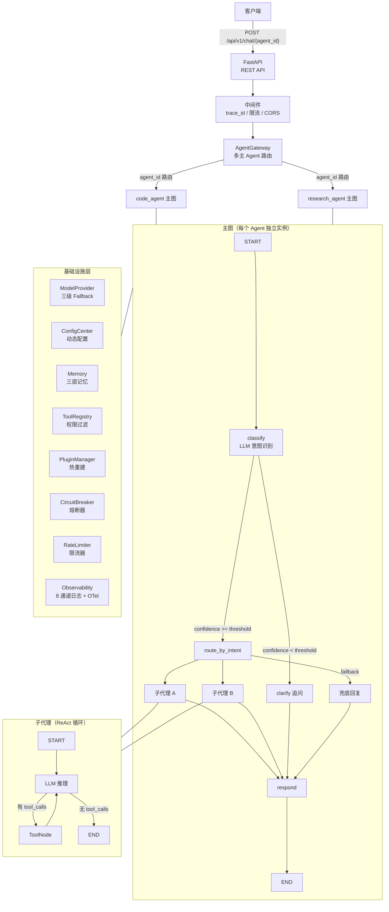

---

## 模块架构

### 存储层（Storage）

可插拔存储抽象，三个独立接口各可选用不同后端。

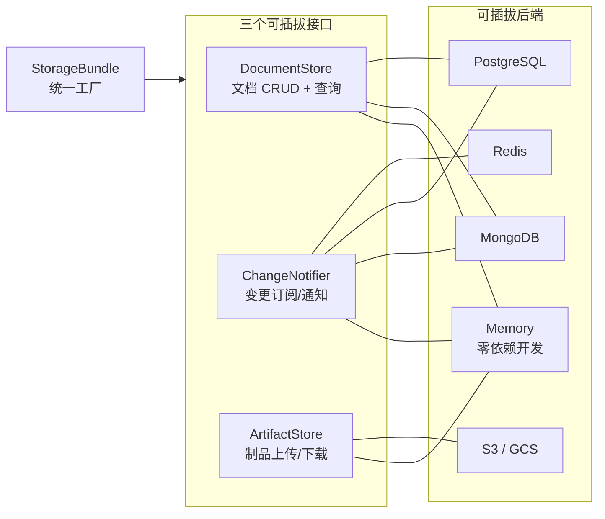

> 详细文档：[doc/modules/storage.md](doc/modules/storage.md) — 接口定义、后端配置、自定义后端接入

### 模型层（Models）

动态模型解析 + 三级 Fallback，模型变更无需重建图。

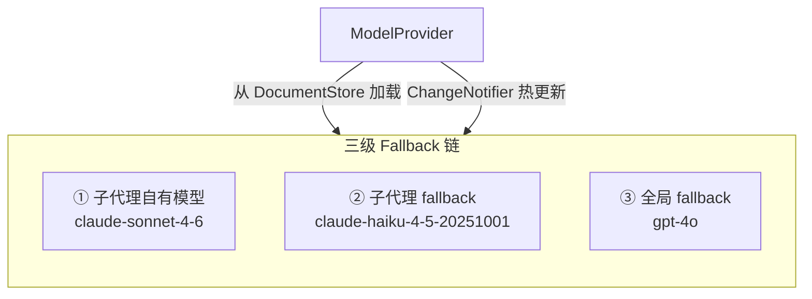

> 详细文档：[doc/modules/models.md](doc/modules/models.md) — ModelConfig、YAML 配置、供应商接入、动态切换

### 工具层（Tools）

全局工具池 + 权限过滤矩阵 + MCP 外部工具适配。

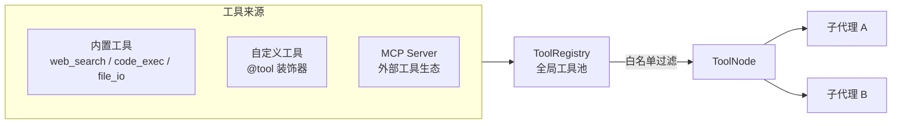

> 详细文档：[doc/modules/tools.md](doc/modules/tools.md) — 注册工具、权限过滤、MCP 适配

### 子代理层（Agents）

支持编程式和声明式两种开发模式，三种内置策略。

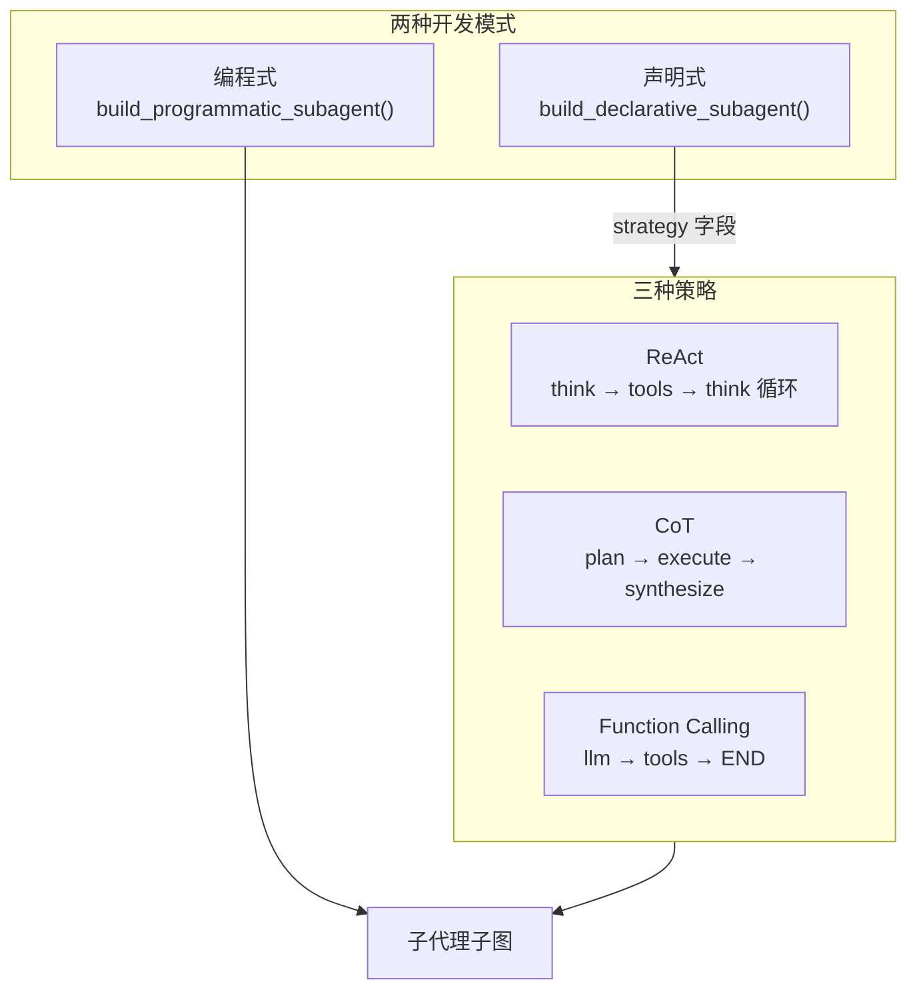

> 详细文档：[doc/modules/agents.md](doc/modules/agents.md) — 编程式/声明式定义、策略引擎、YAML 配置、自定义策略

### 配置中心（Config）

统一管理所有运行时配置，热更新无需重启。

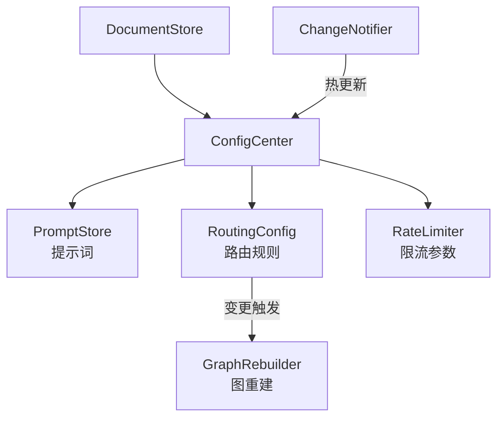

> 详细文档：[doc/modules/config.md](doc/modules/config.md) — 配置分类、路由规则、提示词管理、管理 API

### 记忆系统（Memory）

三层记忆模型 + 可插拔后端 + 上下文窗口管理。

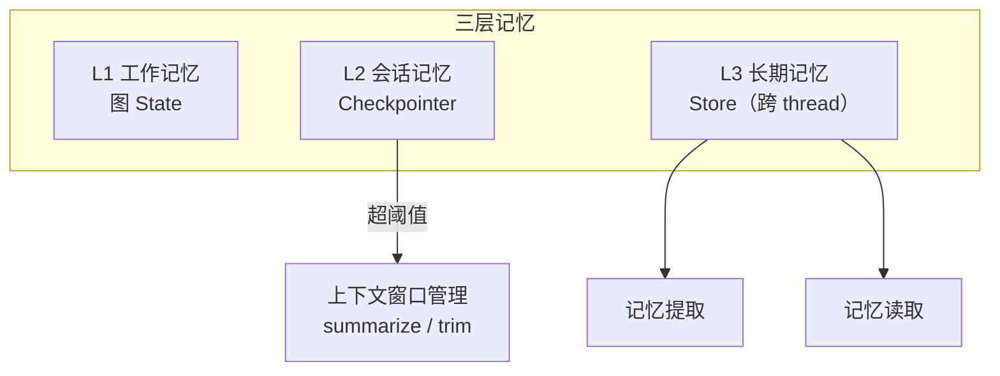

> 详细文档：[doc/modules/memory.md](doc/modules/memory.md) — 三层模型、后端注册、Namespace 隔离、提取/读取、上下文压缩

### 多主 Agent（Multi-Agent）

多 Agent 并存运行，五维隔离。

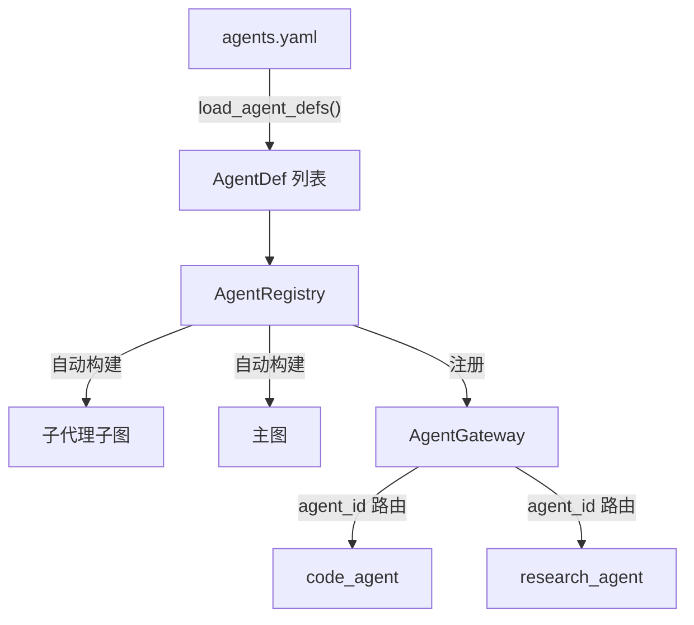

> 详细文档：[doc/modules/multi_agent.md](doc/modules/multi_agent.md) — AgentDef、Registry、YAML 声明、五维隔离

### 插件系统（Plugins）

插件热加载 + 图热重建，发布即生效。

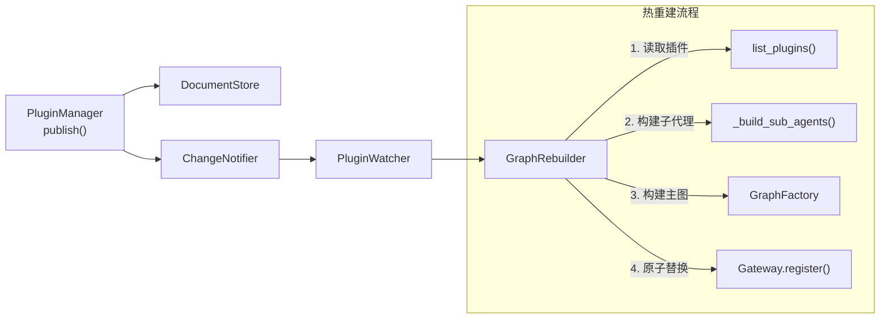

> 详细文档：[doc/modules/plugins.md](doc/modules/plugins.md) — 插件管理、图热重建、Watcher 自动重建、路由回调

### 容错与弹性（Resilience）

全链路容错：熔断器 + 重试 + 节点 error_handler + 限流。

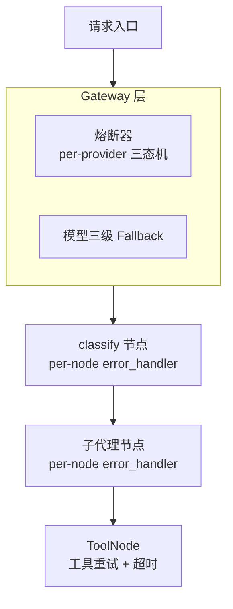

> 详细文档：[doc/modules/resilience.md](doc/modules/resilience.md) — CircuitBreaker、RetryPolicy、error_handler、RateLimiter

### 可观测性与 API（Observability + API + CLI）

8 通道日志 + OTel 可选导出 + REST API + CLI 工具。

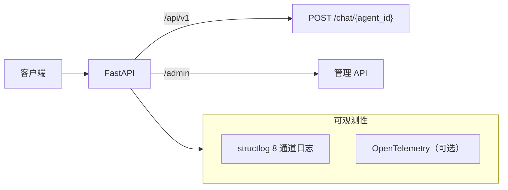

> 详细文档：[doc/modules/observability_api.md](doc/modules/observability_api.md) — 日志系统、OTel、REST API、CLI、完整接入示例

---

## 项目结构

```
artipivot/
├── pyproject.toml                          # 项目元数据、依赖声明、构建配置（hatch + uv）
├── uv.lock                                 # uv 锁文件
├── CLAUDE.md                               # Claude Code 项目指引
├── demo.py                                 # 端到端交互式演示脚本
│
├── doc/                                    # 设计文档
│   ├── DESIGN.md                           # 产品设计文档
│   ├── ARCHITECTURE.md                     # 代码架构文档
│   ├── DEVELOPMENT_PLAN.md                 # 开发计划（P0-P5 进度追踪）
│   └── modules/                            # 模块详细文档
│       ├── storage.md                      #   存储层 — 接口、后端、配置
│       ├── models.md                       #   模型层 — Fallback、YAML、供应商接入
│       ├── tools.md                        #   工具层 — 注册、权限、MCP
│       ├── agents.md                       #   子代理 — 策略引擎、YAML、自定义策略
│       ├── config.md                       #   配置中心 — 路由、提示词、管理 API
│       ├── memory.md                       #   记忆系统 — 三层模型、后端、压缩
│       ├── multi_agent.md                  #   多 Agent — AgentDef、隔离
│       ├── plugins.md                      #   插件系统 — 热重建、Watcher
│       ├── resilience.md                   #   容错 — 熔断、重试、限流
│       └── observability_api.md            #   可观测性 + API + CLI
│
├── config/seed/                            # 首次启动种子配置（YAML → DocumentStore）
│   ├── models.yaml                         #   模型配置种子
│   ├── prompts.yaml                        #   提示词种子
│   ├── routing.yaml                        #   路由规则种子
│   ├── sub_agents.yaml                     #   声明式子代理种子
│   ├── memory.yaml                         #   记忆配置种子
│   └── agents.yaml                         #   多 Agent 声明配置
│
├── src/artipivot/                          # 源码
│   ├── gateway/                            #   多主 Agent 分发层
│   ├── graph/                              #   核心图构建层
│   ├── agents/                             #   子代理层 + 策略引擎
│   ├── tools/                              #   工具层 + MCP 适配
│   ├── memory/                             #   记忆系统
│   ├── models/                             #   模型适配层
│   ├── config/                             #   动态配置中心
│   ├── storage/                            #   可插拔存储抽象层
│   ├── observability/                      #   可观测性（日志 + OTel）
│   ├── plugins/                            #   插件系统（热重建）
│   ├── api/                                #   REST API（FastAPI）
│   ├── cli/                                #   CLI 工具（Typer）
│   └── resilience/                         #   容错与弹性
│
└── tests/                                  # 177 个单元测试
```

## 快速开始

```bash
# 安装依赖
uv sync --dev

# 运行测试（177 个）
uv run pytest tests/ -v

# 交互式 demo（需设置 API Key）
export ANTHROPIC_API_KEY=sk-...
uv run python demo.py

# 启动 API 服务器
uv run artipivot serve --port 8000

# CLI 插件脚手架
uv run artipivot plugin init my_plugin --template react
```

## 扩展点速查表

| 扩展点 | 接口/基类 | 注册方式 | 热更新 |
|--------|-----------|----------|:------:|
| 文档存储 | `DocumentStore` | 继承 + 工厂函数 | — |
| 变更通知 | `ChangeNotifier` | 继承 + 工厂函数 | — |
| 制品存储 | `ArtifactStore` | 继承 + 工厂函数 | — |
| 存储组件组合 | `StorageBundle` + `StorageConfig` | 配置切换后端 | — |
| 模型供应商 | `_factories[provider]` | 添加工厂函数 | ✓ |
| 自定义工具 | `@tool` 装饰器 | `registry.register(tool)` | — |
| 编程式子代理 | `SubAgentDef` + `build_programmatic_subagent()` | 挂载到 `sub_agent_nodes` | — |
| 声明式子代理 | `DeclarativeSubAgentDef` + `build_declarative_subagent()` | strategy 字段选择策略 | — |
| 子代理策略 | `Strategy` ABC | `register_strategy()` | — |
| Checkpointer 后端 | `BaseCheckpointSaver` | `register_checkpointer_backend()` | — |
| Store 后端 | `BaseStore` | `register_store_backend()` | — |
| 多主 Agent | `AgentDef` | `AgentRegistry.register_def()` | — |
| 插件元数据 | `PluginDocument` + `PluginManager` | `pm.publish()` | ✓ |
| 图热重建 | `GraphRebuilder` | `rebuilder.rebuild_agent()` | ✓ |
| 熔断器 | `CircuitBreaker` | `CircuitRegistry.get_or_create()` | — |
| 重试策略 | `RetryPolicy` | 包装异步函数 | — |
| MCP 工具 | `MCPToolAdapter` | `MCPRegistry.register_server()` | — |
| OTel 可观测 | `observability/otel.py` | `OTEL_ENABLED=true` | ✓ |
