# ArtiPivot

**生产级多层 Agent 编排框架**，基于 LangGraph v1.2 构建。

---

## 为什么需要 ArtiPivot

当前主流 Agent 框架（AutoGen、CrewAI 等）大多采用"单体"或"扁平"架构——所有能力塞进一个 Agent。这带来三个核心问题：

1. **职责混乱** — 一个 Agent 同时负责理解意图、规划任务、调用工具、组织回答，改一处处处受限
2. **工具无法复用** — 工具绑死在某个 Agent 内部，其他 Agent 无法使用
3. **扩展侵入性强** — 添加新能力需要修改框架核心代码，风险高、成本大

ArtiPivot 的解法：**三层解耦 + 子代理完全自治 + 插件热重建**

### 三层解耦

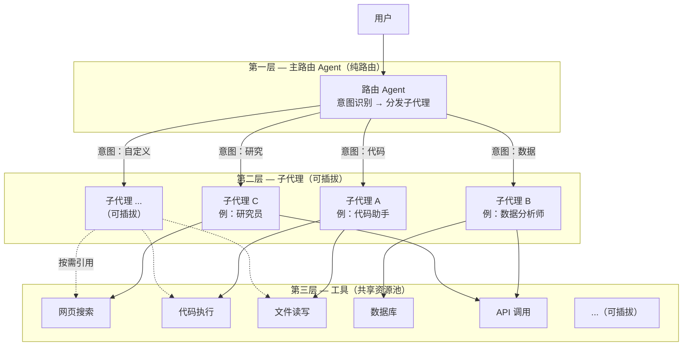

每层职责严格分离：

- **路由 Agent** — 只做两件事：识别意图、选择子代理。不碰工具、不碰记忆、不碰响应生成
- **子代理** — 完全自治的执行者，拥有独立的工具白名单、执行策略、模型配置，像 USB 设备一样插拔
- **工具** — 无状态共享资源池，被多个子代理按需引用，互不绑定

数据流：`用户消息 → 路由 Agent 识别意图 → 透传子代理 → 子代理规划→调工具→生成响应 → 返回用户`

### 子代理完全自治

这是 ArtiPivot 与其他"分层"框架的关键差异。子代理不是被路由 Agent 操控的傀儡，而是拥有完整自主权的独立执行者：

- **独立记忆**：每个子代理有自己的长期记忆 namespace，支持跨会话记住用户偏好（记忆提取/读取模块已实现，可在节点中按需调用）
- **独立工具**：通过白名单机制，每个子代理只能看到被授权的工具子集
- **独立策略**：ReAct 循环、CoT 链式推理、Function Calling——不同子代理可用不同策略
- **独立模型**：不同子代理可配置不同模型供应商和 fallback 链

### 用 YAML 创建子代理

声明式模式让你不写一行 Python 就能创建子代理：

```yaml
# config/seed/sub_agents.yaml
sub_agents:
  code_writer:
    strategy: react                    # ReAct 循环推理
    tools: [web_search, code_exec]     # 工具白名单
    system_prompt: "You are a coding assistant."
    strategy_config:
      max_iterations: 5

  researcher:
    strategy: cot                      # CoT 链式推理
    tools: [web_search]
    system_prompt: "You are a research assistant."
```

启动时自动加载 → 构建 LangGraph 子图 → 挂载到主图，零代码。

### 插件热重建

发布新子代理不用重启服务：

```
pm.publish(plugin)
  → DocumentStore 持久化
  → ChangeNotifier 广播
  → PluginWatcher 监听
  → GraphRebuilder 重建图
  → Gateway 原子替换（dict 赋值是原子的）
```

重建 Agent A 不影响 Agent B 正在处理的请求。

---

## 全局架构

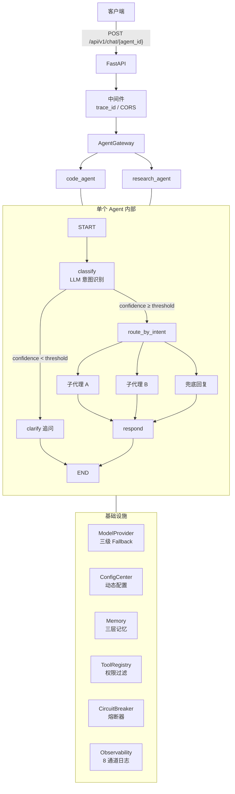

多个主 Agent 并存运行，**五维隔离**：独立 State / 独立路由 / 独立子代理集 / 独立工具白名单 / 独立记忆 namespace。通过 `agents.yaml` 声明，`AgentRegistry` 自动构建并注册到 Gateway。

---

## 核心能力

| 能力 | 设计 | 效果 |
|------|------|------|
| **子代理完全自治** | 独立记忆 + 独立工具 + 独立策略 + 独立模型 | 不是被操控的傀儡，是拥有完整自主权的执行者 |
| **插件热重建** | publish → ChangeNotifier → Watcher → GraphRebuilder → Gateway 原子替换 | 发布即生效，不用重启，重建 A 不影响 B |
| **多主 Agent 五维隔离** | 多 Agent 并存，各自独立 State/路由/子代理/工具/记忆 | Agent 之间互不干扰，可配不同模型供应商 |
| **声明式零代码** | YAML 定义子代理，strategy 字段选策略，自动构建 LangGraph 子图 | 不写 Python 就能创建子代理 |
| **模型三级 Fallback** | 子代理模型 → 子代理兜底 → 全局兜底 | 一级挂了自动降级，保证可用性；模型变更无需重建图 |
| **动态配置** | 模型、提示词、限流等所有参数存 DocumentStore，通过 API 管理 | 修改立即生效，不用重启服务 |
| **三层记忆** | L1 工作记忆（State）+ L2 会话记忆（Checkpointer）+ L3 长期记忆（Store） | 短期对话 + 长期知识 + 用户画像，各 Agent 记忆隔离 |
| **全链路容错** | 熔断器（独立工具）+ 指数退避重试 + 节点 error_handler + 限流 | 各层容错工具可独立使用，按需接入 |
| **生产级可观测** | 8 通道 structlog JSON 日志 + OpenTelemetry 可选 | 不依赖外部 SaaS，trace/LLM/工具/记忆/审计全覆盖 |

### 技术栈

| 组件 | 选型 | 说明 |
|------|------|------|
| 运行时 | LangGraph v1.2 | 图编排 + Checkpointer + Store + ToolNode，不依赖 LangChain 高层包 |
| 模型 | Anthropic Claude / OpenAI GPT | 通过 langchain-anthropic / langchain-openai 集成 |
| 日志 | structlog + orjson | 结构化 JSON 输出，按日轮转 |
| 存储 | 可插拔 | Memory（零依赖开发）/ PostgreSQL（已实现）；可扩展 MongoDB / Redis |
| 部署 | FastAPI + Uvicorn | REST API 入口 + 管理 API + CLI |
| CLI | Typer | `artipivot` 命令行工具（plugin init/publish/serve） |

**177 个单元测试全部通过**（P0: 38 + P1: 23 + P2: 25 + P3: 21 + P4: 19 + P5: 51）

---

## 模块架构

### 子代理与策略引擎

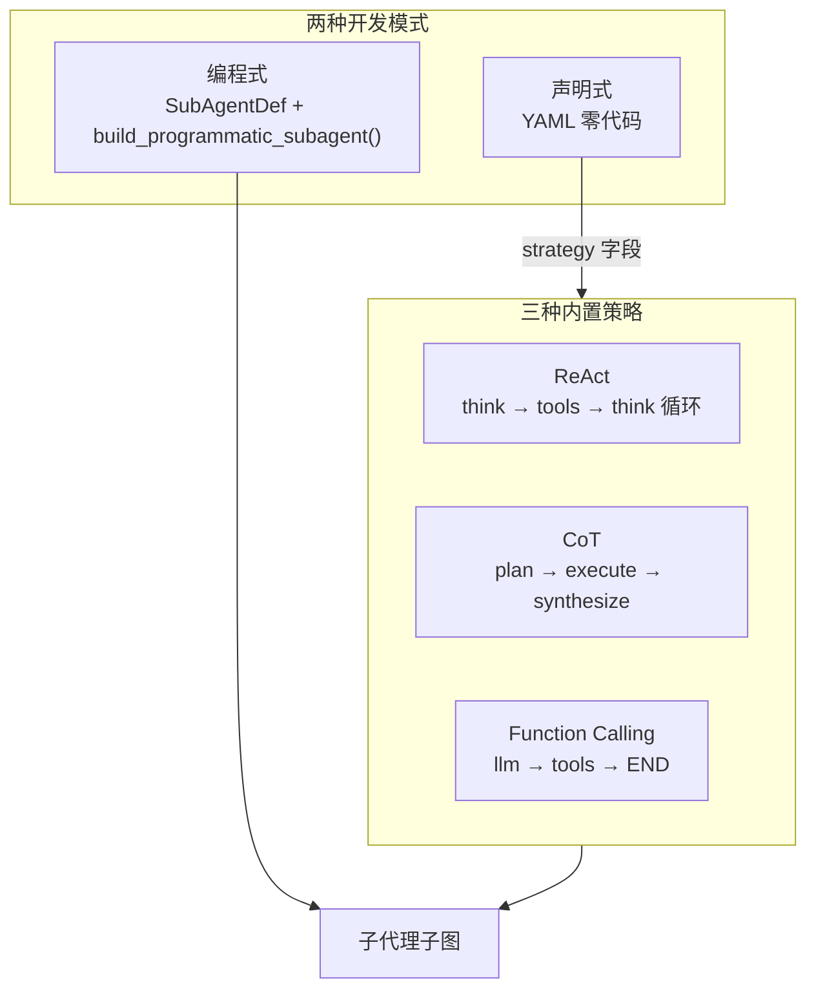

> [doc/modules/agents.md](doc/modules/agents.md) — 编程式/声明式定义、策略引擎、YAML 配置、自定义策略

### 插件系统与热重建

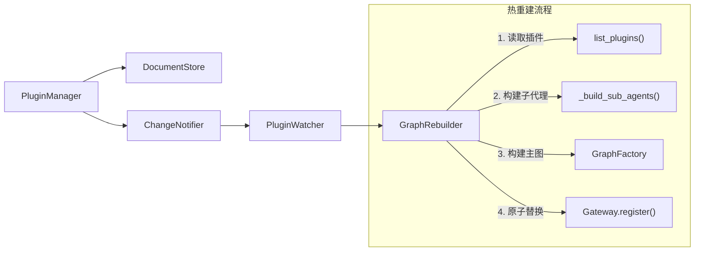

> [doc/modules/plugins.md](doc/modules/plugins.md) — 插件管理、图热重建、Watcher 自动重建、路由回调

### 多主 Agent 隔离

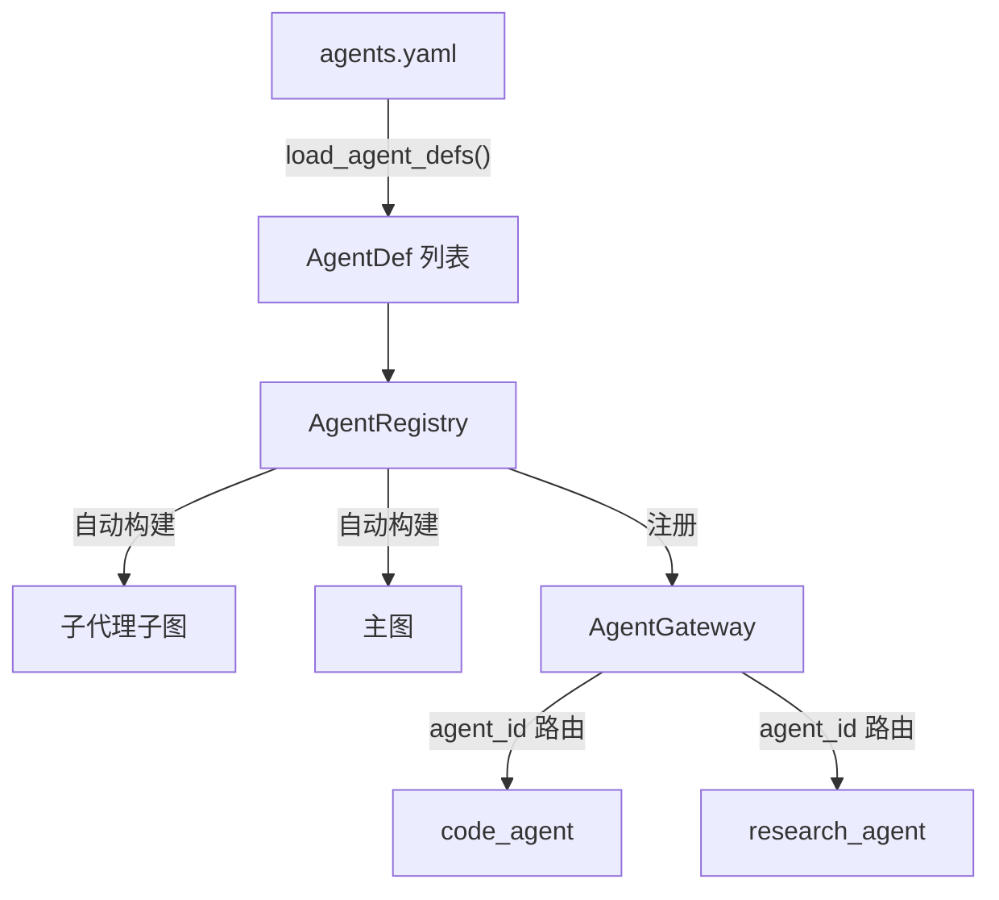

> [doc/modules/multi_agent.md](doc/modules/multi_agent.md) — AgentDef、Registry、YAML 声明、五维隔离

### 模型三级 Fallback

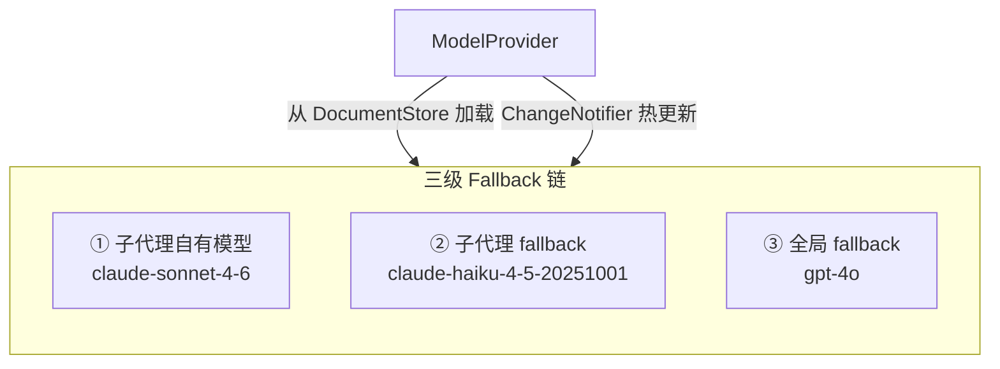

> [doc/modules/models.md](doc/modules/models.md) — ModelConfig、YAML 配置、供应商接入、动态切换

### 三层记忆

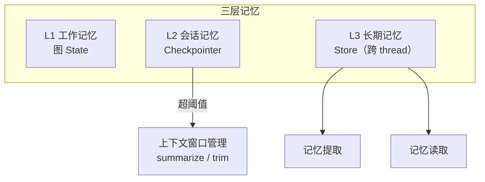

> [doc/modules/memory.md](doc/modules/memory.md) — 三层模型、后端注册、Namespace 隔离、提取/读取、上下文压缩

### 工具层

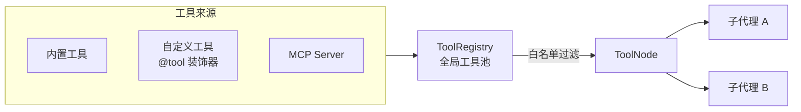

> [doc/modules/tools.md](doc/modules/tools.md) — 注册工具、权限过滤、MCP 适配

### 动态配置中心

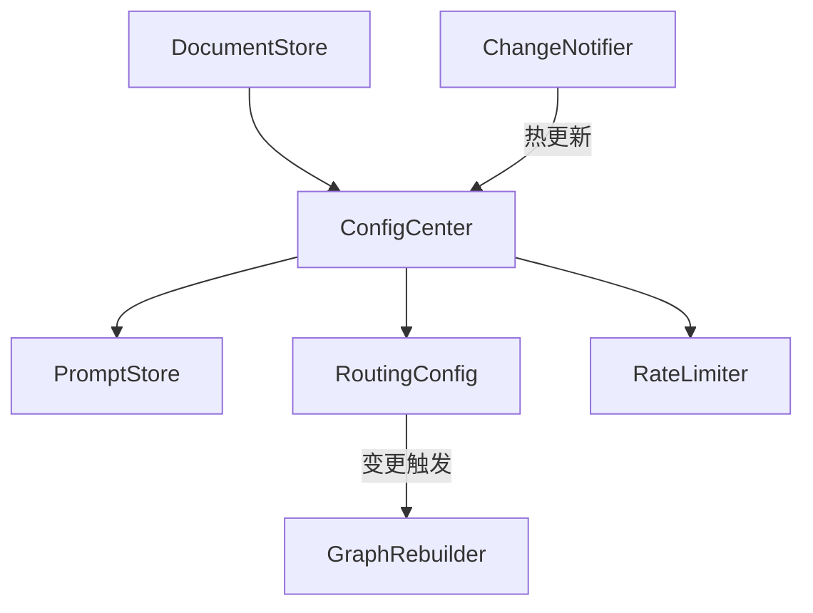

> [doc/modules/config.md](doc/modules/config.md) — 配置分类、路由规则、提示词管理、管理 API

### 可插拔存储

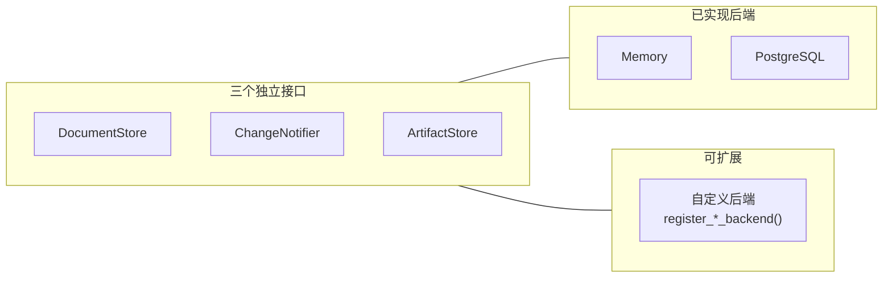

> [doc/modules/storage.md](doc/modules/storage.md) — 接口定义、后端配置、自定义后端接入

### 容错与弹性

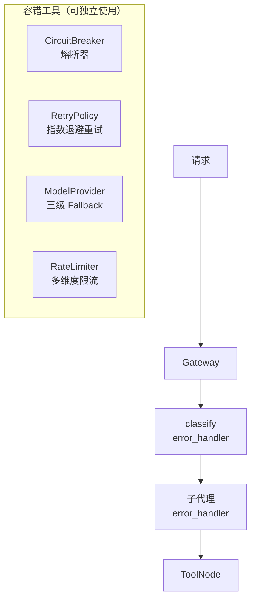

> [doc/modules/resilience.md](doc/modules/resilience.md) — CircuitBreaker、RetryPolicy、error_handler、RateLimiter

### 可观测性与 API

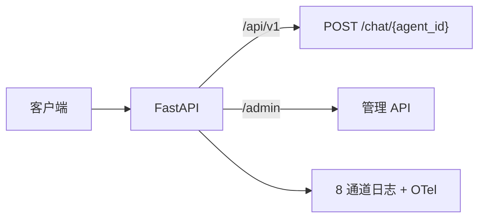

> [doc/modules/observability_api.md](doc/modules/observability_api.md) — 日志系统、OTel、REST API、CLI、完整接入示例

---

## 项目结构

```
artipivot/
├── pyproject.toml                          # 项目元数据、依赖声明（hatch + uv）
├── demo.py                                 # 端到端交互式演示脚本
│
├── doc/
│   └── modules/                            # 模块详细文档（10 个）
│
├── config/seed/                            # 首次启动种子配置（YAML）
│   ├── models.yaml                         #   模型配置 + fallback 链
│   ├── prompts.yaml                        #   各节点提示词
│   ├── routing.yaml                        #   意图→子代理映射
│   ├── sub_agents.yaml                     #   声明式子代理定义
│   ├── memory.yaml                         #   记忆策略配置
│   └── agents.yaml                         #   多 Agent 声明
│
├── src/artipivot/
│   ├── gateway/                            #   多主 Agent 分发层
│   ├── graph/                              #   核心图构建层
│   ├── agents/                             #   子代理层 + 策略引擎
│   ├── tools/                              #   工具层 + MCP 适配
│   ├── memory/                             #   三层记忆系统
│   ├── models/                             #   模型适配 + Fallback
│   ├── config/                             #   动态配置中心
│   ├── storage/                            #   可插拔存储抽象
│   ├── plugins/                            #   插件系统（热重建）
│   ├── resilience/                         #   容错与弹性
│   ├── observability/                      #   日志 + OTel
│   ├── api/                                #   REST API（FastAPI）
│   └── cli/                                #   CLI 工具（Typer）
│
└── tests/                                  # 177 个单元测试
```

## 快速开始

```bash
# 安装依赖
uv sync --dev

# 运行测试（177 个）
uv run pytest tests/ -v

# 交互式 demo（需设置 API Key）
export ANTHROPIC_API_KEY=sk-...
uv run python demo.py

# 启动 API 服务器
uv run artipivot serve --port 8000

# CLI 插件脚手架
uv run artipivot plugin init my_plugin --template react
```

## 扩展点速查表

| 扩展点 | 接口/基类 | 注册方式 | 热更新 |
|--------|-----------|----------|:------:|
| 文档存储 | `DocumentStore` | 继承 + 工厂函数 | — |
| 变更通知 | `ChangeNotifier` | 继承 + 工厂函数 | — |
| 制品存储 | `ArtifactStore` | 继承 + 工厂函数 | — |
| 模型供应商 | `_factories[provider]` | 添加工厂函数 | ✓ |
| 自定义工具 | `@tool` 装饰器 | `registry.register(tool)` | — |
| 子代理策略 | `Strategy` ABC | `register_strategy()` | — |
| Checkpointer 后端 | `BaseCheckpointSaver` | `register_checkpointer_backend()` | — |
| Store 后端 | `BaseStore` | `register_store_backend()` | — |
| 多主 Agent | `AgentDef` | `AgentRegistry.register_def()` | — |
| 插件元数据 | `PluginDocument` | `pm.publish()` | ✓ |
| 图热重建 | `GraphRebuilder` | `rebuilder.rebuild_agent()` | ✓ |
| MCP 工具 | `MCPToolAdapter` | `MCPRegistry.register_server()` | — |
| 限流规则 | `RateLimiter` | `PUT /admin/ratelimits/*` | ✓ |
| OTel 可观测 | `observability/otel.py` | `OTEL_ENABLED=true` | ✓ |
