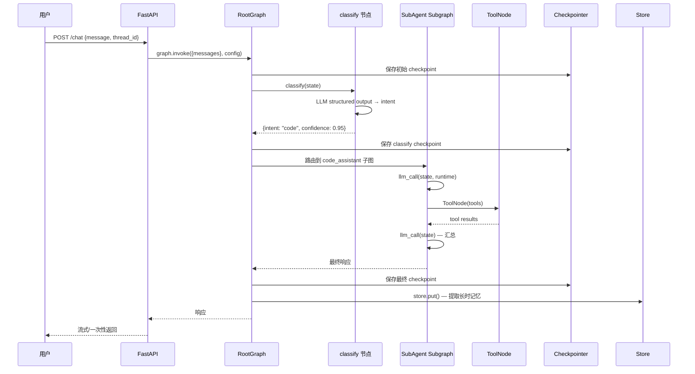

# ArtiPivot 代码架构设计

> 版本: 0.1.0 | 日期: 2026-05-13 | 状态: 草稿
> 基于 [DESIGN.md](./DESIGN.md) 产品设计，映射到 LangGraph/LangChain 代码层

## 依赖版本基线

本架构基于以下版本设计，所有 API 参照这些版本的文档和语义：

| 包 | 版本 | 发布日期 | 关键特性 |
|---|---|---|---|
| **`langchain`** | **v1.3** | 2026-05-12 | `create_agent` 工厂、Middleware 体系、v3 event streaming |
| **`langgraph`** | **v1.2** | 2026-05-12 | `DeltaChannel`、per-node timeouts、node-level error handlers、v2/v3 streaming |
| `langchain-core` | >=1.0 (随 langchain v1.3) | — | `BaseTool`、`@tool`、`RunnableConfig`、消息类型 |
| `langgraph-checkpoint-postgres` | latest | — | `AsyncPostgresSaver`（生产持久化） |

> 版本选型依据：`langgraph` v1.2 引入的 `DeltaChannel`、per-node timeout、error handler 是生产必需能力；`langchain` v1.3 的 `create_agent` + Middleware 是声明式子代理的基础。两者均需 >= v1.0 起步（2025-10-20 发布）。

---

## 1. 核心映射：产品三层 → LangGraph 图结构

DESIGN.md 定义的三层架构（路由 Agent → 子代理 → 工具），在 LangGraph 中通过 **主图 + 子图 + ToolNode** 实现：

```
┌─────────────────────────────────────────────────────┐
│  主图 (RootGraph)                                    │
│                                                     │
│  ┌──────────┐    ┌──────────────┐    ┌───────────┐ │
│  │ classify  │───▶│   dispatch    │───▶│  respond  │ │
│  │ (路由节点) │    │ (条件边分发)   │    │ (格式化)  │ │
│  └──────────┘    └──────┬───────┘    └───────────┘ │
│                         │                            │
│          ┌──────────────┼──────────────┐            │
│          ▼              ▼              ▼            │
│  ┌──────────────┐ ┌──────────────┐ ┌──────────────┐│
│  │ Subgraph A   │ │ Subgraph B   │ │ Subgraph C   ││
│  │ (子代理图)    │ │ (子代理图)    │ │ (子代理图)    ││
│  │              │ │              │ │              │ │
│  │ ┌──────────┐ │ │ ┌──────────┐ │ │ ┌──────────┐ ││
│  │ │ llm_call │ │ │ │ llm_call │ │ │ │ llm_call │ ││
│  │ └────┬─────┘ │ │ └────┬─────┘ │ │ └────┬─────┘ ││
│  │      ▼       │ │      ▼       │ │      ▼       ││
│  │ ┌──────────┐ │ │ ┌──────────┐ │ │ ┌──────────┐ ││
│  │ │ ToolNode │ │ │ │ ToolNode │ │ │ │ ToolNode │ ││
│  │ └──────────┘ │ │ └──────────┘ │ │ └──────────┘ ││
│  └──────────────┘ └──────────────┘ └──────────────┘│
└─────────────────────────────────────────────────────┘
```

### 1.1 概念映射表

| DESIGN.md 概念 | LangGraph 原语 | 职责 |
|---|---|---|
| 路由 Agent | `StateGraph` 主图 + `add_conditional_edges` | 意图分类 + 条件路由 |
| 子代理（编程式） | `StateGraph` 子图，通过 `add_node(subgraph)` 注册 | 独立 State + Nodes + Edges |
| 子代理（声明式） | 由策略引擎动态构建的 `StateGraph` | ReAct / CoT / Function Calling 循环 |
| 工具 | `@tool` 函数 + `ToolNode` | 原子执行能力 |
| 会话上下文 | `MessagesState` + `Checkpointer` (per-thread) | 多轮对话记忆 |
| 跨会话记忆 | `Store` (跨 thread 的长时记忆) | 用户偏好、知识积累 |
| 运行时依赖注入 | `Runtime[Context]` (context_schema) | 模型实例、用户信息、工具注册表 |
| 工具权限矩阵 | `ToolNode` 内置的 tool 过滤逻辑 | 子代理可用工具白名单 |

---

## 2. State 设计

### 2.1 主图 State

```python
class ArtiPivotState(TypedDict):
    messages: Annotated[list[AnyMessage], add_messages]  # 对话消息流
    intent: str | None           # 路由分类结果
    confidence: float            # 分类置信度
    active_agent: str | None     # 当前激活的子代理名
    metadata: dict               # 请求级元数据（user_id, trace_id 等）
```

### 2.2 子代理 State（通用）

```python
class SubAgentState(TypedDict):
    messages: Annotated[list[AnyMessage], add_messages]  # 独立消息流
    query: str                   # 从主图传入的任务描述
    artifacts: list[str]         # 执行过程中产生的中间产物
```

### 2.3 Context Schema（运行时注入）

```python
@dataclass
class AgentContext:
    user_id: str
    model_provider: str          # "anthropic" | "openai" | ...
    model_name: str              # "claude-sonnet-4-6" | "gpt-4o" | ...
    available_tools: list[str]   # 当前子代理可用的工具名列表
```

通过 `StateGraph(State, context_schema=AgentContext)` 注入，节点函数签名接收 `runtime: Runtime[AgentContext]`。

---

## 3. 主图构建：路由 Agent

主图采用 **Routing 工作流模式**，对应 LangGraph 文档中的 Routing pattern：

```
START → classify → (conditional edges) → subgraph_A / subgraph_B / ... / clarify → respond → END
```

### 3.1 节点职责

| 节点 | 职责 | 输入 → 输出 |
|---|---|---|
| `classify` | LLM 结构化输出识别意图 | `messages` → `intent`, `confidence` |
| `clarify` | 置信度不足时追问用户 | `messages` → 追加澄清消息 |
| `fallback` | 无匹配意图的兜底处理 | `messages` → 通用 LLM 回复 |
| `respond` | 统一格式化输出 | 子代理结果 → 最终响应 |

### 3.2 条件边

```python
# classify 后的路由决策
def route_by_intent(state: ArtiPivotState) -> str:
    if state["confidence"] < CONFIDENCE_THRESHOLD:
        return "clarify"
    intent = state["intent"]
    if intent in registered_sub_agents:
        return intent  # 路由到同名子图节点
    return "fallback"

builder.add_conditional_edges("classify", route_by_intent)
```

### 3.3 子图注册

子代理以 **子图** 方式挂载到主图。两种注册方式对应不同的子图构建策略：

- **编程式子代理**：直接 `builder.add_node("code_assistant", compiled_subgraph)`
- **声明式子代理**：由策略引擎动态构建 `StateGraph` 并编译后挂载

---

## 4. 子代理图构建

### 4.1 编程式子代理

开发者编写 `_invoke` 方法，框架将其包装为 LangGraph 子图：

```
┌──────────────────────────┐
│  SubAgent Subgraph        │
│                          │
│  START → invoke → END    │
│            │              │
│            ▼              │
│        ToolNode           │
│            │              │
│            ▼              │
│        invoke (循环)      │
└──────────────────────────┘
```

本质上是 LangGraph 文档中的 **Agent pattern**（LLM + Tool 循环）：

```python
def build_programmatic_subagent(
    invoke_fn, tools: list, context: AgentContext
) -> CompiledStateGraph:
    builder = StateGraph(SubAgentState)

    def llm_call(state: SubAgentState, runtime: Runtime[AgentContext]):
        # 调用用户的 _invoke 逻辑
        return invoke_fn(state, runtime)

    builder.add_node("llm_call", llm_call)
    builder.add_node("tools", ToolNode(tools))
    builder.add_edge(START, "llm_call")
    builder.add_conditional_edges("llm_call", should_continue, ["tools", END])
    builder.add_edge("tools", "llm_call")

    return builder.compile()
```

### 4.2 声明式子代理（策略引擎）

三种内置策略对应三种图拓扑：

**ReAct 策略**（最常用，与 Agent pattern 一致）：
```
START → think → (有工具调用?) → ToolNode → think → ... → END
                 └──(无)──→ END
```

**CoT 策略**（Prompt Chaining pattern）：
```
START → plan → execute → synthesize → END
```

**Function Calling 策略**（并行工具调用）：
```
START → llm_call → ToolNode → llm_call → END
        (单次调用，无循环)
```

策略引擎根据 YAML/JSON 配置选择拓扑并构建图：

```python
class StrategyEngine:
    def build(self, config: DeclarativeConfig) -> CompiledStateGraph:
        strategy = config.strategy.type
        if strategy == "react":
            return self._build_react(config)
        elif strategy == "cot":
            return self._build_cot(config)
        elif strategy == "function_calling":
            return self._build_fc(config)
```

---

## 5. 工具层设计

### 5.1 工具定义

工具统一使用 LangChain 的 `@tool` 装饰器，参数从 YAML 声明自动生成：

```python
# 框架根据 tools/search.yaml 自动生成等价的 @tool 函数
@tool
def search(query: str, max_results: int = 5) -> str:
    """在互联网上搜索指定查询，返回相关网页片段"""
    ...
```

### 5.2 工具注册表

工具注册表是一个 `dict[str, BaseTool]`，子代理通过 `context_schema` 注入可用工具子集：

```python
# 注册表管理器
class ToolRegistry:
    _tools: dict[str, BaseTool]  # 全局工具池

    def get_for_agent(self, agent_name: str, tool_names: list[str]) -> list[BaseTool]:
        """按权限矩阵过滤，返回子代理可用工具"""
        allowed = self._permissions.get(agent_name, set())
        return [self._tools[n] for n in tool_names if n in allowed]
```

### 5.3 MCP 工具适配

外部 MCP Server 通过适配器转换为 `BaseTool`，无缝接入 `ToolNode`：

```
MCP Server → MCPAdapter → list[BaseTool] → ToolNode
```

---

## 6. 持久化策略

### 6.1 三层持久化

| 层级 | LangGraph 机制 | 存储内容 | 后端 |
|---|---|---|---|
| 会话内状态 | `Checkpointer` (per-thread) | 图执行快照、消息历史 | PostgresSaver / InMemorySaver |
| 跨会话记忆 | `Store` | 用户偏好、长期知识 | InMemoryStore / PostgresStore |
| 插件元数据 | MongoDB（自定义） | 子代理/工具定义、版本、制品地址 | MongoDB + S3 |

### 6.2 图编译配置

```python
checkpointer = AsyncPostgresSaver(conn_string)
store = InMemoryStore()  # 开发阶段

graph = root_builder.compile(
    checkpointer=checkpointer,
    store=store,
)
```

### 6.3 子图持久化模式

| 子代理类型 | checkpointer | 说明 |
|---|---|---|
| 编程式 | `None`（默认，per-invocation） | 每次调用独立，支持 interrupt |
| 声明式（无状态） | `False`（stateless） | 纯函数调用，无开销 |
| 需要多轮记忆的子代理 | `True`（per-thread） | 跨调用积累上下文 |

---

## 7. 插件热加载与图重建

LangGraph 的图在 `compile()` 后是**不可变**的。插件的热加载意味着需要**重建图并替换实例**。

### 7.1 热加载流程

```
MongoDB Change Stream → 检测插件变更 → 重新构建受影响的子图 → 重建主图 → 原子替换 graph 实例
```

### 7.2 图工厂模式

```python
class GraphFactory:
    """持有所有插件定义，按需构建完整图"""

    def __init__(self, registry: ClusterPluginRegistry):
        self.registry = registry

    def build(self) -> CompiledStateGraph:
        """从注册表构建完整主图 + 所有子图"""
        root = StateGraph(ArtiPivotState, context_schema=AgentContext)

        # 1. 添加固定节点
        root.add_node("classify", self._classify_node)
        root.add_node("respond", self._respond_node)

        # 2. 动态加载并注册所有子代理子图
        for agent_def in self.registry.list_sub_agents():
            subgraph = self._build_subgraph(agent_def)
            root.add_node(agent_def.name, subgraph)

        # 3. 条件边
        root.add_edge(START, "classify")
        root.add_conditional_edges("classify", route_by_intent)
        root.add_edge("respond", END)

        # 4. 所有子图指向 respond
        for agent_def in self.registry.list_sub_agents():
            root.add_edge(agent_def.name, "respond")

        return root.compile(checkpointer=..., store=...)
```

插件变更时调用 `factory.build()` 重建图，然后原子替换运行中的图实例。

---

## 8. 包结构设计

```
src/artipivot/
├── __init__.py
│
├── graph/                        # 核心图构建层
│   ├── __init__.py
│   ├── state.py                  # ArtiPivotState, SubAgentState
│   ├── context.py                # AgentContext (runtime context_schema)
│   ├── root.py                   # 主图构建（classify → dispatch → respond）
│   ├── router.py                 # 意图分类节点（LLM structured output）
│   └── factory.py                # GraphFactory — 图工厂，热重建入口
│
├── agents/                       # 子代理层
│   ├── __init__.py
│   ├── base.py                   # SubAgent 基类 / 注册接口
│   ├── programmatic.py           # 编程式子代理图构建器
│   ├── declarative.py            # 声明式子代理 — 策略引擎
│   └── strategies/               # 内置策略实现
│       ├── __init__.py
│       ├── react.py              # ReAct 策略图
│       ├── cot.py                # Chain-of-Thought 策略图
│       └── function_calling.py   # Function Calling 策略图
│
├── tools/                        # 工具层
│   ├── __init__.py
│   ├── registry.py               # ToolRegistry — 全局工具池 + 权限矩阵
│   ├── loader.py                 # YAML → @tool 函数动态生成
│   ├── mcp_adapter.py            # MCP Server → BaseTool 适配
│   ├── openapi_importer.py       # OpenAPI Schema → BaseTool 自动导入
│   └── builtin/                  # 内置工具实现
│       ├── __init__.py
│       ├── web_search.py
│       ├── code_exec.py
│       ├── file_io.py
│       └── database.py
│
├── plugins/                      # 插件管理
│   ├── __init__.py
│   ├── manager.py                # ClusterPluginRegistry — MongoDB CRUD
│   ├── watcher.py                # Change Stream 监听 → 触发图重建
│   ├── loader.py                 # 制品下载 → 校验 → 导入 → 实例化
│   └── sandbox.py                # 插件隔离环境
│
├── persistence/                  # 持久化配置
│   ├── __init__.py
│   ├── checkpointer.py           # Checkpointer 工厂（Postgres / Memory）
│   └── store.py                  # Store 工厂 + 语义搜索配置
│
├── api/                          # 对外接口
│   ├── __init__.py
│   ├── server.py                 # FastAPI 入口（langgraph.json 兼容）
│   └── admin.py                  # 插件管理 REST API
│
├── cli/                          # CLI
│   ├── __init__.py
│   └── main.py                   # artipivot plugin init/dev/publish
│
└── config.py                     # 全局配置（模型、数据库连接等）
```

### 8.1 包依赖关系

```
api / cli
   │
   ▼
graph ←── agents ←── tools
   │         │
   │         ▼
   │      plugins
   │         │
   ▼         ▼
persistence  config
```

依赖规则：上层可以依赖下层，同层之间通过接口解耦。`graph` 不直接依赖 `plugins`，而是通过 `factory` 在启动时注入。

---

## 9. 关键技术决策

| 决策 | 选择 | LangGraph 依据 |
|---|---|---|
| 路由实现 | `add_conditional_edges` + LLM structured output | LangGraph Routing pattern |
| 子代理挂载 | Subgraph（`add_node(compiled_subgraph)`） | LangGraph Subgraph — 独立 State + 持久化隔离 |
| 工具执行 | `ToolNode` | 内置并行执行、错误处理、状态注入 |
| 对话记忆 | `MessagesState` + `Checkpointer` (per-thread) | 原生消息累积 reducer + 跨轮次持久化 |
| 长时记忆 | `Store` (跨 thread) | LangGraph Store — 语义搜索 + namespace 隔离 |
| 依赖注入 | `Runtime[AgentContext]` (context_schema) | LangGraph Runtime — 节点自动接收 |
| 插件热加载 | 图工厂重建 + 原子替换实例 | LangGraph 图不可变，需重建 |
| 子代理持久化 | 默认 per-invocation，按需 per-thread | Subgraph persistence 三种模式 |
| 流式输出 | `graph.stream()` + `subgraphs=True` | LangGraph Streaming |
| 人机协作 | `interrupt()` + `Command(resume=...)` | LangGraph Interrupts |
| 可观测性 | LangSmith 原生集成 | 所有 LangGraph 节点自动 trace |

---

## 10. 调用流全景



---

## 11. 实现阶段规划

| 阶段 | 范围 | 对应包 |
|---|---|---|
| **P0 — 骨架** | State 定义 + 主图 + 1 个编程式子代理 + ToolNode + InMemory 持久化 | `graph/`, `agents/programmatic.py`, `tools/builtin/` |
| **P1 — 声明式** | 策略引擎（ReAct/CoT/FC） + YAML 加载 | `agents/strategies/`, `agents/declarative.py` |
| **P2 — 持久化** | PostgresSaver + Store + 语义搜索 | `persistence/` |
| **P3 — 插件** | MongoDB 注册表 + Change Stream + 图热重建 | `plugins/`, `graph/factory.py` |
| **P4 — 生产** | FastAPI + 管理后台 + CLI + 权限矩阵 + MCP 适配 | `api/`, `cli/`, `tools/mcp_adapter.py` |
