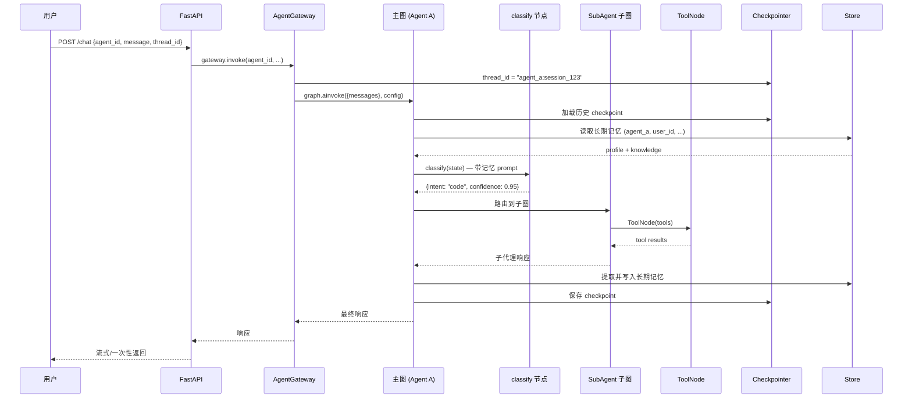

# ArtiPivot 代码架构设计

> 版本: 0.2.0 | 日期: 2026-05-14 | 状态: 草稿
> 基于 [DESIGN.md](./DESIGN.md) 产品设计，映射到 LangGraph 代码层

## 依赖版本基线

本架构**仅依赖 LangGraph 运行时**，不依赖 LangChain 高层包。

| 包 | 版本 | 发布日期 | 用途 |
|---|---|---|---|
| **`langgraph`** | **v1.2** | 2026-05-12 | 图编排运行时（StateGraph、Checkpointer、Store、ToolNode、Streaming、Interrupt） |
| `langchain-core` | >=1.0（langgraph 传递依赖） | — | `@tool`、`BaseTool`、Message 类型、`RunnableConfig` |
| `langgraph-checkpoint-postgres` | latest | — | `AsyncPostgresSaver`（生产 Checkpointer） |
| `langchain-anthropic` | latest | — | Anthropic 模型集成（按需） |
| `langchain-openai` | latest | — | OpenAI 模型集成（按需） |

> **不引入 `langchain` 高层包**。LangGraph 可独立使用（docs 原文："you don't need to use LangChain to use LangGraph"）。`langchain-core` 是 langgraph 的传递依赖，提供 `@tool`、Message 类型等基础类型，无需额外安装。
>
> 版本选型依据：`langgraph` v1.2 的 `DeltaChannel`（长对话 checkpoint 压缩）、per-node timeout、node-level error handler 是生产必需能力。

---

## 1. 核心架构：多主 Agent + 子代理 + 工具

从「单一主图 N 个子图」升级为**多主 Agent 隔离架构**。每个主 Agent 是独立的 `CompiledStateGraph`，拥有独立的 State、路由逻辑、子代理集和工具集。

```
┌──────────────────────────────────────────────────────────────┐
│  Agent Gateway（分发层）                                       │
│  POST /chat {agent_id, message, thread_id}                    │
│  → 按 agent_id 路由到对应主图                                  │
├──────────┬──────────────────┬────────────────────────────────┤
│          ▼                  ▼                  ▼              │
│  ┌──────────────┐   ┌──────────────┐   ┌──────────────┐      │
│  │ Agent A      │   │ Agent B      │   │ Agent C      │      │
│  │ (代码助手)    │   │ (研究员)      │   │ (客服)       │      │
│  │              │   │              │   │              │      │
│  │ State A      │   │ State B      │   │ State C      │      │
│  │ classify A   │   │ classify B   │   │ classify C   │      │
│  │ ┌──────────┐ │   │ ┌──────────┐ │   │ ┌──────────┐ │      │
│  │ │Sub A-1   │ │   │ │Sub B-1   │ │   │ │Sub C-1   │ │      │
│  │ │Sub A-2   │ │   │ │Sub B-2   │ │   │ │          │ │      │
│  │ └──────────┘ │   │ └──────────┘ │   │ └──────────┘ │      │
│  │ ToolNode A   │   │ ToolNode B   │   │ ToolNode C   │      │
│  └──────────────┘   └──────────────┘   └──────────────┘      │
├──────────────────────────────────────────────────────────────┤
│  共享基础设施                                                  │
│  - ToolRegistry（工具池 + 权限矩阵）                           │
│  - Checkpointer（Postgres，thread_id 前缀隔离）                │
│  - Store（Postgres，namespace 前缀隔离）                       │
│  - ModelProvider（模型 SDK 适配）                              │
└──────────────────────────────────────────────────────────────┘
```

### 1.1 隔离维度

| 维度 | 隔离方式 | 效果 |
|---|---|---|
| State | 每个主图独立的 `TypedDict` | 字段完全隔离 |
| 路由逻辑 | 每个主图自己的 classify + conditional edges | 意图体系独立 |
| 子代理 | 每个主图挂载不同的子图集合 | 能力池隔离 |
| 工具 | 每个子图绑定不同的 `ToolNode` | 权限隔离 |
| 会话记忆 | 同一 Checkpointer，`thread_id` 前缀 `{agent_id}:` | 对话不串 |
| 长期记忆 | Store namespace 前缀 `(agent_id, user_id, ...)` | 知识库隔离 |
| 模型 | 各主图可用不同 provider / model | 能力/成本隔离 |

### 1.2 概念映射表

| DESIGN.md 概念 | LangGraph 原语 | 职责 |
|---|---|---|
| 主 Agent | `CompiledStateGraph`（独立实例） | 完整隔离的 Agent 运行时 |
| 路由 Agent | 主图内 `add_conditional_edges` | 意图分类 + 条件路由 |
| 子代理（编程式） | `StateGraph` 子图，`add_node(subgraph)` | 独立 State + Nodes + Edges |
| 子代理（声明式） | 策略引擎动态构建的 `StateGraph` | ReAct / CoT / Function Calling |
| 工具 | `@tool` 函数 + `ToolNode` | 原子执行能力 |
| 会话记忆 | `MessagesState` + `Checkpointer` | 多轮对话（详见 [MEMORY.md](./MEMORY.md)） |
| 长期记忆 | `Store` (跨 thread) | 用户偏好、知识（详见 [MEMORY.md](./MEMORY.md)） |
| 运行时注入 | `Runtime[Context]` (context_schema) | user_id、模型配置等 |
| 工具权限矩阵 | `ToolRegistry` + `ToolNode` 过滤 | 子代理可用工具白名单 |

---

## 2. State 设计

### 2.1 主图 State（每个主 Agent 可自定义）

```python
class ArtiPivotState(TypedDict):
    messages: Annotated[list[AnyMessage], add_messages]  # 对话消息流
    intent: str | None           # 路由分类结果
    confidence: float            # 分类置信度
    active_agent: str | None     # 当前激活的子代理名
    metadata: dict               # 请求级元数据（user_id, trace_id 等）
```

### 2.2 子代理 State（通用）

```python
class SubAgentState(MessagesState):
    query: str                                  # 从主图传入的任务
    artifacts: Annotated[list[str], operator.add]  # 中间产物累积
```

### 2.3 Context Schema（运行时注入）

```python
@dataclass
class AgentContext:
    agent_id: str                # 主 Agent 标识（隔离 key）
    user_id: str
    model_provider: str          # "anthropic" | "openai" | ...
    model_name: str
    available_tools: list[str]
```

---

## 3. 多主 Agent 架构

### 3.1 Agent Gateway

统一入口，按 `agent_id` 分发到对应主图：

```python
class AgentGateway:
    """多主 Agent 分发层"""

    def __init__(self):
        self._graphs: dict[str, CompiledStateGraph] = {}
        self._checkpointer: AsyncPostgresSaver = ...
        self._store: PostgresStore = ...

    def register(self, agent_id: str, graph: CompiledStateGraph):
        self._graphs[agent_id] = graph

    async def invoke(
        self, agent_id: str, message: str, thread_id: str,
        *, user_id: str
    ):
        graph = self._graphs[agent_id]
        config = {"configurable": {"thread_id": f"{agent_id}:{thread_id}"}}
        return await graph.ainvoke(
            {"messages": [{"role": "user", "content": message}]},
            config,
            context=AgentContext(agent_id=agent_id, user_id=user_id, ...),
        )
```

### 3.2 共享 Checkpointer + thread_id 隔离

```python
# 同一个 Checkpointer 实例，thread_id 编码 agent_id
config_a = {"configurable": {"thread_id": "code_agent:session_123"}}
config_b = {"configurable": {"thread_id": "research_agent:session_123"}}

# 各主图只能读到自己的历史，互不干扰
```

### 3.3 共享 Store + namespace 前缀隔离

```python
# Agent A 的用户画像
await store.aget(("code_agent", user_id, "profile"), "main")

# Agent B 的用户画像
await store.aget(("research_agent", user_id, "profile"), "main")
```

### 3.4 共享工具池 + 权限矩阵

```python
# 全局工具池
tool_registry = ToolRegistry({
    "web_search": web_search_tool,
    "code_exec": code_exec_tool,
    "database": database_tool,
})

# 每个主图只绑定有权限的工具子集
code_agent_tools = tool_registry.get_for_agent("code_agent", ["code_exec", "file_io"])
research_agent_tools = tool_registry.get_for_agent("research_agent", ["web_search"])
```

### 3.5 langgraph.json 多图注册（部署级）

```json
{
  "dependencies": ["./src/artipivot"],
  "graphs": {
    "code_agent": "./src/artipivot/agents/code_agent.py:graph",
    "research_agent": "./src/artipivot/agents/research_agent.py:graph",
    "customer_service": "./src/artipivot/agents/customer_service.py:graph"
  },
  "store": {
    "index": {
      "embed": "openai:text-embedding-3-small",
      "dims": 1536,
      "fields": ["$"]
    }
  },
  "env": "./.env"
}
```

---

## 4. 单个主图内部：路由 + 子代理

每个主图内部是 **Routing 工作流模式**：

```
START → classify → (conditional edges) → sub_A / sub_B / ... / clarify → respond → END
```

### 4.1 节点职责

| 节点 | 职责 | 输入 → 输出 |
|---|---|---|
| `classify` | LLM structured output 识别意图 | `messages` → `intent`, `confidence` |
| `clarify` | 置信度不足时追问 | `messages` → 追加澄清消息 |
| `fallback` | 无匹配意图的兜底 | `messages` → 通用 LLM 回复 |
| `respond` | 格式化输出 + 长期记忆提取 | 子代理结果 → 最终响应 |

### 4.2 条件边

```python
def route_by_intent(state: ArtiPivotState) -> str:
    if state["confidence"] < CONFIDENCE_THRESHOLD:
        return "clarify"
    intent = state["intent"]
    if intent in registered_sub_agents:
        return intent
    return "fallback"

builder.add_conditional_edges("classify", route_by_intent)
```

### 4.3 子代理图构建

**编程式子代理**（Agent pattern — LLM + Tool 循环）：

```python
def build_programmatic_subagent(invoke_fn, tools) -> CompiledStateGraph:
    builder = StateGraph(SubAgentState)
    builder.add_node("llm_call", invoke_fn)
    builder.add_node("tools", ToolNode(tools))
    builder.add_edge(START, "llm_call")
    builder.add_conditional_edges("llm_call", should_continue, ["tools", END])
    builder.add_edge("tools", "llm_call")
    return builder.compile()
```

**声明式子代理**（策略引擎根据配置选择图拓扑）：

| 策略 | 图拓扑 | LangGraph Pattern |
|---|---|---|
| ReAct | think → ToolNode → think（循环） | Agent pattern |
| CoT | plan → execute → synthesize | Prompt Chaining pattern |
| Function Calling | llm_call → ToolNode（单次） | — |

---

## 5. 工具层设计

### 5.1 工具定义

使用 `langchain-core` 的 `@tool`（langgraph 传递依赖，无需额外安装）：

```python
from langchain_core.tools import tool

@tool
def search(query: str, max_results: int = 5) -> str:
    """在互联网上搜索指定查询，返回相关网页片段"""
    ...
```

### 5.2 工具注册表

```python
class ToolRegistry:
    _tools: dict[str, BaseTool]
    _permissions: dict[str, set[str]]  # agent_id → allowed tool names

    def get_for_agent(self, agent_id: str, tool_names: list[str]) -> list[BaseTool]:
        allowed = self._permissions.get(agent_id, set())
        return [self._tools[n] for n in tool_names if n in allowed]
```

### 5.3 MCP 工具适配

```
MCP Server → MCPAdapter → list[BaseTool] → ToolNode
```

---

## 6. 持久化策略

记忆系统详见 [MEMORY.md](./MEMORY.md)，此处为概要。

| 层级 | LangGraph 机制 | 存储内容 | 后端 |
|---|---|---|---|
| 会话记忆 | `Checkpointer` (per-thread) | 图快照、消息历史 | AsyncPostgresSaver |
| 长期记忆 | `Store` (跨 thread) | 用户偏好、知识 | PostgresStore + 语义搜索 |
| 插件元数据 | MongoDB（自定义） | 子代理/工具定义 | MongoDB + S3 |

### 6.1 图编译配置

```python
checkpointer = AsyncPostgresSaver.from_conn_string(DB_URI)
store = PostgresStore.from_conn_string(DB_URI, index={...})

graph = root_builder.compile(
    checkpointer=checkpointer,
    store=store,
)
```

### 6.2 子图持久化模式

| 子代理类型 | checkpointer | 说明 |
|---|---|---|
| 编程式 | `None`（per-invocation） | 每次调用独立，支持 interrupt |
| 声明式（无状态） | `False`（stateless） | 纯函数调用，零开销 |
| 需多轮记忆的子代理 | `True`（per-thread） | 跨调用积累上下文 |

---

## 7. 插件热加载与图重建

LangGraph 图 `compile()` 后**不可变**。插件变更需重建图。

### 7.1 热加载流程

```
MongoDB Change Stream → 检测插件变更 → 重建受影响的主图 → 原子替换 AgentGateway 中的实例
```

### 7.2 图工厂

```python
class GraphFactory:
    """按 agent_id 构建独立主图"""

    def build(self, agent_id: str) -> CompiledStateGraph:
        agent_def = self.registry.get_agent(agent_id)
        root = StateGraph(agent_def.state_schema, context_schema=AgentContext)

        # 固定节点
        root.add_node("classify", self._classify_node)
        root.add_node("respond", self._respond_node)

        # 动态子代理
        for sub_def in agent_def.sub_agents:
            subgraph = self._build_subgraph(sub_def)
            root.add_node(sub_def.name, subgraph)
            root.add_edge(sub_def.name, "respond")

        # 路由
        root.add_edge(START, "classify")
        root.add_conditional_edges("classify", route_by_intent)
        root.add_edge("respond", END)

        return root.compile(checkpointer=..., store=...)
```

---

## 8. 包结构设计

```
src/artipivot/
├── __init__.py
│
├── gateway/                       # 多主 Agent 分发层
│   ├── __init__.py
│   ├── gateway.py                 # AgentGateway — 按 agent_id 分发
│   └── config.py                  # 主 Agent 注册表配置
│
├── graph/                         # 核心图构建层
│   ├── __init__.py
│   ├── state.py                   # ArtiPivotState, SubAgentState
│   ├── context.py                 # AgentContext (runtime context_schema)
│   ├── root.py                    # 单个主图构建（classify → dispatch → respond）
│   ├── router.py                  # 意图分类节点（LLM structured output）
│   └── factory.py                 # GraphFactory — 按 agent_id 构建主图
│
├── agents/                        # 子代理层
│   ├── __init__.py
│   ├── base.py                    # SubAgent 基类 / 注册接口
│   ├── programmatic.py            # 编程式子代理图构建器
│   ├── declarative.py             # 声明式子代理 — 策略引擎
│   └── strategies/                # 内置策略实现
│       ├── __init__.py
│       ├── react.py               # ReAct 策略图
│       ├── cot.py                 # Chain-of-Thought 策略图
│       └── function_calling.py    # Function Calling 策略图
│
├── tools/                         # 工具层
│   ├── __init__.py
│   ├── registry.py                # ToolRegistry — 全局工具池 + 权限矩阵
│   ├── loader.py                  # YAML → @tool 函数动态生成
│   ├── mcp_adapter.py             # MCP Server → BaseTool 适配
│   ├── openapi_importer.py        # OpenAPI Schema → BaseTool 自动导入
│   └── builtin/                   # 内置工具实现
│       ├── __init__.py
│       ├── web_search.py
│       ├── code_exec.py
│       ├── file_io.py
│       └── database.py
│
├── memory/                        # 记忆系统（详见 MEMORY.md）
│   ├── __init__.py
│   ├── checkpointer.py            # Checkpointer 工厂（Postgres / Memory）
│   ├── store.py                   # Store 工厂 + 语义搜索配置
│   ├── extraction.py              # 长期记忆提取（对话 → profile/knowledge）
│   └── context_window.py          # 上下文窗口管理（摘要/截断）
│
├── plugins/                       # 插件管理
│   ├── __init__.py
│   ├── manager.py                 # ClusterPluginRegistry — MongoDB CRUD
│   ├── watcher.py                 # Change Stream 监听 → 触发图重建
│   ├── loader.py                  # 制品下载 → 校验 → 导入 → 实例化
│   └── sandbox.py                 # 插件隔离环境
│
├── models/                        # 模型适配层
│   ├── __init__.py
│   └── provider.py               # 统一模型接口（anthropic/openai 按需）
│
├── api/                           # 对外接口
│   ├── __init__.py
│   ├── server.py                  # FastAPI 入口
│   └── admin.py                   # 插件管理 REST API
│
├── cli/                           # CLI
│   ├── __init__.py
│   └── main.py                    # artipivot plugin init/dev/publish
│
└── config.py                      # 全局配置（数据库连接、模型默认值等）
```

### 8.1 包依赖关系

```
api / cli
   │
   ▼
gateway
   │
   ▼
graph ←── agents ←── tools
   │         │
   │         ▼
   │      plugins
   │         │
   ▼         ▼
memory     models
   │
   ▼
config
```

---

## 9. 关键技术决策

| 决策 | 选择 | 依据 |
|---|---|---|
| **不依赖 langchain 高层包** | 仅 `langgraph` + `langchain-core`（传递依赖） | 避免框架锁定，LangGraph 可独立使用 |
| 多主 Agent 隔离 | 多个 `CompiledStateGraph` 实例 | 每个主图独立 State / 路由 / 子代理 / 工具 |
| 会话隔离 | `thread_id` 前缀 `{agent_id}:{session_id}` | 同一 Checkpointer，天然隔离 |
| 记忆隔离 | Store namespace 前缀 `(agent_id, user_id, ...)` | 同一 Store，按 namespace 隔离 |
| 路由实现 | `add_conditional_edges` + LLM structured output | LangGraph Routing pattern |
| 子代理挂载 | Subgraph（`add_node(compiled_subgraph)`） | 独立 State + 持久化隔离 |
| 工具执行 | `ToolNode` | 内置并行执行、错误处理 |
| 依赖注入 | `Runtime[AgentContext]` | 节点自动接收 context |
| 插件热加载 | GraphFactory 重建 + Gateway 原子替换 | 图不可变，需重建 |
| 流式输出 | `graph.stream()` + `subgraphs=True` | LangGraph Streaming v2 |
| 人机协作 | `interrupt()` + `Command(resume=...)` | LangGraph Interrupts |

---

## 10. 调用流全景



---

## 11. 实现阶段规划

| 阶段 | 范围 | 对应包 |
|---|---|---|
| **P0 — 骨架** | Gateway + State + 1 个主图 + 1 个编程式子代理 + ToolNode + InMemory | `gateway/`, `graph/`, `agents/`, `tools/builtin/` |
| **P1 — 声明式** | 策略引擎（ReAct/CoT/FC） + YAML 加载 | `agents/strategies/`, `agents/declarative.py` |
| **P2 — 记忆** | PostgresSaver + PostgresStore + 语义搜索 + 上下文窗口管理 | `memory/` |
| **P3 — 多主 Agent** | 多主图注册 + Gateway 分发 + 隔离验证 | `gateway/`, `graph/factory.py` |
| **P4 — 插件** | MongoDB 注册表 + Change Stream + 图热重建 | `plugins/` |
| **P5 — 生产** | FastAPI + 管理 API + CLI + 权限矩阵 + MCP 适配 | `api/`, `cli/`, `tools/mcp_adapter.py` |
