# ArtiPivot 框架设计文档

> 版本: 0.2.0 | 日期: 2026-05-14 | 状态: 草稿
>
> **配套文档**：[代码架构设计](./ARCHITECTURE.md) | [记忆系统设计](./MEMORY.md)

## 1. 背景与目标

当前 AI Agent 框架（如 OpenClaw、AutoGen、CrewAI）大多采用单体或扁平 Agent 架构，导致：
- 单一 Agent 职责过重，意图识别与执行逻辑耦合
- 工具无法跨 Agent 复用
- 扩展新能力需要侵入式修改核心代码

**ArtiPivot** 的目标：构建一个生产级别的多层 Agent 框架，通过 **主路由 Agent → 子代理 → 工具** 三层解耦架构，实现意图识别、任务分发、工具执行的清晰分离，并以可插拔设计作为核心扩展机制。

### 设计原则

| 原则 | 说明 |
|------|------|
| **单一职责** | 每层只负责一件事：主 Agent 识别意图、子代理执行任务、工具提供原子能力 |
| **可插拔** | 子代理和工具通过注册机制动态加载/卸载，零修改核心代码 |
| **工具复用** | 工具不绑定特定子代理，任何子代理均可按需引用 |
| **生产就绪** | 内置可观测性、错误处理、限流、优雅降级 |

---

## 2. 架构总览

### 2.1 多主 Agent 架构

系统支持**多个主 Agent 并存且完全隔离**。每个主 Agent 是一个独立的运行时实例，拥有自己的路由逻辑、子代理集、工具集和记忆空间。

**隔离维度**：State（独立 TypedDict）、路由逻辑（独立分类器）、子代理（独立子图集）、工具（独立 ToolNode）、会话记忆（thread_id 前缀隔离）、长期记忆（Store namespace 前缀隔离）、模型（可配不同 provider）。

统一通过 **Agent Gateway** 按 `agent_id` 分发请求：

```
用户请求 → Agent Gateway → 按 agent_id 路由 → Agent A 主图 / Agent B 主图 / Agent C 主图
```

每个主图内部仍然是 **路由 → 子代理 → 工具** 三层结构。

### 2.2 三层架构总览（单个主图内部）


### 2.2 数据流全景

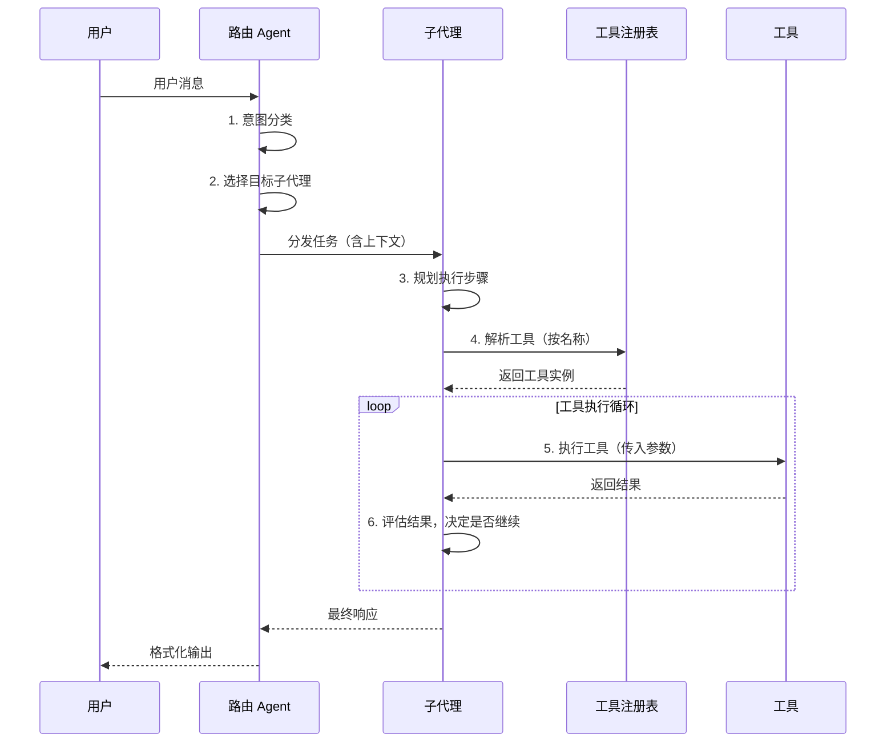

---

## 3. 第一层 — 主路由 Agent

### 3.1 职责

路由 Agent 是系统唯一入口，负责：
1. **意图识别**：解析用户输入，分类到预定义或动态注册的意图
2. **路由分发**：将任务委派给匹配的子代理
3. **上下文管理**：维护会话级上下文，传递给子代理
4. **兜底处理**：无匹配意图时的默认处理策略

### 3.2 意图识别流程

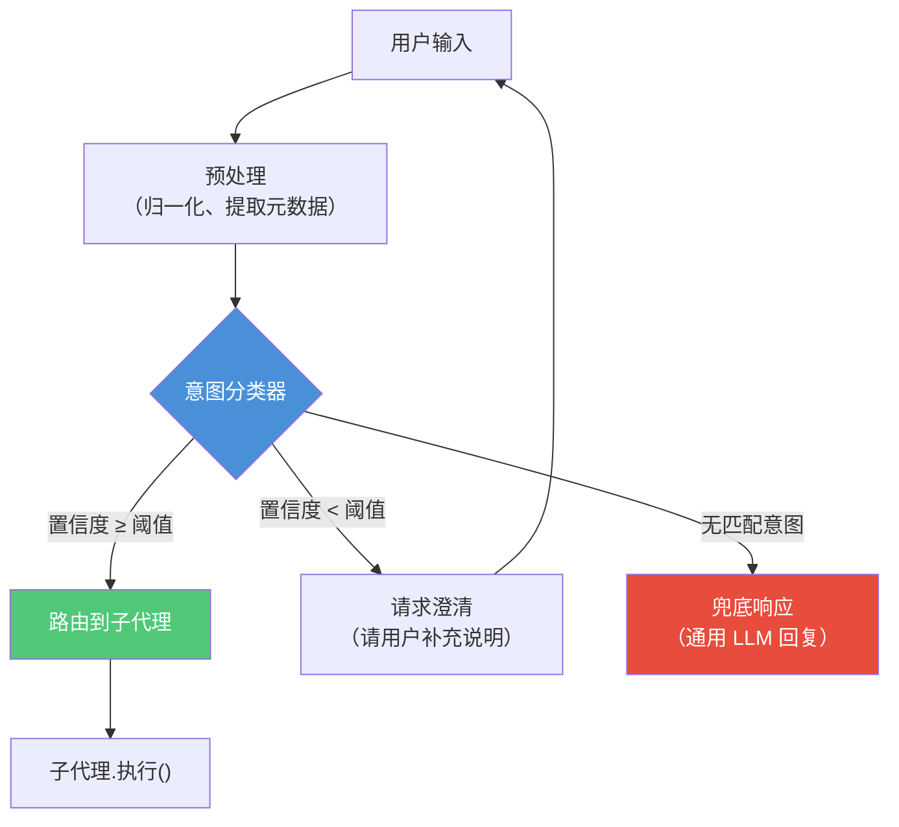

### 3.3 路由 Agent 接口设计

```python
from abc import ABC, abstractmethod
from dataclasses import dataclass
from enum import Enum


class Intent(str, Enum):
    """预定义意图（可通过 Registry 动态扩展）"""
    CODE = "code"
    DATA = "data"
    RESEARCH = "research"
    GENERAL = "general"


@dataclass
class IntentResult:
    intent: Intent
    confidence: float  # 0.0 ~ 1.0
    entities: dict     # 提取的关键实体
    raw_input: str


@dataclass
class RouterResponse:
    intent: IntentResult
    sub_agent_name: str
    response: str
    metadata: dict


class BaseRouter(ABC):
    """路由 Agent 基类 — 可替换实现"""

    @abstractmethod
    async def classify(self, user_input: str, context: dict) -> IntentResult:
        """意图分类"""
        ...

    @abstractmethod
    async def dispatch(self, intent: IntentResult, context: dict) -> RouterResponse:
        """路由到子代理"""
        ...

    @abstractmethod
    async def handle_fallback(self, user_input: str, context: dict) -> RouterResponse:
        """兜底处理"""
        ...
```

---

## 4. 第二层 — 子代理

### 4.1 职责

子代理是实际任务执行者：
1. **任务规划**：将高层意图分解为可执行步骤
2. **工具编排**：按计划调用工具，组装结果
3. **结果聚合**：将多步骤结果合成为最终响应

### 4.2 两种子代理注册方式

ArtiPivot 支持两种子代理开发模式并存，覆盖从零代码到完全自定义的全部场景：

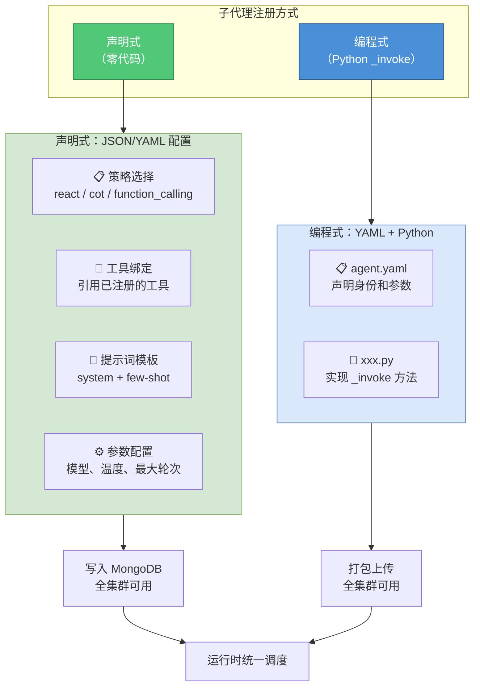

**方式选择指南：**

| 场景 | 推荐方式 | 原因 |
|------|----------|------|
| 大多数业务 Agent（客服、问答、搜索增强） | **声明式** | 配置提示词 + 绑工具即可，无需代码 |
| 需要多步骤编排、条件分支、自定义逻辑 | **编程式** | Python 灵活控制执行流程 |
| 快速原型验证 | **声明式** | 几分钟配置一个可用的 Agent |
| 复杂工具编排（并行调用、结果聚合） | **编程式** | 需要代码控制编排逻辑 |

### 4.3 子代理开发体验（参考 Dify Agent Strategy）

**设计理念**：开发者只需关心"拿到任务怎么执行"，框架负责其余一切。

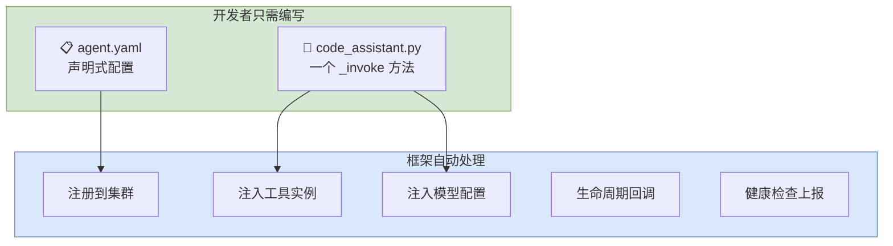

**子代理项目结构（脚手架生成）：**

```
plugins/code_assistant/
├── agent.yaml              # 声明式配置（身份、参数、工具）
├── code_assistant.py       # 核心逻辑（一个类 + 一个方法）
├── _assets/
│   └── icon.svg            # 图标（可选）
└── requirements.txt        # 依赖（可选）
```

**agent.yaml — 声明式配置：**

```yaml
identity:
  name: code_assistant
  author: your-name
  label:
    zh_Hans: 代码助手
    en_US: Code Assistant
  description:
    zh_Hans: 代码生成、审查与调试
    llm: 用于代码生成、代码审查和调试的助手
  icon: icon.svg

intents:
  - code
  - debug

tools:
  required:
    - code_exec
    - file_io
  optional:
    - web_search

parameters:
  - name: max_iterations
    type: number
    required: false
    default: 10
    label:
      zh_Hans: 最大迭代次数
  - name: allowed_languages
    type: string
    required: false
    default: "python,javascript,go"
    label:
      zh_Hans: 允许的编程语言

model:
  required: true          # 是否需要 LLM 模型
```

**code_assistant.py — 开发者只需写这个：**

```python
from artipivot import SubAgent, SubAgentContext


class CodeAssistant(SubAgent):
    """代码助手 — 开发者只需实现 _invoke 一个方法"""

    async def _invoke(self, context: SubAgentContext) -> str:
        """
        核心方法：接收任务，返回结果

        框架自动注入：
        - context.query       用户原始问题
        - context.model       LLM 模型实例（直接调用）
        - context.tools       工具箱（按名称取用）
        - context.config      agent.yaml 中的参数
        - context.history     对话历史
        """
        # 1. 用模型分析任务
        plan = await context.model.chat(
            f"分析以下编程任务，制定执行计划：{context.query}"
        )

        # 2. 按需调用工具（一行取用，无需初始化）
        code_tool = context.tools.get("code_exec")
        file_tool = context.tools.get("file_io")

        # 3. 执行步骤
        result = await code_tool.run(code=plan, language="python")

        # 4. 保存结果
        if result.success:
            await file_tool.run(path="output.py", content=result.data)

        # 5. 直接返回文本即可
        return f"任务完成。代码已写入 output.py"
```

**开发者体验对比：**

| 维度 | 旧设计（学院派） | 新设计（参考 Dify） |
|------|------------------|---------------------|
| 必须理解的概念 | BaseSubAgent、ToolRegistry、on_register、on_unregister | SubAgent、_invoke、context |
| 配置方式 | 写 Python 类属性 | 写 YAML 声明 |
| 工具获取 | 手动从 registry 查找 | `context.tools.get("名字")` |
| 模型调用 | 自己管理 LLM 客户端 | `context.model.chat()` |
| 生命周期 | 实现 3-4 个方法 | 只写 `_invoke` |
| 脚手架 | 无 | `artipivot plugin init` |

### 4.4 脚手架与调试

```bash
# 1. 一键生成子代理模板
artipivot plugin init --type agent --name code_assistant

# 2. 本地开发模式（改代码立即生效，无需打包）
artipivot plugin dev ./plugins/code_assistant

# 3. 打包发布
artipivot plugin package ./plugins/code_assistant
# → 生成 code_assistant-1.0.0.artipivot-plugin.zip

# 4. 上传到集群
artipivot plugin publish ./code_assistant-1.0.0.artipivot-plugin.zip
# → 上传制品 → 写入 MongoDB → 全集群热更新
```

### 4.5 声明式子代理（零代码注册）

**核心思路**：大多数 Agent 就是「提示词 + 策略 + 工具」的组合，不需要写代码。

框架内置三种 Agent 策略引擎，声明式子代理只需选择策略、配置参数：

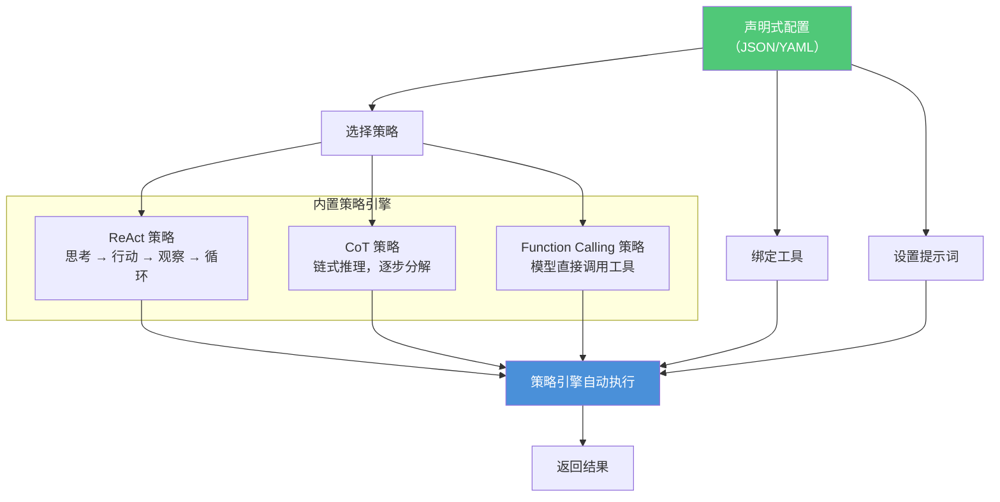

**声明式子代理 — JSON 配置示例：**

```json
{
  "identity": {
    "name": "customer_service",
    "label": { "zh_Hans": "客服助手" },
    "description": { "zh_Hans": "处理客户咨询、订单查询、售后问题" },
    "icon": "customer_service.svg"
  },
  "intents": ["customer_service", "order_query", "after_sales"],

  "strategy": {
    "type": "react",
    "max_iterations": 5
  },

  "model": {
    "provider": "openai",
    "name": "gpt-4o",
    "temperature": 0.3
  },

  "tools": ["order_query", "knowledge_base", "ticket_system"],

  "prompt": {
    "system": "你是电商平台的客服助手。请根据用户问题，使用可用工具查询信息并给出专业回复。\n规则：\n1. 先确认用户身份\n2. 查询相关订单或知识库\n3. 给出明确解决方案",
    "few_shots": [
      {
        "user": "我的订单怎么还没发货？",
        "assistant": "我先帮你查一下订单状态。请问你的订单号是多少？"
      }
    ]
  }
}
```

**通过 API 注册（零代码、热生效）：**

```bash
# 方式一：上传 JSON 文件
artipivot agent register --config ./customer_service.json

# 方式二：直接 POST API
curl -X POST http://localhost:8000/api/v1/agents \
  -H "Content-Type: application/json" \
  -d @customer_service.json

# 方式三：在管理后台 UI 中可视化配置（Phase 3）
```

注册后框架自动：
1. 解析 JSON → 校验配置完整性
2. 写入 MongoDB `plugins` 集合
3. Change Stream 通知所有节点
4. 各节点加载配置 → 按策略引擎实例化 Agent
5. 路由表更新 → 新意图立即生效

**声明式 vs 编程式运行时对比：**

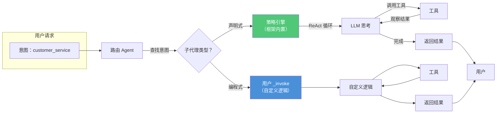

**声明式子代理可配置项：**

| 配置项 | 说明 | 示例 |
|--------|------|------|
| `identity` | 名称、标签、描述、图标 | 同编程式 |
| `intents` | 绑定的意图列表 | `["customer_service"]` |
| `strategy.type` | 策略引擎：`react` / `cot` / `function_calling` | `"react"` |
| `strategy.max_iterations` | 最大思考-行动循环次数 | `5` |
| `model` | 模型配置（provider / name / temperature） | `gpt-4o` |
| `tools` | 绑定的工具列表（按名称引用） | `["order_query"]` |
| `prompt.system` | 系统提示词 | 角色设定 + 规则 |
| `prompt.few_shots` | Few-shot 示例 | 问答对列表 |

---

## 5. 第三层 — 工具

### 5.1 职责

工具提供 **原子化、无状态** 的执行能力：
- 每个工具做一件事，做好一件事
- 不包含业务逻辑，仅封装外部交互
- 可被任意子代理引用

### 5.2 工具可插拔架构

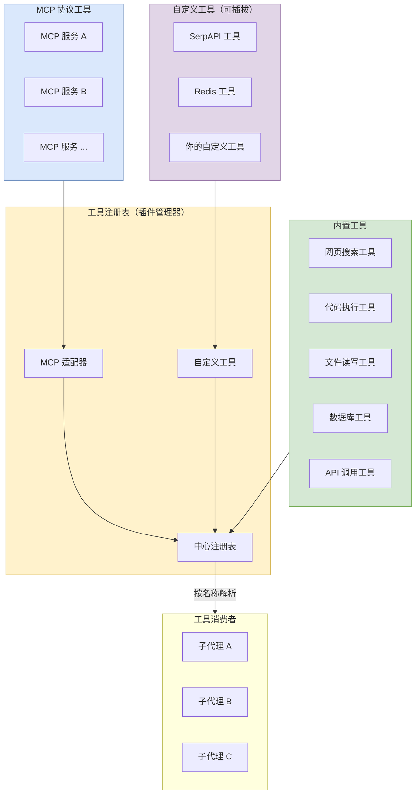

### 5.3 工具开发体验（参考 Dify Tool Plugin）

**设计理念**：工具 = **YAML 声明参数** + **一个 `_invoke` 方法**。零学习成本。

**工具项目结构（脚手架生成）：**

```
plugins/web_search/
├── provider.yaml           # 工具提供者（身份 + 凭证）
├── tools/
│   └── search.yaml         # 单个工具的参数声明
├── web_search.py           # 核心逻辑
├── _assets/
│   └── icon.svg
└── requirements.txt
```

**provider.yaml — 工具提供者配置：**

```yaml
identity:
  name: web_search
  author: your-name
  label:
    zh_Hans: 网页搜索
    en_US: Web Search
  description:
    zh_Hans: 通过搜索引擎查询互联网信息
  icon: icon.svg

credentials:                # 凭证配置（用户安装时填写）
  - name: api_key
    type: secret-input
    required: true
    label:
      zh_Hans: API 密钥
    placeholder: "sk-..."

tools:
  - tools/search.yaml       # 引用具体工具定义
```

**tools/search.yaml — 工具参数声明（替代 Python 代码中的类型标注）：**

```yaml
identity:
  name: search
  description:
    human:
      zh_Hans: 搜索互联网获取信息
    llm: 在互联网上搜索指定查询，返回相关网页片段

parameters:
  - name: query
    type: string
    required: true
    label:
      zh_Hans: 搜索关键词
    description: 要搜索的查询内容

  - name: max_results
    type: number
    required: false
    default: 5
    label:
      zh_Hans: 最大结果数

output:
  type: string              # 返回值类型
  description: 搜索结果文本
```

**web_search.py — 开发者只需写这个：**

```python
from artipivot import Tool, ToolContext


class WebSearch(Tool):
    """网页搜索工具 — 开发者只需实现 _invoke"""

    async def _invoke(self, context: ToolContext) -> str:
        """
        核心方法：接收参数，返回结果字符串

        框架自动注入：
        - context.params      YAML 中声明的参数（已校验、已类型转换）
        - context.credentials 用户配置的凭证（api_key 等）
        - context.logger      结构化日志
        """
        query = context.params["query"]
        max_results = context.params.get("max_results", 5)
        api_key = context.credentials["api_key"]

        # 直接调用第三方 API
        results = await search_engine(query, api_key, limit=max_results)

        # 直接返回字符串即可，框架处理序列化
        return format_results(results)
```

### 5.4 OpenAPI 快速导入（参考 Dify）

除了 Python 工具，还支持直接粘贴 **OpenAPI 3.0 Schema** 创建工具 — 零代码：

```json
{
  "openapi": "3.1.0",
  "info": { "title": "天气查询", "version": "1.0.0" },
  "servers": [{ "url": "https://api.weather.com/v1" }],
  "paths": {
    "/weather": {
      "get": {
        "operationId": "get_weather",
        "description": "根据城市查询当前天气",
        "parameters": [
          { "name": "city", "in": "query", "required": true,
            "schema": { "type": "string" },
            "description": "城市名称" }
        ]
      }
    }
  }
}
```

框架自动解析 OpenAPI → 生成 YAML → 注册为可用工具，无需写一行代码。

### 5.5 三种工具开发方式对比

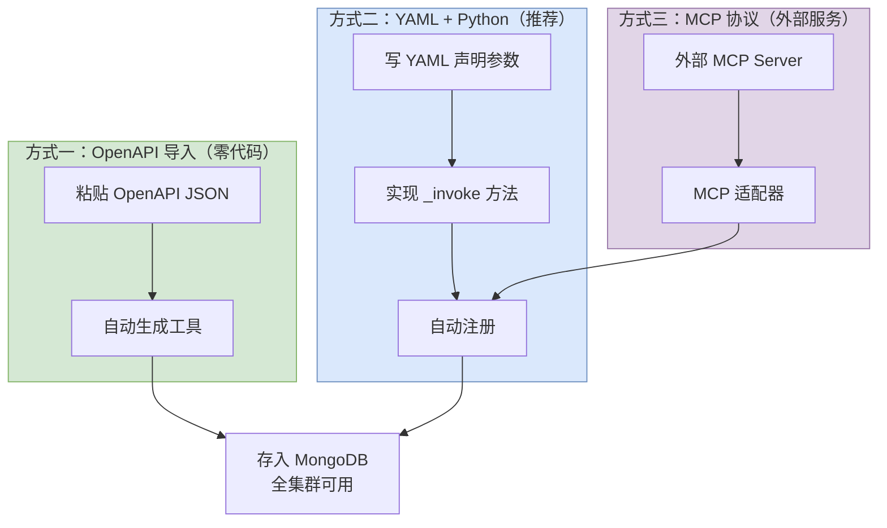

| 方式 | 适合场景 | 开发量 | 灵活性 |
|------|----------|--------|--------|
| **OpenAPI 导入** | 已有 REST API 的服务 | 零代码 | 低（仅支持 HTTP 调用） |
| **YAML + Python** | 自定义逻辑、数据处理 | YAML + 一个方法 | 高 |
| **MCP 协议** | 外部服务、第三方 MCP Server | 配置连接参数 | 中 |

### 5.6 工具在子代理中的使用方式

```python
# 子代理中调用工具 — 极简 API
class CodeAssistant(SubAgent):
    async def _invoke(self, context: SubAgentContext) -> str:
        # 按名称取工具
        tool = context.tools.get("web_search")

        # 直接调用，参数与 YAML 声明一致
        result = await tool.run(query="Python asyncio 最佳实践")

        # result 是字符串
        return f"搜索结果：{result}"
```

### 5.7 零代码工具注册汇总

工具支持三种零代码注册方式，注册后立即全集群生效：

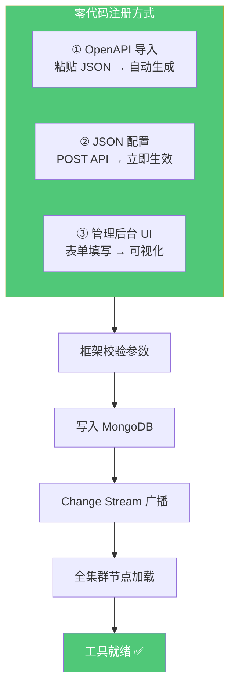

```bash
# 方式一：OpenAPI 导入（适合已有 REST API）
artipivot tool import --openapi ./weather_api.json

# 方式二：直接 JSON 配置（适合简单 HTTP 调用）
curl -X POST http://localhost:8000/api/v1/tools \
  -H "Content-Type: application/json" \
  -d '{
    "identity": { "name": "weather", "label": {"zh_Hans": "天气查询"} },
    "type": "http",
    "endpoint": "https://api.weather.com/v1/weather",
    "method": "GET",
    "parameters": [
      {"name": "city", "type": "string", "required": true}
    ],
    "credentials": [{"name": "api_key", "type": "secret-input"}]
  }'

# 方式三：管理后台表单（Phase 3 Web UI）
```

---

## 6. 集群架构与插件系统

### 6.1 集群部署架构

生产环境下，ArtiPivot 以多节点集群方式运行。所有插件元数据（子代理 / 工具定义）持久化到 **MongoDB**，各节点通过 **Change Stream** 实时同步。

```mermaid
flowchart TB
    subgraph LB["负载均衡"]
        LB1["Nginx / AWS ALB"]
    end

    subgraph Cluster["ArtiPivot 集群"]
        direction LR
        N1["节点 1<br/>路由 + 子代理 + 工具"]
        N2["节点 2<br/>路由 + 子代理 + 工具"]
        N3["节点 N<br/>路由 + 子代理 + 工具"]
    end

    subgraph Storage["持久化层"]
        Mongo[("MongoDB<br/>插件注册表<br/>+ Change Stream")]
        Redis[("Redis<br/>本地缓存<br/>+ 分布式锁")]
        Artifact["制品仓库<br/>S3 / GCS / MinIO<br/>插件代码包")]
    end

    LB --> N1
    LB --> N2
    LB --> N3

    N1 <-->|"Change Stream<br/>实时同步"| Mongo
    N2 <-->|"Change Stream<br/>实时同步"| Mongo
    N3 <-->|"Change Stream<br/>实时同步"| Mongo

    N1 <--> Redis
    N2 <--> Redis
    N3 <--> Redis

    N1 -.->|"下载 .whl 包"| Artifact
    N2 -.->|"下载 .whl 包"| Artifact
    N3 -.->|"下载 .whl 包"| Artifact

    style LB fill:#8B5CF6,color:#fff,stroke:#6D28D9
    style N1 fill:#4A90D9,color:#fff,stroke:#2C5F8A
    style N2 fill:#4A90D9,color:#fff,stroke:#2C5F8A
    style N3 fill:#4A90D9,color:#fff,stroke:#2C5F8A
    style Mongo fill:#50C878,color:#fff,stroke:#2E8B57
    style Redis fill:#E74C3C,color:#fff,stroke:#C0392B
    style Artifact fill:#F5A623,color:#fff,stroke:#D4880F
```

### 6.2 MongoDB 存储模型

插件定义持久化到 MongoDB 的三个核心集合：

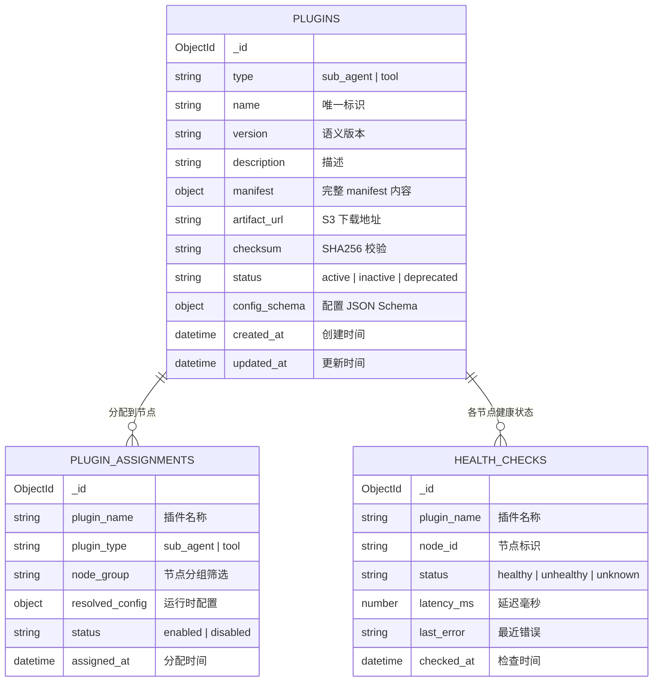

**集合职责：**

| 集合 | 作用 |
|------|------|
| `plugins` | 全局插件注册表，存储元数据、版本、制品地址 |
| `plugin_assignments` | 控制哪些插件在哪些节点组启用，支持灰度发布 |
| `health_checks` | 各节点上报插件健康状态，用于故障摘除 |

**MongoDB 文档示例（`plugins` 集合）：**

```json
{
  "_id": "ObjectId('...')",
  "type": "sub_agent",
  "name": "code_assistant",
  "version": "1.2.0",
  "description": "代码生成、审查与调试",
  "manifest": {
    "supported_intents": ["code"],
    "required_tools": ["code_exec", "file_io"],
    "optional_tools": ["web_search"],
    "config_schema": { "max_iterations": {"type": "int", "default": 10} }
  },
  "artifact_url": "s3://artipivot-plugins/code_assistant-1.2.0-py3-none-any.whl",
  "checksum": "sha256:a1b2c3...",
  "status": "active",
  "created_at": "2026-05-10T08:00:00Z",
  "updated_at": "2026-05-13T10:30:00Z"
}
```

### 6.3 插件注入全流程

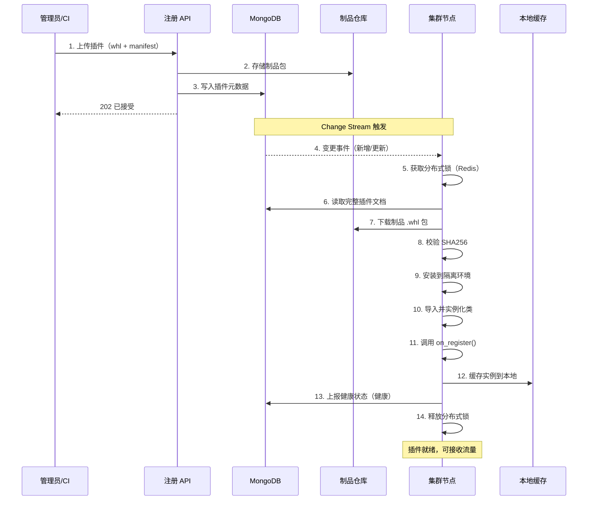

### 6.4 节点启动与同步流程

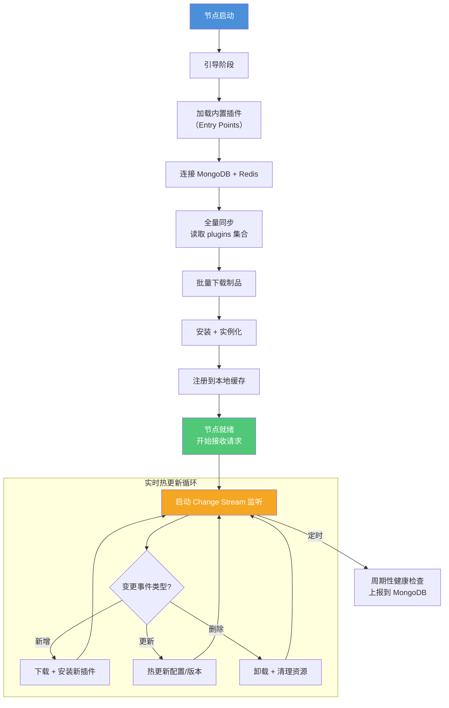

### 6.5 插件注册表接口（集群版）

```python
from abc import ABC, abstractmethod
from dataclasses import dataclass


@dataclass
class PluginDocument:
    """MongoDB 插件文档映射"""
    type: str                    # "sub_agent" | "tool"
    name: str
    version: str
    manifest: dict
    artifact_url: str
    checksum: str
    status: str                  # "active" | "inactive" | "deprecated"


class ClusterPluginRegistry:
    """
    集群级插件注册表 — 以 MongoDB 为唯一数据源

    - 写操作 → MongoDB（管理 API 调用）
    - 读操作 → 本地缓存（优先） → MongoDB（兜底）
    - 热更新 → MongoDB Change Stream
    """

    def __init__(self, mongo_uri: str, redis_uri: str, artifact_store: str):
        self._mongo = MongoStore(mongo_uri)
        self._cache = LocalCache(redis_uri)
        self._artifact = ArtifactStore(artifact_store)
        self._lock = DistributedLock(redis_uri)

    # --- 管理 API（写入 MongoDB） ---

    async def publish_plugin(self, plugin_type: str, name: str,
                             artifact_path: str, manifest: dict) -> str:
        """发布插件：上传制品 + 写入 MongoDB"""
        async with self._lock.acquire(f"publish:{name}"):
            checksum = compute_sha256(artifact_path)
            artifact_url = await self._artifact.upload(artifact_path)
            doc = PluginDocument(
                type=plugin_type, name=name,
                version=manifest["version"],
                manifest=manifest,
                artifact_url=artifact_url,
                checksum=checksum,
                status="active",
            )
            return await self._mongo.insert_or_update(doc)

    async def deprecate_plugin(self, name: str) -> None:
        """标记插件为已弃用"""
        await self._mongo.update_status(name, "deprecated")

    # --- 节点 API（读取 + 本地缓存） ---

    async def get_sub_agent(self, intent: str) -> "BaseSubAgent":
        """获取子代理实例（优先本地缓存）"""
        cached = self._cache.get_sub_agent(intent)
        if cached and cached.is_healthy():
            return cached
        # 缓存未命中 → 从 MongoDB 查询 + 实例化
        doc = await self._mongo.find_by_intent("sub_agent", intent)
        instance = await self._load_and_instantiate(doc)
        self._cache.set_sub_agent(intent, instance)
        return instance

    async def get_tool(self, name: str) -> "BaseTool":
        """获取工具实例"""
        cached = self._cache.get_tool(name)
        if cached and cached.is_healthy():
            return cached
        doc = await self._mongo.find_by_name("tool", name)
        instance = await self._load_and_instantiate(doc)
        self._cache.set_tool(name, instance)
        return instance

    # --- 生命周期 ---

    async def start_watcher(self) -> None:
        """启动 Change Stream 监听，热更新本地插件"""
        async for change in self._mongo.watch_changes():
            await self._handle_change(change)

    async def _load_and_instantiate(self, doc: PluginDocument) -> object:
        """下载制品 → 校验 → 安装 → 导入 → 实例化"""
        artifact_path = await self._artifact.download(
            doc.artifact_url, doc.checksum
        )
        verify_checksum(artifact_path, doc.checksum)
        module = install_and_import(artifact_path, doc.manifest)
        return instantiate(module, doc.manifest)
```

### 6.6 插件加载来源（三层降级）

| 优先级 | 来源 | 适用场景 | 说明 |
|--------|------|----------|------|
| 1 | **本地缓存（Redis）** | 热路径 | 毫秒级响应，定期校验健康状态 |
| 2 | **MongoDB + 制品仓库** | 冷启动 / 缓存未命中 | 全量同步，Change Stream 热更新 |
| 3 | **Entry Points（内置）** | 基础能力 | 内置插件随镜像发布，无需外部存储 |

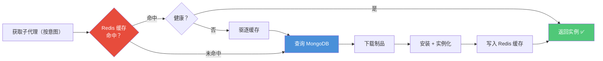

### 6.7 灰度发布与故障摘除

**灰度发布（金丝雀部署）：**

通过 `plugin_assignments` 集合控制：

```json
{
  "plugin_name": "code_assistant",
  "plugin_type": "sub_agent",
  "node_group": "canary",
  "status": "enabled",
  "resolved_config": { "max_iterations": 5 }
}
```

**故障摘除（熔断器）：**

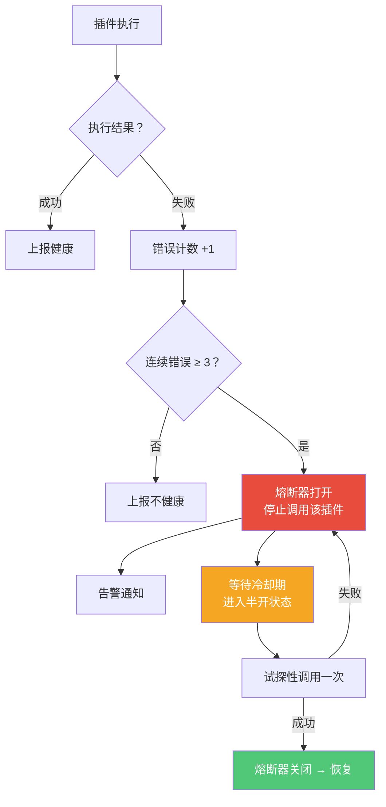

---

## 7. 生产级保障

### 7.1 可观测性架构

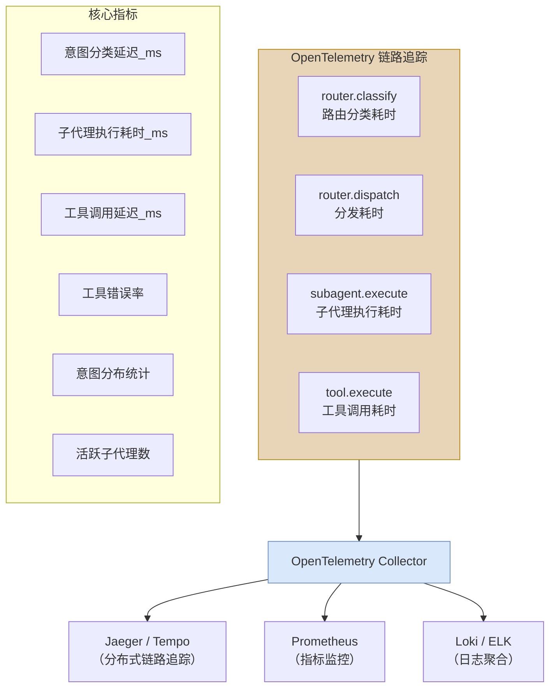

### 7.2 安全模型

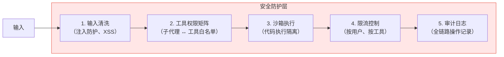

**工具权限矩阵示例：**

| 子代理 | 网页搜索 | 代码执行 | 文件读写 | 数据库 |
|--------|----------|----------|----------|--------|
| 代码助手 | - | ✅ | ✅ | - |
| 数据分析师 | - | - | ✅ | ✅ |
| 研究员 | ✅ | - | ✅ | - |

### 7.3 错误处理策略

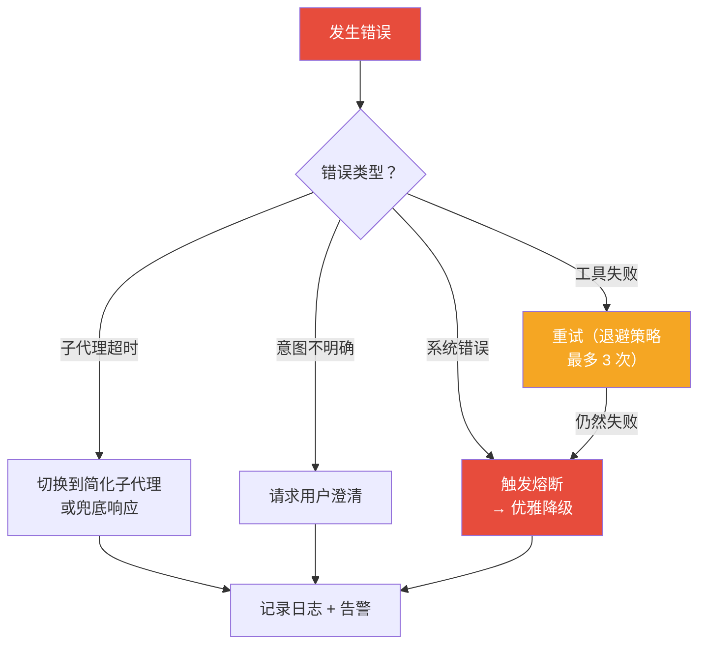

---

## 8. 记忆系统

> 详细设计见 [MEMORY.md](./MEMORY.md)

### 8.1 三层记忆模型

| 层级 | 机制 | 存储内容 | 生命周期 | 后端 |
|------|------|----------|----------|------|
| **L1 工作记忆** | 图 State（TypedDict + Reducer） | 当前意图、活跃子代理、中间产物 | 单次调用 | 内存 |
| **L2 会话记忆** | Checkpointer (per-thread) | 对话消息历史、图执行快照 | 会话内持续 | PostgresSaver |
| **L3 长期记忆** | Store (跨 thread) | 用户画像、偏好、知识积累 | 永久 | PostgresStore + 语义搜索 |

### 8.2 多 Agent 记忆隔离

- **L2 隔离**：`thread_id` 编码为 `{agent_id}:{session_id}`，同一 Checkpointer 天然隔离
- **L3 隔离**：Store namespace 编码为 `(agent_id, user_id, type)`，同一 Store 天然隔离
- **L1 隔离**：每个主图独立 State schema，天然隔离

### 8.3 上下文窗口管理

长对话超出模型上下文窗口时，支持三种策略：
1. **摘要压缩**（推荐）：LLM 摘要旧消息 + 保留最近 N 条
2. **截断**：丢弃最旧的消息
3. **不处理**：由模型自行处理

子代理通过 `agent.yaml` 声明记忆配置：

```yaml
memory:
  session: per-invocation           # per-invocation | per-thread | stateless
  context_window:
    strategy: summarize              # summarize | trim | none
    trigger_tokens: 100000
    keep_messages: 20
    summary_model: claude-haiku-4-5-20251001
  long_term:
    read: [profile, knowledge, agent:self]
    write: [agent:self]
```

### 8.4 长期记忆读写

- **写入**：主图 `respond` 节点在对话结束后，LLM 提取用户画像 / 知识 → 写入 Store
- **读取**：主图 `classify` 节点在对话开始时，从 Store 读取 profile + 语义搜索 knowledge → 注入 prompt

---

## 9. 目录结构

```
artipivot/
├── pyproject.toml
├── doc/
│   ├── DESIGN.md
│   ├── ARCHITECTURE.md           # 代码架构设计
│   └── MEMORY.md                 # 记忆系统设计
├── src/
│   └── artipivot/
│       ├── __init__.py
│       ├── gateway/                  # 多主 Agent 分发层
│       │   ├── gateway.py            # AgentGateway
│       │   └── config.py
│       ├── graph/                    # 核心图构建层
│       │   ├── state.py
│       │   ├── context.py
│       │   ├── root.py
│       │   ├── router.py
│       │   └── factory.py
│       ├── agents/                   # 子代理层
│       │   ├── base.py
│       │   ├── programmatic.py
│       │   ├── declarative.py
│       │   └── strategies/
│       ├── tools/                    # 工具层
│       │   ├── registry.py
│       │   ├── loader.py
│       │   ├── mcp_adapter.py
│       │   ├── openapi_importer.py
│       │   └── builtin/
│       ├── memory/                   # 记忆系统
│       │   ├── checkpointer.py
│       │   ├── store.py
│       │   ├── extraction.py
│       │   └── context_window.py
│       ├── models/                   # 模型适配层
│       │   └── provider.py
│       ├── plugins/                  # 插件管理
│       │   ├── manager.py
│       │   ├── watcher.py
│       │   ├── loader.py
│       │   └── sandbox.py
│       ├── api/
│       │   ├── server.py
│       │   └── admin.py
│       ├── cli/
│       │   └── main.py
│       └── config.py
├── plugins/                          # 外部插件目录
│   └── example_plugin/
│       ├── manifest.yaml
│       └── my_agent.py
├── deploy/
│   ├── docker-compose.yaml
│   ├── Dockerfile
│   └── k8s/
└── tests/
    ├── test_gateway/
    ├── test_graph/
    ├── test_agents/
    ├── test_tools/
    ├── test_memory/
    ├── test_cluster/
    │   ├── test_mongo_store.py
    │   ├── test_change_stream.py
    │   └── test_circuit_breaker.py
    └── test_sub_agents/
```

---

## 10. 关键设计决策

| 决策 | 选择 | 理由 |
|------|------|------|
| **底层运行时** | **LangGraph v1.2**（不依赖 LangChain 高层包） | LangGraph 可独立使用，提供 StateGraph、Checkpointer、Store 等基础设施；避免 LangChain 高层抽象绑定 |
| **多主 Agent** | 多个 `CompiledStateGraph` 实例 + Agent Gateway | 每个主 Agent 完全隔离（State / 路由 / 子代理 / 工具 / 记忆），统一入口分发 |
| 意图识别 | LLM 分类器 + 规则兜底 | 兼顾准确性与延迟，规则兜底保证可用性 |
| 插件存储 | MongoDB（元数据）+ S3（制品） | Schema-free 适合插件清单；Change Stream 天然支持实时同步 |
| 本地缓存 | Redis | 毫秒级读取；分布式锁保证并发安全 |
| 插件分发 | .whl 包 + 制品仓库 | 标准 Python 分发格式；校验 checksum 保证完整性 |
| 工具协议 | JSON Schema（function-calling 兼容） | 与 OpenAI / Anthropic tool use 协议对齐 |
| 异步模型 | asyncio（全链路 async） | IO 密集型 Agent 场景，async 是最优解 |
| 记忆持久化 | PostgresSaver（会话）+ PostgresStore（长期） | LangGraph 原生支持，thread_id / namespace 隔离 |
| 上下文管理 | 摘要压缩（自建节点） | 避免引入 langchain 高层包，纯 langgraph 节点实现 |
| 可观测性 | LangSmith 原生集成 + OpenTelemetry | LangGraph 节点自动 trace；OpenTelemetry 覆盖非图组件 |
| 安全隔离 | 工具权限矩阵 + 沙箱 | 参考 OpenClaw 沙箱模型，最小权限原则 |

---

## 11. 路线图

### 第一阶段 — MVP（核心框架）
- [ ] AgentGateway 多主 Agent 分发
- [ ] GraphFactory 按 agent_id 构建主图
- [ ] `BaseRouter`、`BaseSubAgent`、`BaseTool` 抽象
- [ ] LLM 意图分类器
- [ ] 1 个主图 + 1 个编程式子代理 + ToolNode
- [ ] InMemorySaver + InMemoryStore
- [ ] 3 个内置工具

### 第二阶段 — 声明式 + 记忆
- [ ] 策略引擎（ReAct / CoT / Function Calling）
- [ ] YAML 声明式子代理加载
- [ ] PostgresSaver + PostgresStore 持久化
- [ ] 上下文窗口管理（摘要压缩）
- [ ] 长期记忆读写（profile + knowledge 提取）
- [ ] 子代理 YAML 记忆配置解析

### 第三阶段 — 集群 + 插件
- [ ] MongoDB 注册表 + Change Stream
- [ ] 图热重建 + Gateway 原子替换
- [ ] 插件管理 REST API（发布/下线/灰度）
- [ ] Redis 本地缓存 + 分布式锁
- [ ] 制品仓库（S3/MinIO）上传下载
- [ ] 健康检查 + 故障摘除

### 第四阶段 — 生产加固 + 生态
- [ ] LangSmith / OpenTelemetry 可观测性
- [ ] 工具权限矩阵 + 沙箱执行
- [ ] 限流控制 + 熔断器
- [ ] MCP 协议适配器
- [ ] 插件 CLI（`artipivot plugin init/dev/publish`）
- [ ] Web UI / API Gateway
- [ ] docker-compose + Kubernetes 部署

---

## 参考资料

- [OpenClaw 架构深度解析](https://medium.com/@dingzhanjun/deep-dive-into-openclaw-architecture-code-ecosystem-e6180f34bd07)
- [OpenClaw 工作原理：架构、技能与安全](https://www.mintmcp.com/blog/openclaw-works-architecture-skills-security)
- [OpenClaw 架构详解](https://ppaolo.substack.com/p/openclaw-system-architecture-overview)
- [OpenClaw 2026.3.7 更新：可插拔 ContextEngine](https://www.epsilla.com/blogs/2026-03-09-openclaw-2026-3-7-contextengine-agentic-architecture)
- [剖析 OpenClaw](https://sausheong.com/dissecting-openclaw-733213e9c853)
