# ArtiPivot 框架设计文档

> **版本**: 0.2.0 | **日期**: 2026-05-14 | **状态**: 草稿
>
> **配套文档**：[代码架构设计](./ARCHITECTURE.md) | [记忆系统设计](./MEMORY.md)

---

## 目录

- [1. 背景与目标](#1-背景与目标)
- [2. 架构总览](#2-架构总览)
- [3. 第一层 — 主路由 Agent](#3-第一层--主路由-agent)
- [4. 第二层 — 子代理](#4-第二层--子代理)
- [5. 第三层 — 工具](#5-第三层--工具)
- [6. 集群架构与插件系统](#6-集群架构与插件系统)
- [7. 生产级保障](#7-生产级保障)
- [8. 记忆系统](#8-记忆系统)
- [9. 动态配置中心](#9-动态配置中心)
- [10. 目录结构](#10-目录结构)
- [11. 关键设计决策](#11-关键设计决策)
- [12. 路线图](#12-路线图)

---

## 1. 背景与目标

> **这一节讲什么**：为什么需要 ArtiPivot，它要解决什么问题，以及指导整个设计的核心原则。

### 1.1 行业现状与痛点

当前主流 AI Agent（智能体）框架——如 OpenClaw、AutoGen、CrewAI——大多采用"单体"或"扁平"架构，所有能力塞进一个 Agent 中。这带来三个核心问题：

1. **职责混乱**：一个 Agent 同时负责理解用户意图、规划任务、调用工具、组织回答，修改任何一处都可能影响其他功能
2. **工具无法复用**：工具（如搜索、代码执行）绑死在某个 Agent 内部，其他 Agent 无法使用
3. **扩展侵入性强**：添加新能力需要修改框架核心代码，风险高、成本大

### 1.2 ArtiPivot 的目标

**ArtiPivot** 定位为**生产级别的多层 Agent 框架**。它通过 **主路由 Agent → 子代理 → 工具** 三层解耦架构，实现：

- **意图识别**（理解用户想要什么）、**任务分发**（把任务交给最合适的执行者）、**工具执行**（调用具体能力）三者清晰分离
- **可插拔设计**：子代理和工具像 USB 设备一样，插上就能用、拔掉不影响其他功能
- 所有运行时参数（模型、提示词、限流规则等）**存储在数据库中，通过 API 动态管理，修改立即生效**

### 1.3 设计原则

| 原则 | 含义 | 通俗解释 |
|------|------|----------|
| **单一职责** | 每层只负责一件事 | 路由层只管"理解 + 分发"，子代理层只管"执行任务"，工具层只管"做一件事" |
| **可插拔** | 子代理和工具通过注册机制动态加载/卸载 | 像手机装 App 一样，安装新 Agent 不需要修改系统代码 |
| **工具复用** | 工具不绑定特定子代理，任何子代理均可按需引用 | 搜索工具被代码助手、研究助手等多个 Agent 共用 |
| **生产就绪** | 内置可观测性、错误处理、限流、优雅降级 | 从第一天起就按上线标准设计，不是"以后再说" |
| **高度可配置化** | 所有运行时参数存储在 MongoDB，通过 API 管理 | 修改模型、调整限流不用改代码、不用重启服务 |
| **低侵入** | 开发者只需实现 `_invoke` 一个方法 | 框架把复杂性藏在内部，开发者只关注业务逻辑 |

---

## 2. 架构总览

> **这一节讲什么**：ArtiPivot 的整体结构是什么样的。先看"多个主 Agent 如何并存"，再看"单个主 Agent 内部的三层分工"。

### 2.1 多主 Agent 架构

ArtiPivot 支持**多个主 Agent 并存且完全隔离**。可以把它想象成一家公司：每个主 Agent 是一个独立部门，有自己的员工（子代理）和工具，部门之间互不干扰。

**隔离维度**：State（独立数据结构）、路由逻辑（独立分类器）、子代理（独立子图集）、工具（独立工具集）、会话记忆（thread_id 前缀隔离）、长期记忆（Store namespace 前缀隔离）、模型（可配不同供应商）。

所有请求通过一个 **Agent Gateway**（网关）按 `agent_id` 分发到对应的主 Agent：

```
用户请求 → Agent Gateway → 按 agent_id 路由 → Agent A 主图 / Agent B 主图 / Agent C 主图
```

每个主图内部仍然是 **路由 → 子代理 → 工具** 三层结构。主图本身是纯路由层——只负责意图识别和分发，不做任何业务逻辑。

### 2.2 三层架构总览

下面的图展示了单个主 Agent 内部的三层结构。**从上往下看**：用户消息先到第一层（路由 Agent），路由 Agent 判断意图后分发给第二层（某个子代理），子代理在执行过程中调用第三层（具体工具）。

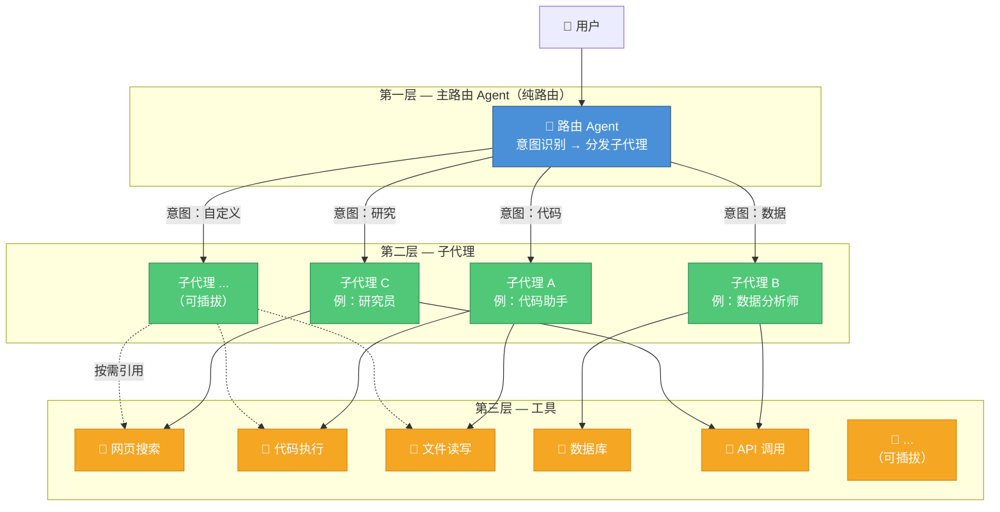

**解读**：路由 Agent **只做两件事**——识别意图、选择子代理。用户的原始输入被完整透传给子代理，由子代理负责工具调用、记忆读写、响应生成。路由 Agent 不做任何业务逻辑。注意工具是被多个子代理**共享**的——这体现了"工具复用"原则。

### 2.3 数据流全景

下面的图描述了一个完整请求的处理过程——从用户发消息到最终返回结果，数据在各层之间如何流动：

1. 用户发消息 → 路由 Agent 根据会话历史识别意图 → 选择子代理
2. 子代理接管全部工作：读取记忆、规划步骤、调用工具、生成响应、回写记忆
3. 子代理直接返回最终响应给用户

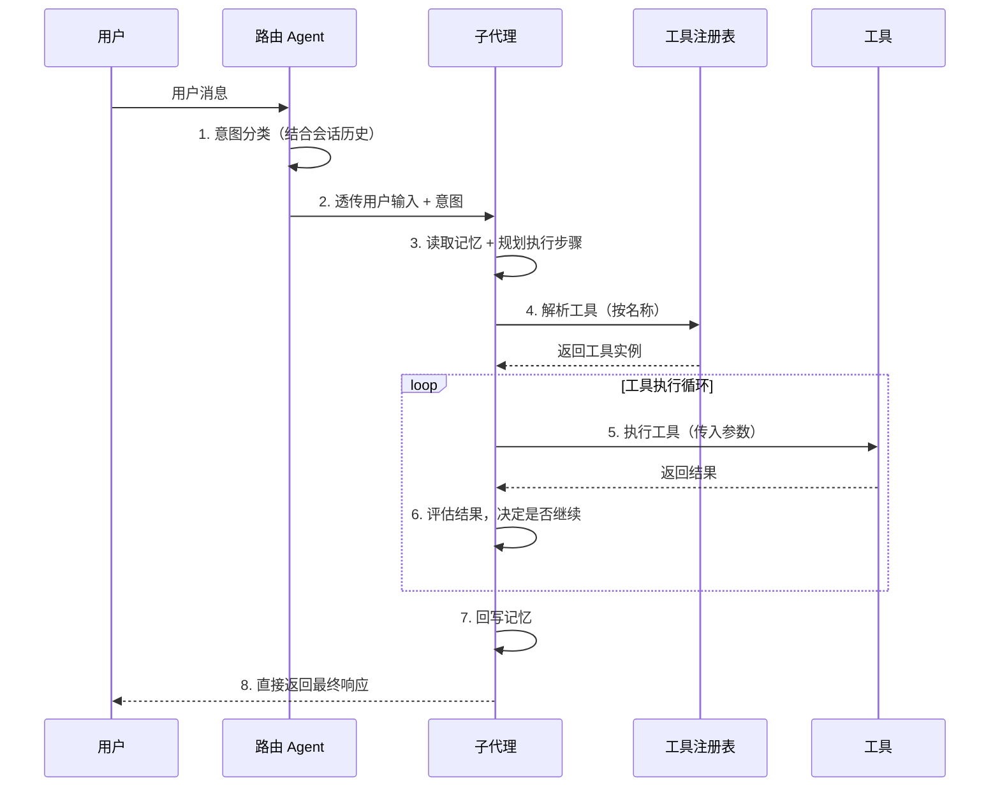

---

## 3. 第一层 — 主路由 Agent（纯路由）

> **这一节讲什么**：路由 Agent 是系统的"前台接待"——它**只负责两件事**：根据会话历史识别用户意图，然后把任务转交给对应的子代理。不涉及记忆读写、工具调用、响应格式化——这些全部由子代理负责。

### 3.1 职责

路由 Agent 是纯路由层，职责严格限定为两件事：

| 职责 | 说明 | 类比 |
|------|------|------|
| **意图识别** | 结合会话历史解析用户输入，判断属于哪类需求 | 前台根据来客描述判断该去哪个窗口 |
| **路由分发** | 将用户原始输入透传给匹配的子代理 | 前台将来客引导到对应窗口，不做其他事 |

**不做的事**（全部由子代理负责）：
- ~~上下文管理~~：子代理自行读取需要的记忆
- ~~响应格式化~~：子代理直接返回最终响应
- ~~记忆回写~~：子代理执行完毕后自行写入长期记忆

### 3.2 意图识别流程

下面的流程图展示了路由 Agent 判断意图的三种结果：

- **置信度够高**（≥ 阈值）：直接路由到对应子代理
- **置信度不够**：请用户补充说明
- **完全没有匹配**：路由到默认子代理（通用对话 Agent）

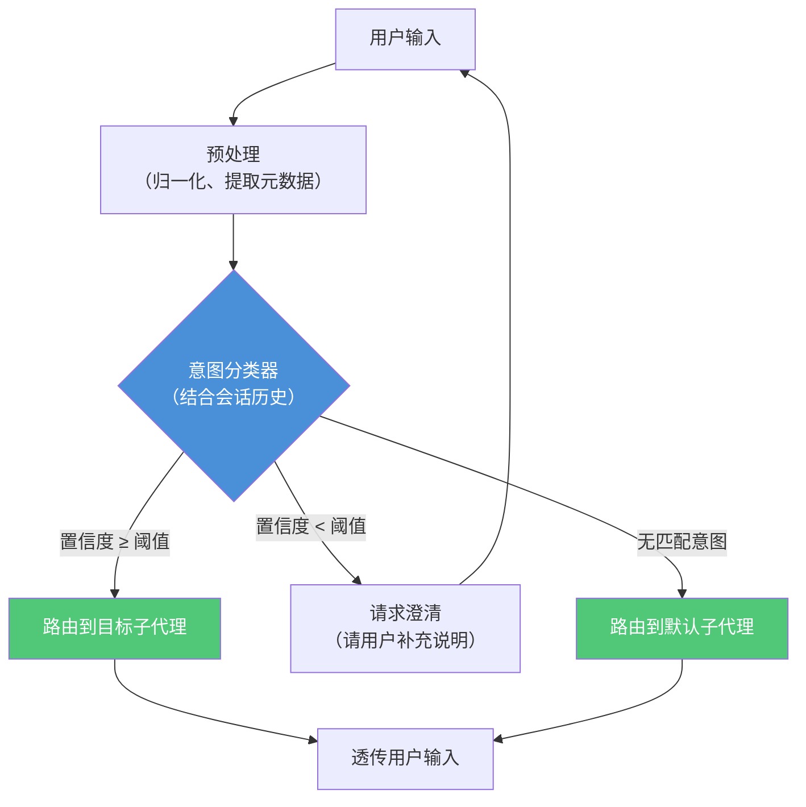

### 3.3 路由 Agent 接口设计

以下是路由 Agent 的核心接口定义。注意：路由 Agent **不返回响应内容**，只返回目标子代理名称——响应由子代理直接生成。

**核心概念说明**：
- `Intent`（意图）：用户需求的分类，如"代码"、"数据分析"、"研究"
- `IntentResult`（意图识别结果）：包含意图类型、置信度（0~1 之间的分数）、提取的关键信息
- `RouteResult`（路由结果）：只包含目标子代理名称和意图识别结果，**不包含响应内容**

```python
from abc import ABC, abstractmethod
from dataclasses import dataclass
from enum import Enum


class Intent(str, Enum):
    """预定义意图（可通过 Registry 动态扩展）"""
    CODE = "code"
    DATA = "data"
    RESEARCH = "research"
    GENERAL = "general"


@dataclass
class IntentResult:
    intent: Intent
    confidence: float  # 0.0 ~ 1.0
    entities: dict     # 提取的关键实体
    raw_input: str


@dataclass
class RouteResult:
    """路由结果 — 只有目标子代理，没有响应内容"""
    intent: IntentResult
    sub_agent_name: str  # 目标子代理名称（无匹配时为默认子代理）


class BaseRouter(ABC):
    """路由 Agent 基类 — 纯路由，不生成响应"""

    @abstractmethod
    async def classify(self, user_input: str, messages: list) -> IntentResult:
        """
        意图分类

        参数：
            user_input: 用户当前输入
            messages: 会话历史（用于结合上下文判断意图）
        """
        ...

    @abstractmethod
    async def route(self, intent: IntentResult) -> RouteResult:
        """
        根据意图选择目标子代理

        无匹配意图时路由到默认子代理，不抛异常
        """
        ...
```

---

## 4. 第二层 — 子代理

> **这一节讲什么**：子代理是真正干活的"专员"——它接收路由 Agent 透传的用户输入，**独立完成全部工作**：读取记忆、规划步骤、调用工具、生成响应、回写记忆。本节介绍两种开发子代理的方式（声明式 vs 编程式），以及面向开发者的极简体验设计。

### 4.1 职责

子代理是实际任务执行者，**承担主 Agent 之外的所有工作**：

| 职责 | 说明 | 类比 |
|------|------|------|
| **记忆读取** | 从 Store 读取用户画像、相关知识等长期记忆 | 专员先翻阅客户档案 |
| **任务规划** | 将高层意图分解为可执行步骤 | 把"做个网站"拆解为"写前端 + 写后端 + 测试" |
| **工具编排** | 按计划调用工具，组装结果 | 按步骤使用不同工具完成任务 |
| **响应生成** | 生成最终响应，直接返回给用户 | 专员直接给客户答复 |
| **记忆回写** | 提取新的用户画像/知识，写入 Store | 专员把新信息记入客户档案 |

### 4.2 两种子代理注册方式

ArtiPivot 支持两种子代理开发模式并存，覆盖从"零代码"到"完全自定义"的全部场景：

- **声明式**：只写配置文件（YAML/JSON），选一个策略引擎（如 ReAct），配置提示词和工具即可——适合大多数标准 Agent
- **编程式**：写一个 Python 类，实现 `_invoke` 方法——适合需要复杂逻辑的自定义 Agent

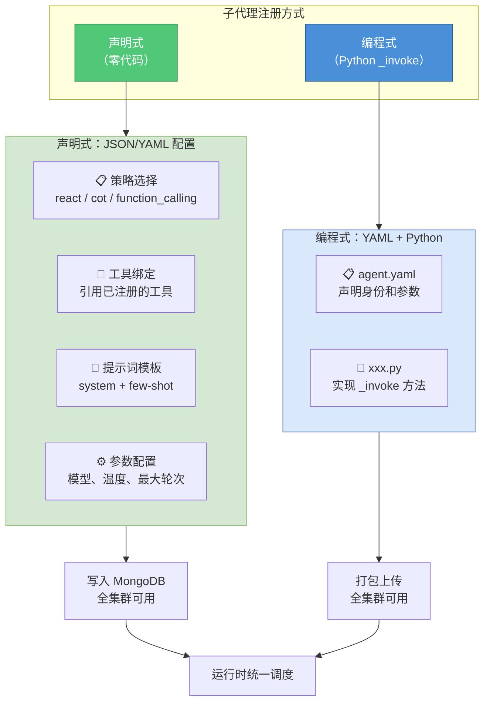

**方式选择指南**：

| 场景 | 推荐方式 | 原因 |
|------|----------|------|
| 大多数业务 Agent（客服、问答、搜索增强） | **声明式** | 配置提示词 + 绑工具即可，无需代码 |
| 需要多步骤编排、条件分支、自定义逻辑 | **编程式** | Python 灵活控制执行流程 |
| 快速原型验证 | **声明式** | 几分钟配置一个可用的 Agent |
| 复杂工具编排（并行调用、结果聚合） | **编程式** | 需要代码控制编排逻辑 |

### 4.3 子代理开发体验

**设计理念**：开发者只需关心"拿到任务怎么执行"，框架负责其余一切（注册、注入工具、注入模型、生命周期、健康检查）。

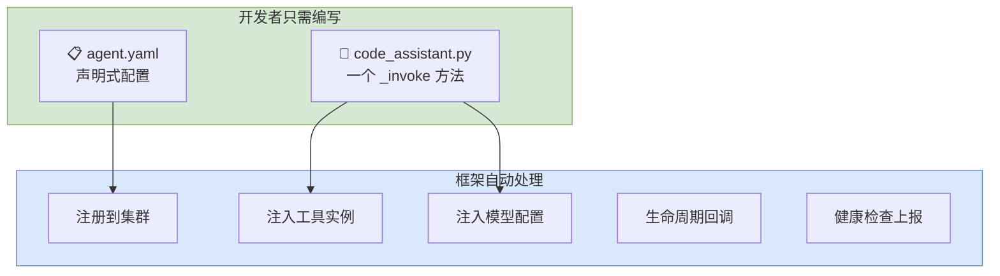

#### 4.3.1 子代理项目结构

通过脚手架命令 `artipivot plugin init` 自动生成：

```
plugins/code_assistant/
├── agent.yaml              # 声明式配置（身份、参数、工具）
├── code_assistant.py       # 核心逻辑（一个类 + 一个方法）
├── _assets/
│   └── icon.svg            # 图标（可选）
└── requirements.txt        # 依赖（可选）
```

#### 4.3.2 agent.yaml — 声明式配置

YAML 文件定义子代理的身份、意图、工具需求和参数。模型配置首次启动后由 MongoDB 管理，运行时变更无需重启。

```yaml
identity:
  name: code_assistant
  author: your-name
  label:
    zh_Hans: 代码助手
    en_US: Code Assistant
  description:
    zh_Hans: 代码生成、审查与调试
    llm: 用于代码生成、代码审查和调试的助手
  icon: icon.svg

intents:
  - code
  - debug

tools:
  required:
    - code_exec
    - file_io
  optional:
    - web_search

parameters:
  - name: max_iterations
    type: number
    required: false
    default: 10
    label:
      zh_Hans: 最大迭代次数
  - name: allowed_languages
    type: string
    required: false
    default: "python,javascript,go"
    label:
      zh_Hans: 允许的编程语言

model:
  required: true
  provider: anthropic
  name: claude-sonnet-4-6
  fallback:               # 兜底模型（主模型不可用时自动切换）
    provider: anthropic
    name: claude-haiku-4-5-20251001

# 注：模型配置首次启动后由 MongoDB 管理，通过 REST API 动态更新
# 运行时变更无需重启，无需重建图
```

#### 4.3.3 模型配置层级

每个子代理可以独立配置 LLM（大语言模型），支持**三级兜底**——主模型挂了自动切换备选，备选也挂了还有全局兜底。模型配置存储在 MongoDB，通过 REST API 动态管理，变更立即生效（详见 [ARCHITECTURE.md](./ARCHITECTURE.md) 第 9 节）。

| 层级 | 配置位置 | 作用 | 管理方式 |
|------|----------|------|----------|
| 子代理模型 | MongoDB → `{agent_id}:{sub_name}` | 该子代理专用模型 | `PUT /admin/models/{agent_id}/{sub_agent}` |
| 子代理兜底 | 同上 → `fallback` 字段 | 子代理模型失败时降级 | 同上 |
| 全局兜底 | MongoDB → `global` | 所有兜底都失败时的最后防线 | `PUT /admin/models/global/fallback` |

首次启动时从 YAML seed 文件加载初始配置，之后所有变更通过 REST API 管理。

```yaml
# config/seed/models.yaml — 仅首次启动使用
global:
  fallback_model:
    provider: openai
    name: gpt-4o

agents:
  code_agent:
    provider: anthropic
    name: claude-sonnet-4-6
    sub_agents:
      code_writer:
        provider: anthropic
        name: claude-sonnet-4-6
        fallback:
          provider: anthropic
          name: claude-haiku-4-5-20251001
```

#### 4.3.4 code_assistant.py — 开发者核心代码

开发者只需实现 `_invoke` 一个方法。框架自动注入模型、工具、配置、对话历史和记忆访问——开发者像搭积木一样组合使用即可。

```python
from artipivot import SubAgent, SubAgentContext


class CodeAssistant(SubAgent):
    """代码助手 — 开发者只需实现 _invoke 一个方法"""

    async def _invoke(self, context: SubAgentContext) -> str:
        """
        核心方法：接收任务，返回结果

        框架自动注入：
        - context.query       用户原始问题（路由 Agent 透传）
        - context.model       LLM 模型实例（直接调用）
        - context.tools       工具箱（按名称取用）
        - context.config      agent.yaml 中的参数
        - context.history     对话历史（L2 会话记忆）
        - context.memory      长期记忆读写（L3 Store）
        """
        # 1. 读取长期记忆（用户偏好等）
        profile = await context.memory.get("profile")
        preferred_lang = profile.get("preferred_language", "python")

        # 2. 用模型分析任务
        plan = await context.model.chat(
            f"分析以下编程任务，制定执行计划：{context.query}"
        )

        # 3. 按需调用工具（一行取用，无需初始化）
        code_tool = context.tools.get("code_exec")
        file_tool = context.tools.get("file_io")

        # 4. 执行步骤
        result = await code_tool.run(code=plan, language=preferred_lang)

        # 5. 保存结果
        if result.success:
            await file_tool.run(path="output.py", content=result.data)

        # 6. 回写长期记忆（框架自动处理，开发者也可主动写）
        await context.memory.put("knowledge", {
            "fact": f"用户偏好语言: {preferred_lang}"
        })

        # 7. 直接返回最终响应（由子代理直接返回给用户）
        return f"任务完成。代码已写入 output.py"
```

#### 4.3.5 开发者体验对比

| 维度 | 传统框架 | ArtiPivot（参考 Dify 设计） |
|------|----------|-----------------------------|
| 必须理解的概念 | 基类、注册表、生命周期回调等 3-4 个接口 | SubAgent、`_invoke`、context 三个概念 |
| 配置方式 | 写 Python 类属性 | 写 YAML 声明 |
| 工具获取 | 手动从注册表查找 | `context.tools.get("名字")` |
| 模型调用 | 自己管理 LLM 客户端 | `context.model.chat()` |
| 记忆读写 | 手动管理存储 | `context.memory.get/put()` |
| 生命周期 | 实现 3-4 个方法 | 只写 `_invoke` |
| 脚手架 | 无 | `artipivot plugin init` |

### 4.4 脚手架与调试

框架提供 CLI 命令，覆盖开发、测试、打包、发布的完整流程：

```bash
# 1. 一键生成子代理模板
artipivot plugin init --type agent --name code_assistant

# 2. 本地开发模式（改代码立即生效，无需打包）
artipivot plugin dev ./plugins/code_assistant

# 3. 打包发布
artipivot plugin package ./plugins/code_assistant
# → 生成 code_assistant-1.0.0.artipivot-plugin.zip

# 4. 上传到集群
artipivot plugin publish ./code_assistant-1.0.0.artipivot-plugin.zip
# → 上传制品 → 写入 MongoDB → 全集群热更新
```

### 4.5 声明式子代理（零代码注册）

> **这一节讲什么**：大多数 Agent 就是"提示词 + 策略 + 工具"的组合，不需要写代码。声明式子代理只需选策略、配参数、绑工具，几分钟就能上线。

**核心思路**：框架内置三种 Agent 策略引擎，声明式子代理只需选择策略、配置参数。

下图展示了三种策略引擎的工作方式：

- **ReAct**（思考-行动-观察循环）：Agent 先"想"要做什么，然后"做"（调用工具），再"观察"结果，循环直到完成任务
- **CoT**（链式推理）：Agent 按步骤推理，逐步分解问题
- **Function Calling**（函数调用）：模型直接决定调用哪个工具及参数

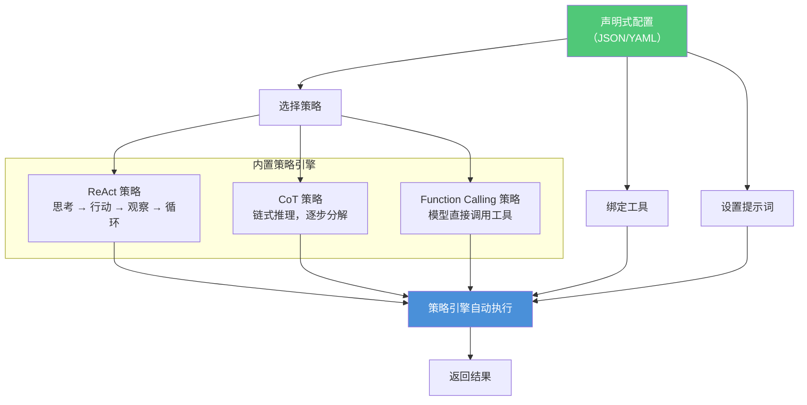

#### 4.5.1 声明式子代理 — JSON 配置示例

以下是一个客服助手的完整声明式配置。配置后框架自动实例化 Agent 并更新路由表，新意图立即生效。

```json
{
  "identity": {
    "name": "customer_service",
    "label": { "zh_Hans": "客服助手" },
    "description": { "zh_Hans": "处理客户咨询、订单查询、售后问题" },
    "icon": "customer_service.svg"
  },
  "intents": ["customer_service", "order_query", "after_sales"],

  "strategy": {
    "type": "react",
    "max_iterations": 5
  },

  "model": {
    "provider": "openai",
    "name": "gpt-4o",
    "temperature": 0.3
  },

  "tools": ["order_query", "knowledge_base", "ticket_system"],

  "prompt": {
    "system": "你是电商平台的客服助手。请根据用户问题，使用可用工具查询信息并给出专业回复。\n规则：\n1. 先确认用户身份\n2. 查询相关订单或知识库\n3. 给出明确解决方案",
    "few_shots": [
      {
        "user": "我的订单怎么还没发货？",
        "assistant": "我先帮你查一下订单状态。请问你的订单号是多少？"
      }
    ]
  }
}
```

#### 4.5.2 注册方式

支持三种注册方式，注册后框架自动完成：解析配置 → 写入 MongoDB → Change Stream 广播 → 各节点加载 → 路由表更新。

```bash
# 方式一：上传 JSON 文件
artipivot agent register --config ./customer_service.json

# 方式二：直接 POST API
curl -X POST http://localhost:8000/api/v1/agents \
  -H "Content-Type: application/json" \
  -d @customer_service.json

# 方式三：在管理后台 UI 中可视化配置（Phase 3）
```

#### 4.5.3 声明式 vs 编程式运行时对比

下图展示了两种子代理在运行时的区别：声明式由框架的策略引擎驱动，编程式由开发者的自定义逻辑驱动。但无论哪种方式，最终都调用工具并返回结果。

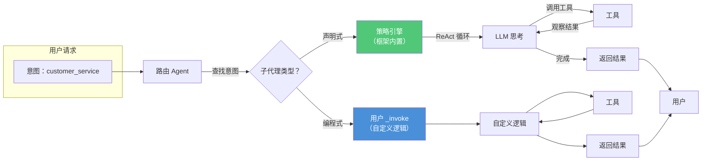

**声明式子代理可配置项**：

| 配置项 | 说明 | 示例 |
|--------|------|------|
| `identity` | 名称、标签、描述、图标 | 同编程式 |
| `intents` | 绑定的意图列表 | `["customer_service"]` |
| `strategy.type` | 策略引擎：`react` / `cot` / `function_calling` | `"react"` |
| `strategy.max_iterations` | 最大思考-行动循环次数 | `5` |
| `model` | 模型配置（provider / name / temperature） | `gpt-4o` |
| `tools` | 绑定的工具列表（按名称引用） | `["order_query"]` |
| `prompt.system` | 系统提示词 | 角色设定 + 规则 |
| `prompt.few_shots` | Few-shot 示例（给模型展示几个问答范例） | 问答对列表 |

---

## 5. 第三层 — 工具

> **这一节讲什么**：工具是系统中最小的能力单元——每个工具只做一件事（搜索、执行代码、读文件等），但可以被子代理自由组合使用。本节介绍工具的开发方式、注册方式，以及更高级的"Pipeline 工具"（工具编排工具）。

### 5.1 职责

工具提供 **原子化、无状态** 的执行能力：

- 每个工具做一件事，做好一件事
- 不包含业务逻辑，仅封装外部交互
- 可被任意子代理引用——工具不"属于"某个子代理

### 5.2 工具可插拔架构

下图展示了工具注册表（ToolRegistry）如何统一管理四种来源的工具：内置工具、MCP 协议工具、自定义工具、Pipeline 工具。所有工具注册到中心注册表后，子代理按名称获取使用。

**MCP**（Model Context Protocol）是一个开放协议，允许外部服务以标准化方式提供工具能力。

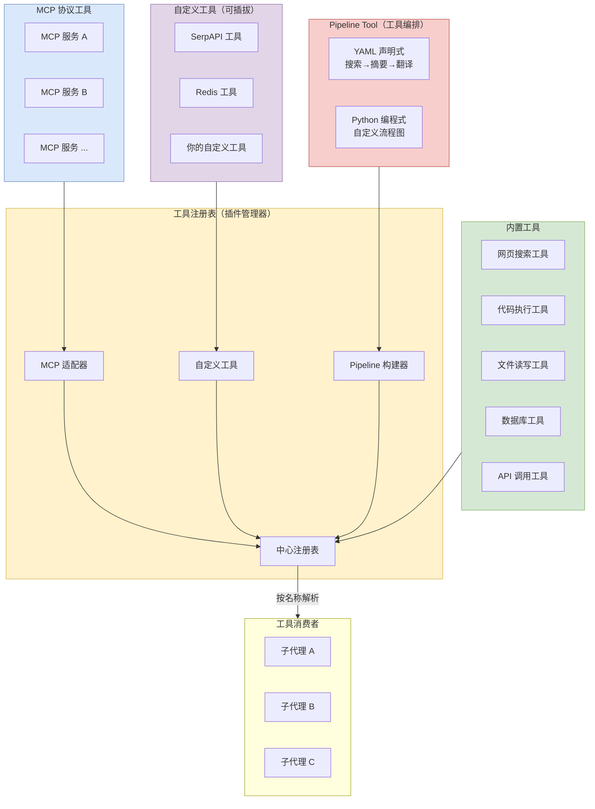

### 5.3 工具开发体验

> **设计理念**：工具 = **YAML 声明参数** + **一个 `_invoke` 方法**。与子代理一样，开发者只需关注核心逻辑。

#### 5.3.1 工具项目结构

```
plugins/web_search/
├── provider.yaml           # 工具提供者（身份 + 凭证）
├── tools/
│   └── search.yaml         # 单个工具的参数声明
├── web_search.py           # 核心逻辑
├── _assets/
│   └── icon.svg
└── requirements.txt
```

#### 5.3.2 provider.yaml — 工具提供者配置

定义工具的身份信息和凭证需求。用户安装工具时填写凭证（如 API 密钥）。

```yaml
identity:
  name: web_search
  author: your-name
  label:
    zh_Hans: 网页搜索
    en_US: Web Search
  description:
    zh_Hans: 通过搜索引擎查询互联网信息
  icon: icon.svg

credentials:                # 凭证配置（用户安装时填写）
  - name: api_key
    type: secret-input
    required: true
    label:
      zh_Hans: API 密钥
    placeholder: "sk-..."

tools:
  - tools/search.yaml       # 引用具体工具定义
```

#### 5.3.3 tools/search.yaml — 工具参数声明

用 YAML 声明工具的输入输出参数，替代 Python 代码中的类型标注。LLM 通过这个描述理解工具能做什么、需要什么参数。

```yaml
identity:
  name: search
  description:
    human:
      zh_Hans: 搜索互联网获取信息
    llm: 在互联网上搜索指定查询，返回相关网页片段

parameters:
  - name: query
    type: string
    required: true
    label:
      zh_Hans: 搜索关键词
    description: 要搜索的查询内容

  - name: max_results
    type: number
    required: false
    default: 5
    label:
      zh_Hans: 最大结果数

output:
  type: string              # 返回值类型
  description: 搜索结果文本
```

#### 5.3.4 web_search.py — 开发者核心代码

与子代理一样，开发者只需实现 `_invoke` 方法。框架自动注入参数、凭证和日志。

```python
from artipivot import Tool, ToolContext


class WebSearch(Tool):
    """网页搜索工具 — 开发者只需实现 _invoke"""

    async def _invoke(self, context: ToolContext) -> str:
        """
        框架自动注入：
        - context.params      YAML 中声明的参数（已校验、已类型转换）
        - context.credentials 用户配置的凭证（api_key 等）
        - context.logger      结构化日志
        """
        query = context.params["query"]
        max_results = context.params.get("max_results", 5)
        api_key = context.credentials["api_key"]

        # 直接调用第三方 API
        results = await search_engine(query, api_key, limit=max_results)

        # 直接返回字符串即可，框架处理序列化
        return format_results(results)
```

### 5.4 OpenAPI 快速导入

除了 Python 工具，还支持直接粘贴 **OpenAPI 3.0 Schema**（一种描述 REST API 的标准格式）创建工具——零代码。

框架自动解析 OpenAPI → 生成 YAML → 注册为可用工具。以下示例定义了一个天气查询接口：

```json
{
  "openapi": "3.1.0",
  "info": { "title": "天气查询", "version": "1.0.0" },
  "servers": [{ "url": "https://api.weather.com/v1" }],
  "paths": {
    "/weather": {
      "get": {
        "operationId": "get_weather",
        "description": "根据城市查询当前天气",
        "parameters": [
          { "name": "city", "in": "query", "required": true,
            "schema": { "type": "string" },
            "description": "城市名称" }
        ]
      }
    }
  }
}
```

### 5.5 Pipeline Tool（工具编排工具）

> **这一节讲什么**：有时一个任务需要多个工具按固定顺序执行（如"搜索 → 摘要 → 翻译"）。Pipeline Tool 把这种固定流程封装为一个独立工具，对子代理而言就是一个普通 tool，内部的多步骤编排是黑盒。

#### 5.5.1 概念

下图展示了一个 Pipeline 的内部结构：输入依次经过三个工具，最终输出结果。对外，它看起来就是一个叫 `search_and_translate` 的普通工具。

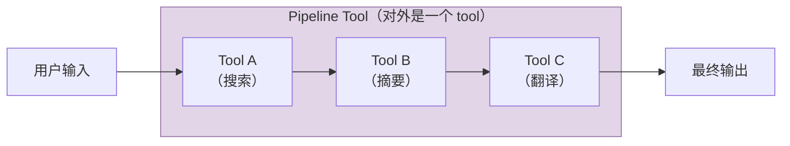

#### 5.5.2 声明式 Pipeline（YAML 配置，零代码）

开发者通过 YAML 描述固定流程，框架自动构建 LangGraph 线性图并编译为工具。以下是一个"搜索 → 摘要 → 翻译"三步 Pipeline 的配置：

```yaml
# plugins/search_translate/pipeline.yaml
identity:
  name: search_and_translate
  description:
    human:
      zh_Hans: 搜索并翻译
    llm: 搜索互联网内容，总结摘要后翻译为中文

parameters:
  - name: query
    type: string
    required: true
    description: 搜索关键词

pipeline:
  steps:
    - name: search
      tool: web_search
      input: "{query}"
      output: search_result

    - name: summarize
      tool: summarize
      input: "{search_result}"
      output: summary

    - name: translate
      tool: translate
      input: "{summary}"
      params:
        target_lang: zh
      output: translated

  output: "{translated}"
```

框架处理流程：

```
pipeline.yaml → PipelineToolBuilder → StateGraph（线性图）→ compile → @tool → 注册到 ToolRegistry
```

子代理调用方式与普通工具完全一致：

```python
tool = context.tools.get("search_and_translate")
result = await tool.run(query="LangGraph architecture")
```

#### 5.5.3 条件分支 Pipeline

固定流程支持简单条件判断，框架将其转为 LangGraph 的条件边。例如：当搜索结果太长时先摘要再翻译，否则直接翻译。

```yaml
pipeline:
  steps:
    - name: fetch
      tool: web_search
      input: "{query}"
      output: raw_result

    - name: check_length
      type: condition
      if: "len({raw_result}) > 5000"
      then: summarize
      else: translate

    - name: summarize
      tool: summarize
      input: "{raw_result}"
      output: processed

    - name: translate
      tool: translate
      input: "{raw_result}"
      output: processed
      params:
        target_lang: zh

  output: "{processed}"
```

#### 5.5.4 编程式 Pipeline

需要更复杂编排逻辑时，用 Python 直接构建 StateGraph：

```python
from artipivot import PipelineTool, PipelineContext

class SearchTranslatePipeline(PipelineTool):
    """搜索 + 翻译流水线 — 编程式"""

    def build_graph(self) -> CompiledStateGraph:
        builder = StateGraph(self.state_schema)

        async def step_search(state, runtime: Runtime):
            tool = runtime.context.tools["web_search"]
            result = await tool.ainvoke({"query": state["input"]})
            return {"search_result": result}

        async def step_translate(state, runtime: Runtime):
            tool = runtime.context.tools["translate"]
            result = await tool.ainvoke({
                "text": state["search_result"],
                "target_lang": "zh"
            })
            return {"output": result}

        builder.add_node("search", step_search)
        builder.add_node("translate", step_translate)
        builder.add_edge(START, "search")
        builder.add_edge("search", "translate")
        builder.add_edge("translate", END)

        return builder.compile()
```

### 5.6 四种工具开发方式对比

| 方式 | 适合场景 | 开发量 | 灵活性 |
|------|----------|--------|--------|
| **OpenAPI 导入** | 已有 REST API 的服务 | 零代码 | 低（仅 HTTP） |
| **YAML + Python** | 自定义逻辑、数据处理 | YAML + 一个方法 | 高 |
| **MCP 协议** | 外部服务、第三方 MCP Server | 配置连接参数 | 中 |
| **Pipeline Tool** | 多工具固定流程编排 | YAML 声明 / Python | 中（支持条件分支） |

### 5.7 工具在子代理中的使用方式

工具的使用 API 极其简洁——按名称取用，直接调用：

```python
class CodeAssistant(SubAgent):
    async def _invoke(self, context: SubAgentContext) -> str:
        # 按名称取工具
        tool = context.tools.get("web_search")

        # 直接调用，参数与 YAML 声明一致
        result = await tool.run(query="Python asyncio 最佳实践")

        # result 是字符串
        return f"搜索结果：{result}"
```

### 5.8 零代码工具注册汇总

工具支持三种零代码注册方式，注册后立即全集群生效。下图展示了从注册到就绪的完整流程：

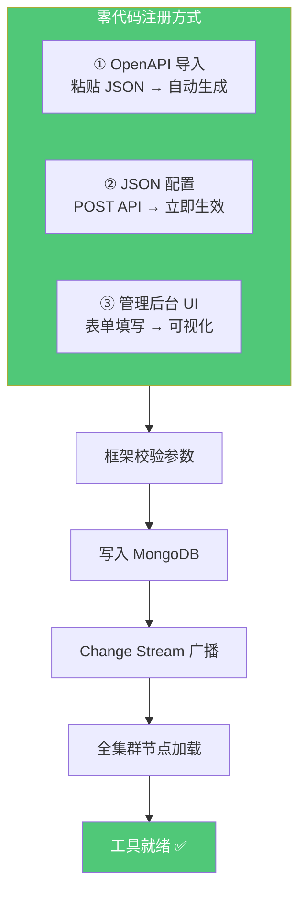

```bash
# 方式一：OpenAPI 导入（适合已有 REST API）
artipivot tool import --openapi ./weather_api.json

# 方式二：直接 JSON 配置（适合简单 HTTP 调用）
curl -X POST http://localhost:8000/api/v1/tools \
  -H "Content-Type: application/json" \
  -d '{
    "identity": { "name": "weather", "label": {"zh_Hans": "天气查询"} },
    "type": "http",
    "endpoint": "https://api.weather.com/v1/weather",
    "method": "GET",
    "parameters": [
      {"name": "city", "type": "string", "required": true}
    ],
    "credentials": [{"name": "api_key", "type": "secret-input"}]
  }'

# 方式三：管理后台表单（Phase 3 Web UI）
```

---

## 6. 集群架构与插件系统

> **这一节讲什么**：生产环境下，ArtiPivot 以多节点集群方式运行。所有插件（子代理/工具）的元数据存储在 MongoDB，各节点通过 Change Stream（MongoDB 的实时数据变更通知机制）自动同步。本节介绍集群架构、数据模型、插件热更新流程。

### 6.1 集群部署架构

下图展示了生产环境的部署结构：

- **负载均衡**（Nginx / AWS ALB）：把用户请求均匀分配到多个节点
- **ArtiPivot 节点**：每个节点运行完整的路由 + 子代理 + 工具
- **持久化层**：MongoDB（插件注册表 + Change Stream）、Redis（本地缓存 + 分布式锁）、制品仓库（S3 / GCS / MinIO，存储插件代码包）

```mermaid
flowchart TB
    subgraph LB["负载均衡"]
        LB1["Nginx / AWS ALB"]
    end

    subgraph Cluster["ArtiPivot 集群"]
        direction LR
        N1["节点 1<br/>路由 + 子代理 + 工具"]
        N2["节点 2<br/>路由 + 子代理 + 工具"]
        N3["节点 N<br/>路由 + 子代理 + 工具"]
    end

    subgraph Storage["持久化层"]
        Mongo[("MongoDB<br/>插件注册表<br/>+ Change Stream")]
        Redis[("Redis<br/>本地缓存<br/>+ 分布式锁")]
        Artifact["制品仓库<br/>S3 / GCS / MinIO<br/>插件代码包")]
    end

    LB --> N1
    LB --> N2
    LB --> N3

    N1 <-->|"Change Stream<br/>实时同步"| Mongo
    N2 <-->|"Change Stream<br/>实时同步"| Mongo
    N3 <-->|"Change Stream<br/>实时同步"| Mongo

    N1 <--> Redis
    N2 <--> Redis
    N3 <--> Redis

    N1 -.->|"下载 .whl 包"| Artifact
    N2 -.->|"下载 .whl 包"| Artifact
    N3 -.->|"下载 .whl 包"| Artifact

    style LB fill:#8B5CF6,color:#fff,stroke:#6D28D9
    style N1 fill:#4A90D9,color:#fff,stroke:#2C5F8A
    style N2 fill:#4A90D9,color:#fff,stroke:#2C5F8A
    style N3 fill:#4A90D9,color:#fff,stroke:#2C5F8A
    style Mongo fill:#50C878,color:#fff,stroke:#2E8B57
    style Redis fill:#E74C3C,color:#fff,stroke:#C0392B
    style Artifact fill:#F5A623,color:#fff,stroke:#D4880F
```

### 6.2 MongoDB 存储模型

插件定义持久化到 MongoDB 的三个核心集合（相当于三张表）：

| 集合 | 作用 |
|------|------|
| `plugins` | 全局插件注册表，存储元数据、版本、制品地址 |
| `plugin_assignments` | 控制哪些插件在哪些节点组启用，支持灰度发布 |
| `health_checks` | 各节点上报插件健康状态，用于故障摘除 |

下图展示了三个集合之间的关系：

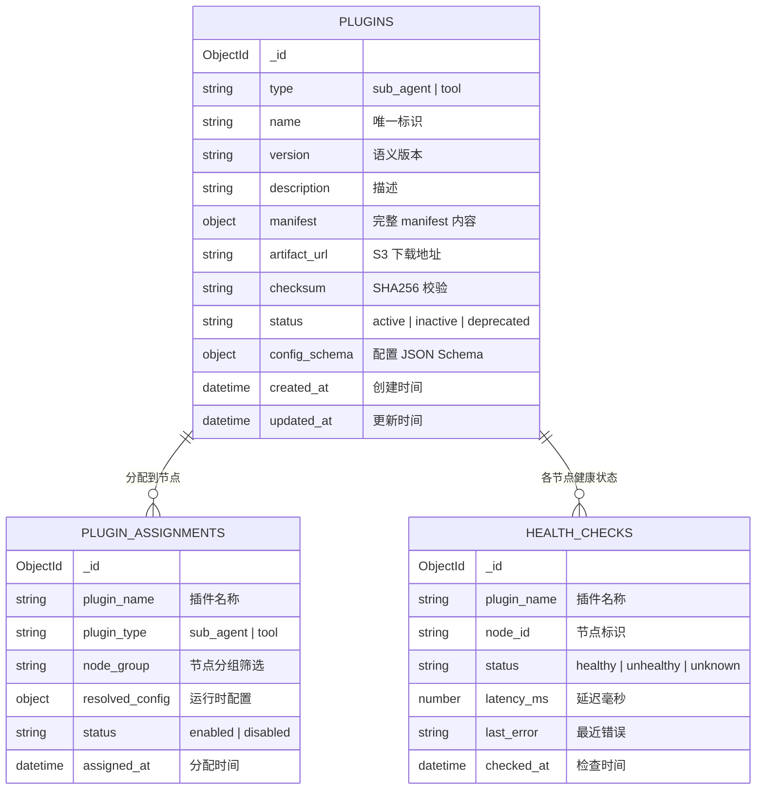

**MongoDB 文档示例**（`plugins` 集合中的一条记录）：

```json
{
  "_id": "ObjectId('...')",
  "type": "sub_agent",
  "name": "code_assistant",
  "version": "1.2.0",
  "description": "代码生成、审查与调试",
  "manifest": {
    "supported_intents": ["code"],
    "required_tools": ["code_exec", "file_io"],
    "optional_tools": ["web_search"],
    "config_schema": { "max_iterations": {"type": "int", "default": 10} }
  },
  "artifact_url": "s3://artipivot-plugins/code_assistant-1.2.0-py3-none-any.whl",
  "checksum": "sha256:a1b2c3...",
  "status": "active",
  "created_at": "2026-05-10T08:00:00Z",
  "updated_at": "2026-05-13T10:30:00Z"
}
```

### 6.3 插件注入全流程

下图展示了一个新插件从上传到全集群就绪的完整流程。关键步骤：管理员上传 → 存储制品 → 写入 MongoDB → Change Stream 触发各节点 → 节点下载安装 → 健康检查通过 → 开始接收流量。

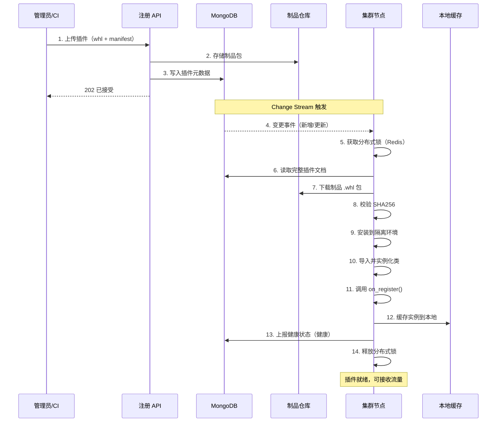

### 6.4 节点启动与同步流程

节点启动时执行全量同步（从 MongoDB 读取所有插件 → 下载安装 → 注册到本地缓存），然后启动 Change Stream 监听，进入实时热更新循环。

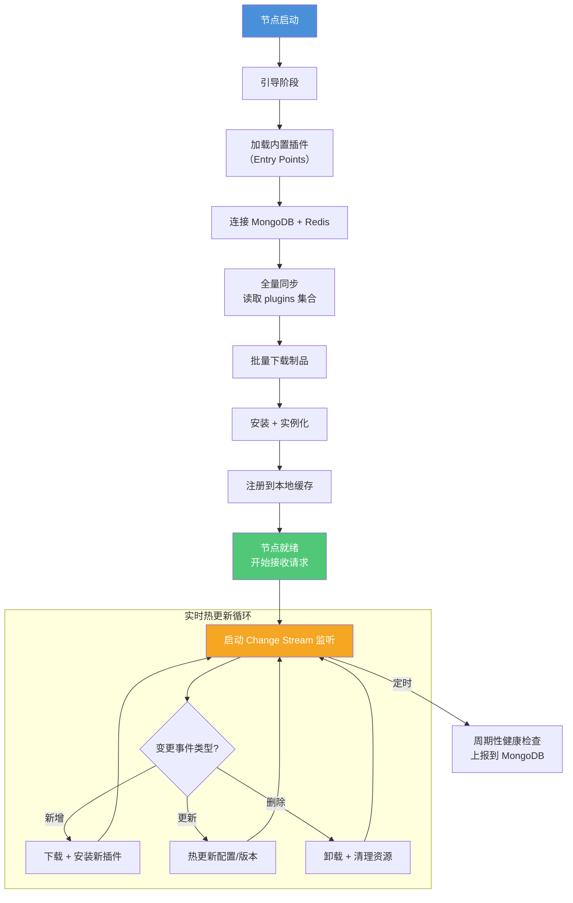

### 6.5 插件注册表接口（集群版）

以下是集群级插件注册表的核心接口。它以 MongoDB 为唯一数据源，写入走 MongoDB（管理 API），读取走本地缓存优先 + MongoDB 兜底，热更新走 Change Stream。

```python
from abc import ABC, abstractmethod
from dataclasses import dataclass


@dataclass
class PluginDocument:
    """MongoDB 插件文档映射"""
    type: str                    # "sub_agent" | "tool"
    name: str
    version: str
    manifest: dict
    artifact_url: str
    checksum: str
    status: str                  # "active" | "inactive" | "deprecated"


class ClusterPluginRegistry:
    """
    集群级插件注册表 — 以 MongoDB 为唯一数据源

    - 写操作 → MongoDB（管理 API 调用）
    - 读操作 → 本地缓存（优先） → MongoDB（兜底）
    - 热更新 → MongoDB Change Stream
    """

    def __init__(self, mongo_uri: str, redis_uri: str, artifact_store: str):
        self._mongo = MongoStore(mongo_uri)
        self._cache = LocalCache(redis_uri)
        self._artifact = ArtifactStore(artifact_store)
        self._lock = DistributedLock(redis_uri)

    # --- 管理 API（写入 MongoDB） ---

    async def publish_plugin(self, plugin_type: str, name: str,
                             artifact_path: str, manifest: dict) -> str:
        """发布插件：上传制品 + 写入 MongoDB"""
        async with self._lock.acquire(f"publish:{name}"):
            checksum = compute_sha256(artifact_path)
            artifact_url = await self._artifact.upload(artifact_path)
            doc = PluginDocument(
                type=plugin_type, name=name,
                version=manifest["version"],
                manifest=manifest,
                artifact_url=artifact_url,
                checksum=checksum,
                status="active",
            )
            return await self._mongo.insert_or_update(doc)

    async def deprecate_plugin(self, name: str) -> None:
        """标记插件为已弃用"""
        await self._mongo.update_status(name, "deprecated")

    # --- 节点 API（读取 + 本地缓存） ---

    async def get_sub_agent(self, intent: str) -> "BaseSubAgent":
        """获取子代理实例（优先本地缓存）"""
        cached = self._cache.get_sub_agent(intent)
        if cached and cached.is_healthy():
            return cached
        # 缓存未命中 → 从 MongoDB 查询 + 实例化
        doc = await self._mongo.find_by_intent("sub_agent", intent)
        instance = await self._load_and_instantiate(doc)
        self._cache.set_sub_agent(intent, instance)
        return instance

    async def get_tool(self, name: str) -> "BaseTool":
        """获取工具实例"""
        cached = self._cache.get_tool(name)
        if cached and cached.is_healthy():
            return cached
        doc = await self._mongo.find_by_name("tool", name)
        instance = await self._load_and_instantiate(doc)
        self._cache.set_tool(name, instance)
        return instance

    # --- 生命周期 ---

    async def start_watcher(self) -> None:
        """启动 Change Stream 监听，热更新本地插件"""
        async for change in self._mongo.watch_changes():
            await self._handle_change(change)

    async def _load_and_instantiate(self, doc: PluginDocument) -> object:
        """下载制品 → 校验 → 安装 → 导入 → 实例化"""
        artifact_path = await self._artifact.download(
            doc.artifact_url, doc.checksum
        )
        verify_checksum(artifact_path, doc.checksum)
        module = install_and_import(artifact_path, doc.manifest)
        return instantiate(module, doc.manifest)
```

### 6.6 插件加载来源（三层降级）

插件加载按优先级从高到低，保证性能的同时兼顾可靠性：

| 优先级 | 来源 | 适用场景 | 说明 |
|--------|------|----------|------|
| 1 | **本地缓存（Redis）** | 热路径 | 毫秒级响应，定期校验健康状态 |
| 2 | **MongoDB + 制品仓库** | 冷启动 / 缓存未命中 | 全量同步，Change Stream 热更新 |
| 3 | **Entry Points（内置）** | 基础能力 | 内置插件随镜像发布，无需外部存储 |

下图展示了获取插件实例时的降级逻辑：Redis 缓存命中且健康 → 直接返回；否则查询 MongoDB → 下载制品 → 安装实例化 → 写入缓存。

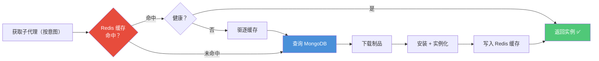

### 6.7 灰度发布与故障摘除

**灰度发布（金丝雀部署）**：

通过 `plugin_assignments` 集合控制新版本插件只在部分节点生效。例如先在 `canary` 节点组启用，观察无问题后全量发布：

```json
{
  "plugin_name": "code_assistant",
  "plugin_type": "sub_agent",
  "node_group": "canary",
  "status": "enabled",
  "resolved_config": { "max_iterations": 5 }
}
```

**故障摘除（熔断器）**：

当插件连续失败超过阈值时，熔断器自动打开，停止调用该插件并告警。等待冷却期后进入半开状态，试探性调用一次，成功则恢复，失败则继续熔断。

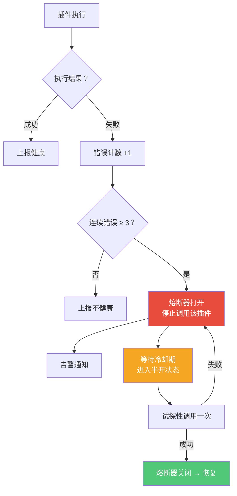

---

## 7. 生产级保障

> **这一节讲什么**：一个系统要上线，光有功能不够，还需要"生产级保障"——能监控运行状态（可观测性）、能防止攻击和滥用（安全）、出错了能自动恢复（容错）。本节分别介绍这三个方面。

### 7.1 可观测性架构

> 详细设计见 [ARCHITECTURE.md](./ARCHITECTURE.md) 第 11 节

**核心原则：生产不依赖任何外部 SaaS 服务。** LangSmith（LangChain 提供的调试工具）仅在本地开发/单测时作为可选调试工具，通过环境变量控制，生产环境禁止启用。

ArtiPivot 使用**自建文件日志系统**：8 个通道各自独立的日志文件，使用结构化 JSON 格式，支持自动轮转（按大小/日期切割）。

#### 7.1.1 八通道日志

| 通道 | 文件 | 内容 | 保留 |
|---|---|---|---|
| 主日志 | `artipivot.log` | 所有组件 INFO+ 合并流 | 30 天 |
| 请求 trace | `trace.log` | 每个请求完整生命周期（节点执行/耗时/路由） | 7 天 |
| **会话** | **`session.log`** | **按 thread_id 串联多轮请求 + 每轮记忆状态** | 30 天 |
| **记忆** | **`memory.log`** | **Store 读写 + Checkpointer + 上下文窗口操作** | 30 天 |
| LLM 调用 | `llm.log` | prompt / response / token / 模型 / 耗时 | 30 天 |
| 工具调用 | `tool.log` | 工具名 / 参数 / 结果 / 耗时 | 14 天 |
| 错误 | `error.log` | 仅 ERROR+，含完整堆栈 | 90 天 |
| 审计 | `audit.log` + MongoDB | 配置变更、插件操作、权限操作 | 365 天 |

**会话级日志（session.log）** 按 `thread_id`（会话标识）串联多轮请求，每轮记录：用户消息 → 记忆快照（本轮开始时有什么记忆）→ 路由结果 → 子代理 → 记忆变更（本轮写了什么新记忆）→ 响应。

**记忆操作日志（memory.log）** 记录三层记忆的所有读写操作：Checkpoint 加载/保存、上下文窗口压缩/截断、Store 读取/语义搜索/写入。用于排查"为什么 Agent 不知道 X"。

详细设计见 [ARCHITECTURE.md](./ARCHITECTURE.md) 第 11.3.7 - 11.3.8 节。

#### 7.1.2 日志架构

下图展示了日志的采集与存储链路：框架内部通过 structlog（结构化日志库）自动采集，写入 8 个日志文件，再通过 Filebeat 等工具导入 Elasticsearch/Loki 实现全文检索和告警。OpenTelemetry 和 LangSmith 为可选扩展。

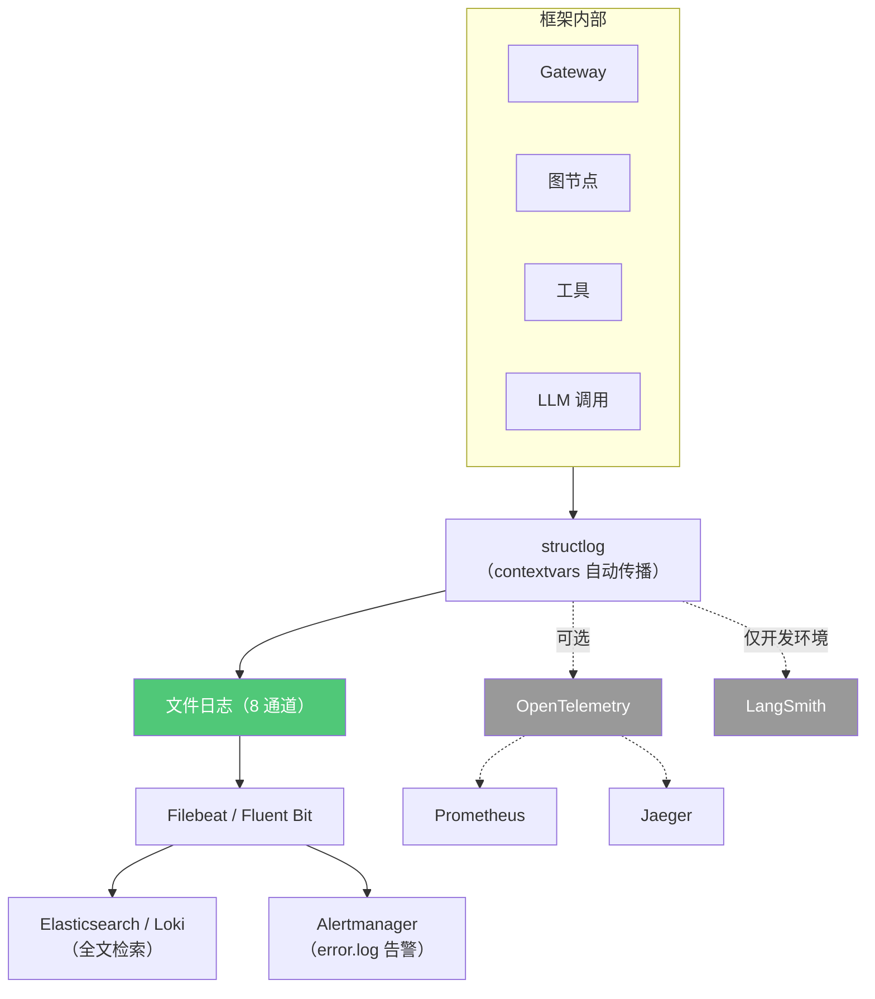

**日志级别规范**：

| 级别 | 使用场景 |
|---|---|
| `DEBUG` | LLM 完整 prompt/response（生产默认关闭） |
| `INFO` | 请求开始/结束、节点执行、工具调用、LLM 调用 |
| `WARNING` | 模型 fallback 触发、限流拒绝、重试、配置降级 |
| `ERROR` | 工具执行失败、模型全部不可用、节点超时 |
| `CRITICAL` | MongoDB 连接断开、Checkpointer 不可用、磁盘满 |

### 7.2 安全模型

系统设置了五层安全防护，请求从左到右依次经过：

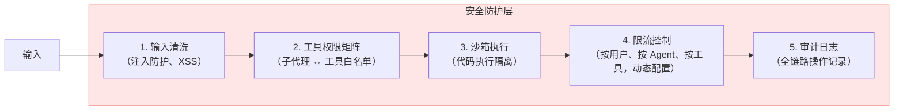

**工具权限矩阵示例**：

| 子代理 | 网页搜索 | 代码执行 | 文件读写 | 数据库 |
|--------|----------|----------|----------|--------|
| 代码助手 | - | ✅ | ✅ | - |
| 数据分析师 | - | - | ✅ | ✅ |
| 研究员 | ✅ | - | ✅ | - |

### 7.3 错误处理与容错

> 详细设计见 [ARCHITECTURE.md](./ARCHITECTURE.md) 第 12 节

**各层独立容错**：不同层级使用不同的容错策略，确保局部故障不会拖垮整个系统。

| 层 | 容错机制 | LangGraph 原生能力 |
|---|---|---|
| 模型调用 | 三级 fallback + 重试（指数退避） | — |
| classify 节点 | per-node timeout + error_handler | `add_node(..., timeout=, error_handler=)` |
| 子代理节点 | per-node timeout + error_handler → fallback 响应 | 同上 |
| 工具执行 | 瞬态错误重试 + 超时 + 错误 ToolMessage | ToolNode |
| 外部依赖 | 熔断器（per-provider 三状态机） | — |
| 基础设施 | MongoDB/Redis/Postgres 连接池 + 重试 | — |

下图展示了不同类型错误的处理路径：

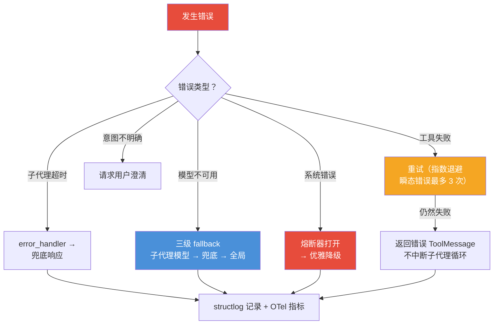

**容错参数动态配置**：超时和重试参数存储在 MongoDB，通过 API 动态调整，无需重启服务。

```bash
# 超时配置
PUT /admin/ratelimits/agent/{agent_id}
{ "tool_timeout_ms": 60000, "subagent_timeout_ms": 120000 }

# 工具重试配置
PUT /admin/ratelimits/tool/{tool_name}
{ "max_retries": 3, "backoff_base_ms": 1000 }
```

---

## 8. 记忆系统

> **这一节讲什么**：Agent 需要"记忆"才能提供连贯的服务——比如记住用户的偏好、之前的对话内容。ArtiPivot 的记忆系统分三层：工作记忆（当前调用）、会话记忆（对话历史）、长期记忆（用户画像和知识积累）。详细设计见 [MEMORY.md](./MEMORY.md)。

### 8.1 三层记忆模型

| 层级 | 机制 | 存储内容 | 生命周期 | 后端 | 管理者 |
|------|------|----------|----------|------|--------|
| **L1 工作记忆** | 图 State（TypedDict + Reducer） | 当前意图、活跃子代理、中间产物 | 单次调用 | 内存 | 子代理 |
| **L2 会话记忆** | Checkpointer (per-thread) | 对话消息历史、图执行快照 | 会话内持续 | PostgresSaver | **主图**（供意图识别）+ 子代理（供任务执行） |
| **L3 长期记忆** | Store (跨 thread) | 用户画像、偏好、知识积累 | 永久 | PostgresStore + 语义搜索 | **子代理**（读写） |

**关键设计**：主 Agent 作为纯路由，**只读 L2 会话记忆**（对话历史）用于意图识别。L3 长期记忆的读写完全由子代理负责——子代理在执行任务时读取用户画像/知识，在任务完成后回写新信息。

### 8.2 多 Agent 记忆隔离

多个主 Agent 共享同一套存储后端，但通过 ID 前缀实现天然隔离：

- **L2 隔离**：`thread_id` 编码为 `{agent_id}:{session_id}`，同一 Checkpointer 天然隔离
- **L3 隔离**：Store namespace 编码为 `(agent_id, user_id, type)`，同一 Store 天然隔离
- **L1 隔离**：每个主图独立 State schema，天然隔离

### 8.3 上下文窗口管理

长对话超出模型上下文窗口（模型一次能处理的最大文本量）时，支持三种策略：

1. **摘要压缩**（推荐）：用 LLM 把旧消息压缩成摘要，保留最近 N 条原始消息
2. **截断**：直接丢弃最旧的消息
3. **不处理**：由模型自行处理

子代理通过 `agent.yaml` 声明记忆配置：

```yaml
memory:
  session: per-invocation           # per-invocation | per-thread | stateless
  context_window:
    strategy: summarize              # summarize | trim | none
    trigger_tokens: 100000
    keep_messages: 20
    summary_model: claude-haiku-4-5-20251001
  long_term:
    read: [profile, knowledge, agent:self]
    write: [agent:self]
```

### 8.4 记忆分工：主图 vs 子代理

| 操作 | 主图（路由 Agent） | 子代理 |
|------|---------------------|--------|
| L2 会话记忆（对话历史） | **读取** — classify 节点加载历史消息，用于意图识别 | **读取** — 理解对话上下文 |
| L3 长期记忆（用户画像/知识） | **不涉及** | **读取 + 写入** — 执行前读 profile/knowledge，执行后提取新信息回写 |
| L1 工作记忆（State） | 仅存 intent + sub_agent_name | 独立 State，存中间产物 |

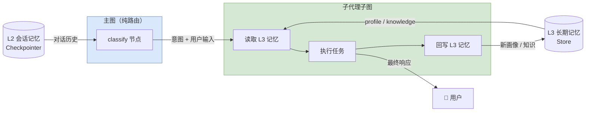

---

## 9. 动态配置中心

> **这一节讲什么**：ArtiPivot 的所有运行时参数（模型、提示词、限流、路由规则）不写死在代码或配置文件中，而是存储在 MongoDB，通过 REST API 动态管理。修改配置后通过 Change Stream 立即生效。YAML 文件仅用于首次启动的初始数据导入。详细设计见 [ARCHITECTURE.md](./ARCHITECTURE.md) 第 10 节。

### 9.1 配置分类与生效方式

不同类型的配置有不同的生效方式——有些可以热更新（无需重启），有些需要重建图结构：

| 配置类型 | 存储位置 | 变更是否重建图 | 管理方式 |
|---|---|---|---|
| 模型配置 | MongoDB `model_configs` | 否 — invoke 时动态解析 | `PUT /admin/models/...` |
| 提示词 | MongoDB `prompt_configs` | 否 — 节点执行时读取 | `PUT /admin/prompts/...` |
| 限流参数 | MongoDB `ratelimit_configs` | 否 — 中间件层拦截 | `PUT /admin/ratelimits/...` |
| 路由规则 | MongoDB `routing_configs` | **是** — 条件边编译进图 | `PUT /admin/routing/...` |
| 子代理/工具 | MongoDB `plugins` | **是** — 图拓扑变化 | 发布/下线 API |

### 9.2 管理接口总览

```bash
# 模型管理
GET/PUT /admin/models/{agent_id}
GET/PUT /admin/models/{agent_id}/{sub_agent}
GET/PUT /admin/models/global/fallback

# 提示词管理
GET/PUT /admin/prompts/{agent_id}/{node}
GET/PUT /admin/prompts/{agent_id}/sub/{sub_name}

# 限流管理
GET/PUT /admin/ratelimits
GET/PUT /admin/ratelimits/agent/{agent_id}
GET/PUT /admin/ratelimits/tool/{tool_name}

# 路由规则管理
GET/PUT /admin/routing/{agent_id}
```

---

## 10. 目录结构

> **这一节讲什么**：项目的文件组织方式——每个目录对应一个功能模块。

```
artipivot/
├── pyproject.toml
├── doc/
│   ├── DESIGN.md
│   ├── ARCHITECTURE.md           # 代码架构设计
│   └── MEMORY.md                 # 记忆系统设计
├── src/
│   └── artipivot/
│       ├── __init__.py
│       ├── gateway/                  # 多主 Agent 分发层
│       │   ├── gateway.py            # AgentGateway
│       │   └── config.py
│       ├── graph/                    # 核心图构建层
│       │   ├── state.py
│       │   ├── context.py
│       │   ├── root.py
│       │   ├── router.py
│       │   └── factory.py
│       ├── agents/                   # 子代理层
│       │   ├── base.py
│       │   ├── programmatic.py
│       │   ├── declarative.py
│       │   └── strategies/
│       ├── tools/                    # 工具层
│       │   ├── registry.py
│       │   ├── loader.py
│       │   ├── pipeline.py           # PipelineToolBuilder
│       │   ├── mcp_adapter.py
│       │   ├── openapi_importer.py
│       │   └── builtin/
│       ├── memory/                   # 记忆系统
│       │   ├── checkpointer.py
│       │   ├── store.py
│       │   ├── extraction.py
│       │   └── context_window.py
│       ├── models/                   # 模型适配层
│       │   └── provider.py
│       ├── config/                   # 动态配置中心
│       │   ├── center.py             # ConfigCenter — 统一配置入口
│       │   ├── prompts.py            # 提示词动态管理
│       │   ├── ratelimit.py          # 多维度限流
│       │   ├── routing.py            # 路由规则配置
│       │   └── seed/                 # 首次启动 seed（YAML → MongoDB）
│       ├── plugins/                  # 插件管理
│       │   ├── manager.py
│       │   ├── watcher.py
│       │   ├── loader.py
│       │   └── sandbox.py
│       ├── api/
│       │   ├── server.py
│       │   └── admin.py               # 插件 + 配置管理 REST API
│       ├── cli/
│       │   └── main.py
│       ├── observability/            # 可观测性
│       │   ├── logging.py            # structlog 多通道 + 轮转
│       │   ├── trace.py              # 请求级生命周期日志
│       │   ├── session.py            # 会话级日志（thread_id 串联多轮）
│       │   ├── memory.py             # 记忆操作日志（Store/CP/上下文窗口）
│       │   ├── llm_logger.py         # LLM 调用拦截记录
│       │   ├── tool_logger.py        # 工具调用拦截记录
│       │   ├── audit.py              # 审计日志（文件 + MongoDB）
│       │   └── otel.py               # OTel 可选导出
│       ├── resilience/               # 容错与弹性
│       │   ├── circuit_breaker.py    # 熔断器
│       │   ├── retry.py              # 重试策略
│       │   └── error_handlers.py     # 节点级 error_handler
│       └── config.py
├── plugins/                          # 外部插件目录
│   └── example_plugin/
│       ├── manifest.yaml
│       └── my_agent.py
├── deploy/
│   ├── docker-compose.yaml
│   ├── Dockerfile
│   └── k8s/
└── tests/
    ├── test_gateway/
    ├── test_graph/
    ├── test_agents/
    ├── test_tools/
    ├── test_memory/
    ├── test_cluster/
    │   ├── test_mongo_store.py
    │   ├── test_change_stream.py
    │   └── test_circuit_breaker.py
    └── test_sub_agents/
```

---

## 11. 关键设计决策

> **这一节讲什么**：把整个设计过程中做过的关键技术决策汇总成一张表，方便快速了解"为什么选 A 不选 B"。

| 决策 | 选择 | 理由 |
|------|------|------|
| **底层运行时** | **LangGraph v1.2**（不依赖 LangChain 高层包） | LangGraph 可独立使用，提供 StateGraph、Checkpointer、Store 等基础设施；避免 LangChain 高层抽象绑定 |
| **主 Agent 定位** | **纯路由**（只做意图识别 + 分发） | 单一职责：主 Agent 只读 L2 会话记忆做意图识别，不涉及 L3 长期记忆、工具调用、响应生成；所有业务逻辑下沉到子代理 |
| **多主 Agent** | 多个 `CompiledStateGraph` 实例 + Agent Gateway | 每个主 Agent 完全隔离（State / 路由 / 子代理 / 工具 / 记忆），统一入口分发 |
| 意图识别 | LLM 分类器 + 规则兜底 | 兼顾准确性与延迟，规则兜底保证可用性 |
| 插件存储 | MongoDB（元数据）+ S3（制品） | Schema-free 适合插件清单；Change Stream 天然支持实时同步 |
| 本地缓存 | Redis | 毫秒级读取；分布式锁保证并发安全 |
| 插件分发 | .whl 包 + 制品仓库 | 标准 Python 分发格式；校验 checksum 保证完整性 |
| 工具协议 | JSON Schema（function-calling 兼容） | 与 OpenAI / Anthropic tool use 协议对齐 |
| 异步模型 | asyncio（全链路 async） | IO 密集型 Agent 场景，async 是最优解 |
| 记忆持久化 | PostgresSaver（会话）+ PostgresStore（长期） | LangGraph 原生支持，thread_id / namespace 隔离 |
| 记忆分工 | 主图读 L2（意图识别），子代理读写 L3（业务逻辑） | 主 Agent 保持纯路由，子代理拥有完整上下文 |
| 上下文管理 | 摘要压缩（自建节点） | 避免引入 langchain 高层包，纯 langgraph 节点实现 |
| **可观测性** | 自建文件日志系统（8 通道 structlog）+ OTel（可选） | 生产不依赖外部 SaaS；LangSmith 仅开发环境可选 |
| 安全隔离 | 工具权限矩阵 + 沙箱 | 参考 OpenClaw 沙箱模型，最小权限原则 |
| **动态配置** | ConfigCenter + MongoDB + Change Stream | 模型、提示词、限流等运行时参数全部动态管理，YAML 仅首次 seed |
| **限流** | Redis 滑动窗口 + 多维度（用户/Agent/工具） | FastAPI 中间件层拦截，不侵入图逻辑 |
| **容错** | per-node timeout + error_handler + 三级 fallback + 熔断器 | 利用 LangGraph v1.2 原生能力；模型/工具/子代理各层独立容错 |

---

## 12. 路线图

> **这一节讲什么**：从 MVP 到完整产品的开发计划，按阶段划分。

### 第一阶段 — MVP（核心框架）

搭建最小可用系统：一个主 Agent、一个编程式子代理、基础工具、内存版记忆。

- [ ] AgentGateway 多主 Agent 分发
- [ ] GraphFactory 按 agent_id 构建主图
- [ ] `BaseRouter`、`BaseSubAgent`、`BaseTool` 抽象
- [ ] LLM 意图分类器
- [ ] 1 个主图 + 1 个编程式子代理 + ToolNode
- [ ] InMemorySaver + InMemoryStore
- [ ] 3 个内置工具
- [ ] ConfigCenter 基础骨架（YAML seed 加载）

### 第二阶段 — 声明式 + 记忆

实现声明式子代理和持久化记忆系统。

- [ ] 策略引擎（ReAct / CoT / Function Calling）
- [ ] YAML 声明式子代理加载
- [ ] PostgresSaver + PostgresStore 持久化
- [ ] 上下文窗口管理（摘要压缩）
- [ ] 长期记忆读写（profile + knowledge 提取）
- [ ] 子代理 YAML 记忆配置解析

### 第三阶段 — 集群 + 插件 + 动态配置

实现生产级集群部署、插件热管理、动态配置。

- [ ] MongoDB 注册表 + Change Stream
- [ ] 图热重建 + Gateway 原子替换
- [ ] 插件管理 REST API（发布/下线/灰度）
- [ ] Redis 本地缓存 + 分布式锁
- [ ] 制品仓库（S3/MinIO）上传下载
- [ ] 健康检查 + 故障摘除
- [ ] ConfigCenter 动态配置（模型/提示词/限流/路由规则）
- [ ] MongoDB 配置集合 + Change Stream 热更新

### 第四阶段 — 生产加固 + 生态

完善可观测性、容错、安全和开发者工具链。

- [ ] 自建文件日志系统（8 通道 structlog，JSON 格式，自动轮转）
- [ ] LLM 调用拦截记录（prompt/response/token/耗时 → llm.log）
- [ ] 工具调用拦截记录（参数/结果/耗时 → tool.log）
- [ ] 请求 trace 日志（完整生命周期 → trace.log）
- [ ] 审计日志（文件 + MongoDB 双写）
- [ ] OpenTelemetry 可选导出（环境变量控制）
- [ ] 工具权限矩阵 + 沙箱执行
- [ ] 限流控制（Redis 滑动窗口）+ 熔断器（per-provider 三状态机）
- [ ] per-node timeout + error_handler 容错
- [ ] 审计日志（配置变更、插件操作 → MongoDB）
- [ ] MCP 协议适配器
- [ ] 插件 CLI（`artipivot plugin init/dev/publish`）
- [ ] Web UI / API Gateway
- [ ] docker-compose + Kubernetes 部署

---

## 参考资料

- [OpenClaw 架构深度解析](https://medium.com/@dingzhanjun/deep-dive-into-openclaw-architecture-code-ecosystem-e6180f34bd07)
- [OpenClaw 工作原理：架构、技能与安全](https://www.mintmcp.com/blog/openclaw-works-architecture-skills-security)
- [OpenClaw 架构详解](https://ppaolo.substack.com/p/openclaw-system-architecture-overview)
- [OpenClaw 2026.3.7 更新：可插拔 ContextEngine](https://www.epsilla.com/blogs/2026-03-09-openclaw-2026-3-7-contextengine-agentic-architecture)
- [剖析 OpenClaw](https://sausheong.com/dissecting-openclaw-733213e9c853)
