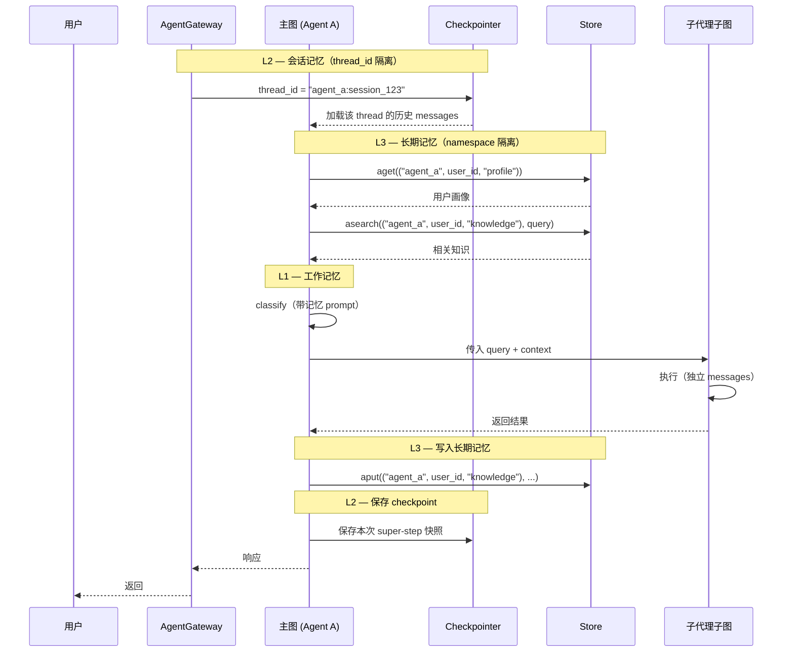

# ArtiPivot 记忆系统设计

> 版本: 0.2.0 | 日期: 2026-05-14 | 状态: 草稿
> 基于 LangGraph v1.2，配合多主 Agent 隔离架构

---

## 1. 记忆分层模型

```
┌─────────────────────────────────────────────────────┐
│  L3 — 长期记忆 (Long-term Memory)                    │
│  LangGraph Store (跨 thread)                         │
│  Namespace: (agent_id, user_id, type)                │
│  用户画像、偏好、知识积累                              │
│  后端：PostgresStore + 语义搜索                       │
├─────────────────────────────────────────────────────┤
│  L2 — 会话记忆 (Session Memory)                      │
│  LangGraph Checkpointer (per-thread)                 │
│  Thread ID: {agent_id}:{session_id}                  │
│  对话消息历史、图执行快照                              │
│  后端：AsyncPostgresSaver                            │
├─────────────────────────────────────────────────────┤
│  L1 — 工作记忆 (Working Memory)                      │
│  LangGraph State (图内存)                            │
│  当前意图、活跃子代理、中间产物                        │
│  后端：图 State（TypedDict + Reducer）               │
└─────────────────────────────────────────────────────┘
```

**多主 Agent 隔离在记忆层的体现：**
- L2：`thread_id` 以 `{agent_id}:` 为前缀，天然隔离
- L3：Store namespace 以 `agent_id` 为首段，天然隔离
- L1：每个主图独立 `TypedDict`，天然隔离

---

## 2. L1 — 工作记忆（图 State）

### 2.1 主图 State

```python
class ArtiPivotState(TypedDict):
    messages: Annotated[list[AnyMessage], add_messages]
    intent: str | None
    confidence: float
    active_agent: str | None
    metadata: dict   # {user_id, agent_id, session_id, ...}
```

### 2.2 子代理 State

```python
class SubAgentState(MessagesState):
    query: str                                    # 主图传入的任务
    artifacts: Annotated[list[str], operator.add] # 中间产物累积
```

### 2.3 Context Schema

```python
@dataclass
class AgentContext:
    agent_id: str       # 主 Agent 标识（记忆隔离 key）
    user_id: str
    thread_id: str      # 完整 thread_id（含 agent_id 前缀）
    model_provider: str
    model_name: str
    available_tools: list[str]
```

通过 `StateGraph(State, context_schema=AgentContext)` 注入。

### 2.4 设计要点

| 要点 | 决策 | 原因 |
|---|---|---|
| messages reducer | `add_messages` | 支持按 ID 覆盖、追加、删除 |
| 子代理独立消息流 | 子图自有 `messages` | 隔离子代理内部对话 |
| 主图 → 子图传递 | 包装节点函数映射 | 主图 messages → 子图 query |
| DeltaChannel | 长对话线程启用 | langgraph v1.2，减少 checkpoint 体积 |

---

## 3. L2 — 会话记忆（Checkpointer）

### 3.1 多 Agent 隔离

共享同一个 `AsyncPostgresSaver` 实例，通过 `thread_id` 前缀隔离：

```python
# 编码规则：{agent_id}:{session_id}
config_code     = {"configurable": {"thread_id": "code_agent:session_123"}}
config_research = {"configurable": {"thread_id": "research_agent:session_123"}}

# 各主图只能读到自己的历史，互不干扰
code_graph.invoke(input, config_code)
research_graph.invoke(input, config_research)
```

### 3.2 配置方式

```python
from langgraph.checkpoint.postgres.aio import AsyncPostgresSaver

checkpointer = AsyncPostgresSaver.from_conn_string(DB_URI)
await checkpointer.setup()

# 所有主图共享同一 checkpointer
for agent_id, graph in graphs.items():
    # thread_id 前缀保证隔离
    ...
```

### 3.3 子图持久化策略

| 子代理类型 | checkpointer | 模式 | 原因 |
|---|---|---|---|
| 通用（编程式） | `None`（默认） | per-invocation | 每次独立，支持 interrupt |
| 多轮记忆型 | `True` | per-thread | 跨调用积累（如研究助手） |
| 纯函数式 | `False` | stateless | 无状态，零开销 |

### 3.4 上下文窗口管理

长对话超出模型上下文窗口时的处理策略：

**摘要压缩（推荐）**：

```python
from langchain.agents.middleware import SummarizationMiddleware

# 注意：这是 langchain 高层包的功能
# 如果坚持不引入 langchain，需自行实现等效的 @before_model 节点
# 在图内部添加 summarize 节点即可

# 方案 A：使用 SummarizationMiddleware（需 langchain）
agent = create_agent(
    model="...",
    middleware=[
        SummarizationMiddleware(
            model="claude-haiku-4-5-20251001",
            trigger=("tokens", 100000),
            keep=("messages", 20),
        )
    ],
    checkpointer=checkpointer,
)

# 方案 B：自建 summarize 节点（纯 langgraph）
async def summarize_if_needed(state, runtime: Runtime[AgentContext]):
    token_count = count_tokens(state["messages"])
    if token_count < TRIGGER_TOKENS:
        return None  # 不需要摘要
    summary = await runtime.model.ainvoke("摘要以下对话...")
    return {"messages": [RemoveMessage(id=REMOVE_ALL_MESSAGES), SystemMessage(content=summary)]}

builder.add_node("summarize", summarize_if_needed)
builder.add_edge("summarize", "classify")
```

### 3.5 子代理 YAML 声明

```yaml
memory:
  # 会话记忆模式
  session: per-invocation    # per-invocation | per-thread | stateless

  # 上下文窗口管理
  context_window:
    strategy: summarize          # summarize | trim | none
    trigger_tokens: 100000
    keep_messages: 20
    summary_model: claude-haiku-4-5-20251001
```

---

## 4. L3 — 长期记忆（Store）

### 4.1 多 Agent 隔离的 Namespace 设计

```
(agent_id, user_id, "profile")            → 用户画像
(agent_id, user_id, "knowledge")          → 用户知识
(agent_id, user_id, "preferences")        → 交互偏好
(agent_id, user_id, "agent", sub_name)    → 子代理专属记忆
```

`agent_id` 作为 namespace 首段，确保不同主 Agent 的长期记忆完全隔离。

### 4.2 记忆类型

| 类型 | Namespace | 示例 |
|---|---|---|
| Profile | `(agent_id, user_id, "profile")` | `{"name": "张三", "language": "Python"}` |
| Knowledge | `(agent_id, user_id, "knowledge")` | `{"fact": "张三的项目用 FastAPI"}` |
| Preference | `(agent_id, user_id, "preferences")` | `{"style": "简洁", "format": "markdown"}` |
| Agent Memory | `(agent_id, user_id, "agent", sub_name)` | `{"last_project": "artipivot"}` |

### 4.3 Store 配置

```python
from langgraph.store.postgres import PostgresStore
from langchain.embeddings import init_embeddings

store = PostgresStore.from_conn_string(
    DB_URI,
    index={
        "embed": init_embeddings("openai:text-embedding-3-small"),
        "dims": 1536,
        "fields": ["$"],
    },
)
await store.setup()
```

### 4.4 记忆写入（respond 节点）

对话结束后提取并存储长期记忆：

```python
async def respond(state: ArtiPivotState, runtime: Runtime[AgentContext]):
    agent_id = runtime.context.agent_id
    user_id = runtime.context.user_id

    # 提取画像更新
    profile = await extract_profile(state["messages"], runtime)
    if profile:
        await runtime.store.aput(
            (agent_id, user_id, "profile"), "main", profile
        )

    # 提取知识
    knowledge = await extract_knowledge(state["messages"], runtime)
    for k in knowledge:
        await runtime.store.aput(
            (agent_id, user_id, "knowledge"), str(uuid.uuid4()), {"fact": k}
        )

    return {"messages": [format_response(state)]}
```

### 4.5 记忆读取（classify 节点）

对话开始时将长期记忆注入 prompt：

```python
async def classify(state: ArtiPivotState, runtime: Runtime[AgentContext]):
    agent_id = runtime.context.agent_id
    user_id = runtime.context.user_id

    # 画像
    profile = await runtime.store.aget((agent_id, user_id, "profile"), "main")

    # 语义搜索相关知识
    knowledge = await runtime.store.asearch(
        (agent_id, user_id, "knowledge"),
        query=state["messages"][-1].content,
        limit=3,
    )

    # 构建带记忆的 prompt，执行分类...
```

### 4.6 子代理的长期记忆声明

```yaml
memory:
  long_term:
    read:
      - profile        # 读取用户画像
      - knowledge      # 读取用户知识
      - agent:self     # 读取本代理专属记忆
    write:
      - agent:self     # 写入本代理专属记忆
```

框架根据声明自动在子代理节点中注入对应的 Store 读取逻辑。

---

## 5. 主图 ↔ 子图记忆传递

```
主图 State.messages ─┐
主图 State.metadata ─┤
                     ▼
              ┌──────────────┐
              │  包装节点函数  │
              └──────┬───────┘
                     │
Store.profile ───────┤
Store.knowledge ─────┤
                     ▼
              ┌──────────────┐
              │  子代理子图    │
              │              │
              │  SubAgentState│
              │  .query       │
              │  .messages    │
              └──────────────┘
```

### 5.1 传入：主图 → 子图

```python
def call_subgraph(state: ArtiPivotState, runtime: Runtime[AgentContext]):
    last_user_msg = state["messages"][-1].content
    subgraph_output = subgraph.invoke({
        "query": last_user_msg,
        "messages": state["messages"],  # 可选：传入完整历史
    })
    return {"messages": subgraph_output["messages"]}
```

### 5.2 传出：子图 → 主图

子图结果通过包装函数写回主图 State。子图的 `artifacts` 可通过 metadata 传递给其他子代理。

---

## 6. 记忆流全景



---

## 7. 配置汇总

### 7.1 全局配置

```python
# 共享基础设施
checkpointer = AsyncPostgresSaver.from_conn_string(DB_URI)
store = PostgresStore.from_conn_string(DB_URI, index={...})
tool_registry = ToolRegistry(...)
```

### 7.2 主 Agent 注册配置

```yaml
# config/agents/code_agent.yaml
agent_id: code_agent
model:
  provider: anthropic
  name: claude-sonnet-4-6

memory:
  session: per-invocation
  context_window:
    strategy: summarize
    trigger_tokens: 100000
    keep_messages: 20
  long_term:
    read: [profile, knowledge, agent:self]
    write: [agent:self]

tools:
  allowed: [code_exec, file_io, web_search]

sub_agents:
  - name: code_writer
    type: programmatic
  - name: code_reviewer
    type: declarative
    strategy: react
```

### 7.3 langgraph.json

```json
{
  "dependencies": ["./src/artipivot"],
  "graphs": {
    "code_agent": "./src/artipivot/agents/code_agent.py:graph",
    "research_agent": "./src/artipivot/agents/research_agent.py:graph"
  },
  "store": {
    "index": {
      "embed": "openai:text-embedding-3-small",
      "dims": 1536,
      "fields": ["$"]
    }
  },
  "env": "./.env"
}
```

---

## 8. 实现阶段

| 阶段 | 范围 | 涉及的 LangGraph API |
|---|---|---|
| **P0** | `MessagesState` + `add_messages` + `InMemorySaver` | L1 + L2 内存版 |
| **P1** | 上下文窗口管理（自建 summarize 节点） | L2 上下文管理 |
| **P2** | `AsyncPostgresSaver` + thread_id 前缀隔离 | L2 生产持久化 |
| **P3** | `PostgresStore` + namespace 设计 + 语义搜索 | L3 长期记忆 |
| **P4** | 记忆提取/写入节点 + 子代理记忆声明解析 | L3 读写自动化 |
| **P5** | 子代理 per-thread + 跨调用记忆 | L2 多轮子代理 |
