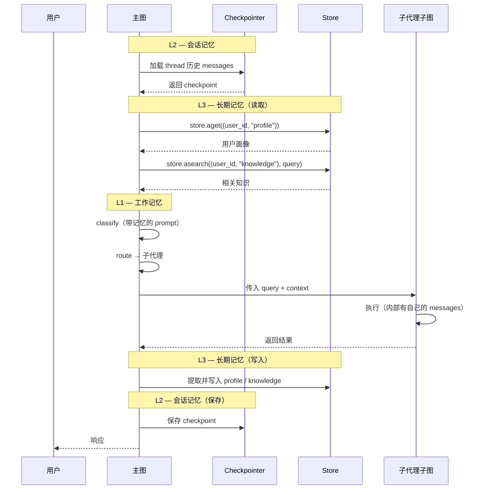

# ArtiPivot 记忆系统设计

> 版本: 0.1.0 | 日期: 2026-05-13 | 状态: 草稿
> 基于 LangGraph v1.2 + LangChain v1.3 的记忆能力

---

## 1. 记忆分层模型

ArtiPivot 的记忆系统分为三层，对应 LangChain/LangGraph 的三种持久化机制：

```
┌─────────────────────────────────────────────────────┐
│  L3 — 长期记忆 (Long-term Memory)                    │
│  LangGraph Store (跨 thread)                         │
│  用户画像、偏好、知识积累                              │
│  生命周期：永久，按 namespace 组织                     │
│  后端：PostgresStore / InMemoryStore                 │
├─────────────────────────────────────────────────────┤
│  L2 — 会话记忆 (Session Memory)                      │
│  LangGraph Checkpointer (per-thread)                 │
│  对话消息历史、图执行快照                              │
│  生命周期：会话内持续，随 thread 存在                  │
│  后端：AsyncPostgresSaver / InMemorySaver            │
├─────────────────────────────────────────────────────┤
│  L1 — 工作记忆 (Working Memory)                      │
│  LangGraph State (图内存，无持久化)                   │
│  当前意图、活跃子代理、中间产物                        │
│  生命周期：单次 invoke / stream 调用                  │
│  后端：图 State（TypedDict + Reducer）               │
└─────────────────────────────────────────────────────┘
```

---

## 2. L1 — 工作记忆（图 State）

工作记忆是图的 State 本身，每次调用时初始化，调用结束后随 Checkpointer 持久化到 L2。

### 2.1 主图 State

```python
class ArtiPivotState(TypedDict):
    # ── 消息流（核心） ──
    messages: Annotated[list[AnyMessage], add_messages]

    # ── 路由决策（单次调用有效） ──
    intent: str | None
    confidence: float
    active_agent: str | None

    # ── 请求元数据 ──
    metadata: dict   # {user_id, session_id, trace_id, ...}
```

### 2.2 子代理 State

```python
class SubAgentState(MessagesState):
    query: str                    # 主图传入的任务
    artifacts: Annotated[list[str], operator.add]  # 中间产物累积
```

子代理继承 `MessagesState`，自带 `messages` 字段和 `add_messages` reducer。

### 2.3 上下文注入

```python
@dataclass
class AgentContext:
    user_id: str
    thread_id: str
    model_provider: str
    model_name: str
    available_tools: list[str]
```

通过 `StateGraph(State, context_schema=AgentContext)` 注入，节点函数签名接收 `runtime: Runtime[AgentContext]`。

### 2.4 设计要点

| 要点 | 决策 | 原因 |
|---|---|---|
| messages 使用 `add_messages` reducer | `Annotated[list[AnyMessage], add_messages]` | 支持按 ID 覆盖、追加、删除，兼容 human-in-the-loop |
| 子代理独立消息流 | 子图有自己的 `messages` 字段 | 隔离子代理内部对话，不污染主图 |
| 主图 → 子图的消息传递 | 通过节点包装函数映射 | 主图 `messages` 最后一条 → 子图 `query` |
| DeltaChannel | 长对话线程启用 `DeltaChannel` | langgraph v1.2 新特性，减少 checkpoint 体积 |

---

## 3. L2 — 会话记忆（Checkpointer）

会话记忆通过 `Checkpointer` 持久化到数据库，支持多轮对话、中断恢复、时间旅行。

### 3.1 配置方式

```python
from langgraph.checkpoint.postgres.aio import AsyncPostgresSaver

checkpointer = AsyncPostgresSaver.from_conn_string(DB_URI)
await checkpointer.setup()

graph = root_builder.compile(
    checkpointer=checkpointer,   # 会话记忆
    store=store,                 # 长期记忆
)
```

### 3.2 调用方式

每次调用必须提供 `thread_id`：

```python
config = {"configurable": {"thread_id": "thread_abc123"}}

# 第一轮
graph.invoke({"messages": [{"role": "user", "content": "帮我写个排序函数"}]}, config)

# 第二轮（同一 thread，自动加载历史）
graph.invoke({"messages": [{"role": "user", "content": "改成降序"}]}, config)
```

### 3.3 子图持久化策略

不同类型的子代理使用不同的持久化模式：

| 子代理类型 | checkpointer | 模式 | 原因 |
|---|---|---|---|
| 通用子代理（编程式） | `None`（默认） | per-invocation | 每次调用独立，支持 interrupt |
| 需要多轮记忆的子代理 | `True` | per-thread | 跨调用积累上下文（如研究助手） |
| 纯函数式子代理 | `False` | stateless | 无状态，零开销 |

```python
# 编程式 — per-invocation（默认）
subgraph = builder.compile()  # checkpointer=None

# 需要多轮记忆 — per-thread
subgraph = builder.compile(checkpointer=True)

# 纯函数 — stateless
subgraph = builder.compile(checkpointer=False)
```

### 3.4 上下文窗口管理

长对话会导致消息超出模型上下文窗口。LangChain 提供 `SummarizationMiddleware` 自动处理：

```python
from langchain.agents.middleware import SummarizationMiddleware

agent = create_agent(
    model="anthropic:claude-sonnet-4-6",
    tools=[...],
    middleware=[
        SummarizationMiddleware(
            model="anthropic:claude-haiku-4-5-20251001",   # 用小模型做摘要
            trigger=("tokens", 100000),   # token 数超过阈值时触发
            keep=("messages", 20),        # 保留最近 20 条消息
        )
    ],
    checkpointer=checkpointer,
)
```

**策略选择：**

| 策略 | 适用场景 | LangChain 原语 |
|---|---|---|
| **摘要压缩**（推荐） | 需要保留语义信息 | `SummarizationMiddleware` |
| 截断 | 简单场景、丢弃旧消息可接受 | `@before_model` + `RemoveMessage` |
| 删除 | 清理敏感信息 | `@after_model` + `RemoveMessage` |

### 3.5 子代理声明中指定记忆策略

在 `agent.yaml` 中声明记忆配置：

```yaml
memory:
  # 会话记忆模式
  session: per-invocation    # per-invocation | per-thread | stateless

  # 上下文窗口管理
  context_window:
    strategy: summarize          # summarize | trim | none
    trigger_tokens: 100000       # 触发阈值
    keep_messages: 20            # 保留条数
    summary_model: claude-haiku-4-5-20251001  # 摘要用的小模型
```

---

## 4. L3 — 长期记忆（Store）

长期记忆通过 LangGraph `Store` 实现，跨 thread 持久化，支持语义搜索。

### 4.1 Namespace 设计

记忆按层级 namespace 组织：

```
(user_id, "profile")         → 用户画像（姓名、语言、偏好）
(user_id, "knowledge")       → 用户知识积累（从对话中提取的事实）
(user_id, "preferences")     → 交互偏好（风格、格式）
(user_id, "agent", agent_name) → 子代理专属记忆（按代理隔离）
```

### 4.2 记忆类型

| 类型 | 说明 | Namespace | 示例 |
|---|---|---|---|
| **Profile** | 用户基本信息 | `(user_id, "profile")` | `{"name": "张三", "language": "Python", "level": "senior"}` |
| **Knowledge** | 对话中提取的事实 | `(user_id, "knowledge")` | `{"fact": "张三的项目用 FastAPI"}` |
| **Preference** | 交互偏好 | `(user_id, "preferences")` | `{"style": "简洁", "format": "markdown"}` |
| **Agent Memory** | 子代理专属上下文 | `(user_id, "agent", name)` | `{"last_project": "artipivot"}` |

### 4.3 Store 配置

```python
from langgraph.store.postgres import PostgresStore
from langchain.embeddings import init_embeddings

store = PostgresStore.from_conn_string(
    DB_URI,
    index={
        "embed": init_embeddings("openai:text-embedding-3-small"),
        "dims": 1536,
        "fields": ["$"],  # 对所有字段建立向量索引
    },
)
await store.setup()
```

### 4.4 记忆写入（对话结束时提取）

在主图的 `respond` 节点中，响应完成后提取并存储长期记忆：

```python
async def respond(state: ArtiPivotState, runtime: Runtime[AgentContext]):
    user_id = runtime.context.user_id

    # 1. 从最新对话中提取用户画像 / 偏好更新
    profile_updates = await extract_profile(state["messages"], runtime)
    if profile_updates:
        await runtime.store.aput(
            (user_id, "profile"),
            "main",
            profile_updates,
        )

    # 2. 提取知识性记忆
    knowledge = await extract_knowledge(state["messages"], runtime)
    for k in knowledge:
        await runtime.store.aput(
            (user_id, "knowledge"),
            str(uuid.uuid4()),
            {"fact": k},
        )

    # 3. 格式化响应
    return {"messages": [format_response(state)]}
```

### 4.5 记忆读取（对话开始时注入）

在主图的 `classify` 节点中，将长期记忆注入到 LLM 的 system prompt：

```python
async def classify(state: ArtiPivotState, runtime: Runtime[AgentContext]):
    user_id = runtime.context.user_id

    # 检索用户画像
    profile = await runtime.store.aget((user_id, "profile"), "main")
    profile_text = profile.value if profile else ""

    # 语义搜索相关知识
    knowledge_items = await runtime.store.asearch(
        (user_id, "knowledge"),
        query=state["messages"][-1].content,
        limit=3,
    )
    knowledge_text = "\n".join([item.value["fact"] for item in knowledge_items])

    # 构建带记忆的 prompt
    enriched_prompt = f"""用户画像：{profile_text}
    相关知识：{knowledge_text}
    用户消息：{state["messages"][-1].content}"""

    # LLM 分类...
```

### 4.6 子代理的长期记忆

子代理声明中指定需要哪些长期记忆：

```yaml
memory:
  long_term:
    read:
      - profile        # 读取用户画像
      - knowledge      # 读取用户知识
      - agent:self     # 读取本代理专属记忆
    write:
      - agent:self     # 写入本代理专属记忆
```

框架根据声明自动注入记忆到子代理的 system prompt。

---

## 5. 主图 ↔ 子图记忆传递

主图与子图之间的记忆传递是架构的关键环节：

```
┌────────────────────────────────────────────────────┐
│  主图                                               │
│                                                    │
│  State.messages ─────────────┐                     │
│  State.metadata ─────────────┤                     │
│                              ▼                     │
│                     ┌─────────────────┐            │
│                     │  包装节点函数    │            │
│                     │  (call_subgraph) │            │
│                     └────────┬────────┘            │
│                              │                     │
│    Store.profile ────────────┤                     │
│    Store.knowledge ──────────┤                     │
│                              ▼                     │
│                     ┌─────────────────┐            │
│                     │  子代理子图      │            │
│                     │                 │            │
│                     │  SubAgentState  │            │
│                     │  .query  ← 主图 │            │
│                     │  .messages ← 独 │            │
│                     │    立消息流      │            │
│                     └─────────────────┘            │
└────────────────────────────────────────────────────┘
```

### 5.1 传入：主图 → 子图

```python
def call_subgraph(state: ArtiPivotState, runtime: Runtime[AgentContext]):
    """包装函数：映射主图 State → 子图 State"""

    # 1. 主图最后一条用户消息作为子图 query
    last_user_msg = state["messages"][-1].content

    # 2. 传入子图
    subgraph_output = subgraph.invoke(
        {
            "query": last_user_msg,
            "messages": state["messages"],  # 可选：传入完整历史
        },
    )

    # 3. 映射回主图
    return {"messages": subgraph_output["messages"]}
```

### 5.2 传出：子图 → 主图

子图执行完毕后，返回的消息通过包装节点函数写回主图 State。子图的 `artifacts` 可以通过主图 metadata 传递给其他子代理。

---

## 6. 记忆流全景



---

## 7. 记忆相关配置汇总

### 7.1 主图配置

```python
graph = root_builder.compile(
    checkpointer=AsyncPostgresSaver(DB_URI),   # L2
    store=PostgresStore(DB_URI, index=...),    # L3
)
```

### 7.2 子代理 YAML 声明

```yaml
memory:
  # L2 — 会话记忆
  session: per-invocation       # per-invocation | per-thread | stateless

  # L2 — 上下文窗口管理
  context_window:
    strategy: summarize          # summarize | trim | none
    trigger_tokens: 100000
    keep_messages: 20
    summary_model: claude-haiku-4-5-20251001

  # L3 — 长期记忆
  long_term:
    read:
      - profile
      - knowledge
      - agent:self
    write:
      - agent:self
```

### 7.3 Store 索引配置（langgraph.json）

```json
{
  "store": {
    "index": {
      "embed": "openai:text-embedding-3-small",
      "dims": 1536,
      "fields": ["$"]
    }
  }
}
```

---

## 8. 实现阶段

| 阶段 | 范围 | 涉及的 LangGraph/LangChain API |
|---|---|---|
| **P0** | `MessagesState` + `add_messages` reducer + `InMemorySaver` | L1 + L2 内存版 |
| **P1** | `SummarizationMiddleware` + 上下文窗口管理 | L2 上下文管理 |
| **P2** | `PostgresStore` + namespace 设计 + 语义搜索 | L3 长期记忆 |
| **P3** | 记忆提取/写入节点 + 子代理记忆声明 | L3 读写自动化 |
| **P4** | 子代理 `per-thread` 模式 + 跨调用记忆 | L2 多轮子代理 |
