# LangGraph 层级模型 & ArtiPivot 对应关系

```mermaid
graph TB
    subgraph L4["第四层：Agent / Workflow 模式"]
        direction LR
        A1["ReAct<br/>think ⇄ tools 循环"]
        A2["Function Calling<br/>llm → tools → END"]
        A3["DSL 管线<br/>llm#1 → tools → llm#2 → END"]
        A4["Orchestrator-Worker<br/>classify → 动态分派子 Agent"]
    end

    subgraph L3["第三层：子图 Subgraph"]
        direction LR
        S1["直接挂载<br/>add_node('name', compiled_graph)<br/>——<br/>父图和子图共享 state key"]
        S2["函数包裹<br/>add_node('name', wrapper_fn)<br/>——<br/>父图和子图 state 不同，手动映射"]
        S3["嵌套子图<br/>父图 → 子图 → 孙图<br/>——<br/>每层独立命名空间"]
    end

    subgraph L2["第二层：图 StateGraph → CompiledStateGraph"]
        direction LR
        G1["build_root_graph()<br/>主 Agent 图<br/>classify → route → sub-agent → respond"]
        G2["build_dsl_graph()<br/>DSL 子 Agent 图<br/>researcher → tools → summarizer → END"]
        G3["build_react_graph()<br/>ReAct 子 Agent 图<br/>think → tools → think → ... → END"]
    end

    subgraph L1["第一层：原子单元 Node & Edge"]
        direction LR
        N1["Node = Python 函数<br/>def node(state) → dict<br/>——<br/>classify / clarify / fallback / respond<br/>llm_node / tool_node"]
        N2["Edge = 连接线<br/>add_edge(A, B)        固定边<br/>add_conditional_edges() 条件边<br/>——<br/>route_by_intent()<br/>has_tool_calls()"]
    end

    L1 --> L2 --> L3 --> L4

    style L1 fill:#dceefb,stroke:#1565c0,color:#000
    style L2 fill:#d5f5d5,stroke:#2e7d32,color:#000
    style L3 fill:#fff4d0,stroke:#ef6c00,color:#000
    style L4 fill:#e8d5f5,stroke:#6a1b9a,color:#000
```



## 每一层的核心技术细节

### 第一层：Node & Edge — 不可再分的原子

```
Node = 接收 state，返回 state 更新的 Python 函数
       async def xxx(state, runtime) → dict

Edge = 决定执行顺序的连线
       固定边：A 之后永远是 B
       条件边：A 之后根据 state 的值决定走 B / C / D
```

**ArtiPivot 中的 Node 实例：**

| Node | 类型 | 做了什么 |
|------|------|---------|
| `classify` | LLM 调用 | 发 prompt 给 LLM，解析 JSON，提取 intent + confidence |
| `clarify` | 纯逻辑 | 返回 "抱歉，我不太确定您的意思..." |
| `fallback` | 纯逻辑 | 返回 "抱歉，我暂时无法处理..." |
| `respond` | 纯逻辑 | passthrough，不修改消息 |
| Sub-agent (ReAct) | 编译图 | 完整的 think→tools 循环 |
| Sub-agent (DSL) | 编译图 | 完整的 n 节点管线 |
| DSL `llm` | LLM 调用 | 一次 LLM 推理，可选绑工具 |
| DSL `tool` | 工具调用 | 执行单个工具 |
| DSL `tools` | ToolNode | 批量执行消息中的 tool_calls |

**ArtiPivot 中的 Edge 实例：**

| Edge | 类型 | 逻辑 |
|------|------|------|
| `START → classify` | 固定 | 入口 |
| `classify → ???` | 条件 | `route_by_intent()` 读 state["intent"] 和 confidence |
| `clarify → END` | 固定 | 澄清后直接返回 |
| `sub-agent → respond` | 固定 | 子 Agent 完成后格式化 |
| `respond → END` | 固定 | 结束 |

### 第二层：StateGraph — 把 Node 和 Edge 组装成图

```python
# 主 Agent 图
builder = StateGraph(ArtiPivotState, context_schema=AgentContext)

# 注册节点
builder.add_node("classify", _classify)
builder.add_node("clarify", _clarify)
builder.add_node("sub_agent_name", compiled_sub_agent)  # ← 第三层的子图

# 连线
builder.add_edge(START, "classify")
builder.add_conditional_edges("classify", _route)       # → clarify / sub_agent
builder.add_edge("sub_agent_name", "respond")

# 编译
graph = builder.compile(checkpointer=...)               # ← CompiledStateGraph
```

编译后的 `CompiledStateGraph` 就可以 `invoke() / astream() / stream_events()`。

### 第三层：Subgraph — 图套图

```
              主 Agent 图 (ArtiPivotState)
              ┌──────────────────────────┐
              │  classify                │
              │    ↓                     │
              │  route_by_intent         │
              │    ↓                     │
              │  ┌──────────────────┐    │
              │  │ 子 Agent 图       │    │  ← 这是一个完整的 CompiledStateGraph
              │  │ (SubAgentState)   │    │    作为"节点"挂在主 Agent 图中
              │  │  think → tools    │    │
              │  │    ↑       ↓      │    │    有自己的 state schema
              │  │    └──循环──┘     │    │    有自己的 checkpointer
              │  └──────────────────┘    │
              │    ↓                     │
              │  respond                 │
              │    ↓                     │
              │  END                     │
              └──────────────────────────┘
```

两种挂载方式：

| | 直接挂载 add_node(name, graph) | 函数包裹 add_node(name, wrapper) |
|---|---|---|
| State schema | 父图和子图共享 key | 父图和子图 state 不同 |
| 用法 | `builder.add_node("coder", coder_graph)` | `builder.add_node("coder", lambda s: coder.invoke({...}))` |
| ArtiPivot 哪里用 | 主 Agent 挂子 Agent | DSL 的 sub_agent 节点 |

### 第四层：Agent / Workflow — 图的执行模式

```
Workflow（固定路径）                  Agent（动态循环）
───────────────                       ──────────────

START                                 START
  ↓                                     ↓
llm#1 "研究"                          think (LLM 推理)
  ↓                                     ↓
tools "收集数据"                      有 tool_calls? ──→ tools (执行)
  ↓                                    ↑                  ↓
llm#2 "总结"                           └──── 循环 ────────┘
  ↓                                  无 tool_calls
llm#3 "格式化"                          ↓
  ↓                                   END
END

= DSL 管线                           = ReAct / FC
```

## 对应到 ArtiPivot 的完整架构

```
┌─────────────────────────────────────────────────────────┐
│                    AgentGateway                          │
│        按 agent_id 分发 → 多个主 Agent 图并行运行          │
│                                                         │
│  ┌─────────────────────┐  ┌─────────────────────────┐   │
│  │   chat_agent        │  │   code_agent            │   │
│  │                     │  │                         │   │
│  │  classify           │  │  classify               │   │
│  │    ↓                │  │    ↓                    │   │
│  │  route ──→ clarify  │  │  route ──→ fallback     │   │
│  │    │                │  │    │                    │   │
│  │    ├──→ chat (ReAct)│  │    ├──→ code (ReAct)    │   │ ← 第三层：子图
│  │    └──→ time_helper │  │    └──→ analyzer (DSL)  │   │
│  │         (共享子Agent)│  │                         │   │
│  │    ↓                │  │    ↓                    │   │
│  │  respond            │  │  respond                │   │
│  └─────────────────────┘  └─────────────────────────┘   │
│                                                         │
│  ┌──────────────────────────────────────────────────┐   │
│  │            SubAgentRegistry (共享池)               │   │
│  │  time_helper = ReAct(e cho, current_time)         │   │ ← 第二层：编译图
│  │  code        = ReAct(e cho, current_time, file_io)│   │
│  │  analyzer    = DSL(researcher→tools→finalizer)    │   │
│  └──────────────────────────────────────────────────┘   │
└─────────────────────────────────────────────────────────┘

第一层：classify/route/clarify/fallback/respond 是原子 Node
第二层：每个子 Agent 是一个 CompiledStateGraph
第三层：子 Agent 作为 Node 挂在主 Agent 图中
第四层：ReAct = Agent 模式，DSL = Workflow 模式
```
