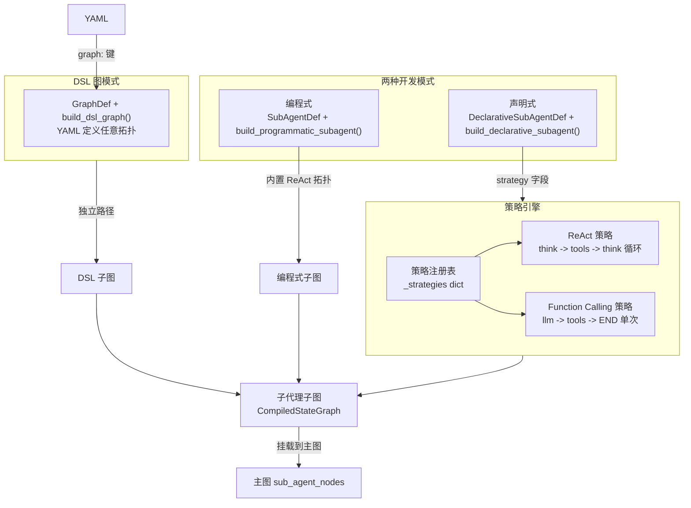

# 子代理系统（Agents）

## 架构总览



## 文件布局

| 文件 | 职责 |
|------|------|
| `agents/base.py` | `SubAgentDef` 数据类 -- 子代理的基础定义 |
| `agents/programmatic.py` | `build_programmatic_subagent()` -- 编程式构建，内置 ReAct 拓扑 |
| `agents/declarative.py` | `DeclarativeSubAgentDef` + `build_declarative_subagent()` -- 声明式策略选择 |
| `agents/strategies/base.py` | `Strategy` ABC -- 所有策略的抽象基类 |
| `agents/strategies/__init__.py` | 策略注册表：`register_strategy()`、`get_strategy()`、`available_strategies()` |
| `agents/strategies/react.py` | `ReActStrategy` -- 思考-行动-观察循环 |
| `agents/strategies/function_calling.py` | `FunctionCallingStrategy` -- 单次调用 |

## SubAgentDef 数据类

所有子代理的基础数据结构，定义在 `agents/base.py`：

```python
@dataclass
class SubAgentDef:
    name: str               # 子代理名称
    tools: list[str]        # 工具名称列表
    system_prompt: str = ""
    max_iterations: int = 10  # 默认最大迭代次数
```

`max_iterations` 默认值为 **10**。编程式子代理和 ReAct 策略均使用此值作为循环上限。

## 编程式子代理

定义在 `agents/programmatic.py`。直接调用 `build_programmatic_subagent()` 构建图，不经过策略注册表。

```python
from artipivot.agents.base import SubAgentDef
from artipivot.agents.programmatic import build_programmatic_subagent

sub_def = SubAgentDef(
    name="code_writer",
    tools=["web_search", "code_exec", "file_io"],
    system_prompt="你是一个专业的编程助手...",
    max_iterations=10,
)
sub_graph = build_programmatic_subagent(sub_def, tool_node)
```

图拓扑：

```
START -> llm_call -> should_continue? -> tools -> llm_call (循环)
                        |
                        +------------------> END
```

- `should_continue`：检查最后一条消息是否包含 `tool_calls`，有则路由到 `tools` 节点，否则到 `END`。
- `llm_call` 节点：从 `AgentContext` 获取模型，支持运行时通过 `ConfigCenter` 动态查找 prompt（优先级：`config_center.prompts.get(agent_id, "system", sub_name=sub_name)` > `sub_def.system_prompt`）。
- 无迭代次数上限保护，依赖 LLM 不再产生 `tool_calls` 自然终止。如需上限保护，应使用声明式 + ReAct 策略。

## 声明式子代理

定义在 `agents/declarative.py`。通过策略注册表选择策略来构建图。

```python
from artipivot.agents.declarative import DeclarativeSubAgentDef, build_declarative_subagent

defn = DeclarativeSubAgentDef(
    name="code_writer",
    strategy="react",              # "react" | "function_calling"
    tools=["web_search", "code_exec"],
    system_prompt="You are a coding assistant.",
    strategy_config={"max_iterations": 5},
)
sub_graph = build_declarative_subagent(defn, tool_node)
```

`DeclarativeSubAgentDef` 数据类：

| 字段 | 类型 | 说明 |
|------|------|------|
| `name` | `str` | 子代理名称 |
| `strategy` | `str` | 策略名称，"react" 或 "function_calling" |
| `tools` | `list[str]` | 工具名称列表 |
| `system_prompt` | `str` | 系统提示词，默认空字符串 |
| `strategy_config` | `dict` | 策略配置，如 `{"max_iterations": 5}`，默认空字典 |

`build_declarative_subagent()` 内部会 import `react` 和 `function_calling` 策略模块以触发自动注册，然后调用 `get_strategy(defn.strategy)` 获取策略实例。

## 策略注册表

定义在 `agents/strategies/__init__.py`。

```python
# 私有注册字典
_strategies: dict[str, type[Strategy]] = {}

def register_strategy(name: str, strategy_cls: type[Strategy]) -> None
def get_strategy(name: str) -> Strategy
def available_strategies() -> list[str]
```

- `register_strategy(name, cls)`：将策略类注册到 `_strategies` 字典。
- `get_strategy(name)`：返回策略类的**实例**。如果名称不存在，抛出 `ValueError`，错误消息包含所有可用策略列表。
- `available_strategies()`：返回已注册策略名称列表。

**自动注册机制**：`react.py` 和 `function_calling.py` 在模块末尾各自调用 `register_strategy()`。`build_declarative_subagent()` 通过 `import` 这两个模块来触发注册。

## Strategy 抽象基类

定义在 `agents/strategies/base.py`：

```python
from abc import ABC, abstractmethod

class Strategy(ABC):
    @abstractmethod
    def build(
        self,
        sub_def: SubAgentDef,
        tool_node: ToolNode,
        *,
        config: dict | None = None,
    ) -> CompiledStateGraph:
        ...
```

所有策略必须实现 `build()` 方法，接收 `SubAgentDef`、`ToolNode` 和可选的 `config` 字典，返回编译后的子图。

## 两种策略对比

| 策略 | 注册名 | 拓扑 | 适用场景 | strategy_config |
|------|--------|------|----------|-----------------|
| ReAct | `"react"` | think -> tools -> think 循环 | 复杂多步推理 | `max_iterations`（默认取自 `SubAgentDef.max_iterations`，即 10） |
| Function Calling | `"function_calling"` | llm -> tools -> END 单次 | 简单查询/转换 | 无 |

### ReAct 策略

定义在 `agents/strategies/react.py`，类名 `ReActStrategy`。

```
START -> llm_call -> should_continue? -> tools -> llm_call (循环)
                        |
                        +---------> END (无 tool_calls 或达到 max_iterations)
```

关键行为：

- `max_iterations` 解析优先级：`strategy_config.get("max_iterations")` > `sub_def.max_iterations`（默认 10）。
- `should_continue` 先检查迭代次数，达到上限直接返回 `END`，不再检查 `tool_calls`。
- 首次调用时通过 `bind(sub_name=..., strategy="react")` 和 `log.info("sub_agent.start")` 记录日志。
- 支持 `ConfigCenter` 运行时 prompt 覆盖。
- 每次迭代通过 `bind(iteration=state["iterations"])` 注入迭代号到日志上下文。

### Function Calling 策略

定义在 `agents/strategies/function_calling.py`，类名 `FunctionCallingStrategy`。

```
START -> llm_call -> should_use_tool? -> tools -> END
                        |
                        +---------> END (无 tool_calls)
```

关键行为：

- 单次调用，`tools` 节点后直接到 `END`，**不会循环回** `llm_call`。这是与 ReAct 的核心区别。
- `should_use_tool`：检查最后一条消息是否包含 `tool_calls`。
- 日志中额外记录 `tool_call_names` 和 `sub_agent.end`。

## 自定义策略

```python
from artipivot.agents.strategies.base import Strategy
from artipivot.agents.strategies import register_strategy

class MyStrategy(Strategy):
    def build(self, sub_def, tool_node, *, config=None):
        # 构建自定义图拓扑
        builder = StateGraph(SubAgentState)
        # ... 添加节点和边 ...
        return builder.compile()

# 注册到策略注册表
register_strategy("my_strategy", MyStrategy)
```

注册后即可在 `DeclarativeSubAgentDef` 中通过 `strategy="my_strategy"` 引用。

## YAML 加载器


```python
) -> dict[str, DeclarativeSubAgentDef | GraphDef]:
```

返回类型为 `dict[str, DeclarativeSubAgentDef | GraphDef]`，支持两种定义方式：

1. **策略模式**（`strategy:` 键）：解析为 `DeclarativeSubAgentDef`。
2. **DSL 图模式**（`graph:` 键）：调用 `parse_graph_def(name, cfg["graph"])` 解析为 `GraphDef`。

加载逻辑：

- 如果 YAML 文件不存在或 `sub_agents` 键为空，返回空字典。
- 遍历 `sub_agents` 下每个条目，检查是否包含 `graph` 键来决定解析路径。
- 策略模式的字段映射：`strategy`、`tools`（默认 `[]`）、`system_prompt`（默认 `""`）、`strategy_config`（默认 `{}`）。

### YAML 配置示例

**策略模式**：

```yaml
sub_agents:
  code_writer:
    strategy: react
    tools: [web_search, code_exec, file_io]
    system_prompt: "You are a professional coding assistant."
    strategy_config:
      max_iterations: 5
```

**DSL 图模式**：

```yaml
sub_agents:
  custom_agent:
    graph:
      nodes:
        thinker:
          type: llm
          system_prompt: "Think step by step"
          tools: [search]
        executor:
          type: tools
      edges:
        - from: START
          to: thinker
        - from: thinker
          to: executor
          condition:
            builtin: has_tool_calls
          targets: [executor, END]
        - from: executor
          to: END
      max_iterations: 5
```

DSL 图模式的完整文档参见 `graph/dsl.py` 及对应模块文档。

## 三种构建路径对比

| 路径 | 入口 | 图拓扑 | 配置方式 |
|------|------|--------|----------|
| 编程式 | `build_programmatic_subagent()` | 固定 ReAct 循环 | Python 代码 |
| 声明式 + 策略 | `build_declarative_subagent()` | 由策略决定 | YAML + 策略名 |
| 声明式 + DSL | `build_dsl_graph()` | YAML 自定义任意拓扑 | YAML `graph:` 键 |

## 运行时 Prompt 覆盖

所有构建路径（编程式、ReAct 策略、Function Calling 策略）均支持通过 `ConfigCenter` 运行时覆盖系统提示词：

```python
# 在 llm_call 节点内部
if ctx.config_center:
    prompt_cfg = ctx.config_center.prompts.get(
        ctx.agent_id, "system", sub_name=sub_name
    )
    system_prompt = prompt_cfg.get("system", default_prompt)
```

查找优先级：`ConfigCenter` 查询结果 > `sub_def.system_prompt` 默认值。

## 可观测性

所有子代理通过 `artipivot.observability` 的 `log` 和 `bind` 进行结构化日志记录：

- `sub_agent.start`：首次进入 `llm_call` 时记录，附带 `sub_name` 和 `strategy`。
- `llm.call`：每次 LLM 调用前记录 `messages_count`。
- `llm.response`：每次 LLM 响应后记录 `tool_calls` 数量。
- `sub_agent.end`：Function Calling 策略在结束时额外记录。

ReAct 策略额外通过 `bind(iteration=...)` 将当前迭代号注入日志上下文。
