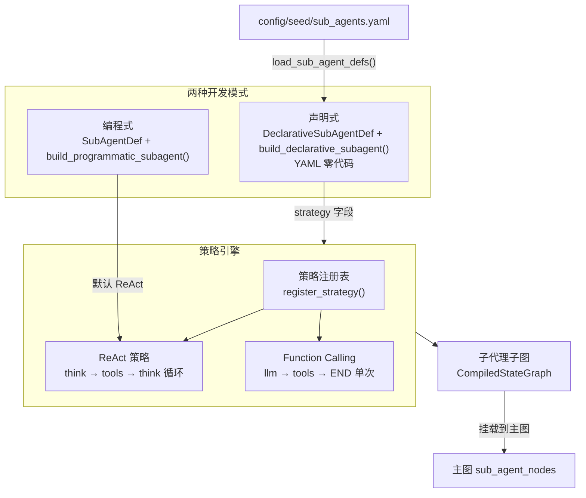

# 子代理系统（Agents）

## 架构



## 编程式子代理

```python
from artipivot.agents.base import SubAgentDef
from artipivot.agents.programmatic import build_programmatic_subagent

sub_def = SubAgentDef(
    name="code_writer",
    tools=["web_search", "code_exec", "file_io"],
    system_prompt="你是一个专业的编程助手...",
    max_iterations=10,
)
sub_graph = build_programmatic_subagent(sub_def, tool_node)
```

图拓扑：`START → llm_call → should_continue? → {tools → llm_call 循环, END}`

## 声明式子代理

```python
from artipivot.agents.declarative import DeclarativeSubAgentDef, build_declarative_subagent

defn = DeclarativeSubAgentDef(
    name="code_writer",
    strategy="react",              # react | function_calling
    tools=["web_search", "code_exec"],
    system_prompt="You are a coding assistant.",
    strategy_config={"max_iterations": 5},
)
sub_graph = build_declarative_subagent(defn, tool_node)
```

## 两种策略对比

| 策略 | 拓扑 | 适用场景 | strategy_config |
|------|------|----------|-----------------|
| `react` | think → tools → think（循环） | 复杂多步推理 | `max_iterations`（默认 10） |
| `function_calling` | llm → tools → END（单次） | 简单查询/转换 | 无 |

## 自定义策略

```python
from artipivot.agents.strategies.base import Strategy, register_strategy

class MyStrategy(Strategy):
    def build(self, sub_def, tool_node, *, config=None):
        # 构建自定义图拓扑
        ...

register_strategy("my_strategy", MyStrategy)
```

## YAML 配置

```yaml
# config/seed/sub_agents.yaml
sub_agents:
  code_writer:
    strategy: react
    tools: [web_search, code_exec, file_io]
    system_prompt: "You are a professional coding assistant."
    strategy_config:
      max_iterations: 5
```
