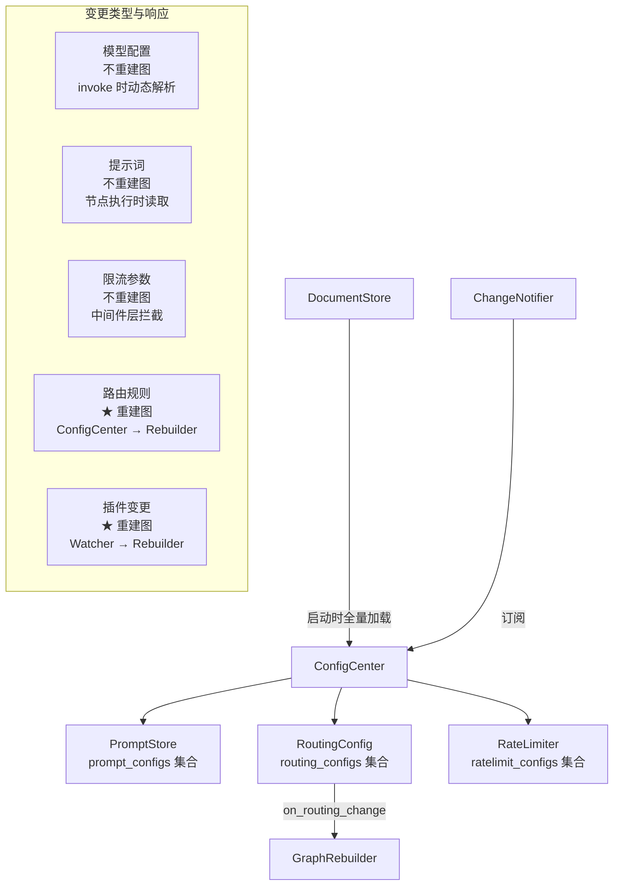

# 动态配置中心（ConfigCenter）

## 架构



## 配置分类

| 配置类型 | 重建图 | 管理方式 |
|----------|:------:|----------|
| 模型配置 | 否 | `model_provider.update_*()` |
| 提示词 | 否 | `prompt_configs` 集合 |
| 限流参数 | 否 | `ratelimit_configs` 集合 |
| 路由规则 | **是** | `routing_configs` → ConfigCenter 回调 → Rebuilder |
| 插件变更 | **是** | PluginManager → ChangeNotifier → PluginWatcher → Rebuilder |

## 路由配置

```yaml
# config/seed/routing.yaml
agents:
  code_agent:
    confidence_threshold: 0.7
    intents:
      - name: code_write
        sub_agent: code_writer
        description: 代码编写相关
    fallback: fallback
    clarify: clarify
```

路由逻辑：`classify → {confidence < threshold? → clarify, intent 匹配? → 子代理, 否则 → fallback}`

## 提示词配置

```yaml
# config/seed/prompts.yaml
prompts:
  "code_agent:classify":
    agent_id: code_agent
    node: classify
    system: |
      你是意图分类器...
  "code_agent:sub:code_writer":
    agent_id: code_agent
    node: sub_agent
    sub_agent: code_writer
    system: |
      你是专业编程助手...
```

读取方式：`config_center.prompts.get("code_agent", "classify")`

## 管理 API

```bash
PUT /admin/prompts/{agent_id}/{node}
PUT /admin/routing/{agent_id}
GET /admin/ratelimits
PUT /admin/ratelimits/agent/{agent_id}
PUT /admin/ratelimits/tool/{tool_name}
```
