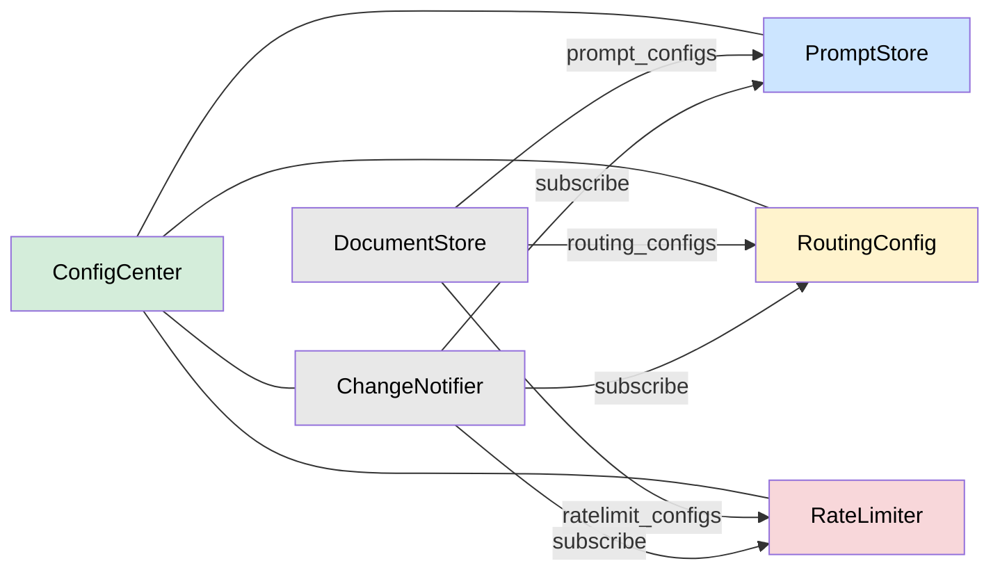
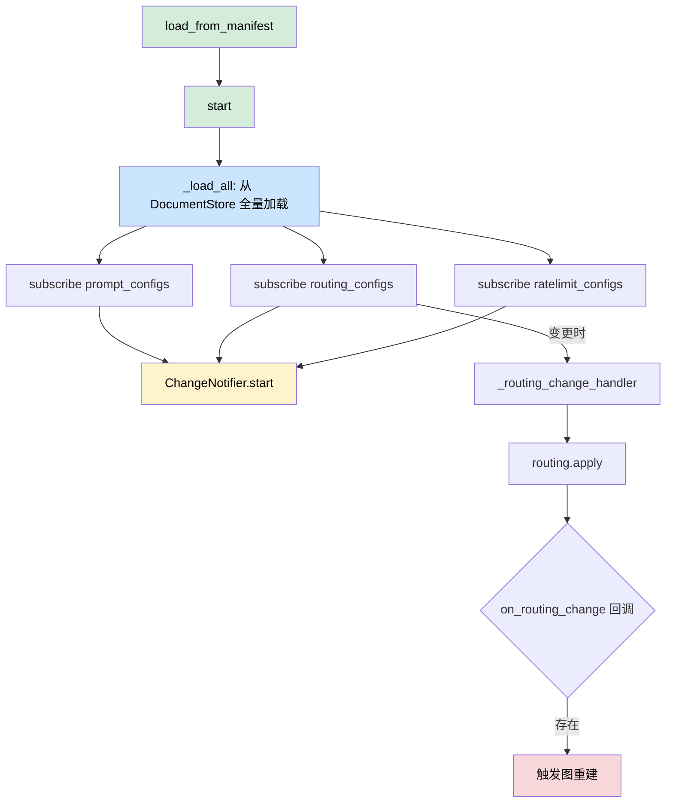

# 动态配置中心（config 模块）

ConfigCenter 统一管理提示词、路由、限流三类配置，从 DocumentStore 热读取，通过 ChangeNotifier 订阅变更。模型配置由独立的 `models/` 模块负责，不在此模块中。

## 模块组成

| 文件 | 类 | 职责 |
|------|-----|------|
| `center.py` | `ConfigCenter` | 统一入口，持有 PromptStore / RoutingConfig / RateLimiter 实例 |
| `prompts.py` | `PromptStore` | 提示词存储，线程安全，按 key 查询 |
| `routing.py` | `RoutingConfig` | 路由规则存储，变更触发图重建 |
| `ratelimit.py` | `RateLimiter`, `RateLimitConfig`, `RateLimitError` | 多维度限流（用户/Agent/工具） |

## 架构



## 配置分类

| 配置类型 | 重建图 | 更新方式 | 生效时机 |
|----------|:------:|----------|----------|
| 提示词 | 否 | DocumentStore / Admin API | 下次节点执行 |
| 限流参数 | 否 | DocumentStore / Admin API | 下次请求 |
| 路由规则 | **是** | DocumentStore / Admin API → ConfigCenter 回调 | 重建后 |

---

## ConfigCenter（center.py）

统一入口，持有三个子组件并协调生命周期。

### 构造

```python
ConfigCenter(
    store: DocumentStore,
    notifier: ChangeNotifier,
    *,
    on_routing_change=None,       # 可选回调，路由变更时触发（用于图重建）
)
```

### 属性

| 属性 | 类型 | 说明 |
|------|------|------|
| `prompts` | `PromptStore` | 提示词存储 |
| `routing` | `RoutingConfig` | 路由规则 |
| `rate_limits` | `RateLimiter` | 限流器 |

### 公开方法

#### `load_from_manifest(manifest) -> None`

从 `AgentManifest`（启动时由 `gateway/loader.py` 生成）直接填充路由和提示词配置，不经过 DocumentStore。

遍历 `manifest.agents` 中每个 `agent_def`：

- **路由**：若 `agent_def.intent_map` 非空，构造如下结构写入 `self.routing._configs[agent_id]`：
  ```python
  {
      "agent_id": agent_id,
      "confidence_threshold": agent_def.confidence_threshold,
      "intents": [
          {"name": intent, "sub_agent": sub_name, "description": ...}
          for intent, sub_name in agent_def.intent_map.items()
      ],
  }
  ```
- **提示词**：遍历 `agent_def.prompts`，以 `f"{agent_id}:{node_name}"` 为 key 写入 `self.prompts._prompts`。

#### `async start() -> None`

启动流程：先调用 `_load_all()` 从 DocumentStore 全量加载已有配置，再订阅三个 collection 的变更通知，最后启动 ChangeNotifier。

订阅关系：

| collection | 回调 |
|------------|------|
| `prompt_configs` | `self.prompts.apply` |
| `routing_configs` | `self._routing_change_handler`（内部先调用 `self.routing.apply`，再调用 `on_routing_change` 回调） |
| `ratelimit_configs` | `self.rate_limits.apply` |

### 私有方法

#### `async _routing_change_handler(collection, key, action, data) -> None`

路由变更处理器：先调用 `self.routing.apply()` 更新配置，若构造时传入了 `on_routing_change` 回调则继续调用（用于触发图重建）。

#### `async _load_all() -> None`

从 DocumentStore 批量加载已有配置。依次查询 `prompt_configs`、`routing_configs`、`ratelimit_configs` 三个 collection，对每条文档调用对应组件的 `apply()` 方法。

```python
# 等价伪代码
for (collection, component) in [
    ("prompt_configs", self.prompts),
    ("routing_configs", self.routing),
    ("ratelimit_configs", self.rate_limits),
]:
    docs = await store.query(collection, {})
    for doc in docs:
        await component.apply(collection, doc["_id"], "load", doc)
```

---

## PromptStore（prompts.py）

线程安全的提示词存储，内部使用 `dict[str, dict]` + `threading.RLock`。

### 方法

#### `get(agent_id, node, sub_name=None) -> dict`

查询提示词。key 格式：

- 有子代理时：`f"{agent_id}:{sub_name}:{node}"`
- 无子代理时：`f"{agent_id}:{node}"`

未找到返回空字典 `{}`。

#### `async apply(collection, key, action, data) -> None`

ChangeNotifier 回调。加锁后将 `data` 写入 `_prompts`，key 取 `data.get("_id", key)`。

---

## RoutingConfig（routing.py）

路由规则存储，变更时需触发图重建。内部使用 `dict[str, dict]` + `threading.RLock`，以 `agent_id` 为 key。

### 方法

#### `get_intent_map(agent_id) -> dict[str, str]`

返回意图名称到子代理名称的映射。从配置的 `intents` 列表中提取 `{"intent_name": "sub_agent_name"}`。

#### `get_intent_descriptions(agent_id) -> dict[str, str]`

返回意图名称到描述文本的映射。无描述的意图返回空字符串。

#### `get_threshold(agent_id) -> float`

返回置信度阈值，默认 `0.7`。

#### `async apply(collection, key, action, data) -> None`

ChangeNotifier 回调。加锁后以 `data.get("agent_id", key)` 为 key 存储。

### 配置结构

每个 agent 的路由配置格式：

```python
{
    "agent_id": "code_agent",
    "confidence_threshold": 0.7,
    "intents": [
        {"name": "code_write", "sub_agent": "code_writer", "description": "代码编写"},
        {"name": "code_review", "sub_agent": "code_reviewer", "description": "代码审查"},
    ],
}
```

路由逻辑：`classify → 置信度 < threshold → clarify / 匹配到 intent → 对应子代理 / 无匹配 → fallback`

---

## RateLimiter（ratelimit.py）

多维度滑动窗口限流器，支持用户级、Agent 级、工具级 RPM 限制。

### 相关类

#### `RateLimitConfig`

数据类，持有三层配置：

| 字段 | 类型 | 说明 | 默认值 |
|------|------|------|--------|
| `defaults` | `dict` | 全局限流参数 | `user_rpm=60`, `agent_rpm=600`, `tool_rpm=120`, `tool_timeout_ms=30000` |
| `agent_overrides` | `dict[str, dict]` | Agent 级覆盖 | 空 |
| `tool_overrides` | `dict[str, dict]` | 工具级覆盖 | 空 |

`get_merged(agent_id=None, tool_name=None) -> dict`：依次合并 defaults → agent_overrides → tool_overrides，后者覆盖前者。

#### `RateLimitError(Exception)`

限流超限时抛出的异常。

#### `_SlidingWindow`

内存滑动窗口计数器，基于 `time.monotonic()` 实现。按 key 维护请求时间戳列表，自动清理过期记录。

- `count(key, window_sec=60.0) -> int`：统计当前窗口内请求数
- `record(key)`：记录一次请求

### RateLimiter 类

#### 构造

```python
RateLimiter(
    store: DocumentStore | None = None,
    notifier: ChangeNotifier | None = None,
)
```

#### 属性

| 属性 | 类型 | 说明 |
|------|------|------|
| `config` | `RateLimitConfig` | 当前限流配置（只读） |

#### `async check(agent_id, user_id, tool_name=None) -> None`

检查限流，超限抛出 `RateLimitError`。检查顺序：

1. **用户级 RPM**：key 为 `user:{agent_id}:{user_id}`，限制 `user_rpm`
2. **Agent 级 RPM**：key 为 `agent:{agent_id}`，限制 `agent_rpm`
3. **工具级 RPM**（可选）：key 为 `tool:{tool_name}`，限制 `tool_rpm`

全部通过后记录三个维度的时间戳。

#### `async apply(collection, key, action, data) -> None`

ChangeNotifier 回调。根据 `data["scope"]` 字段分发到不同层级：

| scope 值 | 行为 |
|----------|------|
| `"global"` | 更新 `config.defaults` |
| `"agent"` | 以 `data.get("agent_id", key)` 为 key 更新 `config.agent_overrides` |
| `"tool"` | 以 `data.get("tool_name", key)` 为 key 更新 `config.tool_overrides` |

---

## DocumentStore 中的配置集合

| Collection | Key 格式 | 内容 | 示例 |
|------------|----------|------|------|
| `prompt_configs` | `{agent_id}:{node}` | 节点提示词 | `code_agent:classify` |
| `prompt_configs` | `{agent_id}:{sub_name}:{node}` | 子代理提示词 | `code_agent:code_writer:think` |
| `routing_configs` | `{agent_id}` | 路由规则 | `code_agent` |
| `ratelimit_configs` | `scope=global` / `scope=agent:{agent_id}` / `scope=tool:{tool_name}` | 限流配置 | 见 RateLimiter.apply |

---

## 热更新流程

ConfigCenter 启动时经历两个阶段：



1. **启动阶段**：`load_from_manifest()` 从 YAML manifest 填充初始路由和提示词配置
2. **DocumentStore 加载**：`_load_all()` 从存储中加载已有配置（覆盖或补充 manifest 数据）
3. **订阅变更**：注册三个 collection 的 ChangeNotifier 回调
4. **运行时**：通过 Admin API 修改 → DocumentStore.put() → ChangeNotifier.notify() → 对应回调自动触发

注意：**提示词和限流的热更新不需要重建图**，只有路由规则变更才通过 `on_routing_change` 回调触发图重建。
