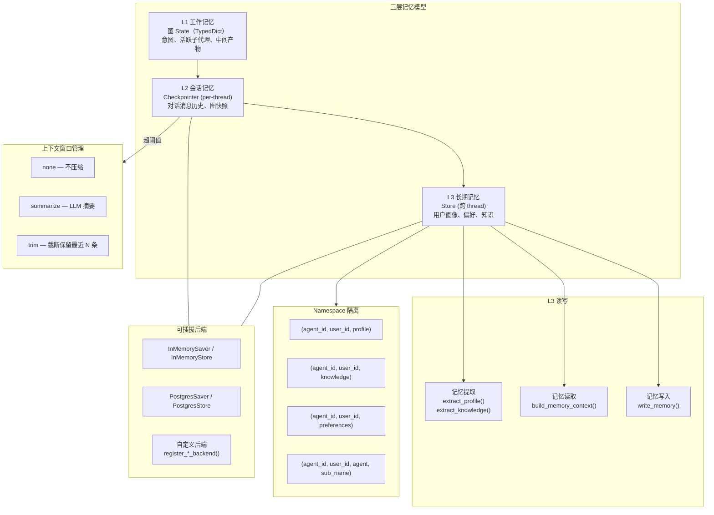

# 记忆系统（Memory）

## 架构



## 三层记忆

| 层级 | 机制 | 内容 |
|------|------|------|
| L1 | 图 State | 意图、活跃子代理、中间产物 |
| L2 | Checkpointer (per-thread) | 对话消息历史、图快照 |
| L3 | Store (跨 thread) | 用户画像、偏好、知识 |

## 可插拔后端

```python
from artipivot.memory.checkpointer import create_checkpointer, register_checkpointer_backend
from artipivot.memory.store import create_store, register_store_backend

cp = create_checkpointer("memory")
store = create_store("memory")

# 自定义后端
register_store_backend("mongodb", lambda **kw: MongoStore(kw["uri"]))
store = create_store("mongodb", uri="mongodb://localhost:27017")
```

## Namespace 隔离

```python
from artipivot.memory.namespace import profile_ns, knowledge_ns, agent_memory_ns

profile_ns("code_agent", "user_123")              # ("code_agent", "user_123", "profile")
agent_memory_ns("code_agent", "user_123", "writer") # ("code_agent", "user_123", "agent", "writer")
```

## 记忆提取 + 写入

```python
from artipivot.memory.extraction import write_memory
await write_memory(store, agent_id, user_id, messages, model)
```

## 记忆读取 + 注入

```python
from artipivot.memory.retrieval import build_memory_context
context = await build_memory_context(store, agent_id, user_id, query)
```

## 上下文窗口管理

| 策略 | 说明 | 适用场景 |
|------|------|----------|
| `none` | 不压缩（默认） | 短对话 |
| `summarize` | LLM 摘要旧消息 | 长对话（推荐） |
| `trim` | 截断保留最近 N 条 | 不想调 LLM |

## 配置

```yaml
# config/seed/memory.yaml
memory:
  embedding:
    enabled: false
  context_window:
    strategy: none
    trigger_tokens: 100000
    keep_messages: 20
```
