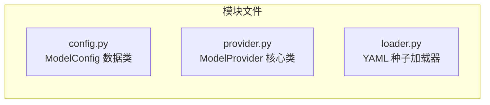
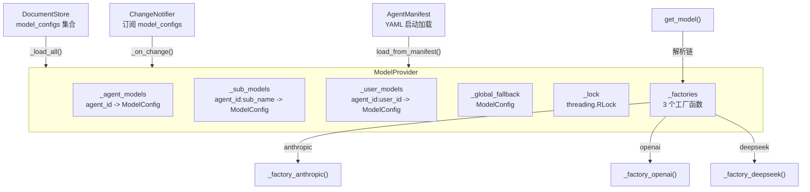
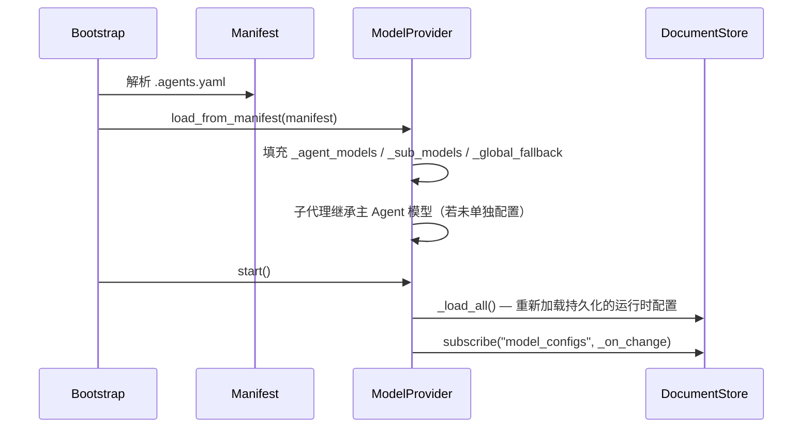

# 模型配置（models 模块）

## 模块总览



模块由三个文件组成：

- **`config.py`** -- `ModelConfig` 数据类，描述单个模型配置。
- **`provider.py`** -- `ModelProvider` 核心类，负责模型解析、fallback 链、工厂函数和运行时热更新。

## 架构图



## ModelConfig 数据结构

定义于 `config.py`，使用 `@dataclass`：

```python
@dataclass
class ModelConfig:
    provider: str                # "anthropic" | "openai" | "deepseek" 等
    name: str                    # "claude-sonnet-4-6" | "gpt-4o" | "deepseek-chat" 等
    temperature: float = 0.0
    timeout: int = 120
    max_tokens: int | None = None
    base_url: str | None = None  # 自定义 API 地址
    api_key: str | None = None   # 显式 key
    fallback: ModelConfig | None = field(default=None, repr=False)  # 递归 fallback
```

关键说明：

- `fallback` 字段支持递归嵌套，形成链式 fallback。
- `base_url` 用于适配兼容 OpenAI/Anthropic 协议的第三方服务。
- `api_key` 为显式传入的密钥，优先级高于环境变量。

## 三个模型工厂

`provider.py` 中注册了三个工厂函数，由 `ModelProvider._factories` 字典管理：

### 1. `_factory_anthropic(cfg) -> BaseChatModel`

- 使用 `langchain_anthropic.ChatAnthropic`。
- `base_url` 映射为 `anthropic_api_url`。
- `api_key` 映射为 `anthropic_api_key`。

### 2. `_factory_openai(cfg) -> BaseChatModel`

- 使用 `langchain_openai.ChatOpenAI`。
- 覆盖 OpenAI 以及所有 OpenAI 兼容的 API（如 DeepSeek 的 OpenAI 兼容端点）。
- `base_url` 直接透传。

### 3. `_factory_deepseek(cfg) -> BaseChatModel`

- 使用 `_PatchedChatDeepSeek`，这是一个运行时动态创建的子类，继承自 `langchain_deepseek.ChatDeepSeek`。
- `base_url` 映射为 `api_base`。

**`_PatchedChatDeepSeek` 的作用：** DeepSeek 的 thinking 模型在 `AIMessage.additional_kwargs` 中返回 `reasoning_content` 字段。上游的 `_convert_message_to_dict` 在构建下一个请求时会丢弃该字段，导致 400 错误。`_PatchedChatDeepSeek` 通过重写 `_get_request_payload()` 方法，将 `reasoning_content` 重新注入回请求 payload 中。

## 四级配置存储

`ModelProvider` 内部维护四个字典：

| 字典 | 键格式 | 用途 |
|------|--------|------|
| `_agent_models` | `agent_id` | Agent 级模型配置 |
| `_sub_models` | `agent_id:sub_name` | 子代理级模型配置 |
| `_user_models` | `agent_id:user_id` 或 `__global__:user_id` | 用户级模型配置 |
| `_global_fallback` | （单一对象） | 全局兜底模型 |

所有字典操作均在 `threading.RLock` 保护下执行。

## 模型解析与 fallback 链

### 解析顺序

`get_model(agent_id, sub_name=None, user_id=None)` 方法的解析顺序：

```
1. user:agent  — 用户+Agent 级配置  (_user_models["agent_id:user_id"])
2. user:global — 用户全局配置       (_user_models["__global__:user_id"])
3. agent       — Agent 级配置       (_agent_models["agent_id"])
4. global_fallback — 全局兜底       (_global_fallback)
```

作用域越精确优先级越高。如果所有层级都无法匹配，抛出 `ValueError`。

### Fallback 链构建

`_build_chain(cfg)` 构建一个 `ModelConfig` 列表：

1. 以解析到的配置为起点。
2. 沿 `fallback` 字段递归追加。
3. 如果链尾不是 `_global_fallback`，则追加全局兜底配置。

`get_model()` 遍历整个链，依次尝试工厂函数。如果某个配置的工厂调用失败（异常），自动尝试链中的下一个。全部失败则抛出 `RuntimeError`。

## 启动与热更新

### 启动流程



`load_from_manifest(manifest)` 在启动时从 `AgentManifest` 对象直接填充配置，不经过 `DocumentStore`。之后 `start()` 会从持久化存储加载运行时的 Admin API 变更（如果存在），并订阅后续变更通知。

### 热更新

模型配置变更**不需要重建图**，下一次 `invoke()` 自动使用新配置。

`_on_change()` 通过 `ChangeNotifier` 订阅 `model_configs` 集合的变更，在收到通知后调用 `_apply_doc()` 即时更新内存中的配置字典。

`_apply_doc(doc)` 根据 `doc["scope"]` 分发到不同字典：

| scope | 写入目标 |
|-------|----------|
| `"global"` | `_global_fallback` |
| `"agent"` | `_agent_models[agent_id]` |
| `"sub_agent"` | `_sub_models["agent_id:sub_name"]` |
| `"user"` | `_user_models["agent_id:user_id"]` |

## 管理 API

### Agent 级配置

```python
# 更新 Agent 模型
await model_provider.update_agent_model("code_agent", {
    "provider": "anthropic", "name": "claude-opus-4-6",
})
```

### 子代理级配置

```python
# 更新子代理模型
await model_provider.update_sub_model("code_agent", "code_writer", {
    "provider": "anthropic", "name": "claude-haiku-4-5-20251001",
})
```

### 用户级配置

```python
# 设置用户+Agent 级模型
await model_provider.update_user_model(
    user_id="user123",
    model={"provider": "openai", "name": "gpt-4o"},
    agent_id="code_agent",
)

# 设置用户全局模型（agent_id=None）
await model_provider.update_user_model(
    user_id="user123",
    model={"provider": "openai", "name": "gpt-4o"},
)

# 查询用户级配置
config = model_provider.get_user_model_config(user_id="user123", agent_id="code_agent")

# 删除用户级配置
await model_provider.delete_user_model(user_id="user123", agent_id="code_agent")
```

用户级方法说明：

- `update_user_model(user_id, model, agent_id=None)` -- 当 `agent_id=None` 时写入 `__global__` 域，表示该用户的全局模型偏好。
- `delete_user_model(user_id, agent_id=None)` -- 删除对应的用户配置，同时清理内存字典和持久化存储。
- `get_user_model_config(user_id, agent_id=None)` -- 读取当前用户级配置，仅查询内存，不涉及存储 I/O。

### 对应 HTTP 端点

```bash
GET  /admin/models/{agent_id}
PUT  /admin/models/{agent_id}
PUT  /admin/models/{agent_id}/{sub_agent}
PUT  /admin/models/global/fallback
```

## YAML 种子配置


### models.yaml 格式

```yaml
global:
  fallback_model:
    provider: openai
    name: gpt-4o

agents:
  code_agent:
    provider: anthropic
    name: claude-sonnet-4-6
    timeout: 120
    temperature: 0.0
    sub_agents:
      code_writer:
        provider: anthropic
        name: claude-sonnet-4-6
        fallback:
          provider: anthropic
          name: claude-haiku-4-5-20251001
```

注意：YAML 中的字段名为 `timeout`（非 `timeout_seconds`），与 `ModelConfig` 数据类字段名一致。

### agents.yaml 格式

`loader.py` 同时支持从 `agents.yaml` 单文件加载完整的 Agent 定义。其中 `model` 部分会被提取并写入 `model_configs` 集合。支持的模型字段：`provider`、`name`、`temperature`、`timeout`、`max_tokens`、`base_url`、`api_key`。

### 其他种子文件


- `routing.yaml` -> `routing_configs`
- `prompts.yaml` -> `prompt_configs`
- `sub_agents.yaml` -> `sub_agent_configs`

## API Key 配置

通过环境变量注入（推荐）：

```bash
ANTHROPIC_API_KEY=sk-ant-...
OPENAI_API_KEY=sk-...
DEEPSEEK_API_KEY=sk-...
```

`ModelConfig.api_key` 字段会明文存储在 `DocumentStore` 中。生产环境请使用环境变量注入，不要在 YAML 种子或 Admin API 请求中传递 `api_key` 字段。

## 接入新模型供应商

在 `provider.py` 中定义工厂函数并在 `__init__` 中注册：

```python
def _factory_my_provider(cfg: ModelConfig) -> BaseChatModel:
    from my_langchain_integration import ChatMyProvider
    return ChatMyProvider(
        model=cfg.name,
        temperature=cfg.temperature,
        timeout=cfg.timeout,
    )

# 在 ModelProvider.__init__ 的 _factories 字典中添加：
self._factories["my_provider"] = _factory_my_provider
```

工厂函数接收 `ModelConfig`，返回 `BaseChatModel` 实例。需要自行处理 `max_tokens`、`base_url`、`api_key` 等可选字段的映射。
