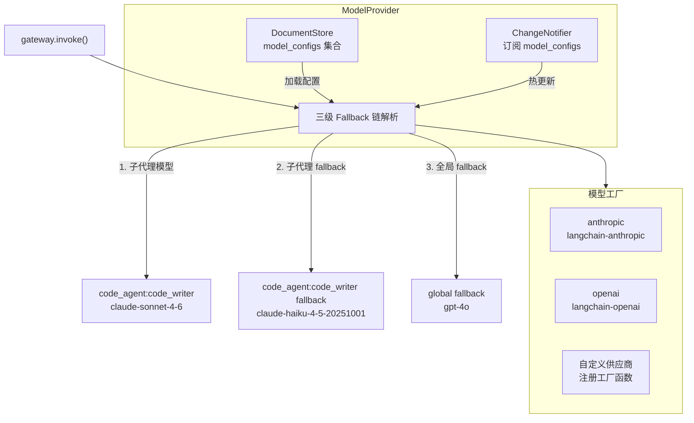

# 模型配置（ModelProvider）

## 架构



## ModelConfig 数据结构

```python
@dataclass
class ModelConfig:
    provider: str                # "anthropic" | "openai" | 自定义
    name: str                    # "claude-sonnet-4-6" | "gpt-4o" 等
    temperature: float = 0.0
    timeout: int = 120
    max_tokens: int | None = None
    base_url: str | None = None  # 自定义 API 地址（适配兼容供应商）
    api_key: str | None = None   # 显式 key（优先级高于环境变量）
    fallback: ModelConfig | None = None  # 递归 fallback
```

## YAML 种子配置

```yaml
# config/seed/models.yaml
global:
  fallback_model:
    provider: openai
    name: gpt-4o
  defaults:
    temperature: 0.0
    timeout_seconds: 120

agents:
  code_agent:
    provider: anthropic
    name: claude-sonnet-4-6
    sub_agents:
      code_writer:
        provider: anthropic
        name: claude-sonnet-4-6
        fallback:
          provider: anthropic
          name: claude-haiku-4-5-20251001
```

## 接入新模型供应商

```python
# 在 ModelProvider.__init__ 中注册工厂函数
def _factory_my_provider(cfg: ModelConfig) -> BaseChatModel:
    from my_langchain_integration import ChatMyProvider
    return ChatMyProvider(model=cfg.name, temperature=cfg.temperature)

self._factories["my_provider"] = _factory_my_provider
```

## API Key 配置

```bash
ANTHROPIC_API_KEY=sk-ant-...
OPENAI_API_KEY=sk-...
```

> **安全提示：** `ModelConfig.api_key` 字段会明文存储在 DocumentStore 中。生产环境请使用环境变量注入 key，不要在 YAML 种子或 Admin API 请求中传递 `api_key` 字段。框架在解析 key 时的优先级：环境变量 > 配置字段。

## 配置优先级

作用域越精确的配置优先级越高：

```
子代理配置 > Agent 配置 > 全局配置 > 全局 fallback
```

## 运行时动态切换

模型变更**不需要重建图**，下一次 `invoke()` 自动使用新配置。

通过 Admin API：
```bash
PUT /admin/models/code_agent
{"provider": "anthropic", "name": "claude-opus-4-6"}
```

通过 Python API：
```python
await model_provider.update_agent_model("code_agent", {
    "provider": "anthropic", "name": "claude-opus-4-6",
})
```

## 管理 API

```bash
GET  /admin/models/{agent_id}
PUT  /admin/models/{agent_id}
PUT  /admin/models/{agent_id}/{sub_agent}
PUT  /admin/models/global/fallback
```
