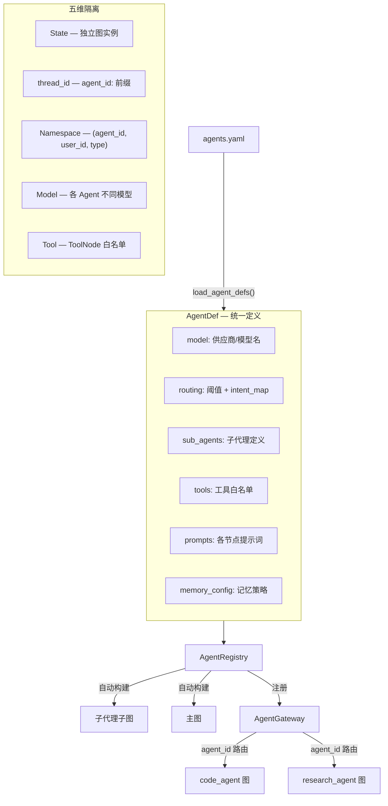

# 多主 Agent 系统（Multi-Agent）

## 架构



## AgentDef 统一定义

```python
from artipivot.gateway.agent_def import AgentDef

agent_def = AgentDef(
    agent_id="code_agent",
    model={"provider": "anthropic", "name": "claude-sonnet-4-6"},
    confidence_threshold=0.7,
    intent_map={"code_write": "code_writer", "debug": "code_writer"},
    declarative_sub_agents={
        "code_writer": DeclarativeSubAgentDef(
            name="code_writer", strategy="react",
            tools=["web_search", "code_exec"],
            system_prompt="You are a coding assistant.",
        )
    },
)
```

## AgentRegistry 自动构建

```python
from artipivot.gateway.registry import AgentRegistry

registry = AgentRegistry(gateway, graph_factory, tool_registry)
registry.register_def(agent_def, checkpointer=cp, store=store)
# 自动构建：子代理图 → 主图 → 注册到 Gateway

registry.list_agents()          # ["code_agent", "research_agent"]
registry.get_def("code_agent")  # AgentDef
```

## YAML 多 Agent 声明

```yaml
# config/seed/agents.yaml
agents:
  code_agent:
    model: {provider: anthropic, name: claude-sonnet-4-6}
    routing:
      confidence_threshold: 0.7
      intents: {code_write: code_writer, debug: code_writer}
    sub_agents:
      code_writer:
        strategy: react
        tools: [web_search, code_exec]
        system_prompt: "You are a coding assistant."
```

```python
from artipivot.gateway.loader import load_agent_defs
defs = load_agent_defs("config/seed")
for agent_def in defs.values():
    registry.register_def(agent_def, checkpointer=cp, store=store)
```

## 五维隔离

| 维度 | 机制 | 说明 |
|------|------|------|
| State | 独立图实例 | 每个 Agent 有自己的 CompiledStateGraph |
| thread_id | `agent_id:thread_id` 前缀 | Gateway 自动加前缀 |
| Namespace | `(agent_id, user_id, type)` | Store 长期记忆隔离 |
| Model | AgentDef.model | 各 Agent 不同模型 |
| Tool | ToolNode 白名单 | 各子代理工具互不可见 |

## GraphFactory 路由验证

构建时自动验证 routing 配置与子代理一致性，指向不存在的子代理立即报错。
