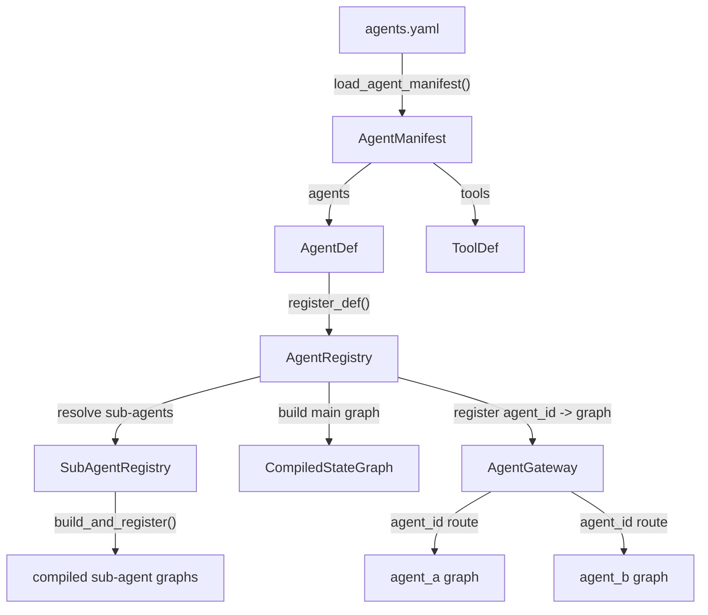
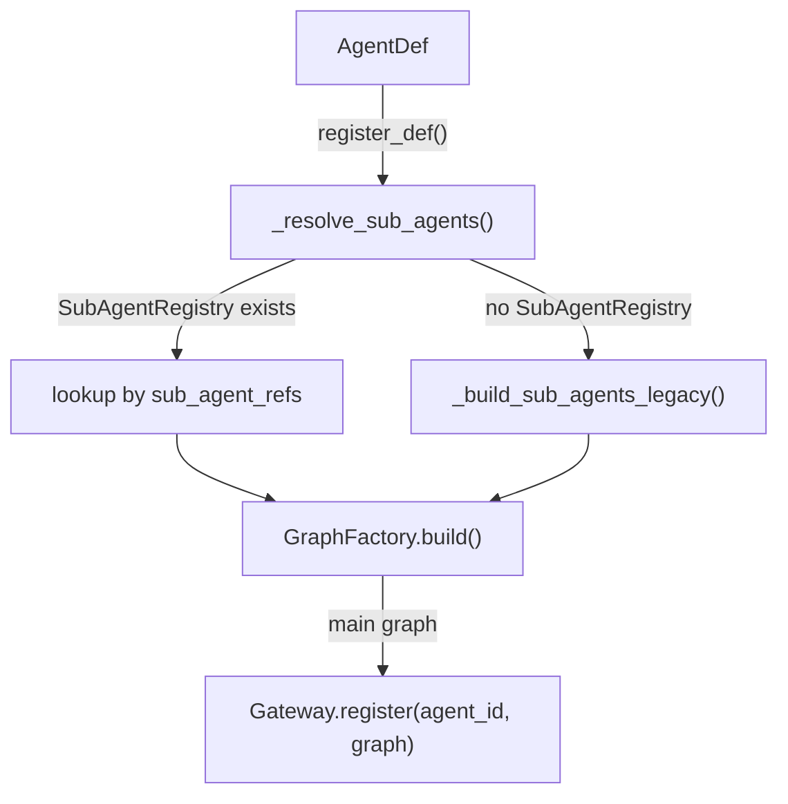
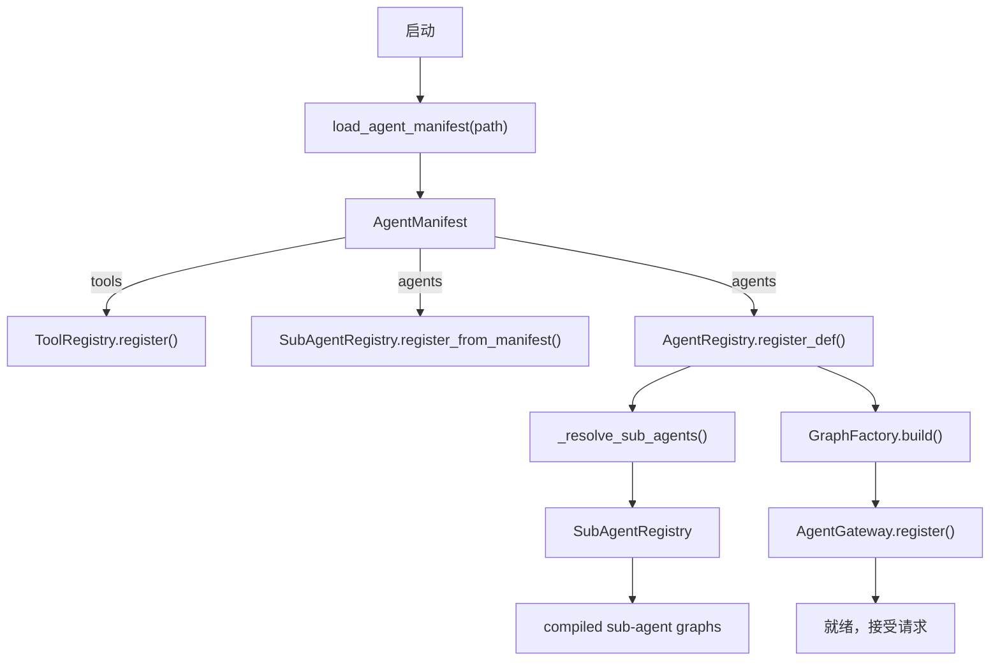

# 多主 Agent 系统（Multi-Agent）

`gateway/` 模块是多 Agent 编排的入口层，负责定义、加载、构建和调度多个独立的 Agent。每个 Agent 拥有自己的编译图（CompiledStateGraph），通过 `AgentGateway` 按 `agent_id` 路由请求。

## 模块总览

| 文件 | 核心类/函数 | 职责 |
|------|------------|------|
| `gateway/agent_def.py` | `AgentDef` | Agent 统一定义数据结构 |
| `gateway/loader.py` | `ToolDef`, `AgentManifest`, `load_agent_manifest()` | 从 YAML 加载 Agent 清单 |
| `gateway/registry.py` | `AgentRegistry` | Agent 生命周期管理（构建 + 注册） |
| `gateway/sub_agent_registry.py` | `SubAgentRegistry` | 子代理全局注册与去重 |
| `gateway/gateway.py` | `AgentGateway` | 运行时请求调度（invoke / stream） |

## 架构



## AgentDef 统一定义

`AgentDef`（`gateway/agent_def.py`）是一个 `dataclass`，包含构建一个完整 Agent 所需的全部信息。

### 字段说明

| 字段 | 类型 | 说明 |
|------|------|------|
| `agent_id` | `str` | Agent 唯一标识 |
| `model` | `dict` | 模型配置，如 `{"provider": "anthropic", "name": "claude-sonnet-4-6"}` |
| `confidence_threshold` | `float` | 路由置信度阈值，默认 0.7 |
| `intent_map` | `dict[str, str]` | 意图到子代理的映射，如 `{"code_write": "code_writer"}` |
| `intent_descriptions` | `dict[str, str]` | 意图描述文本，用于辅助分类 |
| `sub_agents` | `dict[str, SubAgentDef]` | 编程式子代理定义（旧式） |
| `declarative_sub_agents` | `dict[str, DeclarativeSubAgentDef]` | 声明式子代理定义 |
| `graph_sub_agents` | `dict[str, GraphDef]` | DSL 图子代理定义 |
| `sub_agent_refs` | `list[str]` | 子代理名称引用列表 |
| `tools` | `list[str]` | 该 Agent 的全局工具白名单 |
| `prompts` | `dict[str, str]` | 各节点提示词 |
| `memory_config` | `MemoryConfig` | 记忆策略配置 |

### 从字典构建

`AgentDef.from_dict(data)` 从 YAML 解析后的字典构建实例，自动处理：

- **intent 规范化**：支持简单字符串和带描述的富字典两种格式
- **子代理分类**：根据 `graph`/`strategy` 字段自动归入 `graph_sub_agents`、`declarative_sub_agents` 或 `sub_agents`
- **向后兼容**：从旧式字典键自动填充 `sub_agent_refs`

```python
from artipivot.gateway.agent_def import AgentDef

# 简单 intent 格式
# intents: {code_write: code_writer}
# 富 intent 格式
# intents:
#   code_write:
#     target: code_writer
#     description: "用户要求写代码"

agent_def = AgentDef.from_dict(yaml_data)
```

### 序列化

`to_dict()` 方法将 `AgentDef` 序列化为字典，子代理定义摘要为关键信息（工具列表、提示词、节点/边数量等）。

---

## 清单加载器（loader.py）

### ToolDef

```python
@dataclass
class ToolDef:
    name: str
    type: str = "builtin"       # "builtin" | "module"
    module: str | None = None   # type=module 时使用
    function: str | None = None # type=module 时使用
    config: dict = field(default_factory=dict)
```

### AgentManifest

```python
@dataclass
class AgentManifest:
    global_model: dict | None = None
    tools: list[ToolDef] = field(default_factory=list)
    agents: dict[str, AgentDef] = field(default_factory=dict)
```

包含全局模型配置、工具定义列表和所有 Agent 定义。是启动时的完整清单对象。

### load_agent_manifest()

```python
def load_agent_manifest(path: str | Path = ".agents.yaml") -> AgentManifest
```

**主要加载函数**。直接从 YAML 文件解析为 `AgentManifest`，不经过 DocumentStore。

- 默认路径为当前目录下的 `.agents.yaml`
- 可通过 `ARTIPIVOT_AGENTS_MANIFEST` 环境变量或 `--manifest` CLI 参数覆盖
- 如果传入目录，自动查找目录下的 `agents.yaml`
- 文件不存在或为空时返回空的 `AgentManifest`

### load_agent_defs()

```python
def load_agent_defs(path: str | Path = ".agents.yaml") -> dict[str, AgentDef]
```

向后兼容的包装函数，仅返回 `agent_id -> AgentDef` 映射。

---

## SubAgentRegistry（sub_agent_registry.py）

`SubAgentRegistry` 是子代理的全局注册中心，实现"构建一次、多处共享"。多个主 Agent 可以引用同一个子代理实例。

### 构造参数

| 参数 | 说明 |
|------|------|
| `tool_registry` | 工具注册中心（必填） |
| `model_provider` | 模型提供者（可选，DSL 图构建时使用） |

### 核心方法

| 方法 | 说明 |
|------|------|
| `register(name, graph, defn)` | 注册已编译的子代理图 |
| `get(name)` | 按名称获取编译后的子代理图 |
| `get_def(name)` | 按名称获取子代理定义 |
| `list_sub_agents()` | 列出所有已注册子代理名称 |
| `build_and_register(name, defn, *, checkpointer)` | 从定义构建并注册，支持去重 |
| `register_from_manifest(agents)` | 从 manifest 中发现并构建所有子代理 |

### 去重机制

`build_and_register()` 内部通过 `_make_cache_key()` 对定义进行哈希。相同定义的子代理会复用已编译的图，避免重复构建。哈希基于定义类型和关键参数：

- `GraphDef`：哈希节点类型/工具和边信息
- `DeclarativeSubAgentDef`：哈希策略、工具列表、策略配置
- `SubAgentDef`：哈希工具列表

### 支持的定义类型

`_build()` 方法根据定义类型分发构建：

- `GraphDef` -> `build_dsl_graph()`
- `DeclarativeSubAgentDef` -> `build_declarative_subagent()`
- `SubAgentDef` -> `build_programmatic_subagent()`

---

## AgentRegistry（registry.py）

`AgentRegistry` 是主 Agent 的生命周期管理器，负责将 `AgentDef` 解析为编译图并注册到 `AgentGateway`。

### 构造参数

| 参数 | 说明 |
|------|------|
| `gateway` | `AgentGateway` 实例（必填） |
| `graph_factory` | `GraphFactory` 实例（必填） |
| `tool_registry` | `ToolRegistry` 实例（必填） |
| `model_provider` | 模型提供者（可选） |
| `sub_agent_registry` | `SubAgentRegistry` 实例（可选） |

### 核心方法

| 方法 | 说明 |
|------|------|
| `register_def(agent_def, *, checkpointer, store)` | 注册 Agent：解析子代理 -> 构建主图 -> 注册到 Gateway |
| `get_def(agent_id)` | 按 agent_id 获取 AgentDef |
| `list_agents()` | 列出所有已注册的 agent_id |

### 子代理解析流程

`register_def()` 内部调用 `_resolve_sub_agents()` 解析子代理：

1. **有 SubAgentRegistry 时**：遍历 `agent_def.sub_agent_refs`，从 SubAgentRegistry 按名称查找。找不到时回退到旧式定义字典自动构建并注册。
2. **无 SubAgentRegistry 时（旧模式）**：直接从 `sub_agents`、`declarative_sub_agents`、`graph_sub_agents` 字典构建。

### register_def() 完整流程



---

## AgentGateway（gateway.py）

`AgentGateway` 是运行时请求调度层，维护 `agent_id -> CompiledStateGraph` 映射，提供同步调用和流式调用两种模式。

### 构造参数

| 参数 | 说明 |
|------|------|
| `model_provider` | `ModelProvider` 实例（必填） |
| `config_center` | 配置中心（可选关键字参数） |

### 核心方法

#### register()

```python
def register(self, agent_id: str, graph: CompiledStateGraph) -> None
```

注册一个 agent_id 对应的编译图。

#### invoke()

```python
async def invoke(
    self, agent_id: str, message: str, thread_id: str,
    *, user_id: str = "default_user",
) -> dict
```

同步调用（完整响应）。流程：

1. 验证 agent_id 是否已注册
2. 生成 trace_id，绑定上下文（agent_id, user_id, thread_id）
3. 通过 ModelProvider 获取模型实例
4. 构建 LangGraph 配置（thread_id, callbacks）
5. 构造 `AgentContext`，调用 `graph.ainvoke()`
6. 提取回复内容、intent、confidence 等信息
7. 记录日志和 OpenTelemetry 指标

thread_id 自动加 `agent_id:` 前缀，确保多 Agent 隔离。

#### stream()

```python
async def stream(
    self, agent_id: str, message: str, thread_id: str,
    *, user_id: str = "default_user",
)
```

流式调用。与 `invoke()` 流程类似，但使用 `graph.astream()` 异步迭代器逐步 yield 响应块。适用于需要实时输出的场景。

### 线程 ID 隔离

Gateway 自动将 thread_id 格式化为 `{agent_id}:{thread_id}`，确保不同 Agent 的会话状态互不干扰。

### 可观测性

每次请求自动：

- 生成唯一 trace_id 并通过 `bind_trace_id()` 注入 structlog 上下文
- 绑定 `model_name` 到上下文变量
- 通过 `GraphLoggingCallback` 记录图执行事件
- 请求完成后记录 `gateway.complete` 日志（含 duration_ms）
- 异常时记录 `gateway.error` 日志
- 通过 `otel.record_request_duration()` 记录 OpenTelemetry 指标
- 请求结束后通过 `clear_trace()` 清理上下文

---

## YAML 多 Agent 声明

### 示例

```yaml
# .agents.yaml
global:
  fallback_model:
    provider: openai
    name: gpt-4o

tools:
  web_search: builtin
  code_exec: builtin
  custom_tool:
    type: module
    module: my_tools.special
    function: do_something

agents:
  code_agent:
    model:
      provider: anthropic
      name: claude-sonnet-4-6
    routing:
      confidence_threshold: 0.7
      intents:
        code_write:
          target: code_writer
          description: "用户要求写代码或修改代码"
        debug:
          target: code_writer
          description: "用户遇到错误需要调试"
    sub_agents:
      code_writer:
        strategy: react
        tools: [web_search, code_exec]
        system_prompt: "You are a coding assistant."
        strategy_config:
          max_iterations: 10
    tools: [web_search, code_exec]
    prompts:
      classify: "分析用户意图..."
      respond: "整理回复..."
    memory:
      type: sliding_window
      max_messages: 50
```

### intent 格式

Routing 支持两种 intent 格式：

**简单格式**（纯字符串）：

```yaml
intents:
  code_write: code_writer
  debug: code_writer
```

**富格式**（字典，带描述）：

```yaml
intents:
  code_write:
    target: code_writer
    description: "用户要求写代码"
```

富格式的 `description` 会被提取到 `AgentDef.intent_descriptions` 中，辅助意图分类。

---

## 启动加载流程



核心步骤：

1. `load_agent_manifest()` 从 YAML 解析得到 `AgentManifest`
2. 工具注册到 `ToolRegistry`
3. 子代理通过 `SubAgentRegistry.register_from_manifest()` 批量构建并注册（含去重）
4. 各 Agent 通过 `AgentRegistry.register_def()` 依次注册
5. `AgentRegistry` 从 `SubAgentRegistry` 解析子代理引用，构建主图，注册到 `AgentGateway`
6. 系统就绪，`AgentGateway.invoke()` / `AgentGateway.stream()` 可接受请求

---

## 五维隔离

| 维度 | 机制 | 说明 |
|------|------|------|
| State | 独立图实例 | 每个 Agent 有自己的 CompiledStateGraph |
| thread_id | `agent_id:thread_id` 前缀 | Gateway 自动加前缀 |
| Namespace | `(agent_id, user_id, type)` | Store 长期记忆隔离 |
| Model | AgentDef.model | 各 Agent 不同模型 |
| Tool | ToolNode 白名单 | 各子代理工具互不可见 |
