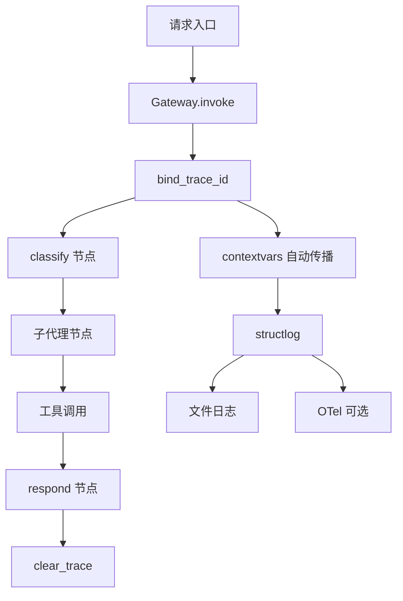

# 可观测性与 API（Observability + API）

## 可观测性架构



## 模块结构

| 文件 | 职责 |
|------|------|
| `observability/__init__.py` | 模块导出：`log`、`bind`、`configure_logging`、`GraphLoggingCallback` 等 |
| `observability/logging.py` | structlog 配置、日志文件管理、`serialize` 工具函数 |
| `observability/trace.py` | `bind_trace_id` / `clear_trace` / `generate_trace_id` |
| `observability/otel.py` | OpenTelemetry 可选集成（metrics + FastAPI 埋点） |
| `observability/callback.py` | `GraphLoggingCallback` — LangChain 回调，自动记录节点/LLM/工具事件 |

---

## 日志系统

### 公共 API

```python
from artipivot.observability import log, bind

# 绑定上下文（contextvars 自动传播到后续所有日志）
bind(sub_name="writer", strategy="react")
bind(iteration=1)

# 记录事件
log.info("sub_agent.start")
log.info("llm.call", model="claude-sonnet-4-6", messages_count=5)
log.error("gateway.error", error="timeout")
```

### 日志配置

```python
from artipivot.observability import configure_logging

configure_logging(
    log_dir="logs",        # 默认 "logs"，环境变量 ARTIPIVOT_LOG_DIR
    level="INFO",          # 默认 "INFO"，环境变量 ARTIPIVOT_LOG_LEVEL
    log_format="json",     # "json" 或 "text"，环境变量 ARTIPIVOT_LOG_FORMAT
    output="file",         # "file" / "console" / "both"，环境变量 ARTIPIVOT_LOG_OUTPUT
    tz="Asia/Shanghai",    # 默认 "Asia/Shanghai"，环境变量 ARTIPIVOT_LOG_TZ
)
```

### 日志文件

配置后产生两个日志文件，均使用 `TimedRotatingFileHandler` 按日轮转：

| 文件 | 级别 | 保留天数 | 说明 |
|------|------|----------|------|
| `logs/artipivot.log` | 由 `level` 参数控制（默认 INFO） | 30 天 | 全量日志 |
| `logs/error.log` | ERROR+ | 90 天 | 仅错误日志，用于告警 |

输出模式说明：
- `file`：仅写文件
- `console`：仅控制台输出
- `both`：文件 + 控制台
- 配置错误时回退到文件输出

### 日志格式

JSON 模式输出示例：

```json
{"timestamp":"2026-05-23T10:30:00+08:00","level":"info","event":"llm.call","trace_id":"a1b2c3d4","agent_id":"code_agent","model":"claude-sonnet-4-6","messages_count":5}
```

Text 模式输出示例：

```
2026-05-23T10:30:00+08:00 INFO  llm.call  model=claude-sonnet-4-6 messages_count=5
```

### 共享处理器链

```
merge_contextvars → add_log_level → timezone_timestamp
  → StackInfoRenderer → format_exc_info → UnicodeDecoder → mask_sensitive
```

敏感字段自动遮蔽：`api_key`、`token`、`authorization`、`password`、`secret` — 仅保留前 4 位，其余替换为 `***`。

### Trace 上下文

```python
from artipivot.observability import bind_trace_id, clear_trace, generate_trace_id

# 请求入口（Gateway 自动处理）
trace_id = generate_trace_id()  # uuid4 前 12 位
bind_trace_id(
    trace_id,
    agent_id="code_agent",
    user_id="alice",
    thread_id="s1",
    model_name="claude-sonnet-4-6",
)

# 请求结束（Gateway 自动处理）
clear_trace()
```

`bind_trace_id` 会先清空已有上下文再绑定新值。所有后续 `log` 调用自动携带 `trace_id`、`agent_id` 等字段。

### serialize 工具

```python
from artipivot.observability import serialize

# 安全序列化 LangChain Message 或任意对象
result = serialize(response, max_len=2000)
# Message → {"type": "AIMessage", "content": "..."}
# 其他 → str(obj)[:max_len]
```

---

## GraphLoggingCallback

`GraphLoggingCallback`（`observability/callback.py`）是 LangChain `BaseCallbackHandler` 实现，自动记录图执行的每个阶段：

| 事件 | 日志级别 | 记录内容 |
|------|----------|----------|
| `node.start` | DEBUG | 节点名称 |
| `node.end` | DEBUG | 节点名称、耗时（ms） |
| `node.error` | ERROR | 节点名称、耗时、错误信息 |
| `llm.input` / `llm.input_summary` | DEBUG / INFO | 消息内容 |
| `llm.end` / `llm.end_summary` | DEBUG / INFO | 耗时、token 用量、输出内容 |
| `llm.error` | ERROR | 错误信息 |
| `tool.start` | INFO | 工具名称 |
| `tool.end` | INFO | 耗时、输出摘要 |
| `tool.error` | ERROR | 错误信息 |

跳过的内部节点：`_start`、`_end`、`__start__`、`__end__`、`EntryPoint`、`ExitPoint`。

---

## OpenTelemetry（可选）

### 启用方式

```bash
OTEL_ENABLED=true
```

### 初始化

```python
from artipivot.observability.otel import setup_otel

setup_otel(app)  # 传入 FastAPI app，启用自动埋点
```

未启用时（默认），所有 `record_*` 函数为空操作，零开销。

### 采集的指标

| 指标名 | 类型 | 单位 | 说明 |
|--------|------|------|------|
| `artipivot.request.duration` | Histogram | ms | 请求总耗时 |
| `artipivot.classify.duration` | Histogram | ms | 意图分类耗时 |
| `artipivot.tool.duration` | Histogram | ms | 工具调用耗时 |
| `artipivot.tool.errors` | Counter | - | 工具调用错误数 |
| `artipivot.intent.classified` | Counter | - | 意图分类分布（按 intent 标签） |
| `artipivot.circuit.opens` | Counter | - | 熔断器打开次数 |

### 记录函数

```python
from artipivot.observability.otel import (
    is_enabled,
    record_request_duration,
    record_classify_duration,
    record_tool_duration,
    record_tool_error,
    record_intent,
    record_circuit_open,
)

record_request_duration(150.5, agent_id="code_agent")
record_intent("code_generation", agent_id="code_agent")
record_circuit_open("anthropic")
```

FastAPI 自动埋点在 `setup_otel(app)` 时启用，依赖 `opentelemetry-instrumentation-fastapi` 包（可选依赖）。

---

## REST API

### 应用入口

```python
# api/server.py — create_app()
app = FastAPI(title="ArtiPivot", version="0.5.0")
app.include_router(chat_router, prefix="/api/v1")
app.include_router(admin_router, prefix="/admin")
```

中间件：
- **CORS**：允许所有来源
- **Trace ID**：从请求头 `X-Trace-ID` 读取（缺省自动生成），写入响应头

### 依赖注入

所有共享组件通过 `api/deps.py` 的模块级单例管理：

| 访问器 | 返回类型 | 说明 |
|--------|----------|------|
| `get_gateway()` | `AgentGateway` | Agent 调用网关 |
| `get_config_center()` | `ConfigCenter` | 配置中心 |
| `get_plugin_manager()` | `PluginManager` | 插件管理器 |
| `get_rate_limiter()` | `RateLimiter` | 限流器 |
| `get_tool_registry()` | `ToolRegistry` | 工具注册表 |
| `get_agent_registry()` | `AgentRegistry` | Agent 注册表 |
| `get_sub_agent_registry()` | `SubAgentRegistry` | 子代理注册表 |

未初始化时调用会抛出 `RuntimeError("App not initialized")`。

### Chat API

```bash
POST /api/v1/chat/{agent_id}
Content-Type: application/json

{
  "message": "写个快速排序",
  "thread_id": "session_1",
  "user_id": "alice"
}
```

响应：

```json
{
  "response": "以下是快速排序的 Python 实现...",
  "thread_id": "session_1"
}
```

错误处理：
- 429：限流超限（`RateLimitError`）
- 404：Agent 不存在
- 500：内部错误

### Admin API

健康检查：

```bash
GET /health
GET /admin/health
```

插件管理：

```bash
# 列出插件（支持 agent_id / plugin_type / status 过滤）
GET /admin/plugins

# 发布插件
POST /admin/plugins
{
  "plugin_type": "sub_agent",
  "name": "writer",
  "version": "1.0.0",
  "agent_id": "code_agent",
  "manifest": {"strategy": "react", "tools": ["web_search"]}
}

# 废弃插件
DELETE /admin/plugins/{plugin_type}/{agent_id}/{name}
```

模型配置：

```bash
# 获取 Agent 模型信息
GET /admin/models/{agent_id}

# 设置用户级模型（指定 Agent）
PUT /admin/models/user/{user_id}/agent/{agent_id}
{
  "provider": "anthropic",
  "name": "claude-sonnet-4-6",
  "temperature": 0.0,
  "timeout": 120,
  "max_tokens": null,
  "base_url": null,
  "api_key": null
}

# 设置用户级全局模型（所有 Agent 生效）
PUT /admin/models/user/{user_id}

# 查询用户所有模型配置
GET /admin/models/user/{user_id}

# 删除用户级 Agent 模型配置
DELETE /admin/models/user/{user_id}/agent/{agent_id}
```

路由配置：

```bash
GET /admin/routing/{agent_id}
```

限流配置：

```bash
GET /admin/ratelimits

PUT /admin/ratelimits/agent/{agent_id}
{"scope": "agent", "overrides": {"user_rpm": 30, "agent_rpm": 100}}

PUT /admin/ratelimits/tool/{tool_name}
{"scope": "agent", "overrides": {"rpm": 50}}
```

Agent 动态注册：

```bash
# 列出所有 Agent
GET /admin/agents

# 获取 Agent 定义
GET /admin/agents/{agent_id}

# 动态注册新 Agent
POST /admin/agents
{
  "agent_id": "code_agent",
  "model": {},
  "sub_agent_refs": ["coder", "reviewer"],
  "routing": {"intents": {"code": "coder"}, "confidence_threshold": 0.7},
  "tools": ["web_search", "code_exec"],
  "prompts": {"system": "You are a coding assistant."}
}
```

图可视化：

```bash
GET /admin/graph/{agent_id}/mermaid      # Mermaid 流程图
GET /admin/graph/{agent_id}/structure    # JSON 结构
```

---

## 文件清单

| 文件 | 职责 |
|------|------|
| `observability/__init__.py` | 模块导出 |
| `observability/logging.py` | structlog 配置、文件轮转、`serialize` |
| `observability/trace.py` | trace_id 绑定与清理 |
| `observability/otel.py` | OpenTelemetry 可选集成 |
| `observability/callback.py` | `GraphLoggingCallback` 回调 |
| `api/__init__.py` | API 包 |
| `api/server.py` | `create_app()` — FastAPI 应用工厂 |
| `api/chat.py` | Chat API 端点 |
| `api/admin.py` | Admin API 端点 |
| `api/deps.py` | 共享组件依赖注入（单例模式） |
