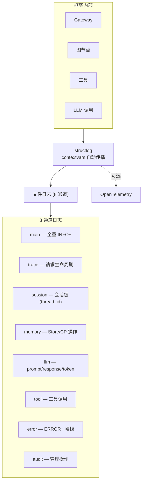
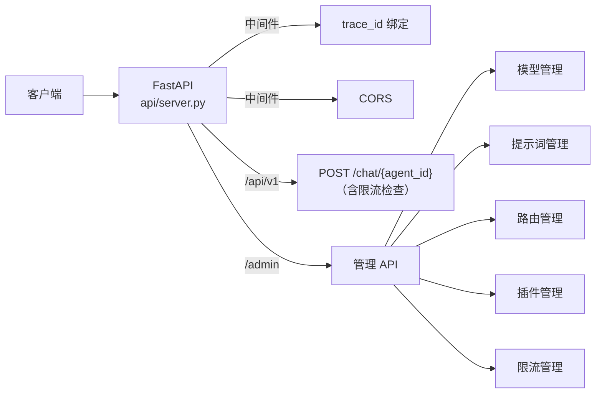

# 可观测性与 API（Observability + API + CLI）

## 可观测性架构



## 日志系统

```python
from artipivot.observability.logging import configure_logging, get_logger
from artipivot.observability.trace import bind_trace_id, generate_trace_id, clear_trace

configure_logging(log_dir="logs", level="INFO")
logger = get_logger("trace")

# 请求入口
trace_id = generate_trace_id()
bind_trace_id(trace_id, agent_id="code_agent", user_id="u1")
logger.info("request.start", message_length=100)
clear_trace()
```

## OpenTelemetry

可选导出，环境变量控制，未启用零影响：

```bash
OTEL_ENABLED=true
OTEL_EXPORTER_OTLP_ENDPOINT=http://otel-collector:4317
```

```python
from artipivot.observability.otel import setup_otel, record_request_duration
setup_otel(app)  # FastAPI 自动埋点
record_request_duration(100.0, agent_id="code_agent")
```

## REST API



启动：`artipivot serve --port 8000` 或 `uvicorn artipivot.api.server:create_app --factory`

### Chat 端点

```bash
POST /api/v1/chat/{agent_id}
{"message": "写个排序函数", "thread_id": "s1", "user_id": "u1"}
```

### 管理 API

```bash
# 插件
GET    /admin/plugins
POST   /admin/plugins
DELETE /admin/plugins/{type}/{agent_id}/{name}

# 路由
GET    /admin/routing/{agent_id}

# 限流
GET    /admin/ratelimits
PUT    /admin/ratelimits/agent/{agent_id}
PUT    /admin/ratelimits/tool/{tool_name}

# 健康检查
GET    /health
```

## CLI 工具

```bash
# 插件脚手架
artipivot plugin init my_plugin --template react
artipivot plugin publish my_plugin --agent-id code_agent

# 启动服务器
artipivot serve --host 0.0.0.0 --port 8000
```

## 完整接入示例

```python
import asyncio

async def main():
    from artipivot.storage.memory import InMemoryDocumentStore, InProcessNotifier
    store = InMemoryDocumentStore()
    notifier = InProcessNotifier()

    from artipivot.models.loader import load_seed_if_empty
    await load_seed_if_empty(store, "config/seed")

    from artipivot.models.provider import ModelProvider
    from artipivot.config.center import ConfigCenter
    model_provider = ModelProvider(store, notifier)
    await model_provider.start()
    config_center = ConfigCenter(store, notifier)
    await config_center.start()

    from artipivot.tools.registry import ToolRegistry
    from artipivot.tools.builtin.web_search import web_search
    from artipivot.tools.builtin.code_exec import code_exec
    tools = ToolRegistry({"web_search": web_search, "code_exec": code_exec})

    from artipivot.gateway.gateway import AgentGateway
    from artipivot.graph.factory import GraphFactory
    from artipivot.gateway.registry import AgentRegistry
    from artipivot.gateway.loader import load_agent_defs

    gateway = AgentGateway(model_provider)
    factory = GraphFactory(config_center)
    registry = AgentRegistry(gateway, factory, tools)

    agent_defs = load_agent_defs("config/seed")
    for agent_def in agent_defs.values():
        registry.register_def(agent_def)

    # 插件热重建（可选）
    from artipivot.plugins.manager import PluginManager, PluginDocument
    from artipivot.plugins.rebuilder import GraphRebuilder
    from artipivot.plugins.watcher import PluginWatcher

    pm = PluginManager(store, notifier)
    rebuilder = GraphRebuilder(gateway, factory, tools, pm)
    watcher = PluginWatcher(notifier, rebuilder)
    await watcher.start()
    await notifier.start()

    # 调用
    result = await gateway.invoke("code_agent", "写个排序函数", "session_1")
    print(result["messages"][-1].content)

asyncio.run(main())
```
