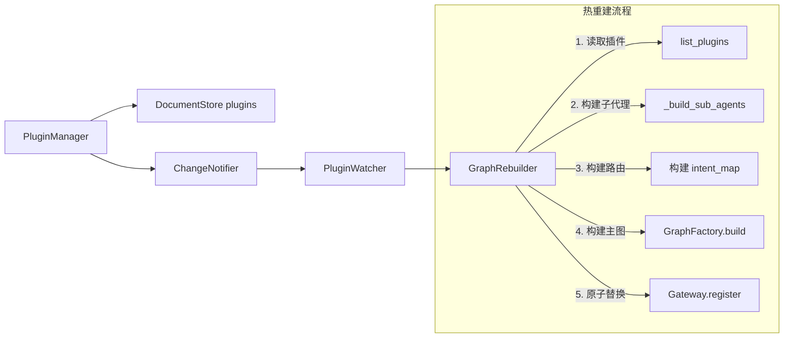

# 插件系统与图热重建

## 架构



## 插件元数据管理

### PluginDocument 字段

| 字段 | 类型 | 说明 |
|------|------|------|
| `plugin_type` | `str` | `"sub_agent"` / `"tool"` / `"pipeline"` |
| `name` | `str` | 插件名称（唯一标识的一部分） |
| `version` | `str` | 语义化版本号 |
| `agent_id` | `str` | 归属的 Agent |
| `manifest` | `dict` | 插件配置（strategy、tools、system_prompt 等） |
| `status` | `str` | `"active"` / `"inactive"` / `"deprecated"` |
| `created_at` | `str` | 发布时间（ISO 8601，自动设置） |
| `updated_at` | `str` | 更新时间（ISO 8601，自动设置） |

### PluginDocument 方法

**`key` 属性**：返回 DocumentStore 的键，格式为 `"{plugin_type}:{agent_id}:{name}"`。

**`to_dict() -> dict`**：将 PluginDocument 实例序列化为字典，包含所有字段。

**`from_dict(data: dict) -> PluginDocument`**（类方法）：从字典反序列化为 PluginDocument 实例。`manifest`、`status`、`created_at`、`updated_at` 有默认值。

### 发布与弃用

```python
from artipivot.plugins.manager import PluginManager, PluginDocument

pm = PluginManager(store, notifier)

plugin = PluginDocument(
    plugin_type="sub_agent",
    name="writer",
    version="1.0",
    agent_id="code_agent",
    manifest={
        "strategy": "react",
        "tools": ["web_search", "code_exec"],
        "system_prompt": "You are a coding assistant.",
        "strategy_config": {"max_iterations": 5},
    },
)
await pm.publish(plugin)  # 自动设置时间戳 + 触发 ChangeNotifier
```

查询、获取与弃用：

```python
# 查询插件列表（支持三个可选过滤参数）
plugins = await pm.list_plugins(agent_id="code_agent", plugin_type="sub_agent", status="active")

# 获取单个插件
plugin = await pm.get_plugin("sub_agent", "writer", "code_agent")

# 弃用插件
await pm.deprecate("sub_agent", "writer", "code_agent")
```

### PluginManager 接口

| 方法 | 参数 | 说明 |
|------|------|------|
| `publish(plugin)` | `PluginDocument` | 设置 `created_at`/`updated_at`、`status="active"`，写入 DocumentStore 并通知 |
| `deprecate(plugin_type, name, agent_id)` | 三个 `str` | 将 status 设为 `"deprecated"`，不存在则抛 `ValueError` |
| `list_plugins(...)` | `agent_id?`, `plugin_type?`, `status?`（均为可选，`status` 默认 `"active"`） | 按条件查询插件，返回 `list[PluginDocument]` |
| `get_plugin(plugin_type, name, agent_id)` | 三个 `str` | 获取单个插件，不存在返回 `None` |

## 图热重建

```python
from artipivot.plugins.rebuilder import GraphRebuilder

rebuilder = GraphRebuilder(
    gateway=gateway,          # AgentGateway
    graph_factory=factory,    # GraphFactory
    tool_registry=tools,      # ToolRegistry
    plugin_manager=pm,        # PluginManager
)
await rebuilder.rebuild_agent("code_agent")
```

### 重建流程（五步）

1. **读取插件**：调用 `list_plugins(agent_id, status="active")` 获取该 Agent 的所有活跃插件。
2. **构建子代理**：`_build_sub_agents(plugins)` 遍历 `plugin_type == "sub_agent"` 的插件，根据 manifest 构建子代理图：
   - 若 manifest 包含 `"graph"` 字段：通过 `parse_graph_def` 解析 DSL 定义，调用 `build_dsl_graph` 构建。
   - 若 manifest 包含 `"strategy"` 字段：构建 `DeclarativeSubAgentDef`，调用 `build_declarative_subagent`。
   - 否则：构建 `SubAgentDef`，调用 `build_programmatic_subagent`。
3. **构建路由 intent_map**：遍历所有 `plugin_type == "sub_agent"` 的插件，从 `manifest.routing.intents` 中提取 intent 到 target 的映射。
4. **构建主图**：调用 `GraphFactory.build(agent_id, sub_agent_nodes, checkpointer, store)`。
5. **原子替换**：调用 `Gateway.register(agent_id, graph)` 完成 dict 赋值替换。

**隔离保证**：重建 Agent A 不影响 Agent B 的图引用。

### rebuild_agent 参数

| 参数 | 类型 | 说明 |
|------|------|------|
| `agent_id` | `str` | 目标 Agent ID |
| `checkpointer` | 可选 | 传递给 `GraphFactory.build` 的 checkpointer |
| `store` | 可选 | 传递给 `GraphFactory.build` 的 store |

## PluginWatcher 自动重建

```python
from artipivot.plugins.watcher import PluginWatcher

watcher = PluginWatcher(notifier, rebuilder)
await watcher.start()
# 此后 publish/deprecate 自动触发图重建
```

### 工作原理

`start()` 调用 `notifier.subscribe("plugins", _on_plugin_change)` 订阅 plugins 集合的变更通知。

`_on_plugin_change(collection, key, action, data)` 是内部回调，从 `data` 中提取 `agent_id`，然后调用 `rebuilder.rebuild_agent(agent_id)` 触发重建。

端到端流程：`publish → DocumentStore.put → ChangeNotifier.notify → PluginWatcher._on_plugin_change → GraphRebuilder.rebuild_agent → Gateway.register`

## 错误处理

重建图可能因以下原因失败：

| 失败原因 | 表现 | 处理 |
|----------|------|------|
| 插件 manifest 不合法 | `build()` 阶段抛异常 | 日志记录错误，旧图保持服务，不会部分替换 |
| routing 与子代理不匹配 | `GraphFactory.build()` 验证失败 | 日志 + 旧图保持服务 |
| 模型配置缺失 | `build()` 阶段抛异常 | 日志 + 旧图保持服务 |

**关键保证**：`Gateway.register()` 在重建成功后才执行原子替换（dict 赋值），重建失败时旧图不受影响。
