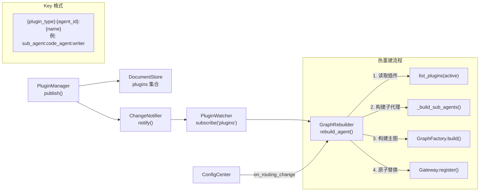

# 插件系统与图热重建

## 架构



## 插件元数据管理

### PluginDocument 字段

| 字段 | 类型 | 说明 |
|------|------|------|
| `plugin_type` | `str` | `"sub_agent"` / `"tool"` / `"pipeline"` |
| `name` | `str` | 插件名称（唯一标识的一部分） |
| `version` | `str` | 语义化版本号 |
| `agent_id` | `str` | 归属的 Agent |
| `manifest` | `dict` | 插件配置（strategy、tools、system_prompt 等） |
| `status` | `str` | `"active"` / `"deprecated"`（由 publish/deprecate 自动设置） |
| `created_at` | `str` | 发布时间（ISO 8601，自动设置） |
| `updated_at` | `str` | 更新时间（ISO 8601，自动设置） |

### 发布与弃用

```python
from artipivot.plugins.manager import PluginManager, PluginDocument

pm = PluginManager(store, notifier)

plugin = PluginDocument(
    plugin_type="sub_agent",     # sub_agent | tool | pipeline
    name="writer",
    version="1.0",
    agent_id="code_agent",
    manifest={
        "strategy": "react",
        "tools": ["web_search", "code_exec"],
        "system_prompt": "You are a coding assistant.",
        "strategy_config": {"max_iterations": 5},
    },
)
await pm.publish(plugin)  # 自动设置时间戳 + 触发 ChangeNotifier
```

查询与弃用：

```python
plugins = await pm.list_plugins(agent_id="code_agent", status="active")
plugin = await pm.get_plugin("sub_agent", "writer", "code_agent")
await pm.deprecate("sub_agent", "writer", "code_agent")
```

## 图热重建

```python
from artipivot.plugins.rebuilder import GraphRebuilder

rebuilder = GraphRebuilder(gateway, factory, tools, pm)
await rebuilder.rebuild_agent("code_agent")
```

重建流程：读取插件 → 构建子代理 → 构建主图 → `gateway.register()` 原子替换（dict 赋值）

**隔离保证**：重建 Agent A 不影响 Agent B 的图引用。

## PluginWatcher 自动重建

```python
from artipivot.plugins.watcher import PluginWatcher

watcher = PluginWatcher(notifier, rebuilder)
await watcher.start()
# 此后 publish/deprecate 自动触发图重建
```

端到端流程：`publish → DocumentStore.put → ChangeNotifier.notify → PluginWatcher → GraphRebuilder → Gateway.register`

## 错误处理

重建图可能因以下原因失败：

| 失败原因 | 表现 | 处理 |
|----------|------|------|
| 插件 manifest 不合法 | `build()` 阶段抛异常 | 日志记录错误，**旧图保持服务**，不会部分替换 |
| routing 与子代理不匹配 | `GraphFactory.build()` 验证失败 | 日志 + 旧图保持服务 |
| 模型配置缺失 | `build()` 阶段抛异常 | 日志 + 旧图保持服务 |

**关键保证**：`Gateway.register()` 在重建**成功**后才执行原子替换（dict 赋值），重建失败时旧图不受影响。

## ConfigCenter 路由回调

```python
config_center = ConfigCenter(store, notifier, on_routing_change=rebuilder.rebuild_agent)
await config_center.start()
# 路由配置变更 → 自动重建图
```
