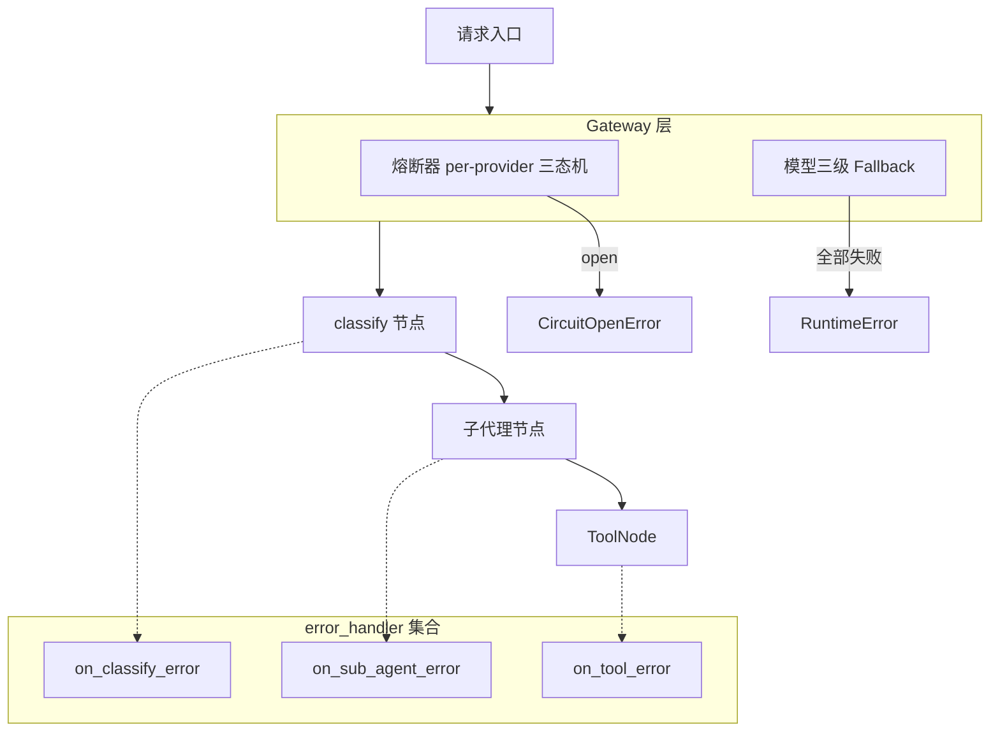

# 容错与弹性（Resilience）

## 架构



## 模块结构

| 文件 | 职责 |
|------|------|
| `resilience/circuit_breaker.py` | `CircuitBreaker` 三态机 + `CircuitRegistry` per-provider 管理 |
| `resilience/retry.py` | `RetryPolicy` 指数退避重试 |
| `resilience/error_handlers.py` | `on_classify_error` / `on_sub_agent_error` / `on_tool_error` 节点级错误处理 |

> **注意**：`RateLimiter` 不在 `resilience/` 模块中，而是位于 `config/ratelimit.py`，属于配置层。限流参数通过 Admin API 热更新，无需重建图。

---

## 熔断器（CircuitBreaker）

per-provider 三态机，保护外部依赖（LLM API 等）免受级联故障。

### 状态转换

```
closed  -- failure_count >= failure_threshold --> open
open    -- recovery_timeout 已过 --------------> half_open
half_open -- 调用成功 -------------------------> closed
half_open -- 调用失败 -------------------------> open
```

### 使用方式

```python
from artipivot.resilience.circuit_breaker import CircuitBreaker, CircuitRegistry, CircuitOpenError

registry = CircuitRegistry()
cb = registry.get_or_create("anthropic", failure_threshold=3, recovery_timeout=30.0)

try:
    result = await cb.call(my_async_fn, arg1, arg2)
except CircuitOpenError:
    # 熔断器已打开，跳过该 provider
```

### 构造参数

| 参数 | 默认值 | 说明 |
|------|--------|------|
| `name` | 必填 | 熔断器标识，通常为 provider 名称 |
| `failure_threshold` | `3` | 连续失败多少次后打开熔断器 |
| `recovery_timeout` | `30.0` | 打开后等待多少秒进入半开状态 |
| `half_open_max_calls` | `1` | 半开状态下允许的试探调用数 |

### CircuitRegistry

```python
registry.get_or_create("anthropic", failure_threshold=5)  # 获取或创建
registry.get_state("anthropic")   # "closed" / "open" / "half_open" / "unknown"
registry.reset("anthropic")       # 手动重置为 closed
registry.all_states()             # {"anthropic": "closed", "openai": "open"}
```

### 线程安全

`CircuitBreaker` 使用 `asyncio.Lock` 保护状态转换。`_check_state`、`_on_success`、`_on_failure` 均在锁内操作。

---

## 重试策略（RetryPolicy）

指数退避 + 可选抖动，适用于瞬时故障自动恢复。

### 使用方式

```python
from artipivot.resilience.retry import RetryPolicy, RetryExhaustedError

policy = RetryPolicy(
    max_retries=3,
    base_delay=1.0,
    max_delay=30.0,
    exponential_base=2.0,
    jitter=True,
    retryable_exceptions=(ConnectionError, TimeoutError),
)

try:
    result = await policy.execute(my_async_fn, arg1)
except RetryExhaustedError as e:
    # 所有重试失败
```

### 构造参数

| 参数 | 默认值 | 说明 |
|------|--------|------|
| `max_retries` | `3` | 最大重试次数（不含首次调用） |
| `base_delay` | `1.0` | 基础延迟（秒） |
| `max_delay` | `30.0` | 延迟上限（秒） |
| `exponential_base` | `2.0` | 指数底数 |
| `jitter` | `True` | 是否添加随机抖动 |
| `retryable_exceptions` | `(Exception,)` | 可重试的异常类型元组 |

### 退避计算

```python
delay = min(base_delay * (exponential_base ** attempt), max_delay)
if jitter:
    delay *= random.uniform(0.5, 1.0)
```

### 与 DSL 图集成

DSL 图的 `NodeDef.retry` 字段自动使用 `RetryPolicy` 包裹节点函数（参见 `graph/dsl.py` 中的 `_wrap_with_retry`）。

---

## 节点 error_handler

利用 LangGraph v1.2 原生 `error_handler` 参数，在 `add_node()` 时注册。

### 使用方式

```python
from artipivot.resilience.error_handlers import on_classify_error, on_sub_agent_error, on_tool_error

builder.add_node("classify", classify_fn, error_handler=on_classify_error)
builder.add_node("writer", writer_fn, error_handler=on_sub_agent_error)
```

### 三个处理器

| 处理器 | 适用节点 | 行为 |
|--------|----------|------|
| `on_classify_error` | classify | 任何错误（含 TimeoutError）→ `Command(update={intent: fallback, confidence: 0.0}, goto="fallback")` |
| `on_sub_agent_error` | 子代理 | 返回错误提示消息 → `Command(update={messages: [...]}, goto="respond")` |
| `on_tool_error` | 工具 | 返回错误 ToolMessage → 不中断子代理循环，让 ReAct 策略继续 |

### 返回类型

- `on_classify_error` 和 `on_sub_agent_error` 返回 `Command`（LangGraph 路由指令）
- `on_tool_error` 返回 `dict`（状态更新，由 LangGraph 合并到当前状态）

---

## 限流器（RateLimiter）

限流器位于 `config/ratelimit.py`（非 `resilience/` 模块），但与弹性体系紧密配合。

```python
from artipivot.config.ratelimit import RateLimiter, RateLimitError

rl = RateLimiter(store, notifier)
await rl.check("code_agent", "user_1")  # 超限抛 RateLimitError
```

### 限流维度

| 维度 | 配置 key | 说明 |
|------|----------|------|
| 每用户 RPM | `user_rpm` | 同一 user_id 每分钟最大请求数 |
| 每 Agent RPM | `agent_rpm` | 同一 agent_id 每分钟最大请求数 |
| 每工具 RPM | `tool_rpm` | 同一工具每分钟最大调用次数 |
| 工具超时 | `tool_timeout_ms` | 单个工具调用的最大等待时间 |

### 动态配置

```bash
PUT /admin/ratelimits/agent/{agent_id}
{"user_rpm": 30, "agent_rpm": 100, "tool_timeout_ms": 60000}

PUT /admin/ratelimits/tool/{tool_name}
{"rpm": 50, "timeout_ms": 30000}
```

### 配置合并

```
默认值（代码内置 60 RPM/用户）
  + Agent 级别覆盖（PUT /admin/ratelimits/agent/{agent_id}）
    + 工具级别覆盖（PUT /admin/ratelimits/tool/{tool_name}）
      = 最终生效值
```

限流参数热更新，无需重建图。

---

## 文件清单

| 文件 | 职责 |
|------|------|
| `resilience/__init__.py` | 模块导出（空） |
| `resilience/circuit_breaker.py` | `CircuitBreaker` + `CircuitRegistry` + `CircuitOpenError` |
| `resilience/retry.py` | `RetryPolicy` + `RetryExhaustedError` |
| `resilience/error_handlers.py` | `on_classify_error` / `on_sub_agent_error` / `on_tool_error` |
| `config/ratelimit.py` | `RateLimiter` + `RateLimitError`（配置层，非 resilience 包） |
