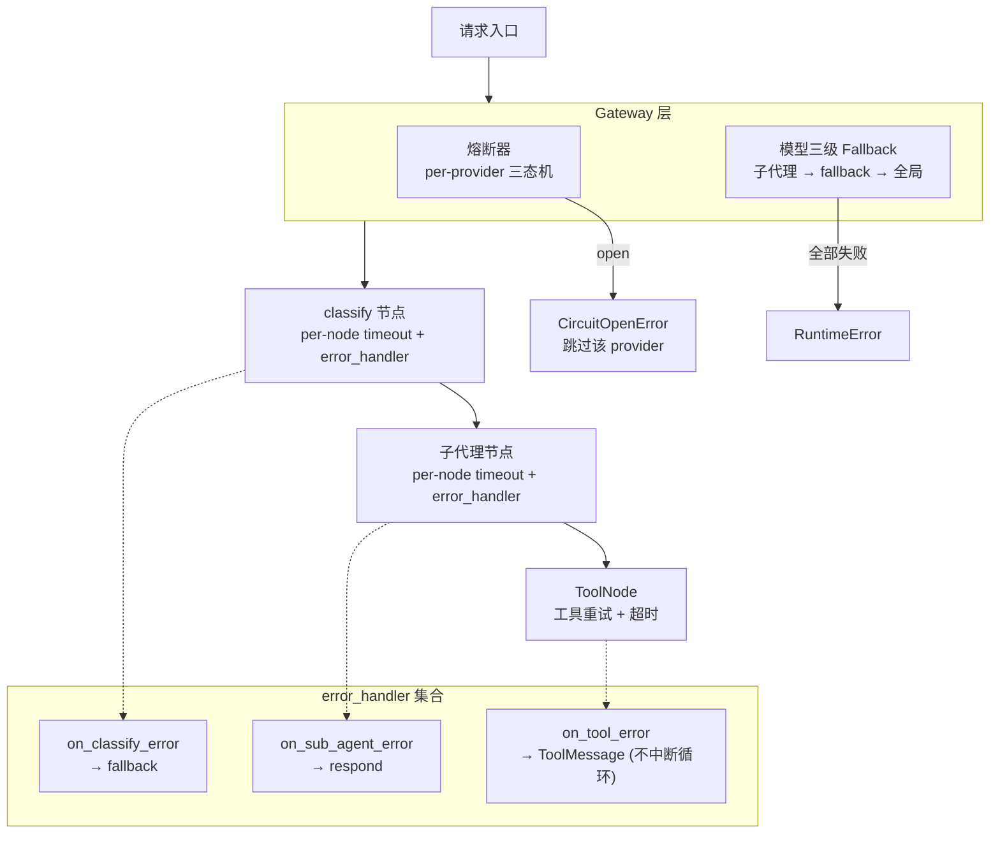

# 容错与弹性（Resilience）

## 架构



## 熔断器（CircuitBreaker）

per-provider 三态机：`closed → open → half_open → closed`

```python
from artipivot.resilience.circuit_breaker import CircuitBreaker, CircuitRegistry

registry = CircuitRegistry()
cb = registry.get_or_create("anthropic", failure_threshold=3, recovery_timeout=30.0)

try:
    result = await cb.call(my_async_fn, arg1, arg2)
except CircuitOpenError:
    # 熔断器已打开，跳过该 provider
```

## 重试策略（RetryPolicy）

指数退避 + 可选抖动：

```python
from artipivot.resilience.retry import RetryPolicy

policy = RetryPolicy(
    max_retries=3,
    base_delay=1.0,
    max_delay=30.0,
    retryable_exceptions=(ConnectionError, TimeoutError),
)
result = await policy.execute(my_async_fn, arg1)
```

## 节点 error_handler

利用 LangGraph v1.2 原生 `error_handler`，在 `add_node()` 时注册：

```python
from artipivot.resilience.error_handlers import on_classify_error, on_sub_agent_error

builder.add_node("classify", classify_fn, error_handler=on_classify_error)
builder.add_node("writer", writer_fn, error_handler=on_sub_agent_error)
```

| 节点 | 错误处理 |
|------|----------|
| classify | → fallback（兜底回复） |
| 子代理 | → respond（错误消息） |
| 工具 | → ToolMessage（不中断子代理循环） |

## 限流器（RateLimiter）

多维度滑动窗口限流，按优先级合并配置（默认值 → Agent 覆盖 → 工具覆盖）：

```python
from artipivot.config.ratelimit import RateLimiter

rl = RateLimiter(store, notifier)
await rl.check("code_agent", "user_1")  # 超限抛 RateLimitError
```

### 限流维度

| 维度 | 配置 key | 说明 |
|------|----------|------|
| 每用户 RPM | `user_rpm` | 同一 user_id 每分钟最大请求数 |
| 每 Agent RPM | `agent_rpm` | 同一 agent_id 每分钟最大请求数 |
| 每工具 RPM | `tool_rpm` | 同一工具每分钟最大调用次数 |
| 工具超时 | `tool_timeout_ms` | 单个工具调用的最大等待时间 |

### 动态配置

```bash
PUT /admin/ratelimits/agent/{agent_id}
{"user_rpm": 30, "agent_rpm": 100, "tool_timeout_ms": 60000}

PUT /admin/ratelimits/tool/{tool_name}
{"rpm": 50, "timeout_ms": 30000}
```

### 配置合并

```
默认值（代码内置 60 RPM/用户）
  └── Agent 级别覆盖（PUT /admin/ratelimits/agent/{agent_id}）
        └── 工具级别覆盖（PUT /admin/ratelimits/tool/{tool_name}）
              └── 最终生效值
```

限流参数热更新，无需重建图。
