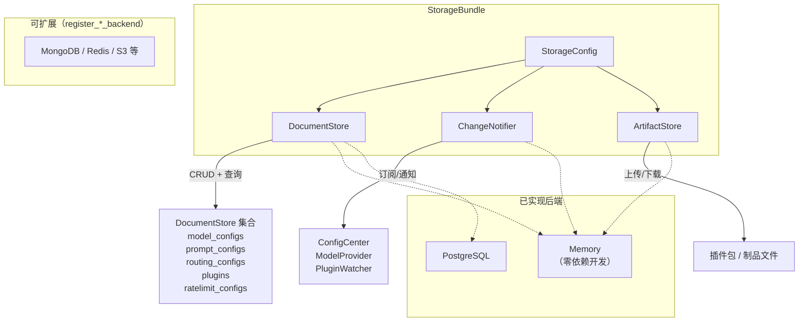

# 存储后端（DocumentStore / ChangeNotifier / ArtifactStore）

存储层有三个独立的可插拔接口，各自可选用不同后端，互不耦合。

## 架构



## 接口定义

### DocumentStore — 文档存储

```python
class DocumentStore(ABC):
    async def get(self, collection: str, key: str) -> dict | None      # 按 key 获取文档
    async def put(self, collection: str, key: str, data: dict) -> None  # 写入（upsert 语义）
    async def delete(self, collection: str, key: str) -> None           # 删除
    async def query(self, collection: str, filter: dict) -> list[dict]  # 按条件查询，空 filter 返回全部
```

### ChangeNotifier — 变更通知

```python
class ChangeNotifier(ABC):
    async def subscribe(self, collection: str, callback: Callable) -> None
        # callback 签名: async callback(collection, key, action, data)
    async def notify(self, collection: str, key: str, action: str, data: dict) -> None
    async def start(self) -> None
    async def stop(self) -> None
```

### ArtifactStore — 制品存储

```python
class ArtifactStore(ABC):
    async def upload(self, local_path: str, remote_key: str) -> str  # 上传文件，返回 URL
    async def download(self, remote_key: str, local_path: str) -> str # 下载文件，返回本地路径
```

## 已有实现

| 接口 | 实现 | 文件 | 适用场景 |
|------|------|------|----------|
| DocumentStore | `InMemoryDocumentStore` | `storage/memory.py` | 本地开发、单测 |
| ChangeNotifier | `InProcessNotifier` | `storage/memory.py` | 进程内回调 |
| ArtifactStore | `InMemoryArtifactStore` | `storage/memory.py` | 本地文件系统 |

## 接入新后端

三个接口各自独立，可分别实现：

```python
from artipivot.storage.base import DocumentStore, ChangeNotifier, ArtifactStore

# DocumentStore — 文档存储
class MyDocumentStore(DocumentStore):
    async def get(self, collection, key): ...
    async def put(self, collection, key, data): ...
    async def delete(self, collection, key): ...
    async def query(self, collection, filter): ...

# ChangeNotifier — 变更通知（生产环境推荐 Redis Pub/Sub）
class MyChangeNotifier(ChangeNotifier):
    async def subscribe(self, collection, callback): ...
    async def notify(self, collection, key, action, data): ...
    async def start(self): ...
    async def stop(self): ...

# ArtifactStore — 制品存储（生产环境推荐 S3/MinIO）
class MyArtifactStore(ArtifactStore):
    async def upload(self, local_path, remote_key) -> str: ...
    async def download(self, remote_key, local_path) -> str: ...
```

### PostgreSQL 接入示例

```python
# DocumentStore — 以表名作为 collection
# 表结构：collection text, key text, data jsonb, primary key (collection, key)

# ChangeNotifier — 使用 PostgreSQL LISTEN/NOTIFY
# LISTEN artipivot_config_changes;
# NOTIFY artipivot_config_changes, '{"collection":"plugins","key":"...","action":"put"}';
```

## 配置

```bash
STORAGE_DOCUMENT_BACKEND=memory    # memory | postgres | 自定义
STORAGE_NOTIFIER_BACKEND=memory    # memory | 自定义
STORAGE_ARTIFACT_BACKEND=memory    # memory | 自定义
```

或通过 `StorageBundle` 统一创建：

```python
from artipivot.storage.bundle import StorageBundle, StorageConfig

bundle = StorageBundle(StorageConfig(
    document_backend="memory",
    notifier_backend="memory",
    artifact_backend="memory",
))
```

## 典型组合

| 场景 | DocumentStore | ChangeNotifier | ArtifactStore |
|------|---------------|----------------|---------------|
| 本地开发 | `memory` | `memory` | `memory` |
| 生产（PostgreSQL） | `postgres` | `memory`（或自定义 Redis） | `memory`（或自定义 S3） |
