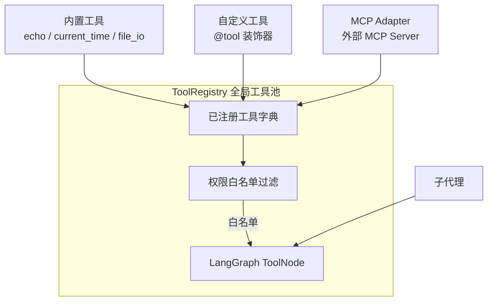
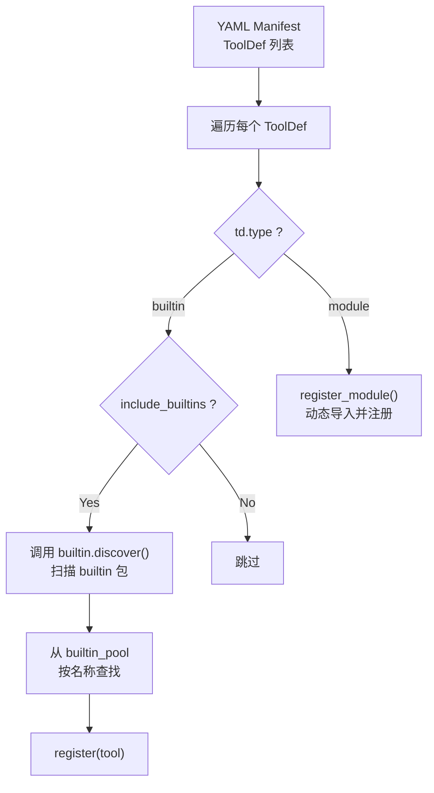
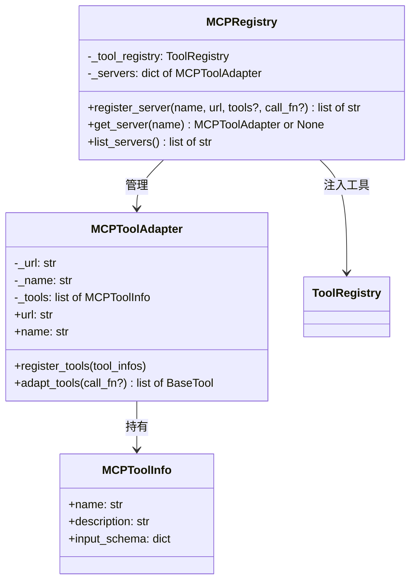

# 工具系统（ToolRegistry + MCP Adapter + Builtin Tools）

## 架构总览



## 模块结构

```
src/artipivot/tools/
  __init__.py          # 包入口（当前为空）
  registry.py          # ToolRegistry 全局工具池
  mcp_adapter.py       # MCPToolAdapter / MCPRegistry / MCPToolInfo
  builtin/
    __init__.py        # discover() 自动扫描
    echo.py            # echo 工具
    current_time.py    # current_time 工具
    file_io.py         # file_io 工具（stub）
```

## ToolRegistry

`ToolRegistry` 是全局工具池单例，管理所有工具的注册、查询与权限过滤。

### 注册方法

| 方法 | 签名 | 说明 |
|------|------|------|
| `register` | `(tool: BaseTool) -> None` | 直接注册一个 LangChain `BaseTool` 实例，以 `tool.name` 为键 |
| `register_module` | `(name: str, module_path: str, fn_name: str) -> None` | 动态导入 `module_path` 模块中的 `fn_name` 函数，用 `@tool` 装饰器包装后注册 |
| `register_from_manifest` | `(tool_defs: list[ToolDef], *, include_builtins: bool = True) -> None` | 根据 manifest 中的 `ToolDef` 列表批量注册，支持 `builtin`（自动扫描）和 `module`（动态导入）两种类型 |

### 查询方法

| 方法 / 属性 | 签名 | 说明 |
|-------------|------|------|
| `get` | `(name: str) -> BaseTool \| None` | 按名称查询单个工具，不存在返回 `None` |
| `get_for_agent` | `(allowed: list[str]) -> list[BaseTool]` | 按权限白名单过滤，只返回 `allowed` 列表中存在的工具 |
| `get_tool_node` | `(allowed: list[str]) -> ToolNode` | 构建一个 LangGraph `ToolNode`，内含权限过滤后的工具列表 |
| `all_tools` | `@property -> list[BaseTool]` | 返回所有已注册工具的列表 |
| `names` | `@property -> list[str]` | 返回所有已注册工具的名称列表 |

### register_from_manifest 流程



`ToolDef` 数据类定义在 `gateway/loader.py` 中，字段如下：

| 字段 | 类型 | 说明 |
|------|------|------|
| `name` | `str` | 工具名称 |
| `type` | `str` | `"builtin"` 或 `"module"`，默认 `"builtin"` |
| `module` | `str \| None` | `type=module` 时指定模块路径 |
| `function` | `str \| None` | `type=module` 时指定函数名 |
| `config` | `dict` | 额外配置，默认为空字典 |

## 注册自定义工具

通过 `register` 方法直接注册：

```python
from langchain_core.tools import tool
from artipivot.tools.registry import ToolRegistry

@tool
def my_tool(query: str, max_results: int = 5) -> str:
    """工具描述（LLM 通过此描述理解工具用途）。"""
    return f"result for: {query}"

registry = ToolRegistry()
registry.register(my_tool)
```

通过 `register_module` 动态导入注册：

```python
registry.register_module("my_tool", "my_package.my_module", "my_function")
```

## 权限过滤

每个子代理只能使用 YAML manifest 中声明的工具白名单：

```python
# 子代理只能用 echo 和 current_time
tools = registry.get_for_agent(["echo", "current_time"])
tool_node = registry.get_tool_node(["echo", "current_time"])
```

`get_tool_node` 返回的 `ToolNode` 可直接嵌入 LangGraph 子代理图，子代理执行时只能调用白名单内的工具。

## 内置工具

内置工具位于 `tools/builtin/` 目录下，通过 `@tool` 装饰器定义，由 `discover()` 函数自动扫描。

### discover() 函数

定义在 `tools/builtin/__init__.py` 中：

```python
def discover() -> dict[str, BaseTool]:
    """Scan every module in this package and collect LangChain @tool instances."""
```

使用 `pkgutil.iter_modules` 遍历 `builtin/` 目录下所有模块，在每个模块中查找 `BaseTool` 实例，以 `tool.name` 为键返回字典。

### 内置工具一览

| 工具名 | 文件 | 功能 | 状态 |
|--------|------|------|------|
| `echo` | `builtin/echo.py` | 回显给定消息，返回 `[echo] {message}` | 可用 |
| `current_time` | `builtin/current_time.py` | 获取当前日期时间，格式 `yyyy-MM-dd HH:mm:ss` | 可用 |
| `file_io` | `builtin/file_io.py` | 文件读写（stub 实现，仅返回占位字符串） | Stub |

### echo

```python
@tool
def echo(message: str) -> str:
    """回显给定的消息。Echo back the given message."""
    return f"[echo] {message}"
```

**参数**：`message`（str，必填）—— 要回显的消息。

**返回**：`[echo] {message}`

### current_time

```python
@tool
def current_time() -> str:
    """获取当前日期和时间（yyyy-MM-dd HH:mm:ss 格式）。Get the current date and time in yyyy-MM-dd HH:mm:ss format."""
    return datetime.now().strftime("%Y-%m-%d %H:%M:%S")
```

**参数**：无。

**返回**：当前时间字符串，格式 `YYYY-MM-DD HH:MM:SS`。

### file_io（stub）

```python
@tool
def file_io(path: str, content: str | None = None, action: str = "read") -> str:
    """读取或写入文件系统中的文件。Read or write files on the filesystem."""
```

**参数**：
- `path`（str，必填）—— 文件路径
- `content`（str，可选）—— 写入内容，`action=write` 时使用
- `action`（str，默认 `"read"`）—— 操作类型，`"read"` 或 `"write"`

**当前行为**：stub 实现，仅返回占位字符串 `[STUB] file_io {action}: path={path}`。

## MCP 适配器

MCP 适配器负责将外部 MCP Server 的工具转换为 LangChain `BaseTool` 并注册到 `ToolRegistry`。

### 类关系



### MCPToolInfo

描述从 MCP Server 发现的单个工具：

| 字段 | 类型 | 说明 |
|------|------|------|
| `name` | `str` | 工具名称 |
| `description` | `str` | 工具描述 |
| `input_schema` | `dict` | JSON Schema 格式的输入参数定义 |

### MCPToolAdapter

将 MCP Server 工具适配为 LangChain `BaseTool`。

| 方法 | 签名 | 说明 |
|------|------|------|
| `__init__` | `(server_url: str, server_name: str \| None = None)` | 初始化，绑定 MCP Server URL |
| `register_tools` | `(tool_infos: list[MCPToolInfo]) -> None` | 注册已发现的工具信息列表 |
| `adapt_tools` | `(call_fn=None) -> list[BaseTool]` | 将注册的工具信息转换为 LangChain `BaseTool` 列表 |

**adapt_tools 的 call_fn 参数**：
- 传入时：签名为 `async def call_fn(tool_name: str, arguments: dict) -> str`，工具调用时委托给此函数
- 不传入（`None`）：返回 stub 实现，返回 `[MCP stub] {tool_name} called with {kwargs} via {url}`

### MCPRegistry

MCP Server 连接注册中心，整合 MCP 适配器与 ToolRegistry。

| 方法 | 签名 | 说明 |
|------|------|------|
| `__init__` | `(tool_registry: ToolRegistry)` | 绑定全局 ToolRegistry |
| `register_server` | `(name, url, tools?, call_fn?) -> list[str]` | 注册 MCP Server，自动适配工具并注入 ToolRegistry，返回注册的工具名列表 |
| `get_server` | `(name: str) -> MCPToolAdapter \| None` | 按名称获取 MCP Server 适配器，不存在返回 `None` |
| `list_servers` | `() -> list[str]` | 返回所有已注册的 MCP Server 名称列表 |

### 使用示例

```python
from artipivot.tools.mcp_adapter import MCPRegistry, MCPToolInfo

mcp = MCPRegistry(tool_registry)

async def my_mcp_call(tool_name: str, arguments: dict) -> str:
    import aiohttp
    async with aiohttp.ClientSession() as session:
        resp = await session.post(
            "http://localhost:3000/tools/call",
            json={"name": tool_name, "arguments": arguments},
        )
        return await resp.text()

mcp.register_server(
    "remote",
    "http://localhost:3000",
    tools=[
        MCPToolInfo("search", "Search the internet", {"properties": {"q": {"type": "string"}}, "required": ["q"]}),
    ],
    call_fn=my_mcp_call,
)
# 工具自动注册到 ToolRegistry，可通过 registry.get("search") 获取
```

`call_fn` 为 `None` 时使用 stub 实现（始终返回 mock 结果），适用于本地开发测试。生产环境必须提供实际的 MCP 调用函数。

## 工具输入参数的 Schema 构建

`_build_args_schema` 辅助函数（`mcp_adapter.py`）将 MCP 工具的 JSON Schema `input_schema` 转换为 Pydantic 模型：

1. 从 `input_schema["properties"]` 中提取字段
2. 所有字段类型映射为 `str`
3. `input_schema["required"]` 中的字段设为必填（默认值 `...`），其余字段默认值 `None`
4. 如果无任何字段，添加 `_placeholder` 占位字段
5. 使用 `pydantic.create_model` 动态创建模型类
