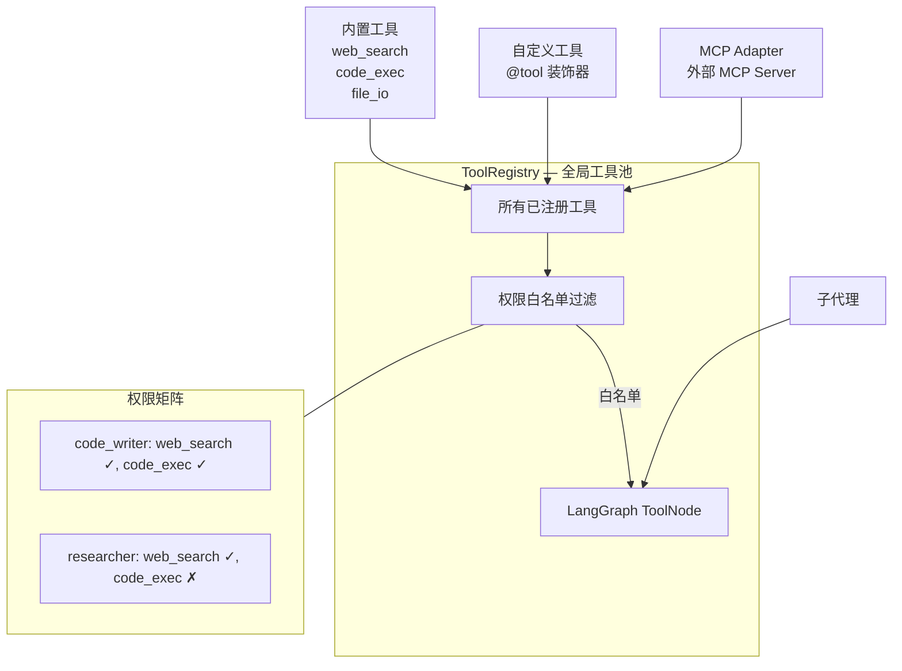

# 工具系统（ToolRegistry + MCP Adapter）

## 架构



## 注册自定义工具

```python
from langchain_core.tools import tool
from artipivot.tools.registry import ToolRegistry

@tool
def my_tool(query: str, max_results: int = 5) -> str:
    """工具描述（LLM 通过此描述理解工具用途）。"""
    return f"result for: {query}"

registry = ToolRegistry()
registry.register(my_tool)
```

## 权限过滤

```python
# 子代理只能用 web_search 和 code_exec
tools = registry.get_for_agent(["web_search", "code_exec"])
tool_node = registry.get_tool_node(["web_search", "code_exec"])
```

| 子代理 | web_search | code_exec | file_io |
|--------|:----------:|:---------:|:-------:|
| code_writer | ✓ | ✓ | ✓ |
| researcher | ✓ | - | - |
| data_analyst | - | ✓ | - |

## MCP 适配器

将 MCP Server 工具接入 ToolRegistry：

```python
from artipivot.tools.mcp_adapter import MCPRegistry, MCPToolInfo

mcp = MCPRegistry(tool_registry)
mcp.register_server(
    "remote",
    "http://localhost:3000",
    tools=[
        MCPToolInfo("search", "Search", {"properties": {"q": {"type": "string"}}, "required": ["q"]}),
    ],
    call_fn=my_async_call_fn,  # 可选，不传则使用 stub
)
# 工具自动注册到 ToolRegistry
```

## 内置工具（stub）

| 工具 | 文件 | 功能 |
|------|------|------|
| `web_search` | `tools/builtin/web_search.py` | 互联网搜索 |
| `code_exec` | `tools/builtin/code_exec.py` | 代码执行 |
| `file_io` | `tools/builtin/file_io.py` | 文件读写 |
