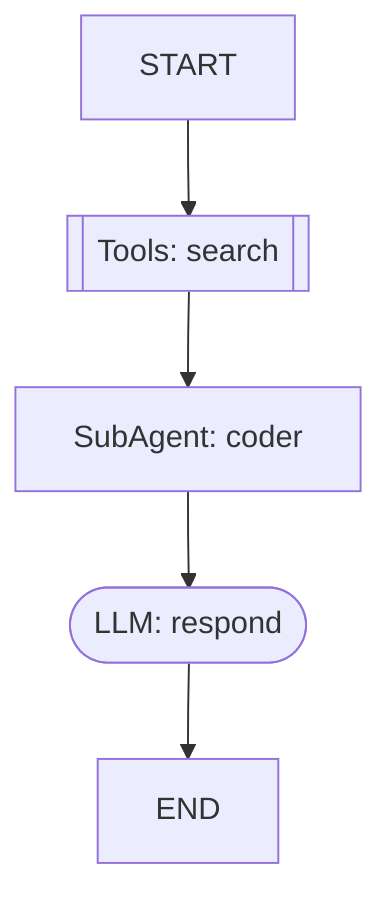

# 可视化调试 -- Mermaid 流程图 + Admin API

## 概述

开发者在构建 DSL 图时，需要直观了解图结构和执行流程。ArtiPivot 提供 Mermaid 流程图生成和 Admin API 端点，支持图结构查询和可视化。

---

## Mermaid 流程图

### 生成方式

```python
from artipivot.graph.visual import graph_to_mermaid
from artipivot.graph.dsl import parse_graph_def

gd = parse_graph_def("my_graph", yaml_dict)
mermaid = graph_to_mermaid(gd)
print(mermaid)
```

### 节点形状

DSL 图仅支持以下四种节点类型（定义在 `dsl.py` 的 `VALID_NODE_TYPES`）：

| 节点类型 | Mermaid 形状 | 视觉 |
|---------|-------------|------|
| `llm` | `([ ])` stadium | 圆角矩形 |
| `tool` / `tools` | `[[ ]]` subroutine | 双线矩形 |
| `sub_agent` | `[ ]` rectangle | 矩形 |

### 边样式

| 边类型 | Mermaid 语法 | 视觉 |
|-------|-------------|------|
| 固定边 | `-->` | 实线箭头 |
| 扇出 | 多条 `-->` | 多条实线箭头从同一源出发 |
| 条件边 | `-.->` | 虚线箭头 + 条件标签 |

### 条件标签

- `field` 条件：显示 `field:<field_name>`
- `builtin` 条件：显示 `fn:<builtin_name>`
- 无条件信息：显示 `cond`

### 特殊节点

`__start__` 显示为 `START`，`__end__` 显示为 `END`。

### 节点标签格式

标签前缀由类型决定：

| 节点类型 | 标签前缀 |
|---------|---------|
| `llm` | `LLM:` |
| `tool` | `Tool:` |
| `tools` | `Tools:` |
| `sub_agent` | `SubAgent:` |

完整标签格式：`{前缀}: {节点名}`

### 示例输出

一个包含 LLM 节点、工具节点、子代理节点的 DSL 图可能生成如下 Mermaid：



---

## Admin API

### 获取 Mermaid 流程图

```
GET /admin/graph/{agent_id}/mermaid
```

返回指定 Agent 所有 DSL 子代理的 Mermaid 流程图文本。

**响应示例：**

```json
{
  "agent_id": "code_agent",
  "graphs": {
    "research_and_code": "flowchart TD\n    search[[\"Tools: search\"]]\n    ...",
    "review_pipeline": "flowchart TD\n    ..."
  }
}
```

实现逻辑（`api/admin.py`）：
1. 通过 `get_agent_registry().get_def(agent_id)` 获取 Agent 定义
2. 检查 `agent_def.graph_sub_agents` 是否存在
3. 对每个 `graph_sub_agents` 条目调用 `graph_to_mermaid(gd)`

### 获取图结构 JSON

```
GET /admin/graph/{agent_id}/structure
```

返回 DSL 子代理的结构化定义。

**响应示例：**

```json
{
  "agent_id": "code_agent",
  "graphs": {
    "research_and_code": {
      "name": "research_and_code",
      "nodes": {"search": {"type": "tools", ...}},
      "edges": [...]
    }
  }
}
```

实现直接返回 `agent_def.to_dict().get("graph_sub_agents", {})`。

### 错误响应

| HTTP 状态码 | 场景 |
|:----------:|------|
| 404 | Agent 不存在 |
| 404 | Agent 没有 DSL 图子代理 |

---

## 实现细节

### graph_to_mermaid 函数

```python
def graph_to_mermaid(graph_def: GraphDef) -> str:
```

生成流程：
1. 遍历 `graph_def.nodes`，为每个节点生成带形状的声明行
2. 遍历 `graph_def.edges`，根据是否有 `condition` 和 `targets` 生成不同类型的边

### _node_shape 函数

```python
def _node_shape(node_type: str) -> tuple[str, str]:
```

返回值：

| node_type | 返回值 | Mermaid 形状 |
|-----------|--------|-------------|
| `"llm"` | `("([", "])")` | stadium（圆角矩形） |
| `"tool"` 或 `"tools"` | `("[[", "]]")` | subroutine（双线矩形） |
| 其他 | `("[", "]")` | rectangle（矩形） |

---

## 文件清单

| 文件 | 职责 |
|------|------|
| `graph/visual.py` | `graph_to_mermaid()` + 辅助函数 |
| `graph/dsl.py` | `GraphDef` / `NodeDef` / `EdgeDef` 数据模型，定义 `VALID_NODE_TYPES` |
| `api/admin.py` | Admin API 端点（`/graph/{agent_id}/mermaid` 和 `/structure`） |
| `api/deps.py` | `get_agent_registry()` 访问器 |
