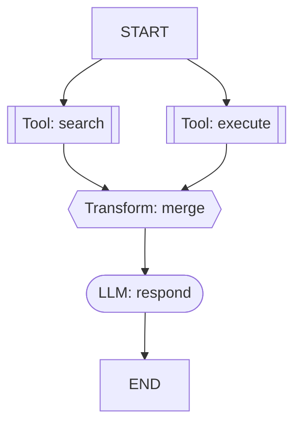

# 可视化调试 — Mermaid 流程图 + Admin API

## 概述

开发者在构建 DSL 图时，需要直观了解图结构和执行流程。ArtiPivot 提供 Mermaid 流程图生成和 Admin API 端点，支持图结构查询和可视化。

---

## Mermaid 流程图

### 生成方式

```python
from artipivot.graph.visual import graph_to_mermaid
from artipivot.graph.dsl import parse_graph_def

gd = parse_graph_def("my_graph", yaml_dict)
mermaid = graph_to_mermaid(gd)
print(mermaid)
```

### 节点形状

| 节点类型 | Mermaid 形状 | 视觉 |
|---------|-------------|------|
| `llm` | `([ ])` stadium | 圆角矩形 |
| `tool` / `tools` | `[[ ]]` subroutine | 双线矩形 |
| `transform` | `{{ }}` hexagon | 六边形 |
| `sub_agent` | `[ ]` rectangle | 矩形 |

### 边样式

| 边类型 | Mermaid 语法 | 视觉 |
|-------|-------------|------|
| 固定边 | `-->` | 实线箭头 |
| 扇出 | 多条 `-->` | 多条实线箭头 |
| 条件边 | `-.->` | 虚线箭头 + 条件标签 |

### 示例输出



---

## Admin API

### 获取 Mermaid 流程图

```
GET /admin/graph/{agent_id}/mermaid
```

返回指定 Agent 所有 DSL 子代理的 Mermaid 流程图文本。

**响应示例：**

```json
{
  "agent_id": "code_agent",
  "graphs": {
    "research_and_code": "flowchart TD\n    search[[\"Tool: search\"]]\n    ...",
    "review_pipeline": "flowchart TD\n    ..."
  }
}
```

### 获取图结构 JSON

```
GET /admin/graph/{agent_id}/structure
```

返回 DSL 子代理的结构化定义（节点数、边数等摘要）。

**响应示例：**

```json
{
  "agent_id": "code_agent",
  "graphs": {
    "research_and_code": {
      "name": "research_and_code",
      "nodes": 4,
      "edges": 6
    }
  }
}
```

### 错误响应

| HTTP 状态码 | 场景 |
|:----------:|------|
| 404 | Agent 不存在 |
| 404 | Agent 没有 DSL 图子代理 |

---

## 文件清单

| 文件 | 职责 |
|------|------|
| `graph/visual.py` | `graph_to_mermaid()` 函数 |
| `api/admin.py` | Admin API 端点 |
| `api/deps.py` | `get_agent_registry()` 访问器 |
| `tests/test_visual.py` | 6 个测试 |
