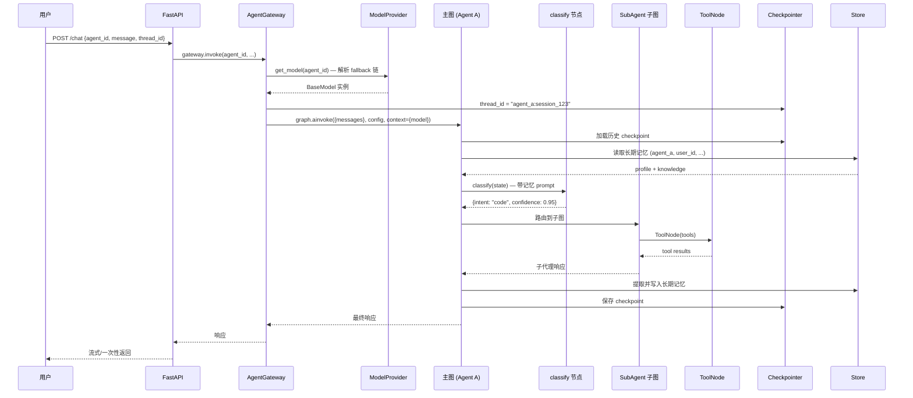

# ArtiPivot 代码架构设计

> 版本: 0.2.0 | 日期: 2026-05-14 | 状态: 草稿
> 基于 [DESIGN.md](./DESIGN.md) 产品设计，映射到 LangGraph 代码层

## 依赖版本基线

本架构**仅依赖 LangGraph 运行时**，不依赖 LangChain 高层包。

| 包 | 版本 | 发布日期 | 用途 |
|---|---|---|---|
| **`langgraph`** | **v1.2** | 2026-05-12 | 图编排运行时（StateGraph、Checkpointer、Store、ToolNode、Streaming、Interrupt） |
| `langchain-core` | >=1.0（langgraph 传递依赖） | — | `@tool`、`BaseTool`、Message 类型、`RunnableConfig` |
| `langgraph-checkpoint-postgres` | latest | — | `AsyncPostgresSaver`（生产 Checkpointer） |
| `langchain-anthropic` | latest | — | Anthropic 模型集成（按需） |
| `langchain-openai` | latest | — | OpenAI 模型集成（按需） |
| `structlog` | latest | — | 结构化 JSON 日志（生产核心） |
| `orjson` | latest | — | 高性能 JSON 序列化 |

> **不引入 `langchain` 高层包**。LangGraph 可独立使用（docs 原文："you don't need to use LangChain to use LangGraph"）。`langchain-core` 是 langgraph 的传递依赖，提供 `@tool`、Message 类型等基础类型，无需额外安装。
>
> **LangSmith 仅开发环境可选**：通过环境变量 `LANGSMITH_API_KEY` 控制，生产环境不启用。生产可观测性依赖自建文件日志系统。
>
> 版本选型依据：`langgraph` v1.2 的 `DeltaChannel`（长对话 checkpoint 压缩）、per-node timeout、node-level error handler 是生产必需能力。

---

## 1. 核心架构：多主 Agent + 子代理 + 工具

从「单一主图 N 个子图」升级为**多主 Agent 隔离架构**。每个主 Agent 是独立的 `CompiledStateGraph`，拥有独立的 State、路由逻辑、子代理集和工具集。

```
┌──────────────────────────────────────────────────────────────┐
│  Agent Gateway（分发层）                                       │
│  POST /chat {agent_id, message, thread_id}                    │
│  → 按 agent_id 路由到对应主图                                  │
├──────────┬──────────────────┬────────────────────────────────┤
│          ▼                  ▼                  ▼              │
│  ┌──────────────┐   ┌──────────────┐   ┌──────────────┐      │
│  │ Agent A      │   │ Agent B      │   │ Agent C      │      │
│  │ (代码助手)    │   │ (研究员)      │   │ (客服)       │      │
│  │              │   │              │   │              │      │
│  │ State A      │   │ State B      │   │ State C      │      │
│  │ classify A   │   │ classify B   │   │ classify C   │      │
│  │ ┌──────────┐ │   │ ┌──────────┐ │   │ ┌──────────┐ │      │
│  │ │Sub A-1   │ │   │ │Sub B-1   │ │   │ │Sub C-1   │ │      │
│  │ │Sub A-2   │ │   │ │Sub B-2   │ │   │ │          │ │      │
│  │ └──────────┘ │   │ └──────────┘ │   │ └──────────┘ │      │
│  │ ToolNode A   │   │ ToolNode B   │   │ ToolNode C   │      │
│  └──────────────┘   └──────────────┘   └──────────────┘      │
├──────────────────────────────────────────────────────────────┤
│  共享基础设施                                                  │
│  - ToolRegistry（工具池 + 权限矩阵）                           │
│  - Checkpointer（Postgres，thread_id 前缀隔离）                │
│  - Store（Postgres，namespace 前缀隔离）                       │
│  - ModelProvider（模型 SDK 适配）                              │
└──────────────────────────────────────────────────────────────┘
```

### 1.1 隔离维度

| 维度 | 隔离方式 | 效果 |
|---|---|---|
| State | 每个主图独立的 `TypedDict` | 字段完全隔离 |
| 路由逻辑 | 每个主图自己的 classify + conditional edges | 意图体系独立 |
| 子代理 | 每个主图挂载不同的子图集合 | 能力池隔离 |
| 工具 | 每个子图绑定不同的 `ToolNode` | 权限隔离 |
| 会话记忆 | 同一 Checkpointer，`thread_id` 前缀 `{agent_id}:` | 对话不串 |
| 长期记忆 | Store namespace 前缀 `(agent_id, user_id, ...)` | 知识库隔离 |
| 模型 | 各主图可用不同 provider / model | 能力/成本隔离 |

### 1.2 概念映射表

| DESIGN.md 概念 | LangGraph 原语 | 职责 |
|---|---|---|
| 主 Agent | `CompiledStateGraph`（独立实例） | 完整隔离的 Agent 运行时 |
| 路由 Agent | 主图内 `add_conditional_edges` | 意图分类 + 条件路由 |
| 子代理（编程式） | `StateGraph` 子图，`add_node(subgraph)` | 独立 State + Nodes + Edges |
| 子代理（声明式） | 策略引擎动态构建的 `StateGraph` | ReAct / Function Calling |
| 工具 | `@tool` 函数 + `ToolNode` | 原子执行能力 |
| 会话记忆 | `MessagesState` + `Checkpointer` | 多轮对话（详见 [MEMORY.md](./MEMORY.md)） |
| 长期记忆 | `Store` (跨 thread) | 用户偏好、知识（详见 [MEMORY.md](./MEMORY.md)） |
| 运行时注入 | `Runtime[Context]` (context_schema) | user_id、模型配置等 |
| 工具权限矩阵 | `ToolRegistry` + `ToolNode` 过滤 | 子代理可用工具白名单 |

---

## 2. State 设计

### 2.1 主图 State（每个主 Agent 可自定义）

```python
class ArtiPivotState(TypedDict):
    messages: Annotated[list[AnyMessage], add_messages]  # 对话消息流
    intent: str | None           # 路由分类结果
    confidence: float            # 分类置信度
    active_agent: str | None     # 当前激活的子代理名
    metadata: dict               # 请求级元数据（user_id, trace_id 等）
```

### 2.2 子代理 State（通用）

```python
class SubAgentState(MessagesState):
    query: str                                  # 从主图传入的任务
    artifacts: Annotated[list[str], operator.add]  # 中间产物累积
```

### 2.3 Context Schema（运行时注入）

```python
@dataclass
class AgentContext:
    agent_id: str                # 主 Agent 标识（隔离 key）
    user_id: str
    thread_id: str               # 完整 thread_id（含 agent_id 前缀）
    model: BaseModel             # 已解析的模型实例（含 fallback 链）
    available_tools: list[str]
```

### 2.4 模型配置解析

每个节点通过 `runtime.context.model` 获取 LLM 实例，无需关心 provider 差异：

```python
async def classify(state: ArtiPivotState, runtime: Runtime[AgentContext]):
    # 直接使用已解析的模型实例
    result = await runtime.context.model.ainvoke(...)
```

模型解析链：子代理 model → 子代理 fallback → 全局 fallback（详见第 9 节）。

---

## 3. 多主 Agent 架构

### 3.1 Agent Gateway

统一入口，按 `agent_id` 分发到对应主图。Gateway 持有 `ModelProvider`，在调用时解析模型实例注入 `AgentContext`：

```python
class AgentGateway:
    """多主 Agent 分发层"""

    def __init__(self):
        self._graphs: dict[str, CompiledStateGraph] = {}
        self._checkpointer: AsyncPostgresSaver = ...
        self._store: PostgresStore = ...
        self._model_provider: ModelProvider = ...

    def register(self, agent_id: str, graph: CompiledStateGraph):
        self._graphs[agent_id] = graph

    async def invoke(
        self, agent_id: str, message: str, thread_id: str,
        *, user_id: str
    ):
        graph = self._graphs[agent_id]
        config = {"configurable": {"thread_id": f"{agent_id}:{thread_id}"}}

        # 解析模型：主图模型（含 fallback 链）
        model = self._model_provider.get_model(agent_id)

        return await graph.ainvoke(
            {"messages": [{"role": "user", "content": message}]},
            config,
            context=AgentContext(
                agent_id=agent_id,
                user_id=user_id,
                thread_id=f"{agent_id}:{thread_id}",
                model=model,
            ),
        )
```

### 3.2 共享 Checkpointer + thread_id 隔离

```python
# 同一个 Checkpointer 实例，thread_id 编码 agent_id
config_a = {"configurable": {"thread_id": "code_agent:session_123"}}
config_b = {"configurable": {"thread_id": "research_agent:session_123"}}

# 各主图只能读到自己的历史，互不干扰
```

### 3.3 共享 Store + namespace 前缀隔离

节点内通过 `runtime.store` 访问 Store（LangGraph 自动注入）：

```python
async def my_node(state, runtime: Runtime[AgentContext]):
    # Agent A 的用户画像
    profile = await runtime.store.aget(("code_agent", user_id, "profile"), "main")

    # Agent B 的用户画像
    profile_b = await runtime.store.aget(("research_agent", user_id, "profile"), "main")
```

### 3.4 共享工具池 + 权限矩阵

```python
# 全局工具池
tool_registry = ToolRegistry({
    "web_search": web_search_tool,
    "code_exec": code_exec_tool,
    "database": database_tool,
})

# 每个主图只绑定有权限的工具子集
code_agent_tools = tool_registry.get_for_agent("code_agent", ["code_exec", "file_io"])
research_agent_tools = tool_registry.get_for_agent("research_agent", ["web_search"])
```

### 3.5 langgraph.json 多图注册（部署级）

```json
{
  "dependencies": ["./src/artipivot"],
  "graphs": {
    "code_agent": "./src/artipivot/agents/code_agent.py:graph",
    "research_agent": "./src/artipivot/agents/research_agent.py:graph",
    "customer_service": "./src/artipivot/agents/customer_service.py:graph"
  },
  "store": {
    "index": {
      "embed": "openai:text-embedding-3-small",
      "dims": 1536,
      "fields": ["$"]
    }
  },
  "env": "./.env"
}
```

---

## 4. 单个主图内部：路由 + 子代理

每个主图内部是 **Routing 工作流模式**：

```
START → classify → (conditional edges) → sub_A / sub_B / ... / clarify → respond → END
```

### 4.1 节点职责

| 节点 | 职责 | 输入 → 输出 |
|---|---|---|
| `classify` | LLM structured output 识别意图 | `messages` → `intent`, `confidence` |
| `clarify` | 置信度不足时追问 | `messages` → 追加澄清消息 |
| `fallback` | 无匹配意图的兜底 | `messages` → 通用 LLM 回复 |
| `respond` | 格式化输出 + 长期记忆提取 | 子代理结果 → 最终响应 |

### 4.2 条件边

```python
def route_by_intent(state: ArtiPivotState, runtime: Runtime[AgentContext]) -> str:
    # 从动态配置读取阈值
    threshold = config_center.routing.get_threshold(runtime.context.agent_id)
    if state["confidence"] < threshold:
        return "clarify"
    intent = state["intent"]
    intent_map = config_center.routing.get_intent_map(runtime.context.agent_id)
    return intent_map.get(intent, "fallback")

builder.add_conditional_edges("classify", route_by_intent)
```

### 4.3 子代理图构建

**编程式子代理**（Agent pattern — LLM + Tool 循环）：

```python
def build_programmatic_subagent(invoke_fn, tools) -> CompiledStateGraph:
    builder = StateGraph(SubAgentState)
    builder.add_node("llm_call", invoke_fn)
    builder.add_node("tools", ToolNode(tools))
    builder.add_edge(START, "llm_call")
    builder.add_conditional_edges("llm_call", should_continue, ["tools", END])
    builder.add_edge("tools", "llm_call")
    return builder.compile()
```

**声明式子代理**（策略引擎根据配置选择图拓扑）：

| 策略 | 图拓扑 | LangGraph Pattern |
|---|---|---|
| ReAct | think → ToolNode → think（循环） | Agent pattern |
| CoT | plan → execute → synthesize | Prompt Chaining pattern |
| Function Calling | llm_call → ToolNode（单次） | — |

---

## 5. 工具层设计

### 5.1 工具定义

使用 LangChain 的 `@tool` 装饰器（`langchain-core` 作为 langgraph 传递依赖自动安装）：

```python
from langchain.tools import tool

@tool
def search(query: str, max_results: int = 5) -> str:
    """在互联网上搜索指定查询，返回相关网页片段"""
    ...
```

### 5.2 工具注册表

```python
from langgraph.prebuilt import ToolNode

class ToolRegistry:
    _tools: dict[str, BaseTool]
    _permissions: dict[str, set[str]]  # agent_id → allowed tool names

    def get_for_agent(self, agent_id: str, tool_names: list[str]) -> list[BaseTool]:
        allowed = self._permissions.get(agent_id, set())
        return [self._tools[n] for n in tool_names if n in allowed]

    def get_tool_node(self, agent_id: str, tool_names: list[str]) -> ToolNode:
        """构建带权限过滤的 ToolNode"""
        return ToolNode(self.get_for_agent(agent_id, tool_names))
```

### 5.3 MCP 工具适配

```
MCP Server → MCPAdapter → list[BaseTool] → ToolNode
```

### 5.4 Pipeline Tool（工具编排）

将多个原子工具按固定流程串联，暴露为单个 `@tool`。内部实现为 LangGraph **线性 StateGraph**，保留 checkpoint / streaming / error handler 能力。

**原理**：固定流程 = 没有动态路由的线性图。

```
@tool("search_and_translate")
  └── 内部 StateGraph: START → search → summarize → translate → END
```

**声明式 Pipeline（YAML → 自动构建图）**：

```yaml
# pipeline.yaml
identity:
  name: search_and_translate
  description: 搜索互联网内容，总结摘要后翻译为中文

parameters:
  - name: query
    type: string
    required: true

pipeline:
  steps:
    - name: search
      tool: web_search
      input: "{query}"
      output: search_result
    - name: summarize
      tool: summarize
      input: "{search_result}"
      output: summary
    - name: translate
      tool: translate
      input: "{summary}"
      params:
        target_lang: zh
      output: translated
  output: "{translated}"
```

**框架构建逻辑**：

```python
class PipelineToolBuilder:
    """YAML → StateGraph（线性图）→ compile → @tool"""

    def build(self, config: PipelineConfig, registry: ToolRegistry) -> BaseTool:
        # 1. 动态 State：每个 step 的 output + 全局 input/output
        fields = {"input": str, "output": str}
        for step in config.steps:
            fields[step.output] = str
        PipelineState = TypedDict("PipelineState", fields)

        # 2. 构建线性图
        builder = StateGraph(PipelineState)
        prev = START
        for step in config.steps:
            node_fn = self._make_step_node(step, registry)
            builder.add_node(step.name, node_fn)
            builder.add_edge(prev, step.name)
            prev = step.name
        builder.add_edge(prev, END)
        graph = builder.compile()

        # 3. 包装为 @tool
        @tool
        def pipeline_tool(query: str) -> str:
            result = graph.invoke({"input": query})
            return result["output"]

        pipeline_tool.name = config.identity.name
        return pipeline_tool

    def _make_step_node(self, step, registry):
        tool = registry.get(step.tool)
        async def node(state, runtime):
            # 模板变量替换: "{search_result}" → state["search_result"]
            rendered_input = step.render_input(state)
            result = await tool.ainvoke({"query": rendered_input, **step.params})
            return {step.output: result}
        return node
```

**条件分支**：YAML 中 `type: condition` 的步骤转为 `add_conditional_edges`：

```yaml
- name: check_length
  type: condition
  if: "len({raw_result}) > 5000"
  then: summarize
  else: translate
```

**注册方式**：

```bash
artipivot tool import --pipeline ./plugins/search_translate/pipeline.yaml
```

注册后与普通工具无差别，子代理 `context.tools.get("search_and_translate")` 即可调用。

---

## 6. 持久化策略

记忆系统详见 [MEMORY.md](./MEMORY.md)，此处为概要。

| 层级 | LangGraph 机制 | 存储内容 | 后端 |
|---|---|---|---|
| 会话记忆 | `Checkpointer` (per-thread) | 图快照、消息历史 | AsyncPostgresSaver |
| 长期记忆 | `Store` (跨 thread) | 用户偏好、知识 | PostgresStore + 语义搜索 |
| 插件元数据 | DocumentStore（自定义） | 子代理/工具定义 | DocumentStore + ArtifactStore |

### 6.1 图编译配置

```python
checkpointer = AsyncPostgresSaver.from_conn_string(DB_URI)
store = PostgresStore.from_conn_string(DB_URI, index={...})

graph = root_builder.compile(
    checkpointer=checkpointer,
    store=store,
)
```

### 6.2 子图持久化模式

| 子代理类型 | checkpointer | 说明 |
|---|---|---|
| 编程式 | `None`（per-invocation） | 每次调用独立，支持 interrupt |
| 声明式（无状态） | `False`（stateless） | 纯函数调用，零开销 |
| 需多轮记忆的子代理 | `True`（per-thread） | 跨调用积累上下文 |

---

## 7. 插件热加载与图重建

LangGraph 图 `compile()` 后**不可变**。插件变更需重建图。

### 7.1 热加载流程

```
ChangeNotifier（变更通知）→ 检测插件变更 → 重建受影响的主图 → 原子替换 AgentGateway 中的实例
```

### 7.2 图工厂

```python
class GraphFactory:
    """按 agent_id 构建独立主图"""

    def build(self, agent_id: str) -> CompiledStateGraph:
        agent_def = self.registry.get_agent(agent_id)
        root = StateGraph(agent_def.state_schema, context_schema=AgentContext)

        # 固定节点
        root.add_node("classify", self._classify_node)
        root.add_node("respond", self._respond_node)

        # 动态子代理
        for sub_def in agent_def.sub_agents:
            subgraph = self._build_subgraph(sub_def)
            root.add_node(sub_def.name, subgraph)
            root.add_edge(sub_def.name, "respond")

        # 路由
        root.add_edge(START, "classify")
        root.add_conditional_edges("classify", route_by_intent)
        root.add_edge("respond", END)

        return root.compile(checkpointer=..., store=...)
```

---

## 8. 包结构设计

```
src/artipivot/
├── __init__.py
│
├── gateway/                       # 多主 Agent 分发层
│   ├── __init__.py
│   ├── gateway.py                 # AgentGateway — 按 agent_id 分发
│   └── config.py                  # 主 Agent 注册表配置
│
├── graph/                         # 核心图构建层
│   ├── __init__.py
│   ├── state.py                   # ArtiPivotState, SubAgentState
│   ├── context.py                 # AgentContext (runtime context_schema)
│   ├── root.py                    # 单个主图构建（classify → dispatch → respond）
│   ├── router.py                  # 意图分类节点（LLM structured output）
│   └── factory.py                 # GraphFactory — 按 agent_id 构建主图
│
├── agents/                        # 子代理层
│   ├── __init__.py
│   ├── base.py                    # SubAgent 基类 / 注册接口
│   ├── programmatic.py            # 编程式子代理图构建器
│   ├── declarative.py             # 声明式子代理 — 策略引擎
│   └── strategies/                # 内置策略实现
│       ├── __init__.py
│       ├── react.py               # ReAct 策略图
│       ├── cot.py                 # Chain-of-Thought 策略图
│       └── function_calling.py    # Function Calling 策略图
│
├── tools/                         # 工具层
│   ├── __init__.py
│   ├── registry.py                # ToolRegistry — 全局工具池 + 权限矩阵
│   ├── loader.py                  # YAML → @tool 函数动态生成
│   ├── pipeline.py                # PipelineToolBuilder — 多工具编排为单个 tool
│   ├── mcp_adapter.py             # MCP Server → BaseTool 适配
│   ├── openapi_importer.py        # OpenAPI Schema → BaseTool 自动导入
│   └── builtin/                   # 内置工具实现
│       ├── __init__.py
│       ├── web_search.py
│       ├── code_exec.py
│       ├── file_io.py
│       └── database.py
│
├── memory/                        # 记忆系统（详见 MEMORY.md）
│   ├── __init__.py
│   ├── checkpointer.py            # Checkpointer 工厂（Postgres / Memory）
│   ├── store.py                   # Store 工厂 + 语义搜索配置
│   ├── extraction.py              # 长期记忆提取（对话 → profile/knowledge）
│   └── context_window.py          # 上下文窗口管理（摘要/截断）
│
├── plugins/                       # 插件管理
│   ├── __init__.py
│   ├── manager.py                 # ClusterPluginRegistry — DocumentStore CRUD
│   ├── watcher.py                 # ChangeNotifier 监听 → 触发图重建
│   ├── loader.py                  # 制品下载 → 校验 → 导入 → 实例化
│   └── sandbox.py                 # 插件隔离环境
│
├── models/                        # 模型适配层
│   ├── __init__.py
│   ├── config.py                 # ModelConfig 数据结构
│   ├── provider.py               # ModelProvider — 动态模型解析 + fallback 链
│   └── loader.py                 # YAML seed → DocumentStore 初始加载
│
├── config/                        # 动态配置中心
│   ├── __init__.py
│   ├── center.py                 # ConfigCenter — 统一配置入口
│   ├── prompts.py                # PromptStore — 提示词动态管理
│   ├── ratelimit.py              # RateLimiter — 多维度限流
│   ├── routing.py                # RoutingConfig — 路由规则
│   └── seed/                     # 首次启动 seed（YAML → DocumentStore）
│       ├── models.yaml
│       ├── prompts.yaml
│       ├── ratelimits.yaml
│       └── routing.yaml
│
├── api/                           # 对外接口
│   ├── __init__.py
│   ├── server.py                  # FastAPI 入口
│   └── admin.py                   # 插件管理 REST API
│
├── cli/                           # CLI
│   ├── __init__.py
│   └── main.py                    # artipivot plugin init/dev/publish
│
├── observability/                 # 可观测性
│   ├── __init__.py
│   ├── logging.py                # structlog 配置 + 多通道 Handler + 轮转
│   ├── trace.py                  # TraceLogger — 请求级生命周期
│   ├── session.py                # SessionLogger — 会话级（thread_id 串联多轮）
│   ├── memory.py                 # MemoryLogger — 记忆操作日志
│   ├── llm_logger.py             # LLMMiddleware — LLM 调用拦截
│   ├── tool_logger.py            # LoggingToolNode — 工具调用拦截
│   ├── audit.py                  # AuditLogger — 审计（文件 + DocumentStore）
│   └── otel.py                   # OTel 可选导出
│
├── resilience/                    # 容错与弹性
│   ├── __init__.py
│   ├── circuit_breaker.py        # CircuitBreaker 三状态机
│   ├── retry.py                  # 工具重试策略
│   └── error_handlers.py         # 节点级 error_handler 集合
│
└── config.py                      # 静态配置（数据库连接字符串、环境变量等）
```

### 8.1 包依赖关系

```
api / cli
   │
   ▼
gateway
   │
   ▼
graph ←── agents ←── tools
   │         │
   │         ▼
   │      plugins
   │         │
   ▼         ▼
memory     models
   │         │
   ▼         ▼
config (动态配置中心)
   │
   ▼
observability / resilience
```

---

## 9. 模型适配层

### 9.1 设计目标

- 每个 Agent / 子代理可**独立配置** LLM provider + model
- 模型配置**完全动态**：存储在 DocumentStore（可配置后端），运行时可修改，**立即生效无需重建图**
- 支持三级 fallback：子代理模型 → 子代理兜底 → 全局兜底
- 对上层透明：节点只拿到 `BaseModel` 实例，无需关心 provider 差异

**核心洞察**：LangGraph 图 `compile()` 后不可变，但模型不编译进图——模型在每次 `invoke()` 时由 `ModelProvider` 动态解析。因此模型变更**不需要触发图重建**，只需更新 ModelProvider 内部状态即可。

### 9.2 动态配置架构

```
┌───────────────────────────────────────────────────────┐
│  DocumentStore（可配置后端）                            │
│  ┌─────────────────────────────────────────────────┐  │
│  │  model_configs 集合                              │  │
│  │  {scope: "global", ...}                         │  │
│  │  {scope: "agent", agent_id: "code_agent", ...}  │  │
│  │  {scope: "sub_agent", agent_id: ..., sub: ...}  │  │
│  └─────────────────────────────────────────────────┘  │
│                        │                               │
│              ChangeNotifier                            │
│              （可配置通知机制）                          │
│                        │                               │
│                        ▼                               │
│  ┌─────────────────────────────────────────────────┐  │
│  │  ModelProvider（内存）                            │  │
│  │  - 原子更新内部 dict                              │  │
│  │  - 无需重建图，下一次 invoke 自动使用新配置        │  │
│  └─────────────────────────────────────────────────┘  │
└───────────────────────────────────────────────────────┘
```

**与插件热加载的区别**：

| 变更类型 | 是否需要重建图 | 原因 |
|---|---|---|
| 子代理增删 / 工具变更 | 是 | 图拓扑变化，compile 后不可变 |
| 模型配置变更 | **否** | 模型不编译进图，invoke 时动态解析 |
| 提示词变更 | **否** | 提示词不编译进图，classify/respond 节点从配置读取 |

### 9.3 配置存储结构

**DocumentStore `model_configs` 集合**（具体存储格式由后端决定）：

```python
# 全局配置（全局兜底模型、默认参数）
{
    "_id": "global",
    "scope": "global",
    "fallback_model": {"provider": "openai", "name": "gpt-4o"},
    "defaults": {"temperature": 0.0, "timeout_seconds": 120},
    "providers": {
        "anthropic": {"api_key_env": "ANTHROPIC_API_KEY"},
        "openai":    {"api_key_env": "OPENAI_API_KEY"},
    },
}

# 主 Agent 模型配置
{
    "_id": "code_agent",
    "scope": "agent",
    "agent_id": "code_agent",
    "model": {"provider": "anthropic", "name": "claude-sonnet-4-6", "temperature": 0.0},
}

# 子代理模型配置（可选，未配置则继承主 Agent）
{
    "_id": "code_agent:code_writer",
    "scope": "sub_agent",
    "agent_id": "code_agent",
    "sub_agent": "code_writer",
    "model": {
        "provider": "anthropic",
        "name": "claude-sonnet-4-6",
        "temperature": 0.0,
        "fallback": {"provider": "anthropic", "name": "claude-haiku-4-5-20251001"},
    },
}
```

### 9.4 管理接口

通过 REST API 动态管理模型配置：

```bash
# 查询某 agent 的模型配置
GET /admin/models/{agent_id}

# 更新主 Agent 模型（立即生效，无需重启）
PUT /admin/models/{agent_id}
{
  "provider": "anthropic",
  "name": "claude-opus-4-6"     # 从 sonnet 升级到 opus
}

# 更新子代理模型
PUT /admin/models/{agent_id}/{sub_agent}
{
  "provider": "openai",
  "name": "gpt-4o"
}

# 更新全局兜底模型
PUT /admin/models/global/fallback
{
  "provider": "openai",
  "name": "gpt-4o"
}
```

### 9.5 ModelConfig 数据结构

```python
from dataclasses import dataclass, field

@dataclass
class ModelConfig:
    provider: str        # "anthropic" | "openai" | ...
    name: str            # "claude-sonnet-4-6" | "gpt-4o" | ...
    temperature: float = 0.0
    timeout: int = 120              # 超时秒数
    max_tokens: int | None = None   # 最大输出 token
    fallback: "ModelConfig | None" = None
```

### 9.6 ModelProvider

```python
from langchain_anthropic import ChatAnthropic
from langchain_openai import ChatOpenAI
import threading
from artipivot.storage import DocumentStore, ChangeNotifier

class ModelProvider:
    """模型解析 + fallback 链 + 动态热更新"""

    def __init__(self, store: DocumentStore, notifier: ChangeNotifier):
        self._store = store
        self._notifier = notifier
        self._lock = threading.RLock()

        # 三级配置（从 DocumentStore 加载）
        self._agent_models: dict[str, ModelConfig] = {}
        self._sub_models: dict[str, ModelConfig] = {}          # key = "agent_id:sub_name"
        self._global_fallback: ModelConfig | None = None

        # provider 工厂（可扩展注册新 provider）
        self._factories: dict[str, Callable] = {
            "anthropic": lambda cfg: ChatAnthropic(
                model=cfg.name, temperature=cfg.temperature,
                timeout=cfg.timeout, max_tokens=cfg.max_tokens,
            ),
            "openai": lambda cfg: ChatOpenAI(
                model=cfg.name, temperature=cfg.temperature,
                timeout=cfg.timeout, max_tokens=cfg.max_tokens,
            ),
        }

    # ── 启动时加载 + ChangeNotifier 监听 ──

    async def start(self):
        """加载全量配置 + 启动 ChangeNotifier 监听"""
        await self._load_all()
        await self._notifier.subscribe("model_configs", self._on_change)

    async def _load_all(self):
        """从 DocumentStore 加载全部模型配置"""
        docs = await self._store.query("model_configs", {})
        with self._lock:
            for doc in docs:
                self._apply_doc(doc.data)

    async def _on_change(self, collection: str, key: str, action: str, data: dict):
        """ChangeNotifier 回调，原子更新内存"""
        with self._lock:
            self._apply_doc(data)

    def _apply_doc(self, doc: dict):
        """根据 scope 更新对应层级"""
        match doc["scope"]:
            case "global":
                self._global_fallback = ModelConfig(**doc["fallback_model"])
            case "agent":
                self._agent_models[doc["agent_id"]] = ModelConfig(**doc["model"])
            case "sub_agent":
                key = f"{doc['agent_id']}:{doc['sub_agent']}"
                self._sub_models[key] = ModelConfig(**doc["model"])

    # ── 管理接口（REST API 调用） ──

    async def update_agent_model(self, agent_id: str, model: dict):
        """更新主 Agent 模型配置 → DocumentStore → ChangeNotifier 自动同步"""
        await self._store.put("model_configs", f"agent:{agent_id}", {
            "scope": "agent", "agent_id": agent_id, "model": model,
        })

    async def update_sub_model(self, agent_id: str, sub_name: str, model: dict):
        """更新子代理模型配置"""
        await self._store.put("model_configs", f"sub_agent:{agent_id}:{sub_name}", {
            "scope": "sub_agent", "agent_id": agent_id, "sub_agent": sub_name, "model": model,
        })

    async def update_global_fallback(self, model: dict):
        """更新全局兜底模型"""
        await self._store.put("model_configs", "global", {
            "scope": "global", "fallback_model": model,
        })

    # ── 运行时解析（每次 invoke 时调用） ──

    def get_model(self, agent_id: str, sub_name: str | None = None) -> "BaseModel":
        """解析模型实例，含 fallback 链"""
        with self._lock:
            # 确定配置链
            if sub_name and f"{agent_id}:{sub_name}" in self._sub_models:
                cfg = self._sub_models[f"{agent_id}:{sub_name}"]
            else:
                cfg = self._agent_models.get(agent_id)
                if cfg is None:
                    raise ValueError(f"Agent {agent_id} 无模型配置")

            chain = self._build_chain(cfg)

        # 按优先级尝试实例化
        for model_cfg in chain:
            try:
                factory = self._factories[model_cfg.provider]
                return factory(model_cfg)
            except Exception:
                continue  # 当前 provider 不可用，降级到下一级

        raise RuntimeError(f"所有模型均不可用: agent={agent_id}, sub={sub_name}")

    def _build_chain(self, cfg: ModelConfig) -> list[ModelConfig]:
        """构建 fallback 链: [cfg, cfg.fallback, ..., global_fallback]"""
        chain = [cfg]
        current = cfg
        while current.fallback:
            chain.append(current.fallback)
            current = current.fallback
        if self._global_fallback and chain[-1] != self._global_fallback:
            chain.append(self._global_fallback)
        return chain
```

### 9.7 解析优先级

```
code_writer 子代理调用 LLM 时：
  1. code_agent:code_writer  → claude-sonnet-4-6（子代理自有配置）
  2. code_agent:code_writer  → claude-haiku-4-5-20251001（子代理 fallback）
  3. global fallback         → gpt-4o（全局兜底）

code_reviewer 子代理调用 LLM 时（无独立配置）：
  1. code_agent              → claude-sonnet-4-6（继承主 Agent 配置）
  2. global fallback         → gpt-4o（全局兜底）
```

### 9.8 与 Gateway 集成

Gateway 每次调用 `invoke()` 时动态解析模型，模型变更在下一次请求自动生效：

```python
class AgentGateway:
    def __init__(self, model_provider: ModelProvider, ...):
        self._model_provider = model_provider

    async def invoke(self, agent_id, message, thread_id, *, user_id):
        graph = self._graphs[agent_id]
        model = self._model_provider.get_model(agent_id)  # 动态解析

        return await graph.ainvoke(
            {"messages": [{"role": "user", "content": message}]},
            config={"configurable": {"thread_id": f"{agent_id}:{thread_id}"}},
            context=AgentContext(
                agent_id=agent_id, user_id=user_id,
                thread_id=f"{agent_id}:{thread_id}", model=model,
            ),
        )
```

### 9.9 初始配置来源

系统首次启动时（DocumentStore 为空），从 YAML seed 文件加载初始配置：

```yaml
# config/seed/models.yaml — 仅首次启动使用
global:
  fallback_model:
    provider: openai
    name: gpt-4o
  defaults:
    temperature: 0.0
    timeout_seconds: 120

agents:
  code_agent:
    provider: anthropic
    name: claude-sonnet-4-6
    sub_agents:
      code_writer:
        provider: anthropic
        name: claude-sonnet-4-6
        fallback:
          provider: anthropic
          name: claude-haiku-4-5-20251001

  research_agent:
    provider: anthropic
    name: claude-sonnet-4-6
```

启动后所有变更通过 REST API 管理，YAML 文件不再参与运行时。

### 9.10 配置维度一览

| 配置项 | 作用域 | 动态生效 | 管理方式 |
|---|---|---|---|
| provider + model name | agent / sub_agent | 是 | REST API |
| temperature | agent / sub_agent | 是 | REST API |
| timeout / max_tokens | agent / sub_agent | 是 | REST API |
| fallback 模型 | agent / sub_agent | 是 | REST API |
| 全局兜底模型 | global | 是 | REST API |
| API Key（provider 级） | global | 是 | REST API → 环境变量注入 |
| 新 provider 注册 | global | 是 | 代码扩展 `_factories` |

---

## 10. 动态配置中心

### 10.1 设计目标

框架中所有运行时参数均从 DocumentStore 动态读取，通过 ChangeNotifier 热更新，实现**零重启、零改码**的配置管理。

**配置分类与生效方式**：

| 配置类型 | 变更是否需要重建图 | 原因 |
|---|---|---|
| 模型配置 | 否 | invoke 时动态解析 |
| 提示词 | 否 | 节点执行时从 ConfigCenter 读取 |
| 限流参数 | 否 | 中间件层拦截，不涉及图 |
| 路由规则（意图集 + 映射表） | **是** | 条件边逻辑编译进图 |
| 子代理 / 工具增删 | **是** | 图拓扑变化 |

### 10.2 配置中心架构

```
┌──────────────────────────────────────────────────────────────┐
│  DocumentStore（可配置后端）                                    │
│  ┌──────────────┐  ┌──────────────┐  ┌──────────────┐        │
│  │ model_configs│  │ prompt_configs│ │  ratelimit   │  ...   │
│  └──────────────┘  └──────────────┘  └──────────────┘        │
│         │                  │                 │                 │
│         └──────────┬───────┘─────────────────┘                 │
│              ChangeNotifier                                    │
│              （可配置通知机制）                                  │
│                    │                                           │
│                    ▼                                           │
│  ┌────────────────────────────────────────────────────────┐   │
│  │  ConfigCenter（内存单例）                                │   │
│  │  - 原子更新各模块内部 dict                               │   │
│  │  - 不需要重建图的配置：立即生效                           │   │
│  │  - 需要重建图的配置：通知 GraphFactory 触发重建           │   │
│  └────────────────────────────────────────────────────────┘   │
└──────────────────────────────────────────────────────────────┘
```

```python
from artipivot.storage import DocumentStore, ChangeNotifier

class ConfigCenter:
    """动态配置中心 — 统一管理所有运行时配置"""

    def __init__(self, store: DocumentStore, notifier: ChangeNotifier):
        self._store = store
        self._notifier = notifier
        self._lock = threading.RLock()

        # 各模块配置（从 DocumentStore 加载）
        self.models: ModelProvider = ...
        self.prompts: PromptStore = ...
        self.rate_limits: RateLimitConfig = ...
        self.routing: RoutingConfig = ...
        self.global_settings: dict = {}

    async def start(self):
        """全量加载 + 启动 ChangeNotifier 监听"""
        await self._load_all()
        await self._notifier.subscribe("model_configs", self.models.apply)
        await self._notifier.subscribe("prompt_configs", self.prompts.apply)
        await self._notifier.subscribe("ratelimit_configs", self.rate_limits.apply)
        await self._notifier.subscribe("routing_configs", self._on_routing_change)
        await self._notifier.start()

    async def _load_all(self):
        """从 DocumentStore 加载全部配置"""
        for collection in ["model_configs", "prompt_configs", "ratelimit_configs", "routing_configs"]:
            docs = await self._store.query(collection, {})
            for doc in docs:
                self._apply_doc(collection, doc.data)

    async def _on_routing_change(self, collection, key, action, data):
        """路由配置变更 → 触发图重建"""
        self.routing.apply(data)
        await self._notify_graph_rebuild()
```

### 10.3 提示词动态化

提示词存储在 DocumentStore `prompt_configs` 集合，节点执行时从 `ConfigCenter.prompts` 读取。

**存储结构**：

```python
# DocumentStore prompt_configs 集合（具体格式由后端决定）
{
    "_id": "code_agent:classify",
    "agent_id": "code_agent",
    "node": "classify",
    "system": "你是代码助手的意图分类器。将用户消息分类为以下意图之一...",
    "few_shots": [
        {"user": "帮我写个函数", "assistant": '{"intent": "code", "confidence": 0.95}'},
    ],
    "output_schema": {  # LLM structured output 的 JSON Schema
        "type": "object",
        "properties": {
            "intent": {"type": "string"},
            "confidence": {"type": "number"},
        },
    },
    "updated_at": "2026-05-14T10:00:00Z",
}

{
    "_id": "code_agent:respond",
    "agent_id": "code_agent",
    "node": "respond",
    "system": "请根据以下子代理执行结果，整理为用户友好的回复...",
    "updated_at": "2026-05-14T10:00:00Z",
}

{
    "_id": "code_agent:sub:code_writer",
    "agent_id": "code_agent",
    "node": "sub_agent",
    "sub_agent": "code_writer",
    "system": "你是一个专业的编程助手。请根据用户需求...",
    "updated_at": "2026-05-14T10:00:00Z",
}
```

**节点读取方式**：

```python
class PromptStore:
    """提示词存储 — 从 DocumentStore 加载，ChangeNotifier 热更新"""

    def __init__(self):
        self._prompts: dict[str, dict] = {}  # key = "agent_id:node" or "agent_id:sub:sub_name"

    def get(self, agent_id: str, node: str, sub_name: str | None = None) -> dict:
        key = f"{agent_id}:{sub_name}:{node}" if sub_name else f"{agent_id}:{node}"
        return self._prompts.get(key, {})

    def apply(self, data: dict):
        """ChangeNotifier 回调"""
        key = data["_id"]
        with threading.RLock():
            self._prompts[key] = data

# 节点中使用
async def classify(state: ArtiPivotState, runtime: Runtime[AgentContext]):
    agent_id = runtime.context.agent_id
    prompt_config = config_center.prompts.get(agent_id, "classify")
    system_prompt = prompt_config.get("system", DEFAULT_CLASSIFY_PROMPT)
    few_shots = prompt_config.get("few_shots", [])
    # ... 构建 messages，调用 LLM
```

**管理接口**：

```bash
# 更新 classify 节点提示词（立即生效）
PUT /admin/prompts/{agent_id}/classify
{
  "system": "新的分类提示词...",
  "few_shots": [...]
}

# 更新子代理提示词
PUT /admin/prompts/{agent_id}/sub/{sub_name}
{
  "system": "新的子代理系统提示词..."
}
```

### 10.4 限流配置

按用户、Agent、工具三个维度限流，支持令牌桶和滑动窗口两种策略。

**存储结构**：

```python
# DocumentStore ratelimit_configs 集合（具体格式由后端决定）
{
    "_id": "global_defaults",
    "scope": "global",
    "defaults": {
        "user_rpm": 60,          # 每用户每分钟请求数
        "agent_rpm": 600,        # 每 Agent 每分钟请求数
        "tool_rpm": 120,         # 每工具每分钟请求数
        "tool_timeout_ms": 30000 # 工具超时
    },
}

{
    "_id": "agent:code_agent",
    "scope": "agent",
    "agent_id": "code_agent",
    "overrides": {
        "user_rpm": 30,           # 代码助手限流更严
        "tool_timeout_ms": 60000  # 代码执行允许更长时间
    },
}

{
    "_id": "tool:code_exec",
    "scope": "tool",
    "tool_name": "code_exec",
    "overrides": {
        "max_concurrent": 5,     # 最大并发数
        "timeout_ms": 60000,
        "daily_quota": 1000      # 每日调用配额
    },
}
```

**限流中间件（FastAPI 层）**：

```python
class RateLimiter:
    """多维度限流 — 在 FastAPI 中间件层拦截，不侵入图逻辑"""

    def __init__(self, config: RateLimitConfig, redis: Redis):
        self._config = config
        self._redis = redis

    async def check(self, agent_id: str, user_id: str, tool_name: str | None = None):
        limits = self._config.get_merged(agent_id, tool_name)

        # 滑动窗口：按 user + agent 限流
        key = f"ratelimit:{agent_id}:{user_id}"
        current = await self._redis.incr(key)
        if current == 1:
            await self._redis.expire(key, 60)  # 1 分钟窗口
        if current > limits["user_rpm"]:
            raise RateLimitError(f"用户 {user_id} 请求过于频繁，请稍后再试")

        # 按工具限流（可选）
        if tool_name:
            tool_key = f"ratelimit:tool:{tool_name}"
            tool_current = await self._redis.incr(tool_key)
            if tool_current == 1:
                await self._redis.expire(tool_key, 60)
            if tool_current > limits.get("tool_rpm", float("inf")):
                raise RateLimitError(f"工具 {tool_name} 当前负载过高，请稍后再试")
```

**管理接口**：

```bash
# 查看限流配置
GET /admin/ratelimits

# 更新 Agent 限流
PUT /admin/ratelimits/agent/{agent_id}
{
  "user_rpm": 30,
  "tool_timeout_ms": 60000
}

# 更新工具限流
PUT /admin/ratelimits/tool/{tool_name}
{
  "max_concurrent": 5,
  "daily_quota": 1000
}
```

### 10.5 路由规则配置化

意图集、置信度阈值、意图→子代理映射表存储在 DocumentStore，变更时通过 ChangeNotifier 触发图重建。

**存储结构**：

```python
# DocumentStore routing_configs 集合
{
    "key": "code_agent",
    "agent_id": "code_agent",
    "confidence_threshold": 0.7,
    "intents": [
        {"name": "code_write", "sub_agent": "code_writer", "description": "代码编写相关"},
        {"name": "code_review", "sub_agent": "code_reviewer", "description": "代码审查相关"},
        {"name": "debug", "sub_agent": "code_writer", "description": "调试与修复"},
    ],
    "fallback": "fallback",
    "clarify": "clarify",
}
```

**与 GraphFactory 集成**：

```python
class RoutingConfig:
    """路由规则配置 — 变更时触发图重建"""

    def __init__(self):
        self._configs: dict[str, dict] = {}  # agent_id → routing config

    def get_intent_map(self, agent_id: str) -> dict[str, str]:
        """获取意图 → 子代理映射"""
        cfg = self._configs.get(agent_id, {})
        return {i["name"]: i["sub_agent"] for i in cfg.get("intents", [])}

    def get_threshold(self, agent_id: str) -> float:
        return self._configs.get(agent_id, {}).get("confidence_threshold", 0.7)

    def apply(self, data: dict):
        """ChangeNotifier 回调 — 路由配置变更时触发图重建"""
        with threading.RLock():
            self._configs[data["agent_id"]] = data

# route_by_intent 从配置读取
def route_by_intent(state: ArtiPivotState, runtime: Runtime[AgentContext]) -> str:
    agent_id = runtime.context.agent_id
    routing = config_center.routing
    threshold = routing.get_threshold(agent_id)
    intent_map = routing.get_intent_map(agent_id)

    if state["confidence"] < threshold:
        return "clarify"
    return intent_map.get(state["intent"], "fallback")
```

**管理接口**：

```bash
# 更新路由规则（触发图重建）
PUT /admin/routing/{agent_id}
{
  "confidence_threshold": 0.8,
  "intents": [
    {"name": "code_write", "sub_agent": "code_writer", "description": "..."},
    {"name": "refactor", "sub_agent": "code_writer", "description": "重构"}  # 新增意图
  ]
}
```

### 10.6 配置管理全景

| 配置项 | DocumentStore 集合 | 变更是否重建图 | 管理接口 |
|---|---|---|---|
| 模型配置 | `model_configs` | 否 | `PUT /admin/models/...` |
| 提示词 | `prompt_configs` | 否 | `PUT /admin/prompts/...` |
| 限流参数 | `ratelimit_configs` | 否 | `PUT /admin/ratelimits/...` |
| 路由规则 | `routing_configs` | **是** | `PUT /admin/routing/...` |
| 记忆策略 | `agent_configs` | 否 | `PUT /admin/agents/{id}/memory` |
| 子代理/工具定义 | `plugins` | **是** | 发布/下线 API |

### 10.7 包结构更新

```
src/artipivot/
├── ...
├── config/                        # 动态配置中心
│   ├── __init__.py
│   ├── center.py                  # ConfigCenter — 统一入口
│   ├── prompts.py                 # PromptStore — 提示词管理
│   ├── ratelimit.py               # RateLimiter + RateLimitConfig
│   ├── routing.py                 # RoutingConfig — 路由规则
│   └── seed/                      # 首次启动 seed 文件
│       ├── models.yaml
│       ├── prompts.yaml
│       ├── ratelimits.yaml
│       └── routing.yaml
└── ...
```

---

## 11. 可观测性

### 11.1 设计目标

- **生产级自包含**：不依赖任何外部 SaaS 服务（LangSmith 仅开发环境可选）
- 每个请求的全链路可追踪：FastAPI 入口 → Gateway → 主图节点 → 子代理 → 工具
- 健壮的**文件日志系统**：结构化 JSON、自动轮转、按通道分类、磁盘空间可控
- OpenTelemetry 作为可选的 metrics/traces 导出层
- 审计日志独立存储，不可篡改

### 11.2 LangSmith 定位

**LangSmith 是 SaaS 产品，不适用于生产环境。** 仅在本地开发和单测时作为可选调试工具：

| 环境 | LangSmith | 说明 |
|---|---|---|
| 本地开发 / 单测 | 可选开启 | 通过环境变量 `LANGSMITH_API_KEY` 开启，自动 trace 节点/LLM/工具 |
| CI/CD | 关闭 | 不依赖外部服务 |
| 生产环境 | **禁止** | 使用自建文件日志系统 |

LangGraph v1.2 的节点执行本身产生结构化数据（输入/输出/错误/耗时），**框架自行采集**写入文件日志，不依赖 LangSmith。

### 11.3 文件日志系统（生产核心）

#### 11.3.1 日志通道设计

按关注点分离为独立通道（Channel），每个通道写入独立文件：

```
logs/
├── artipivot.log              # 主日志（所有通道的合并流，INFO+）
├── trace.log                  # 请求链路日志（每个请求一条完整 trace）
├── session.log                # 会话级日志（按 thread_id 串联多轮请求 + 记忆快照）
├── memory.log                 # 记忆操作日志（Store 读/写 + Checkpointer + 上下文窗口）
├── llm.log                    # LLM 调用日志（prompt + response + token + 耗时）
├── tool.log                   # 工具调用日志（工具名 + 参数 + 结果 + 耗时）
├── error.log                  # 错误日志（仅 ERROR+，方便告警监控）
├── audit.log                  # 审计日志（配置变更、插件操作、权限操作）
└── archive/                   # 轮转归档目录
    ├── artipivot.2026-05-13.log.gz
    ├── trace.2026-05-13.log.gz
    └── ...
```

**通道职责**：

| 通道 | 文件 | 内容 | 级别 |
|---|---|---|---|
| 主日志 | `artipivot.log` | 所有组件的 INFO+ 合并流 | INFO+ |
| 请求 trace | `trace.log` | 每个请求的完整生命周期 | INFO |
| **会话** | **`session.log`** | **按 thread_id 串联的多轮请求 + 每轮记忆状态** | INFO |
| **记忆** | **`memory.log`** | **Store/Checkpointer/上下文窗口 所有读写操作** | INFO |
| LLM 调用 | `llm.log` | prompt / response / token / 模型 / 耗时 | INFO |
| 工具调用 | `tool.log` | 工具名 / 参数 / 结果 / 耗时 / 错误 | INFO |
| 错误 | `error.log` | 仅 ERROR+ 异常，含完整堆栈 | ERROR+ |
| 审计 | `audit.log` | 管理操作，不可关闭 | INFO |

#### 11.3.2 日志轮转与保留

```python
from logging.handlers import TimedRotatingFileHandler, RotatingFileHandler

class LogRotation:
    """日志轮转配置"""

    # 按时间轮转（每日）
    TIME_BASED = {
        "when": "midnight",
        "interval": 1,
        "backupCount": 30,     # 保留 30 天
        "encoding": "utf-8",
    }

    # 按大小轮转（单文件最大）
    SIZE_BASED = {
        "maxBytes": 500 * 1024 * 1024,   # 500MB
        "backupCount": 10,                # 保留 10 个备份
        "encoding": "utf-8",
    }

    # 各通道策略
    CHANNELS = {
        "main":    {"rotation": "time", "retention_days": 30},
        "trace":   {"rotation": "time", "retention_days": 7},     # trace 量大，7 天
        "session": {"rotation": "time", "retention_days": 30},    # 会话级，保留 30 天
        "memory":  {"rotation": "time", "retention_days": 30},    # 记忆操作，保留 30 天
        "llm":     {"rotation": "time", "retention_days": 30},
        "tool":    {"rotation": "time", "retention_days": 14},
        "error":   {"rotation": "time", "retention_days": 90},    # 错误保留更久
        "audit":   {"rotation": "time", "retention_days": 365},   # 审计保留一年
    }
```

#### 11.3.3 结构化 JSON 格式

所有通道统一 JSON 格式，自动携带 context：

```python
import structlog
import orjson

# 日志格式示例
{
  "timestamp": "2026-05-14T10:30:00.123Z",
  "level": "info",
  "channel": "trace",
  "event": "request.complete",

  # 自动携带的 context
  "trace_id": "a1b2c3d4",
  "agent_id": "code_agent",
  "user_id": "user_123",
  "thread_id": "code_agent:session_456",

  # 事件特有字段
  "intent": "code_write",
  "confidence": 0.95,
  "sub_agent": "code_writer",
  "duration_ms": 2345,
  "model": "claude-sonnet-4-6",
  "tool_calls": 3,
  "token_input": 1200,
  "token_output": 800
}
```

#### 11.3.4 structlog 配置

```python
import structlog
from pathlib import Path

def configure_logging(log_dir: str = "logs", level: str = "INFO"):
    """生产日志配置"""
    log_path = Path(log_dir)
    log_path.mkdir(parents=True, exist_ok=True)

    # 共享 processor 链
    shared_processors = [
        structlog.contextvars.merge_contextvars,   # 自动合并 context
        structlog.stdlib.add_logger_name,
        structlog.stdlib.add_log_level,
        structlog.stdlib.PositionalArgumentsFormatter(),
        structlog.processors.TimeStamper(fmt="iso"),
        structlog.processors.StackInfoRenderer(),
        structlog.processors.format_exc_info,
        structlog.processors.UnicodeDecoder(),
    ]

    # JSON renderer（生产环境）
    def json_renderer(logger, method_name, event_dict):
        return orjson.dumps(event_dict, default=str).decode()

    structlog.configure(
        processors=[
            *shared_processors,
            structlog.stdlib.ProcessorFormatter.wrap_for_formatter,
        ],
        logger_factory=structlog.stdlib.LoggerFactory(),
        wrapper_class=structlog.stdlib.BoundLogger,
        cache_logger_on_first_use=True,
    )

    # 各通道 Handler
    formatter = structlog.stdlib.ProcessorFormatter(
        processors=[
            structlog.stdlib.ProcessorFormatter.remove_processors_meta,
            json_renderer,
        ],
        foreign_pre_chain=shared_processors,
    )

    for channel, config in LogRotation.CHANNELS.items():
        file_path = log_path / f"{channel}.log"
        handler = TimedRotatingFileHandler(
            str(file_path),
            when="midnight", backupCount=config["retention_days"],
            encoding="utf-8",
        )
        handler.setFormatter(formatter)
        handler.setLevel(getattr(logging, level))

        channel_logger = logging.getLogger(f"artipivot.{channel}")
        channel_logger.addHandler(handler)
        channel_logger.setLevel(logging.DEBUG)

    # error 通道额外加 console 输出（开发时方便）
    # audit 通道独立，不可被 level 过滤
```

#### 11.3.5 Context 传播

Gateway 在请求入口绑定 contextvars，所有下游代码自动携带：

```python
import structlog

logger = structlog.get_logger("artipivot.trace")

class AgentGateway:
    async def invoke(self, agent_id, message, thread_id, *, user_id):
        trace_id = generate_trace_id()

        # 绑定请求级 context，后续所有 log 自动携带
        structlog.contextvars.bind_contextvars(
            trace_id=trace_id,
            agent_id=agent_id,
            user_id=user_id,
            thread_id=thread_id,
        )

        logger.info("request.start", message_length=len(message))
        start = time.monotonic()

        try:
            result = await graph.ainvoke(...)
            elapsed = (time.monotonic() - start) * 1000
            logger.info("request.complete",
                intent=result.get("intent"),
                duration_ms=round(elapsed),
            )
            return result
        except Exception as e:
            elapsed = (time.monotonic() - start) * 1000
            structlog.get_logger("artipivot.error").error("request.error",
                error=str(e), error_type=type(e).__name__,
                duration_ms=round(elapsed),
                exc_info=True,
            )
            raise
        finally:
            structlog.contextvars.clear_contextvars()
```

#### 11.3.6 各通道日志采集点

**trace.log — 请求生命周期**：

```python
# 节点中使用
async def classify(state: ArtiPivotState, runtime: Runtime[AgentContext]):
    logger = structlog.get_logger("artipivot.trace")
    start = time.monotonic()

    logger.info("node.start", node="classify")
    # ... classify 逻辑 ...

    elapsed = (time.monotonic() - start) * 1000
    logger.info("node.complete", node="classify",
        intent=intent, confidence=confidence, duration_ms=round(elapsed))
```

**llm.log — LLM 调用明细**：

```python
class LLMMiddleware:
    """拦截所有 LLM 调用，记录到 llm.log"""

    async def on_invoke(self, model: str, messages: list, response, elapsed_ms: float):
        logger = structlog.get_logger("artipivot.llm")
        logger.info("llm.invoke",
            model=model,
            input_tokens=response.usage_metadata.get("input_tokens"),
            output_tokens=response.usage.metadata.get("output_tokens"),
            duration_ms=round(elapsed_ms),
            # prompt 前 200 字 + response 前 500 字（避免日志过大）
            prompt_preview=truncate(str(messages[-1].content), 200),
            response_preview=truncate(str(response.content), 500),
        )
```

**tool.log — 工具调用明细**：

```python
class LoggingToolNode:
    """ToolNode 包装，记录工具调用到 tool.log"""

    async def __call__(self, state):
        logger = structlog.get_logger("artipivot.tool")
        tool_calls = state["messages"][-1].tool_calls

        for tc in tool_calls:
            start = time.monotonic()
            try:
                result = await self._execute(tc)
                elapsed = (time.monotonic() - start) * 1000
                logger.info("tool.invoke",
                    tool=tc["name"],
                    duration_ms=round(elapsed),
                    status="success",
                    result_preview=truncate(str(result.content), 500),
                )
            except Exception as e:
                elapsed = (time.monotonic() - start) * 1000
                logger.error("tool.error",
                    tool=tc["name"], duration_ms=round(elapsed),
                    error=str(e), error_type=type(e).__name__,
                )
                raise
```

#### 11.3.7 会话级日志（session.log）

**核心问题**：一个会话（thread_id）内包含多轮请求，需要从会话视角串联所有轮次的请求和记忆状态。

session.log 按 `thread_id` 聚合，记录每轮请求的关键信息 + 该轮开始时的记忆快照 + 该轮结束时的记忆变更：

```python
class SessionLogger:
    """会话级日志 — 按 thread_id 串联多轮请求"""

    def __init__(self):
        self._logger = structlog.get_logger("artipivot.session")

    async def log_round_start(
        self, thread_id: str, agent_id: str, user_id: str,
        round_number: int, user_message: str,
        memory_snapshot: dict | None = None,
    ):
        """每轮请求开始时记录"""
        self._logger.info("session.round.start",
            thread_id=thread_id,
            agent_id=agent_id,
            user_id=user_id,
            round=round_number,
            user_message=truncate(user_message, 500),
            # 本轮开始时的记忆状态
            memory_profile=memory_snapshot.get("profile") if memory_snapshot else None,
            memory_knowledge_count=memory_snapshot.get("knowledge_count") if memory_snapshot else 0,
            memory_context_window_tokens=memory_snapshot.get("context_tokens") if memory_snapshot else None,
        )

    async def log_round_end(
        self, thread_id: str, agent_id: str, user_id: str,
        round_number: int,
        intent: str, sub_agent: str | None,
        response_preview: str,
        duration_ms: float,
        memory_changes: dict | None = None,
    ):
        """每轮请求结束时记录"""
        self._logger.info("session.round.end",
            thread_id=thread_id,
            agent_id=agent_id,
            user_id=user_id,
            round=round_number,
            intent=intent,
            sub_agent=sub_agent,
            response_preview=truncate(response_preview, 500),
            duration_ms=round(duration_ms),
            # 本轮产生的记忆变更
            memory_written=memory_changes.get("written") if memory_changes else [],
            memory_updated=memory_changes.get("updated") if memory_changes else [],
        )

    async def log_session_start(self, thread_id: str, agent_id: str, user_id: str):
        """会话首次创建"""
        self._logger.info("session.created",
            thread_id=thread_id, agent_id=agent_id, user_id=user_id,
        )

    async def log_session_end(self, thread_id: str, agent_id: str, user_id: str,
                               total_rounds: int, total_duration_ms: float):
        """会话结束（超时/用户主动关闭）"""
        self._logger.info("session.closed",
            thread_id=thread_id, agent_id=agent_id, user_id=user_id,
            total_rounds=total_rounds, total_duration_ms=round(total_duration_ms),
        )
```

**session.log 输出示例**（一个 3 轮会话）：

```json
{"timestamp":"2026-05-14T10:00:00Z","level":"info","channel":"session","event":"session.created","thread_id":"code_agent:sess_1","agent_id":"code_agent","user_id":"user_123"}
{"timestamp":"2026-05-14T10:00:01Z","level":"info","channel":"session","event":"session.round.start","thread_id":"code_agent:sess_1","round":1,"user_message":"帮我写个排序函数","memory_knowledge_count":0,"memory_context_window_tokens":0}
{"timestamp":"2026-05-14T10:00:05Z","level":"info","channel":"session","event":"session.round.end","thread_id":"code_agent:sess_1","round":1,"intent":"code_write","sub_agent":"code_writer","duration_ms":4200,"memory_written":["knowledge:用户使用Python"]}
{"timestamp":"2026-05-14T10:01:00Z","level":"info","channel":"session","event":"session.round.start","thread_id":"code_agent:sess_1","round":2,"user_message":"改成降序","memory_knowledge_count":1,"memory_context_window_tokens":3500}
{"timestamp":"2026-05-14T10:01:03Z","level":"info","channel":"session","event":"session.round.end","thread_id":"code_agent:sess_1","round":2,"intent":"code_write","sub_agent":"code_writer","duration_ms":2800,"memory_written":[]}
{"timestamp":"2026-05-14T10:02:00Z","level":"info","channel":"session","event":"session.round.start","thread_id":"code_agent:sess_1","round":3,"user_message":"测试一下","memory_knowledge_count":1,"memory_context_window_tokens":5200}
{"timestamp":"2026-05-14T10:02:06Z","level":"info","channel":"session","event":"session.round.end","thread_id":"code_agent:sess_1","round":3,"intent":"code_write","sub_agent":"code_writer","duration_ms":5600,"memory_written":["knowledge:用户偏好测试驱动开发"]}
```

**查询方式**：按 `thread_id` 过滤即可还原完整会话链路：

```bash
# 查看某会话的完整链路
cat logs/session.log | jq 'select(.thread_id == "code_agent:sess_1")'

# 统计各会话的轮次数
cat logs/session.log | jq 'select(.event == "session.round.end") | {thread_id, round}'
```

#### 11.3.8 记忆操作日志（memory.log）

记录所有记忆层操作，用于调试记忆系统行为、排查"为什么 Agent 不知道 X"：

```python
class MemoryLogger:
    """记忆操作日志"""

    def __init__(self):
        self._logger = structlog.get_logger("artipivot.memory")

    # ── L2: Checkpointer 操作 ──

    async def log_checkpoint_load(self, thread_id: str, checkpoint_id: str,
                                   message_count: int, total_tokens: int):
        self._logger.info("checkpoint.load",
            thread_id=thread_id, checkpoint_id=checkpoint_id,
            message_count=message_count, total_tokens=total_tokens,
        )

    async def log_checkpoint_save(self, thread_id: str, message_count: int,
                                   total_tokens: int):
        self._logger.info("checkpoint.save",
            thread_id=thread_id,
            message_count=message_count, total_tokens=total_tokens,
        )

    # ── L2: 上下文窗口管理 ──

    async def log_summarize(self, thread_id: str,
                             original_tokens: int, summarized_tokens: int,
                             kept_messages: int, model: str, duration_ms: float):
        self._logger.info("context_window.summarize",
            thread_id=thread_id,
            original_tokens=original_tokens,
            summarized_tokens=summarized_tokens,
            kept_messages=kept_messages,
            summary_model=model,
            duration_ms=round(duration_ms),
            compression_ratio=round(summarized_tokens / original_tokens, 2),
        )

    async def log_trim(self, thread_id: str,
                        original_messages: int, trimmed_messages: int,
                        removed_count: int):
        self._logger.info("context_window.trim",
            thread_id=thread_id,
            original_messages=original_messages,
            trimmed_messages=trimmed_messages,
            removed_count=removed_count,
        )

    # ── L3: Store 读取 ──

    async def log_store_read(self, thread_id: str, namespace: tuple,
                              key: str, hit: bool, result_preview: str | None = None):
        self._logger.info("store.read",
            thread_id=thread_id,
            namespace="/".join(namespace),
            key=key,
            hit=hit,
            result_preview=truncate(result_preview, 200) if result_preview else None,
        )

    async def log_store_search(self, thread_id: str, namespace: tuple,
                                query: str, result_count: int,
                                top_score: float | None = None):
        self._logger.info("store.search",
            thread_id=thread_id,
            namespace="/".join(namespace),
            query_preview=truncate(query, 200),
            result_count=result_count,
            top_score=top_score,
        )

    # ── L3: Store 写入 ──

    async def log_store_write(self, thread_id: str, namespace: tuple,
                               key: str, data: dict, reason: str):
        self._logger.info("store.write",
            thread_id=thread_id,
            namespace="/".join(namespace),
            key=key,
            data_preview=truncate(str(data), 300),
            reason=reason,   # "profile_extracted" | "knowledge_extracted" | "preference_updated"
        )
```

**memory.log 输出示例**（一轮请求中的记忆操作）：

```json
{"event":"checkpoint.load","thread_id":"code_agent:sess_1","checkpoint_id":"cp_abc","message_count":4,"total_tokens":3500}
{"event":"store.read","thread_id":"code_agent:sess_1","namespace":"code_agent/user_123/profile","key":"main","hit":true,"result_preview":"{\"name\":\"张三\",\"language\":\"Python\"}"}
{"event":"store.search","thread_id":"code_agent:sess_1","namespace":"code_agent/user_123/knowledge","query_preview":"帮我写个排序函数","result_count":2,"top_score":0.85}
{"event":"store.write","thread_id":"code_agent:sess_1","namespace":"code_agent/user_123/knowledge","key":"uuid_789","data_preview":"{\"fact\":\"张三偏好 Python 排序算法\"}","reason":"knowledge_extracted"}
{"event":"checkpoint.save","thread_id":"code_agent:sess_1","message_count":6,"total_tokens":5200}
```

**典型排查场景**：

```bash
# "为什么 Agent 在第 3 轮不知道用户偏好？"
cat logs/memory.log | jq 'select(.thread_id == "code_agent:sess_1") | {event, namespace, hit, result_preview}'

# "上下文窗口什么时候被压缩的？压缩了多少？"
cat logs/memory.log | jq 'select(.event == "context_window.summarize")'
```

#### 11.3.9 日志级别规范

| 级别 | 使用场景 | 示例 |
|---|---|---|
| `DEBUG` | 调试信息，生产默认关闭 | LLM 完整 prompt/response（可能很大） |
| `INFO` | 关键业务事件 | 请求开始/结束、节点执行、工具调用、LLM 调用 |
| `WARNING` | 非致命异常 | 模型 fallback 触发、限流拒绝、重试、配置降级 |
| `ERROR` | 影响请求的异常 | 工具执行失败、模型全部不可用、节点超时 |
| `CRITICAL` | 影响系统的事件 | DocumentStore 连接断开、Checkpointer 不可用、磁盘满 |

### 11.4 OpenTelemetry（可选指标导出）

OTel 作为**可选的** metrics/traces 导出层，不作为核心依赖。生产环境可选择启用或禁用：

```python
from opentelemetry import trace, metrics

# 通过环境变量控制
# OTEL_ENABLED=true
# OTEL_EXPORTER_OTLP_ENDPOINT=http://otel-collector:4317

if os.getenv("OTEL_ENABLED", "false") == "true":
    from opentelemetry.instrumentation.fastapi import FastAPIInstrumentor
    FastAPIInstrumentor.instrument_app(app)

    meter = metrics.get_meter("artipivot")
    # 核心指标定义
    request_duration = meter.create_histogram("artipivot.request.duration", unit="ms")
    classify_duration = meter.create_histogram("artipivot.classify.duration", unit="ms")
    tool_duration = meter.create_histogram("artipivot.tool.duration", unit="ms")
    tool_errors = meter.create_counter("artipivot.tool.errors")
    intent_distribution = meter.create_counter("artipivot.intent.classified")
```

**所有指标标签**：`agent_id`, `sub_agent`, `tool_name`, `intent`, `model` — 支持多维度聚合。

### 11.5 审计日志

关键操作写入独立通道 `audit.log` **和** DocumentStore `audit_logs` 集合（双重保障）：

```python
class AuditLogger:
    """审计日志 — 文件 + DocumentStore 双写"""

    def __init__(self, store: DocumentStore):
        self._file_logger = structlog.get_logger("artipivot.audit")
        self._store = store

    async def log(self, action: str, actor: str, target_type: str,
                  target_id: str, changes: dict | None = None):
        record = {
            "timestamp": datetime.utcnow().isoformat(),
            "action": action,           # config.update | plugin.publish | ...
            "actor": actor,
            "target_type": target_type,
            "target_id": target_id,
            "changes": changes,
            "trace_id": structlog.contextvars.get_contextvars().get("trace_id"),
            "source_ip": get_client_ip(),
        }

        # 双写：文件（不可篡改） + DocumentStore（可查询）
        self._file_logger.info("audit", **record)
        await self._store.put("audit_logs", record["trace_id"] or record["timestamp"], record)
```

### 11.6 日志采集与告警（运维层）

文件日志写入后，由运维侧采集工具消费，**框架不关心下游**：

```
日志文件（本地磁盘）
  │
  ├── Filebeat / Fluent Bit → Elasticsearch / Loki    （全文检索）
  ├── Filebeat → Prometheus Alertmanager              （error.log 告警）
  └── 自研脚本 → 按规则提取 metrics                     （可选）
```

### 11.7 可观测性全景

```
┌──────────────────────────────────────────────────────────────┐
│  请求入口                                                     │
│  FastAPI middleware: bind contextvars (trace_id, agent_id)   │
├──────────────────────────────────────────────────────────────┤
│  Gateway + 图节点 + 记忆系统 + 工具                            │
│  structlog → 各通道文件日志（自包含，不依赖外部服务）            │
│  ├─ trace.log:   请求级生命周期                                │
│  ├─ session.log: 会话级（按 thread_id 串联多轮+记忆快照）       │
│  ├─ memory.log:  记忆操作（Store/Checkpointer/上下文窗口）     │
│  ├─ llm.log:     LLM prompt/response/token/耗时               │
│  ├─ tool.log:    工具调用参数/结果/耗时                        │
│  ├─ error.log:   错误 + 完整堆栈                               │
│  └─ audit.log:   管理操作 + DocumentStore 双写                 │
├──────────────────────────────────────────────────────────────┤
│  可选导出层（不启用不影响核心功能）                               │
│  ├─ OTel → Prometheus (metrics) / Jaeger (traces)             │
│  └─ LangSmith → 仅开发环境 (环境变量控制)                       │
├──────────────────────────────────────────────────────────────┤
│  运维采集层（框架无关）                                        │
│  Filebeat / Fluent Bit → Elasticsearch / Loki / Alertmanager  │
└──────────────────────────────────────────────────────────────┘
```

### 11.8 包结构

```
├── observability/                 # 可观测性
│   ├── __init__.py
│   ├── logging.py                # structlog 配置 + 多通道 Handler + 轮转
│   ├── trace.py                  # TraceLogger — 请求级生命周期日志
│   ├── session.py                # SessionLogger — 会话级日志（thread_id 串联多轮）
│   ├── memory.py                 # MemoryLogger — 记忆操作日志（Store/CP/上下文窗口）
│   ├── llm_logger.py             # LLMMiddleware — LLM 调用拦截记录
│   ├── tool_logger.py            # LoggingToolNode — 工具调用拦截记录
│   ├── audit.py                  # AuditLogger — 审计日志（文件 + DocumentStore）
│   └── otel.py                   # OTel 可选导出（metrics/traces）
```

---

## 12. 容错与弹性

### 12.1 设计目标

- 每一层都有独立的容错策略，错误不向上泄漏
- 模型调用、工具执行、子代理调度各自容错
- 利用 LangGraph v1.2 原生能力（per-node timeout、node-level error handler）减少自建代码
- 所容错参数可动态配置

### 12.2 LangGraph 原生容错机制

**per-node timeout**：图编译时为关键节点配置超时：

```python
root = StateGraph(ArtiPivotState, context_schema=AgentContext)

# 节点级超时 — 超时自动抛出 TimeoutError，由 error_handler 捕获
root.add_node("classify", classify_fn, timeout=10)       # 分类 10s 超时
root.add_node("respond", respond_fn, timeout=30)          # 响应 30s 超时

# 子代理节点超时（动态配置）
for sub_def in agent_def.sub_agents:
    timeout = config_center.ratelimit.get_timeout(agent_id, sub_def.name)
    root.add_node(sub_def.name, subgraph, timeout=timeout)
```

**node-level error handler**：节点级错误处理，替代全局 try/except：
- 错误处理器接收 `NodeError`，返回 `Command` 对象控制流转
- `Command.update` 更新 state，`Command.goto` 指定下一个节点

```python
from langgraph.errors import NodeError
from langgraph.types import Command

def on_classify_error(state: ArtiPivotState, error: NodeError) -> Command:
    """classify 节点错误处理 — 返回 Command 控制流转"""
    logger.error("classify.error", error=str(error))

    if isinstance(error.original, TimeoutError):
        # 分类超时 → 走 fallback
        return Command(
            update={"intent": "fallback", "confidence": 0.0},
            goto="fallback",
        )

    if isinstance(error.original, LLMError):
        # LLM 不可用 → 规则兜底
        return Command(
            update={"intent": "general", "confidence": 0.5},
            goto="respond",
        )

    # 未知错误 → 兜底
    return Command(
        update={"intent": "fallback", "confidence": 0.0},
        goto="fallback",
    )
```

**RetryPolicy**：per-node 重试策略，用于瞬态错误自动重试：

```python
from langgraph.types import RetryPolicy

root.add_node("classify", classify_fn,
              timeout=10,
              retry_policy=RetryPolicy(max_attempts=2, retry_on=LLMError),
              error_handler=on_classify_error)
```

### 12.3 模型容错（三级 fallback）

ModelProvider 已实现三级 fallback 链（§9.6），这里补充重试逻辑：

```python
class ModelProvider:
    # 最大重试次数（可配置）
    MAX_RETRIES = 2

    def get_model(self, agent_id: str, sub_name: str | None = None) -> BaseModel:
        chain = self._build_chain(cfg)

        for i, model_cfg in enumerate(chain):
            for attempt in range(self.MAX_RETRIES + 1):
                try:
                    factory = self._factories[model_cfg.provider]
                    return factory(model_cfg)
                except (RateLimitError, APIConnectionError) as e:
                    if attempt < self.MAX_RETRIES:
                        wait = 2 ** attempt  # 指数退避: 1s, 2s
                        logger.warning("model.retry",
                            provider=model_cfg.provider, model=model_cfg.name,
                            attempt=attempt, wait=wait, error=str(e))
                        await asyncio.sleep(wait)
                        continue
                    # 重试耗尽 → 降级到下一级模型
                    logger.warning("model.fallback",
                        from_model=model_cfg.name,
                        to_model=chain[i+1].name if i+1 < len(chain) else "none")
                    break
                except Exception:
                    break  # 非瞬态错误，直接降级

        raise RuntimeError(f"所有模型均不可用: agent={agent_id}")
```

### 12.4 工具容错

**重试策略**：使用 `langgraph.prebuilt.ToolNode` + `RetryPolicy`：

```python
from langgraph.prebuilt import ToolNode
from langgraph.types import RetryPolicy

# ToolNode 内置并行执行和错误处理
tool_node = ToolNode(tools)

# 在 add_node 时配置重试策略（瞬态错误自动重试）
root.add_node("tools", tool_node,
              timeout=60,
              retry_policy=RetryPolicy(
                  max_attempts=3,
                  retry_on=(TimeoutError, RateLimitError, ConnectionError),
              ),
              error_handler=on_tool_error)

# 错误处理器：非瞬态错误返回错误消息，不中断子代理循环
def on_tool_error(state: ArtiPivotState, error: NodeError) -> Command:
    logger.error("tool.failed", error=str(error))
    return Command(
        update={"messages": [ToolMessage(
            content=f"工具执行失败: {error}",
            tool_call_id=state["messages"][-1].tool_calls[-1]["id"],
            status="error",
        )]},
        goto="agent",  # 返回 agent 节点处理错误
    )
```

**工具超时**：通过动态配置中心管理：

```python
# ratelimit_configs 中可配置
{
  "tool_name": "code_exec",
  "timeout_ms": 60000,       # 工具超时
  "max_retries": 2,          # 最大重试
  "backoff_base_ms": 1000,   # 退避基数
}
```

### 12.5 子代理容错

子代理失败时，主图有兜底路径：

```python
# 方式一：error_handler 返回 Command，直接返回兜底消息
def on_subagent_error(state: ArtiPivotState, error: NodeError) -> Command:
    logger.error("subagent.error",
        sub_agent=state["active_agent"], error=str(error))

    return Command(
        update={"messages": [{
            "role": "assistant",
            "content": "抱歉，处理过程中遇到了问题。请稍后重试或换一种方式提问。"
        }]},
        goto=END,
    )

root.add_node("code_writer", code_writer_subgraph,
              timeout=60,
              error_handler=on_subagent_error)

# 方式二：路由到 fallback 子代理（轻量版）
def on_subagent_error_fallback(state: ArtiPivotState, error: NodeError) -> Command:
    return Command(
        update={"_subagent_failed": True},
        goto="fallback",
    )
```

### 12.6 熔断器

保护频繁失败的外部依赖（模型 API、工具 API）：

```python
class CircuitBreaker:
    """熔断器 — 三状态机"""

    STATES = ("closed", "open", "half_open")

    def __init__(self, name: str,
                 failure_threshold: int = 3,
                 recovery_timeout: float = 30.0,
                 half_open_max_calls: int = 1):
        self.name = name
        self.state = "closed"
        self.failure_count = 0
        self.failure_threshold = failure_threshold
        self.recovery_timeout = recovery_timeout
        self.half_open_max_calls = half_open_max_calls
        self.last_failure_time: float | None = None
        self._lock = asyncio.Lock()

    async def call(self, fn, *args, **kwargs):
        async with self._lock:
            if self.state == "open":
                if time.time() - self.last_failure_time > self.recovery_timeout:
                    self.state = "half_open"
                    logger.warning("circuit.half_open", circuit=self.name)
                else:
                    raise CircuitOpenError(f"熔断器 [{self.name}] 已打开")

        try:
            result = await fn(*args, **kwargs)
            await self._on_success()
            return result
        except Exception as e:
            await self._on_failure(e)
            raise

    async def _on_success(self):
        async with self._lock:
            self.failure_count = 0
            if self.state == "half_open":
                self.state = "closed"
                logger.info("circuit.closed", circuit=self.name)

    async def _on_failure(self, error):
        async with self._lock:
            self.failure_count += 1
            self.last_failure_time = time.time()

            if self.failure_count >= self.failure_threshold:
                self.state = "open"
                logger.error("circuit.opened",
                    circuit=self.name, failures=self.failure_count, error=str(error))
                # 上报 Prometheus
                circuit_opens.add(1, {"circuit": self.name})
```

**使用方式**：

```python
class ModelProvider:
    def __init__(self, ...):
        self._circuits: dict[str, CircuitBreaker] = {}  # per-provider 熔断器

    async def get_model(self, agent_id, sub_name=None):
        chain = self._build_chain(cfg)
        for model_cfg in chain:
            circuit = self._circuits.get(model_cfg.provider)
            if circuit and circuit.state == "open":
                continue  # 该 provider 被熔断，跳过

            try:
                factory = self._factories[model_cfg.provider]
                model = await circuit.call(factory, model_cfg) if circuit else factory(model_cfg)
                return model
            except CircuitOpenError:
                continue
            except Exception:
                continue
```

### 12.7 容错全景

```
请求入口
  │
  ▼
Gateway
  │  └── 模型熔断器（per-provider）
  │  └── 模型三级 fallback + 重试（指数退避）
  │
  ▼
主图 classify 节点
  │  └── per-node timeout（10s）
  │  └── error_handler → 超时走 fallback，LLM 错误走规则兜底
  │
  ▼
子代理子图
  │  └── per-node timeout（动态配置）
  │  └── error_handler → 兜底消息 / 路由到 fallback
  │
  ▼
ToolNode
  │  └── 工具重试（瞬态错误，指数退避，最多 N 次）
  │  └── 工具超时（动态配置）
  │  └── 非瞬态错误 → 返回错误 ToolMessage，不中断子代理循环
  │
  ▼
基础设施
  │  └── DocumentStore：重试 + 降级到缓存
  │  └── ChangeNotifier：连接池 + 重试
  │  └── Postgres：连接池 + 重试
```

### 12.8 包结构

```
├── resilience/                    # 容错与弹性
│   ├── __init__.py
│   ├── circuit_breaker.py        # CircuitBreaker 三状态机
│   ├── retry.py                  # 工具重试策略
│   └── error_handlers.py         # 节点级 error_handler 集合
```

---

## 13. 关键技术决策

| 决策 | 选择 | 依据 |
|---|---|---|
| **不依赖 langchain 高层包** | 仅 `langgraph` + `langchain-core`（传递依赖） | 避免框架锁定，LangGraph 可独立使用 |
| **模型 fallback** | `ModelProvider` 三级链式降级 | 子代理模型 → 子代理兜底 → 全局兜底，保证可用性 |
| **动态模型配置** | DocumentStore + ChangeNotifier | 模型变更立即生效，无需重建图（模型在 invoke 时动态解析） |
| **动态提示词** | DocumentStore + PromptStore | 节点执行时从配置读取，变更立即生效 |
| **限流** | Redis 滑动窗口 + 多维度 | FastAPI 中间件层拦截，不侵入图逻辑 |
| **可观测性** | 文件日志（8 通道 structlog）+ OTel（可选） | 生产不依赖外部 SaaS；含会话级/记忆操作日志；LangSmith 仅开发环境可选 |
| **容错** | per-node timeout + RetryPolicy + NodeError/Command + 三级 fallback + 熔断器 | 利用 LangGraph v1.2 原生能力；模型/工具/子代理各层独立容错 |
| 多主 Agent 隔离 | 多个 `CompiledStateGraph` 实例 | 每个主图独立 State / 路由 / 子代理 / 工具 |
| 会话隔离 | `thread_id` 前缀 `{agent_id}:{session_id}` | 同一 Checkpointer，天然隔离 |
| 记忆隔离 | Store namespace 前缀 `(agent_id, user_id, ...)` | 同一 Store，按 namespace 隔离 |
| 路由实现 | `add_conditional_edges` + LLM structured output | LangGraph Routing pattern |
| 子代理挂载 | Subgraph（`add_node(compiled_subgraph)`） | 独立 State + 持久化隔离 |
| 工具执行 | `ToolNode` | 内置并行执行、错误处理 |
| 依赖注入 | `Runtime[AgentContext]` | 节点自动接收 context |
| 插件热加载 | GraphFactory 重建 + Gateway 原子替换 | 图不可变，需重建 |
| 流式输出 | `graph.stream()` + `subgraphs=True` | LangGraph Streaming v2 |
| 人机协作 | `interrupt()` + `Command(resume=...)` | LangGraph Interrupts |

---

## 14. 调用流全景



---

## 15. 实现阶段规划

| 阶段 | 范围 | 对应包 |
|---|---|---|
| **P0 — 骨架** | Gateway + State + 1 个主图 + 1 个编程式子代理 + ToolNode + InMemory + ConfigCenter 骨架 + 基础日志 | `gateway/`, `graph/`, `agents/`, `tools/builtin/`, `config/`, `observability/` |
| **P1 — 声明式** | 策略引擎（ReAct/CoT/FC） + YAML 加载 | `agents/strategies/`, `agents/declarative.py` |
| **P2 — 记忆** | PostgresSaver + PostgresStore + 语义搜索 + 上下文窗口管理 | `memory/` |
| **P3 — 多主 Agent** | 多主图注册 + Gateway 分发 + 隔离验证 | `gateway/`, `graph/factory.py` |
| **P4 — 插件 + 动态配置** | DocumentStore 注册表 + ChangeNotifier + 图热重建 + ConfigCenter 全量动态配置 | `plugins/`, `config/` |
| **P5 — 生产** | FastAPI + 管理 API + CLI + 权限矩阵 + 限流 + 熔断器 + OTel + MCP 适配 | `api/`, `cli/`, `tools/mcp_adapter.py`, `resilience/` |
